# Singularity 架构图谱

这份图谱用于看懂项目、追踪一次操作，以及定位代码和改动影响。图中的英文名对应源码对象或函数，中文说明其用途；每组图下提供源码入口。实线表示调用、传递或拥有，虚线表示派生、引用或边界条件，具体关系以箭头文字为准。状态图描述生命周期，时序图从上到下阅读。

## 导航

| 要回答的问题 | 从这里进入 |
| --- | --- |
| 程序由哪些部分组成，哪些运行在同一进程？ | [系统总览](#system)、[源码依赖](#modules) |
| 项目、任务、回合是什么关系，谁拥有状态？ | [对象与所有权](#ownership)、[数据位置](#storage) |
| 正文、轨迹、草稿从哪里来，刷新怎样恢复？ | [前端视图](#frontend)、[连接与同步](#sync) |
| 一次发送怎样到模型、工具和最终结果？ | [执行主链](#execution)、[Agent 循环](#agent) |
| 运行中补充、排队、停止会发生什么？ | [控制与执行窗口](#controls)、[取消与收尾](#cancellation) |
| 模型设置、协议、重试和用量怎样串起来？ | [模型配置](#models)、[模型请求](#provider)、[请求记录](#requests) |
| 模型实际看到什么，长任务怎样压缩？ | [指令与技能](#instructions)、[上下文](#context) |
| 工具怎样并行、改文件和管理进程？ | [工具执行](#tools) |
| 重启或异常退出后怎样恢复？ | [历史与恢复](#recovery) |
| 改某个能力，应一起检查哪些地方？ | [改动影响导航](#impact) |
| 源码怎样成为可运行程序，外部评估怎样接入？ | [构建与入口](#delivery) |

## 1. 系统总览

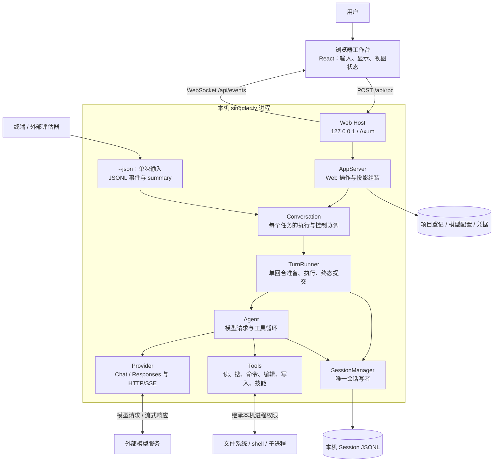
```mermaid
flowchart TB
    User["用户"] --> Browser["浏览器工作台<br/>React：输入、显示、视图状态"]
    Evaluator["终端 / 外部评估器"] --> Json["--json：单次输入<br/>JSONL 事件与 summary"]
    subgraph Process["本机 singularity 进程"]
        Host["Web Host<br/>127.0.0.1 / Axum"] --> WB["AppServer<br/>Web 操作与投影组装"]
        WB --> Conversation["Conversation<br/>每个任务的执行与控制协调"]
        Json --> Conversation
        Conversation --> Runner["TurnRunner<br/>单回合准备、执行、终态提交"]
        Runner --> Agent["Agent<br/>模型请求与工具循环"]
        Agent --> Provider["Provider<br/>Chat / Responses 与 HTTP/SSE"]
        Agent --> Tools["Tools<br/>读、搜、命令、编辑、写入、技能"]
        Runner --> Session["SessionManager<br/>唯一会话写者"]
        Agent --> Session
    end
    Browser -->|"POST /api/rpc"| Host
    Host -->|"WebSocket /api/events"| Browser
    Provider <-->|"模型请求 / 流式响应"| API["外部模型服务"]
    Tools <-->|"继承本机进程权限"| Machine["文件系统 / shell / 子进程"]
    Session --> Ledger[("本机 Session JSONL")]
    WB --> Config[("项目登记 / 模型配置 / 凭据")]
```

浏览器刷新或关闭只断开控制面，Host 内的执行继续。项目分组决定任务目录与导航归属；工具使用本机权限，Workspace 不构成文件访问沙箱。外部评估器通过 `--json` 使用同一执行层，自行负责超时、进程终止和判分。

源码：[程序入口](../crates/cli/src/main.rs) · [Host](../crates/cli/src/web/server.rs) · [AppServer](../crates/cli/src/web/app_server.rs) · [共享执行层](../crates/runtime/src/lib.rs)。产品边界见[宪章](constitution.md)。

## 2. 源码依赖与模块职责

下图只画 Rust crate 的直接生产依赖；箭头从使用方指向被使用方。测试使用的依赖另见各 crate 的 Cargo.toml。

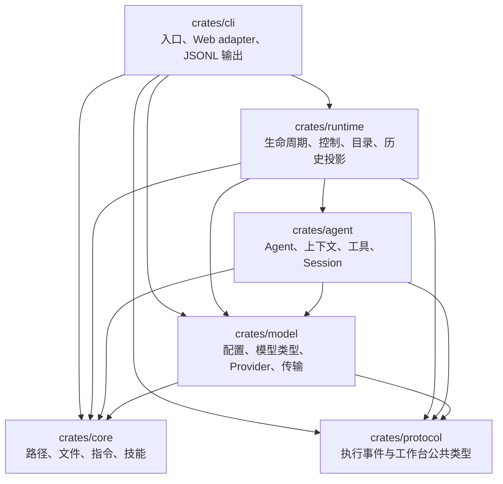
```mermaid
flowchart TB
    CLI["crates/cli<br/>入口、Web adapter、JSONL 输出"] --> Runtime["crates/runtime<br/>生命周期、控制、目录、历史投影"]
    CLI --> Model["crates/model<br/>配置、模型类型、Provider、传输"]
    CLI --> Core["crates/core<br/>路径、文件、指令、技能"]
    CLI --> Protocol["crates/protocol<br/>执行事件与工作台公共类型"]
    Runtime --> Agent["crates/agent<br/>Agent、上下文、工具、Session"]
    Runtime --> Model
    Runtime --> Core
    Runtime --> Protocol
    Agent --> Model
    Agent --> Core
    Agent --> Protocol
    Model --> Core
    Model --> Protocol
```

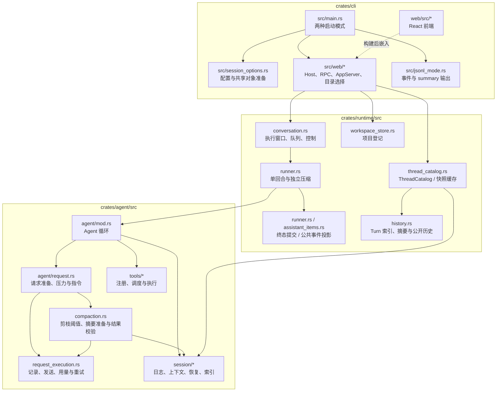
```mermaid
flowchart TB
    subgraph CliSource["crates/cli"]
        Main["src/main.rs<br/>两种启动模式"] --> Setup["src/session_options.rs<br/>配置与共享对象准备"]
        Main --> Web["src/web/*<br/>Host、RPC、AppServer、目录选择"]
        Main --> JSONL["src/jsonl_mode.rs<br/>事件与 summary 输出"]
        Front["web/src/*<br/>React 前端"] -. "构建后嵌入" .-> Web
    end
    subgraph RuntimeSource["crates/runtime/src"]
        Conv["conversation.rs<br/>执行窗口、队列、控制"] --> Run["runner.rs<br/>单回合与独立压缩"]
        Run --> Terminal["runner.rs / assistant_items.rs<br/>终态提交 / 公共事件投影"]
        Catalog["thread_catalog.rs<br/>ThreadCatalog / 快照缓存"] --> History["history.rs<br/>Turn 索引、摘要与公开历史"]
        WS["workspace_store.rs<br/>项目登记"]
    end
    subgraph AgentSource["crates/agent/src"]
        Loop["agent/mod.rs<br/>Agent 循环"] --> Requests["agent/request.rs<br/>请求准备、压力与指令"]
        Loop --> Tool["tools/*<br/>注册、调度与执行"]
        Requests --> Compact["compaction.rs<br/>剪枝阈值、摘要准备与结果校验"]
        Requests --> Execute["request_execution.rs<br/>记录、发送、用量与重试"]
        Compact --> Execute
        Loop --> Sessions["session/*<br/>日志、上下文、恢复、索引"]
        Compact --> Sessions
    end
    Web --> Conv
    Web --> Catalog
    Web --> WS
    Run --> Loop
    Catalog --> Sessions
```

`core` 与 `protocol` 不依赖其他内部 crate。前端通过协议与 Host 通信，与可执行程序同目录维护，不导入 Rust 内部实现。事件与公开对象直接使用 `protocol` 定义。

源码：[Cargo workspace](../Cargo.toml) · [Runtime 导出](../crates/runtime/src/lib.rs) · [Agent 导出](../crates/agent/src/lib.rs) · [Model 导出](../crates/model/src/lib.rs) · [前端依赖](../crates/cli/web/package.json)。

## 3. 对象、身份与状态所有权

### 3.1 项目、任务、回合与请求

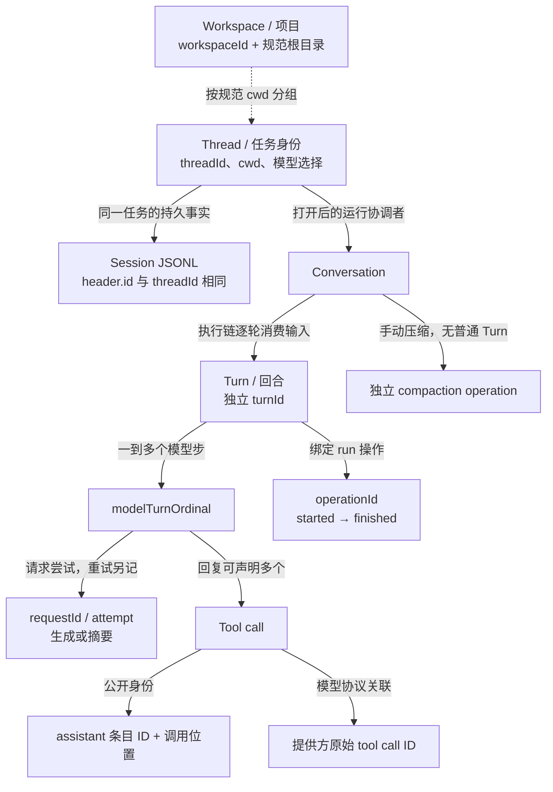
```mermaid
flowchart TB
    Workspace["Workspace / 项目<br/>workspaceId + 规范根目录"] -. "按规范 cwd 分组" .-> Thread["Thread / 任务身份<br/>threadId、cwd、模型选择"]
    Thread -->|"同一任务的持久事实"| Session["Session JSONL<br/>header.id 与 threadId 相同"]
    Thread -->|"打开后的运行协调者"| Conversation["Conversation"]
    Conversation -->|"执行链逐轮消费输入"| Turn["Turn / 回合<br/>独立 turnId"]
    Turn -->|"一到多个模型步"| Step["modelTurnOrdinal"]
    Step -->|"请求尝试，重试另记"| Request["requestId / attempt<br/>生成或摘要"]
    Step -->|"回复可声明多个"| Call["Tool call"]
    Call -->|"公开身份"| PublicID["assistant 条目 ID + 调用位置"]
    Call -->|"模型协议关联"| ProviderID["提供方原始 tool call ID"]
    Turn -->|"绑定 run 操作"| Operation["operationId<br/>started → finished"]
    Conversation -->|"手动压缩，无普通 Turn"| CompactOp["独立 compaction operation"]
```

公开工具身份用于实时与历史展示，避免提供方重复使用调用 ID 时合并不同工具；模型仍使用原始协议 ID。项目登记保存根目录，任务依据自己的 cwd 动态归组，不另存一份项目内任务清单。

### 3.2 Host 与浏览器的状态归属

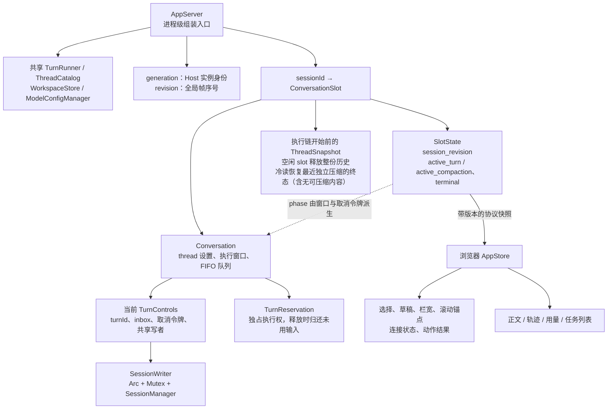
```mermaid
flowchart TB
    WB["AppServer<br/>进程级组装入口"] --> Shared["共享 TurnRunner / ThreadCatalog<br/>WorkspaceStore / ModelConfigManager"]
    WB --> Order["generation：Host 实例身份<br/>revision：全局帧序号"]
    WB --> Slots["sessionId → ConversationSlot"]
    Slots --> Conv["Conversation<br/>thread 设置、执行窗口、FIFO 队列"]
    Slots --> Projection["SlotState<br/>session_revision<br/>active_turn / active_compaction、terminal"]
    Slots --> Stable["执行链开始前的 ThreadSnapshot<br/>空闲 slot 释放整份历史<br/>冷读恢复最近独立压缩的终态（含无可压缩内容）"]
    Conv --> Running["当前 TurnControls<br/>turnId、inbox、取消令牌、共享写者"]
    Conv --> Reservation["TurnReservation<br/>独占执行权，释放时归还未用输入"]
    Running --> Writer["SessionWriter<br/>Arc + Mutex + SessionManager"]
    Projection -. "phase 由窗口与取消令牌派生" .-> Conv
    Projection -->|"带版本的协议快照"| Store["浏览器 AppStore"]
    Store --> UIState["选择、草稿、栏宽、滚动锚点<br/>连接状态、动作结果"]
    Store --> Views["正文 / 轨迹 / 用量 / 任务列表"]
```

普通 `session_changed` / `session_settled` 的 payload 均直接承载轻量 runtime（生命周期、队列、活动身份与终态）；完整活动事件只随 `session.read` 恢复快照传输。终态携带来源（普通回合或独立压缩）：任务状态只跟随回合终态，压缩结果在对话区自成一行。不同任务可并行；一个任务同一时刻只有一个普通执行链或独立压缩窗口。`TurnReservation` 保持到调用方完成投影收尾，旧预订只释放自己开启的窗口。写者只在追加或读取时短暂加锁，不跨模型等待与工具执行持锁。工作台的会话生命周期操作（查找或创建 slot、建立执行或压缩预订、归档与移除）共用一段短临界区：销毁操作不能穿过启动占用尚未打开写者的窗口。

源码：[AppServer](../crates/cli/src/web/app_server.rs) · [ConversationSlot / SlotState](../crates/cli/src/web/app_server/session.rs) · [Conversation / TurnReservation / TurnControls](../crates/runtime/src/conversation.rs) · [SessionWriter](../crates/agent/src/session/mod.rs) · [工具身份](../crates/agent/src/session/format.rs)。

## 4. 数据位置与唯一维护方

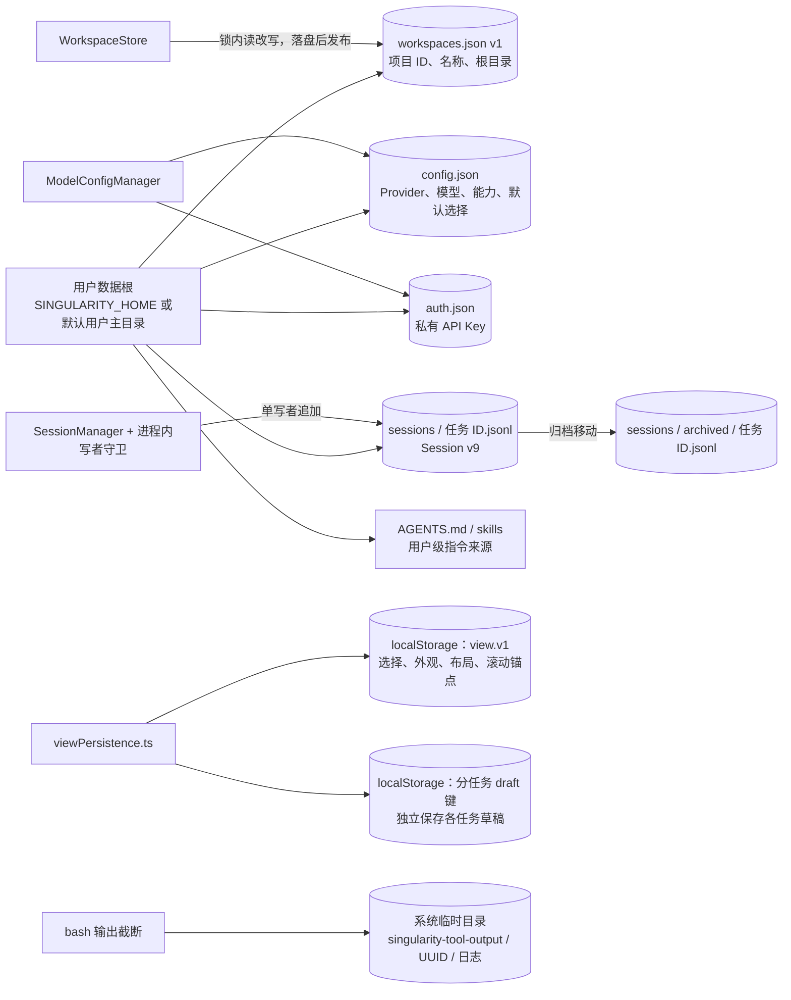
```mermaid
flowchart LR
    Home["用户数据根<br/>SINGULARITY_HOME 或默认用户主目录"] --> WorkspaceRegistryFile[("workspaces.json v1<br/>项目 ID、名称、根目录")]
    Home --> Config[("config.json<br/>Provider、模型、能力、默认选择")]
    Home --> Auth[("auth.json<br/>私有 API Key")]
    Home --> Ledger[("sessions / 任务 ID.jsonl<br/>Session v9")]
    Ledger -->|"归档移动"| Archive[("sessions / archived / 任务 ID.jsonl")]
    Home --> Instructions["AGENTS.md / skills<br/>用户级指令来源"]
    WorkspaceStore["WorkspaceStore"] -->|"锁内读改写，落盘后发布"| WorkspaceRegistryFile
    ModelManager["ModelConfigManager"] --> Config
    ModelManager --> Auth
    Manager["SessionManager + 进程内写者守卫"] -->|"单写者追加"| Ledger
    Browser["viewPersistence.ts"] --> View[("localStorage：view.v1<br/>选择、外观、布局、滚动锚点")]
    Browser --> Draft[("localStorage：分任务 draft 键<br/>独立保存各任务草稿")]
    Bash["bash 输出截断"] --> Temp[("系统临时目录<br/>singularity-tool-output / UUID / 日志")]
```

| 数据 | 维护边界与读取方 |
| --- | --- |
| 项目身份 | `CanonicalWorkspacePath` 规范化路径及比较键；`WorkspaceStore` 维护登记；bootstrap 按同一登记快照分组任务。读取历史身份不要求原目录仍存在。 |
| 模型与凭据 | `ModelConfigManager` 串行修改并生成运行快照、脱敏目录；浏览器只写新密钥，不从目录读回密钥。 |
| 会话事实 | `SessionManager` 写入，`SessionData` 只读；上下文、中断操作恢复、历史、摘要、请求详情均从同一日志派生。未消费的控制输入是内存状态，不由日志恢复。 |
| 视图与草稿 | `viewPersistence.ts` 读取和保存本页状态；视图使用容器键，草稿按任务使用独立键。 |
| 临时工具输出 | 工具结果给出实际日志路径；新建输出时清理超过七天的旧输出，保存失败明确反馈。 |

移除项目只移除登记，归档任务只移动日志。运行中或仍有待处理输入的任务会阻止移除所属项目。私有配置依赖 Windows 用户目录权限并使用原子替换；Session 追加的“先写后发布”不承诺断电持久性。

源码：[数据根](../crates/core/src/user_home.rs) · [路径身份](../crates/core/src/workspace.rs) · [项目登记](../crates/runtime/src/workspace_store.rs) · [配置](../crates/model/src/config/manager.rs) · [会话目录](../crates/runtime/src/thread_catalog.rs) · [视图持久化](../crates/cli/web/src/viewPersistence.ts) · [临时输出日志](../crates/agent/src/tools/bash/capture.rs)。文件维护见[安装说明](INSTALL.md#数据更新与卸载)。

## 5. 前端视图、数据派生与交互入口

### 5.1 页面组件怎样接入共同状态

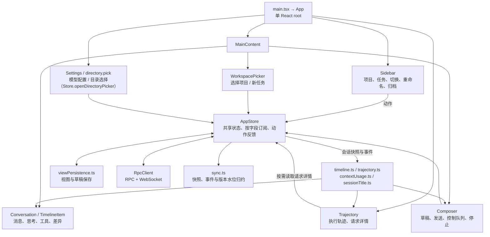
```mermaid
flowchart TB
    Root["main.tsx → App<br/>单 React root"] --> Sidebar["Sidebar<br/>项目、任务、切换、重命名、归档"]
    Root --> Main["MainContent"]
    Main --> Workspace["WorkspacePicker<br/>选择项目 / 新任务"]
    Main --> ConversationView["Conversation / TimelineItem<br/>消息、思考、工具、差异"]
    Main --> Composer["Composer<br/>草稿、发送、控制队列、停止"]
    Root --> Trajectory["Trajectory<br/>执行轨迹、请求详情"]
    Root --> Settings["Settings / directory.pick<br/>模型配置 / 目录选择（Store.openDirectoryPicker）"]
    Sidebar -->|"动作"| Store["AppStore<br/>共享状态、按字段订阅、动作反馈"]
    Workspace --> Store
    Composer --> Store
    Settings --> Store
    Trajectory -->|"按需读取请求详情"| Store
    Store -->|"会话快照与事件"| Derived["timeline.ts / trajectory.ts<br/>contextUsage.ts / sessionTitle.ts"]
    Derived --> ConversationView
    Derived --> Trajectory
    Derived --> Composer
    Store <--> Persistence["viewPersistence.ts<br/>视图与草稿保存"]
    Store <--> Connection["RpcClient<br/>RPC + WebSocket"]
    Store --> Sync["sync.ts<br/>快照、事件与版本水位归约"]
```

### 5.2 历史与流式内容怎样组成当前画面

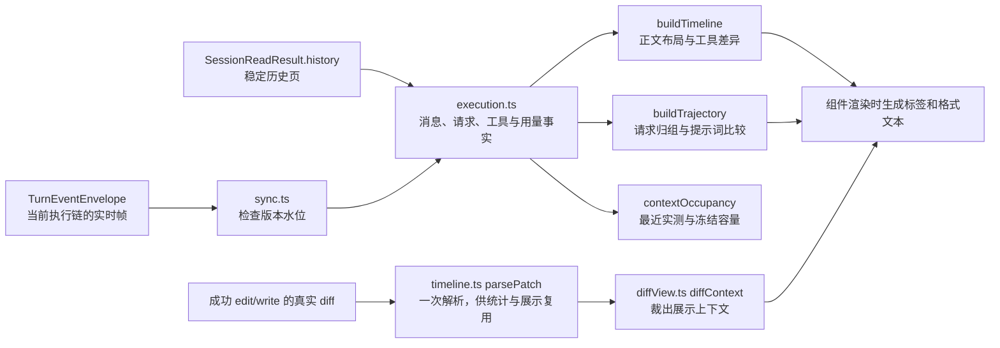
```mermaid
flowchart LR
    Baseline["SessionReadResult.history<br/>稳定历史页"] --> Facts["execution.ts<br/>消息、请求、工具与用量事实"]
    Frames["TurnEventEnvelope<br/>当前执行链的实时帧"] --> Sync["sync.ts<br/>检查版本水位"]
    Sync --> Facts
    Facts --> Timeline["buildTimeline<br/>正文布局与工具差异"]
    Facts --> Trace["buildTrajectory<br/>请求归组与提示词比较"]
    Facts --> Usage["contextOccupancy<br/>最近实测与冻结容量"]
    Timeline --> Render["组件渲染时生成标签和格式文本"]
    Trace --> Render
    ToolResult["成功 edit/write 的真实 diff"] --> Diff["timeline.ts parsePatch<br/>一次解析，供统计与展示复用"]
    Diff --> DiffContext["diffView.ts diffContext<br/>裁出展示上下文"]
    DiffContext --> Render
```

执行链期间，Host 固定链开始前的历史，实时投影覆盖该链内各回合；收尾后从日志刷新历史并清除实时投影。浏览器在同步边界将两种输入归约为共同执行事实，展示模块只做布局和格式转换。任务生命周期由同步层统一更新，选中详情引用同一对象；结算立即显示空闲并保留活动内容，历史补读成功后整体替换。用户消息（初始输入与注入输入）经 `turn/userMessage` 携带生产者派生的公开内容块身份（该条目首个文本块，即 `item.itemId`），实时投影与历史重读因此共用同一身份；无 Turn 前导条目保留各自身份。控制处置变化经带类型的事件出口发布为会话快照，控制队列不进入实时正文投影。分页加载核对会话、连接代次和分页锚点；刷新尾页只保留连续重叠的已加载前缀。

助手消息保存后，完成事件携带与历史相同的公开内容和条目身份；只有最终正文而没有增量的响应也能直接显示。完成事件与历史共用同一套公开块规则，只在范围上不同：完成事件不含工具调用项（工具事实由自己的工具事件承载），历史含。Host 的活动恢复快照用完成内容替换该条目的开始事件与文本、思考增量，实时广播继续发送增量。每个回合独立归约完成或失败，执行链收尾只补齐最后一个尚未闭合的回合。

浏览器 Store 逐帧归约协议状态，正文、思考与工具进度的显示通知按 50 毫秒窗口合并；操作、终态和连接变化立即通知最新状态。代码高亮只把异步高亮器的就绪状态存入 React 状态，token 按当前代码派生；已完成代码块通过稳定参数复用渲染结果。

`inputTrigger.ts` 维护 `@文件`、`/技能` 候选触发，`Composer` 持有候选结果与查询错误；查询显式绑定项目和任务，切换或输入改变后丢弃旧请求的结果。`ModelPicker` 从共同模型目录生成选择，`modelChoices.ts` 维护推理档位排序；`interactions.ts` 与 `Menu`、`Dialog`、`Disclosure` 等组件维护共享交互。主题和布局样式位于 `styles/tokens.css`、`styles/app.css`、`styles/model-picker.css`。各面板保留自己的展开与焦点状态，任务正文与列表共用同一任务名称来源。

源码：[App](../crates/cli/web/src/app.tsx) · [Store](../crates/cli/web/src/appStore.ts) · [时间线](../crates/cli/web/src/timeline.ts) · [轨迹](../crates/cli/web/src/trajectory.ts) · [执行事实](../crates/cli/web/src/execution.ts) · [输入候选](../crates/cli/web/src/inputTrigger.ts) · [差异](../crates/cli/web/src/diffView.ts)。具体显示与操作约定见[工作台交互](web-ui.md)。

## 6. Web 协议、来源边界与同步

### 6.1 请求怎样到达业务对象

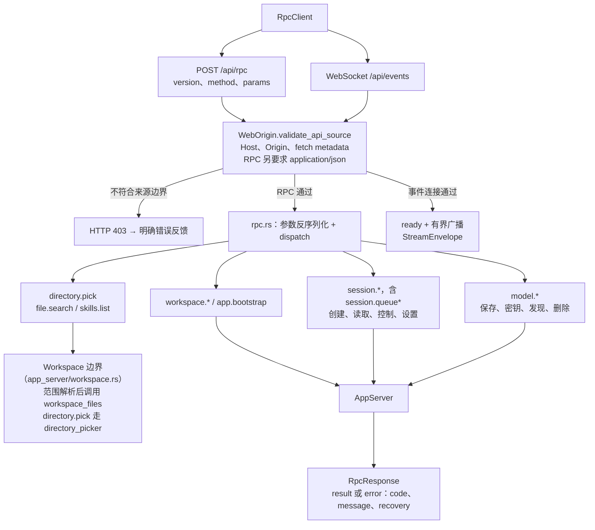
```mermaid
flowchart TB
    Browser["RpcClient"] --> RPC["POST /api/rpc<br/>version、method、params"]
    Browser --> WS["WebSocket /api/events"]
    RPC --> Origin["WebOrigin.validate_api_source<br/>Host、Origin、fetch metadata<br/>RPC 另要求 application/json"]
    WS --> Origin
    Origin -->|"不符合来源边界"| Forbidden["HTTP 403 → 明确错误反馈"]
    Origin -->|"RPC 通过"| Dispatch["rpc.rs：参数反序列化 + dispatch"]
    Dispatch --> Files["directory.pick<br/>file.search / skills.list"]
    Dispatch --> Projects["workspace.* / app.bootstrap"]
    Dispatch --> Sessions["session.*，含 session.queue*<br/>创建、读取、控制、设置"]
    Dispatch --> Models["model.*<br/>保存、密钥、发现、删除"]
    Files --> FileAdapter["Workspace 边界（app_server/workspace.rs）<br/>范围解析后调用 workspace_files<br/>directory.pick 走 directory_picker"]
    Projects --> WB["AppServer"]
    Sessions --> WB
    Models --> WB
    WB --> Receipt["RpcResponse<br/>result 或 error：code、message、recovery"]
    Origin -->|"事件连接通过"| Broadcast["ready + 有界广播<br/>StreamEnvelope"]
```

Host 只绑定 loopback，不开放 CORS，也不维护浏览器登录 token 或 cookie。页面及资源校验 Host，API 另校验请求来源；这阻止浏览器跨源控制，不认证本机进程身份。同步文件与历史操作由 `spawn_blocking` 执行，模型发现和原生目录选择走各自异步入口。

### 6.2 首次打开、断线与刷新恢复

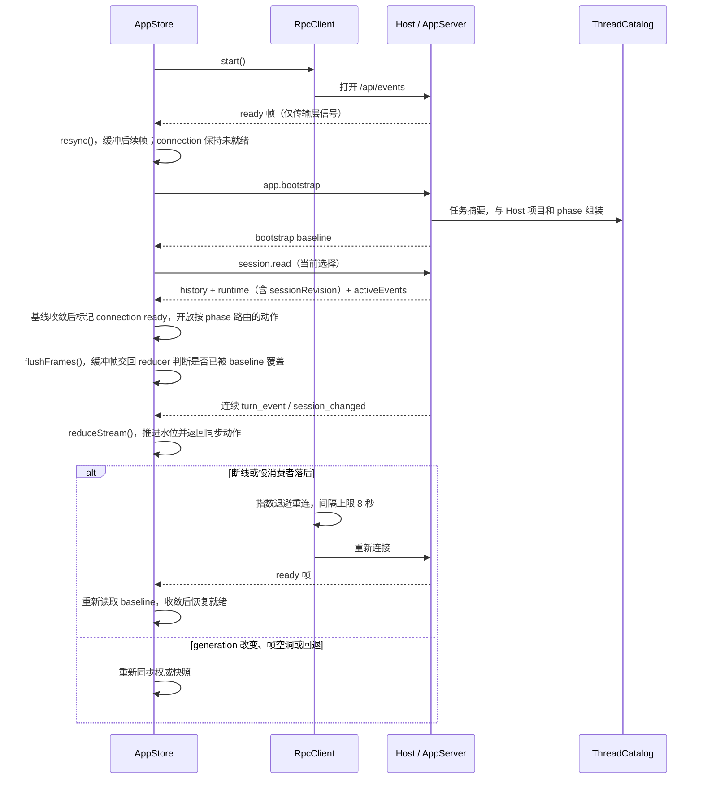
```mermaid
sequenceDiagram
    participant View as AppStore
    participant Conn as RpcClient
    participant Host as Host / AppServer
    participant Catalog as ThreadCatalog
    View->>Conn: start()
    Conn->>Host: 打开 /api/events
    Host-->>View: ready 帧（仅传输层信号）
    View->>View: resync()，缓冲后续帧；connection 保持未就绪
    View->>Host: app.bootstrap
    Host->>Catalog: 任务摘要，与 Host 项目和 phase 组装
    Host-->>View: bootstrap baseline
    View->>Host: session.read（当前选择）
    Host-->>View: history + runtime（含 sessionRevision）+ activeEvents
    View->>View: 基线收敛后标记 connection ready，开放按 phase 路由的动作
    View->>View: flushFrames()，缓冲帧交回 reducer 判断是否已被 baseline 覆盖
    Host-->>View: 连续 turn_event / session_changed
    View->>View: reduceStream()，推进水位并返回同步动作
    alt 断线或慢消费者落后
        Conn->>Conn: 指数退避重连，间隔上限 8 秒
        Conn->>Host: 重新连接
        Host-->>View: ready 帧
        View->>View: 重新读取 baseline，收敛后恢复就绪
    else generation 改变、帧空洞或回退
        View->>View: 重新同步权威快照
    end
```

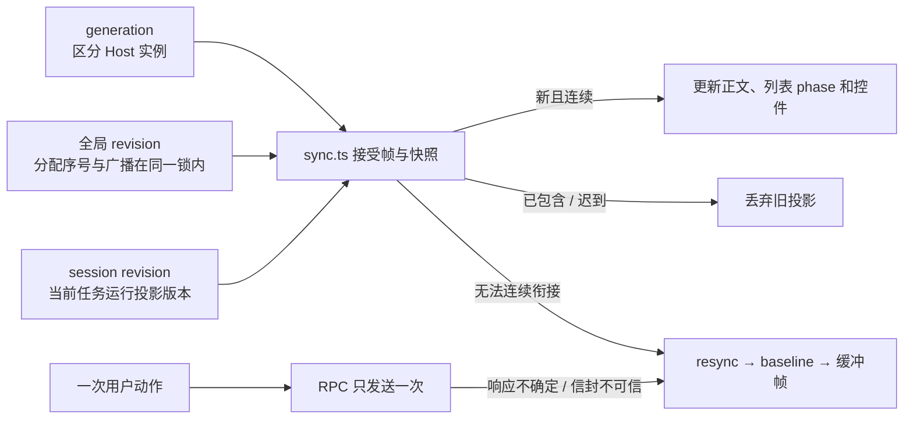
```mermaid
flowchart LR
    Generation["generation<br/>区分 Host 实例"] --> Gate["sync.ts 接受帧与快照"]
    Global["全局 revision<br/>分配序号与广播在同一锁内"] --> Gate
    SessionRevision["session revision<br/>当前任务运行投影版本"] --> Gate
    Gate -->|"新且连续"| Apply["更新正文、列表 phase 和控件"]
    Gate -->|"已包含 / 迟到"| Ignore["丢弃旧投影"]
    Gate -->|"无法连续衔接"| Resync["resync → baseline → 缓冲帧"]
    Mutation["一次用户动作"] --> Once["RPC 只发送一次"]
    Once -->|"响应不确定 / 信封不可信"| Resync
```

普通目录刷新不推进事件消费游标，投影版本与执行事件水位分别维护。会话控制的接受与消费共同更新 `Conversation` 的当前投影；AppServer 在接受及真实消费边界通过既有 `session_changed` 快照发布该事实，不另存一份控制生命周期。完整工作台替换快照的构造和发布仍串行，较早事实不会在结算或较新快照之后取得更高版本。运行中的 `stopping` 不被后续流式帧改回 `running`。断线保留草稿，发送按钮按连接状态禁用；网络恢复读取状态，不自动重放 mutation。不可读取或版本与请求标识不匹配的 RPC 响应与不可达、被拒绝同属连接级失败：基线读取失败不宣告就绪，下一轮有效基线才收敛。

项目、任务目录和模型配置 mutation 以服务端随操作发布的 `app_changed` 完整快照为权威。修改类 RPC 成功只返回空结果，只有创建动作返回动作本身需要的新身份（`workspace.add` 的 workspaceId、`session.create` 的读取结果），不再额外请求 bootstrap，也不另造目录或摘要回执。创建 RPC 返回前到达的目录帧先缓冲；返回的新任务身份保留到包含它的目录快照到达。`session_settled` 仍触发任务终态读取和目录刷新，帧空洞或连接代次变化则走完整 resync。

`protocol/rpc.rs` 维护方法、参数与结果的关联，RPC adapter 按方法标记解析和序列化。`StreamEvent` 将消息类型与载荷关联；前端声明从 Rust DTO 生成，`TurnEventEnvelope` 的时间补充由真实序列化 fixture 验证。`sync.ts` 归约快照、事件与水位并返回所需动作；Store 执行读取、缓冲与重连，组件使用生产单例。

源码：[工作台 DTO](../crates/protocol/src/app.rs) · [RPC 合同](../crates/protocol/src/rpc.rs) · [RPC adapter](../crates/cli/src/web/rpc.rs) · [来源校验](../crates/cli/src/web/origin.rs) · [连接](../crates/cli/web/src/rpcClient.ts) · [同步归约](../crates/cli/web/src/sync.ts) · [Store](../crates/cli/web/src/appStore.ts)。生成与序列化检查见[协议测试](../crates/protocol/tests/contract.rs)。

## 7. 一次发送的完整执行主链

### 7.1 接受输入并启动后台执行链

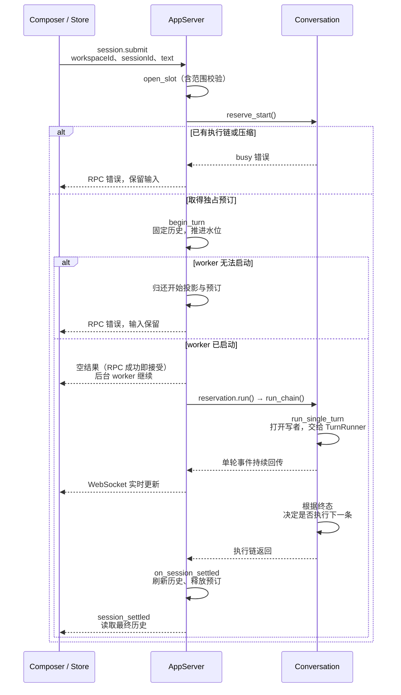
```mermaid
sequenceDiagram
    participant UI as Composer / Store
    participant WB as AppServer
    participant Conv as Conversation
    UI->>WB: session.submit<br/>workspaceId、sessionId、text
    WB->>WB: open_slot（含范围校验）
    WB->>Conv: reserve_start()
    alt 已有执行链或压缩
        Conv-->>WB: busy 错误
        WB-->>UI: RPC 错误，保留输入
    else 取得独占预订
        WB->>WB: begin_turn<br/>固定历史，推进水位
        alt worker 无法启动
            WB->>WB: 归还开始投影与预订
            WB-->>UI: RPC 错误，输入保留
        else worker 已启动
            WB-->>UI: 空结果（RPC 成功即接受）<br/>后台 worker 继续
            WB->>Conv: reservation.run() → run_chain()
            Conv->>Conv: run_single_turn<br/>打开写者，交给 TurnRunner
            Conv-->>WB: 单轮事件持续回传
            WB-->>UI: WebSocket 实时更新
            Conv->>Conv: 根据终态<br/>决定是否执行下一条
            Conv-->>WB: 执行链返回
            WB->>WB: on_session_settled<br/>刷新历史、释放预订
            WB-->>UI: session_settled<br/>读取最终历史
        end
    end
```

### 7.2 单轮执行与日志、事件的先后关系

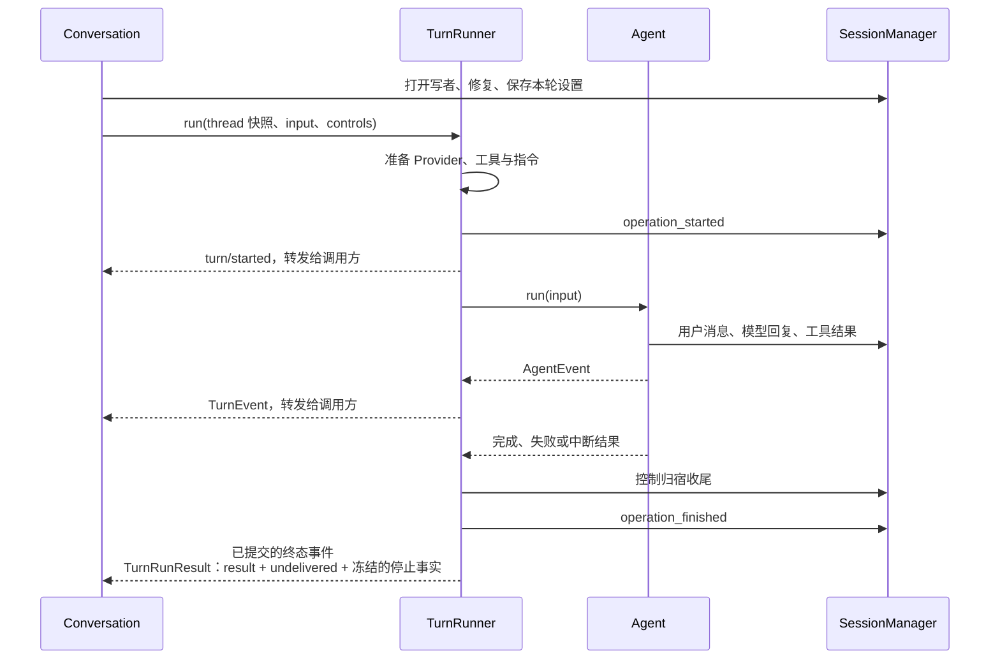
```mermaid
sequenceDiagram
    participant Conv as Conversation
    participant Runner as TurnRunner
    participant Agent as Agent
    participant Log as SessionManager
    Conv->>Log: 打开写者、修复、保存本轮设置
    Conv->>Runner: run(thread 快照、input、controls)
    Runner->>Runner: 准备 Provider、工具与指令
    Runner->>Log: operation_started
    Runner-->>Conv: turn/started，转发给调用方
    Runner->>Agent: run(input)
    Agent->>Log: 用户消息、模型回复、工具结果
    Agent-->>Runner: AgentEvent
    Runner-->>Conv: TurnEvent，转发给调用方
    Agent-->>Runner: 完成、失败或中断结果
    Runner->>Log: 控制归宿收尾
    Runner->>Log: operation_finished
    Runner-->>Conv: 已提交的终态事件<br/>TurnRunResult：result + undelivered + 冻结的停止事实
```

`TurnRunner` 持有单回合生命周期，`Conversation` 持有跨回合队列；一个回合可包含多个模型请求。`start_turn` 成功写入 `operation_started` 后才进入已开始阶段；此后的控制归宿或终态提交失败归为 `Terminalization`。操作开始记录只包含身份与类型，用户文本随后由 Agent 追加。Runner 无论成功还是失败都通过 `TurnRunResult` 交回带完整身份的未交付控制与同一次冻结的停止事实，由 Conversation 按该事实决定归宿，不从错误类型反推。持久边界对应的完成事件先写日志再发布；正文与工具进度增量可在最终消息写入前显示。修改类 RPC 成功只返回空结果，只确认动作是否接受；执行事实由后续事件与快照提供。

源码：[Store.submit](../crates/cli/web/src/appStore.ts) · [AppServer.submit / spawn_operation](../crates/cli/src/web/app_server.rs) · [Conversation.run_chain / run_single_turn](../crates/runtime/src/conversation.rs) · [TurnRunner.run](../crates/runtime/src/runner.rs) · [Runner 终态提交](../crates/runtime/src/runner.rs)。

## 8. Agent 内部循环

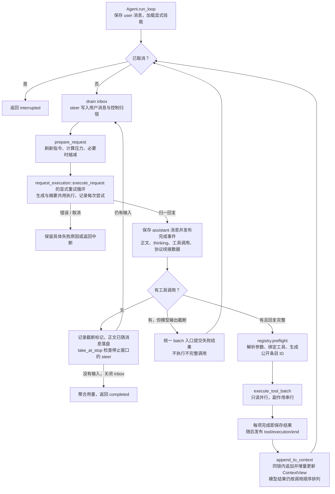
```mermaid
flowchart TB
    Input["Agent.run_loop<br/>保存 user 消息，加载显式技能"] --> Cancel{"已取消？"}
    Cancel -->|"是"| Abort["返回 interrupted"]
    Cancel -->|"否"| Inbox["drain inbox<br/>steer 写入用户消息与控制归宿"]
    Inbox --> Prepare["prepare_request<br/>刷新指令、计算压力、必要时缩减"]
    Prepare --> Request["request_execution::execute_request 的显式重试循环<br/>生成与摘要共用执行、记录每次尝试"]
    Request -->|"错误 / 取消"| Failure["保留具体失败原因或返回中断"]
    Request -->|"归一回复"| Assistant["保存 assistant 消息并发布完成事件<br/>正文、thinking、工具调用、协议续接数据"]
    Assistant --> Calls{"有工具调用？"}
    Calls -->|"无"| Stop["记录截断标记，正文已随消息落盘<br/>take_at_stop 检查停止窗口的 steer"]
    Stop -->|"仍有输入"| Inbox
    Stop -->|"没有输入，关闭 inbox"| Completed["聚合用量，返回 completed"]
    Calls -->|"有，但模型输出截断"| Truncated["统一 batch 入口提交失败结果<br/>不执行不完整调用"]
    Truncated --> Cancel
    Calls -->|"有且回复完整"| Preflight["registry.preflight<br/>解析参数、绑定工具、生成公开条目 ID"]
    Preflight --> Batch["execute_tool_batch<br/>只读并行，副作用串行"]
    Batch --> Results["每项完成即保存结果<br/>随后发布 tool/execution/end"]
    Results --> Context["append_to_context<br/>同锁内追加并增量更新 ContextView<br/>模型结果仍按调用顺序排列"]
    Context --> Cancel
```

工具自身失败成为 `is_error` 结果供模型决定下一步；会话写入失败通过错误通道停止执行。运行中输入在模型步边界或自然停止窗口注入，已经发出的模型请求不会被改写。

源码：[Agent.run_loop / inject_controls / run_turn](../crates/agent/src/agent/mod.rs) · [请求准备](../crates/agent/src/agent/request.rs) · [请求执行](../crates/agent/src/request_execution.rs) · [TurnInbox](../crates/agent/src/agent/inbox.rs) · [AgentEvent](../crates/agent/src/events.rs) · [公共事件投影](../crates/runtime/src/assistant_items.rs)。

## 9. 控制队列与执行窗口

### 9.1 同一任务的独占窗口

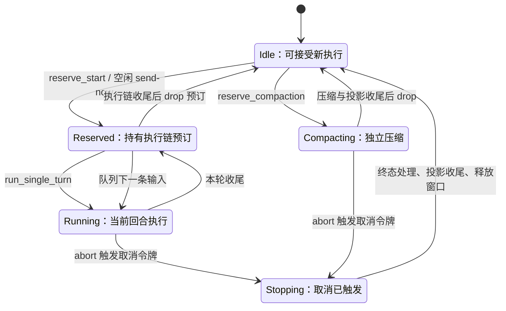
```mermaid
stateDiagram-v2
    state "Idle：可接受新执行" as Idle
    state "Reserved：持有执行链预订" as Reserved
    state "Running：当前回合执行" as Running
    state "Compacting：独立压缩" as Compacting
    state "Stopping：取消已触发" as Stopping
    [*] --> Idle
    Idle --> Reserved: reserve_start / 空闲 send-now
    Reserved --> Running: run_single_turn
    Running --> Reserved: 本轮收尾
    Reserved --> Running: 队列下一条输入
    Reserved --> Idle: 执行链收尾后 drop 预订
    Idle --> Compacting: reserve_compaction
    Compacting --> Idle: 压缩与投影收尾后 drop
    Running --> Stopping: abort 触发取消令牌
    Compacting --> Stopping: abort 触发取消令牌
    Stopping --> Idle: 终态处理、投影收尾、释放窗口
```

`Stopping` 是公共 phase，直接由 Running/Compacting 内的取消令牌派生；内部仍持有原操作窗口。同一 Session 的普通提交、空闲 send-now 和压缩共享独占规则。

send-now 一次提交当前队列：不带目标即整批，带 controlId 只提升该条。目标定位、注入窗口判定与所有权转移共用同一份内存状态，调用方不再按自己读到的快照逐条请求。执行中整批交给当前轮的 TurnInbox，窗口已关闭时整批留在原位；空闲时只提升队首并建立预订，其余条目按原顺序留在队列，由该预订的链条在自然交接点继续消费。

### 9.2 不同输入动作怎样汇合

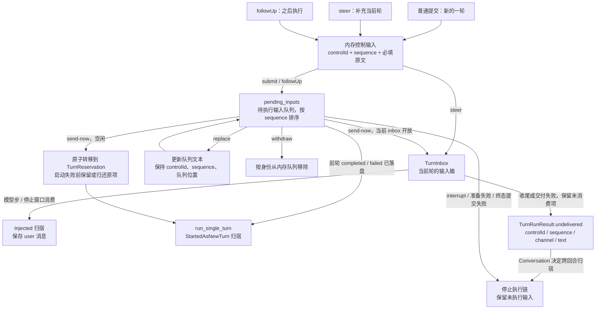
```mermaid
flowchart TB
    Submit["普通提交：新的一轮"] --> Accepted["内存控制输入<br/>controlId + sequence + 必填原文"]
    Steer["steer：补充当前轮"] --> Accepted
    Follow["followUp：之后执行"] --> Accepted
    Accepted -->|"steer"| Inbox["TurnInbox<br/>当前轮的输入箱"]
    Accepted -->|"submit / followUp"| Queue["pending_inputs<br/>待执行输入队列，按 sequence 排序"]
    Inbox -->|"模型步 / 停止窗口消费"| Injected["Injected 归宿<br/>保存 user 消息"]
    Queue -->|"replace"| Replaced["更新队列文本<br/>保持 controlId、sequence、队列位置"]
    Replaced --> Queue
    Queue -->|"withdraw"| Withdrawn["按身份从内存队列移除"]
    Queue -->|"send-now，当前 inbox 开放"| Inbox
    Queue -->|"send-now，空闲"| Reserve["原子转移到 TurnReservation<br/>启动失败前保留或归还原项"]
    Queue -->|"前轮 completed / failed 已落盘"| Next["run_single_turn<br/>StartedAsNewTurn 归宿"]
    Reserve --> Next
    Inbox -->|"收尾或交付失败，保留未消费项"| Handoff["TurnRunResult.undelivered<br/>controlId / sequence / channel / text"]
    Handoff -->|"Conversation 决定跨回合归宿"| Retain
    Queue -->|"interrupt / 准备失败 / 终态提交失败"| Retain["停止执行链<br/>保留未执行输入"]
```

控制输入由 Conversation 的队列和当前轮 Inbox 持有，编辑、撤回和提升保持同一身份与接受顺序。交给 Agent 后保存普通用户消息。已接受但未消费的输入只有一套表示，文本必填，按接受顺序等待：普通提交、steer 与 Follow-up 都在同一队列中，channel 只记录输入从哪个入口进来，不决定它是否还在等待。停止是独立的取消动作，不通过排队渠道表达，`Cancelled` 只描述已接受排队输入的撤回或未交付结果。交付失败时归还的未消费 steer、启动失败的普通提交与排队的 follow-up 一样留在同一队列，并同样以 Pending 投影给客户端，因此都可显示、编辑、撤回与提前发送。刷新网页通过当前快照恢复队列；程序退出后不恢复未消费输入。已保存终态的普通失败允许继续 Follow-up，中断则结束执行链。手动停止标记保存在操作终态中。

源码：[Conversation 控制方法](../crates/runtime/src/conversation.rs) · [控制输入类型](../crates/agent/src/agent/inbox.rs) · [AppServer.apply_control](../crates/cli/src/web/app_server.rs) · [Composer](../crates/cli/web/src/components/Composer.tsx)。

## 10. 停止、失败与终态提交

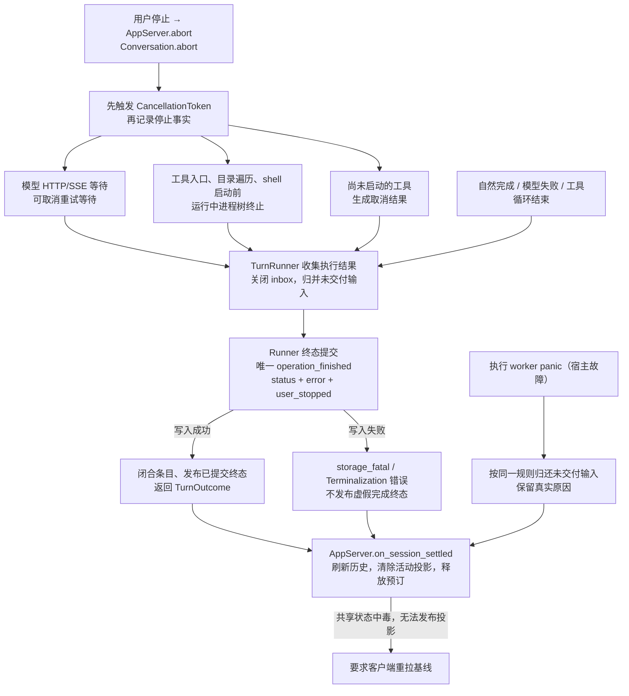
```mermaid
flowchart TB
    Stop["用户停止 → AppServer.abort<br/>Conversation.abort"] --> Signal["先触发 CancellationToken<br/>再记录停止事实"]
    Signal --> Model["模型 HTTP/SSE 等待<br/>可取消重试等待"]
    Signal --> Tools["工具入口、目录遍历、shell 启动前<br/>运行中进程树终止"]
    Signal --> Unstarted["尚未启动的工具<br/>生成取消结果"]
    Model --> Finish["TurnRunner 收集执行结果<br/>关闭 inbox，归并未交付输入"]
    Tools --> Finish
    Unstarted --> Finish
    Normal["自然完成 / 模型失败 / 工具循环结束"] --> Finish
    Finish --> Commit["Runner 终态提交<br/>唯一 operation_finished<br/>status + error + user_stopped"]
    Commit -->|"写入成功"| Publish["闭合条目、发布已提交终态<br/>返回 TurnOutcome"]
    Commit -->|"写入失败"| Fatal["storage_fatal / Terminalization 错误<br/>不发布虚假完成终态"]
    Publish --> Settled["AppServer.on_session_settled<br/>刷新历史，清除活动投影，释放预订"]
    Fatal --> Settled
    Panic["执行 worker panic（宿主故障）"] --> Handback["按同一规则归还未交付输入<br/>保留真实原因"]
    Handback --> Settled
    Settled -->|"共享状态中毒，无法发布投影"| Resync["要求客户端重拉基线"]
```

追加 I/O 失败后，该写者停止后续写入，避免向半行 JSONL 继续追加；重新打开写者后由既有修复路径处理尾部。进度或客户端输出失败不改写执行事实。`operation_finished` 是回合终态的唯一持久来源；Web 收尾投影中的错误反馈不能代替它。

Runner 在决定终态前原子关闭本轮取消接受窗口；先接受的停止随本轮收敛，自然终态先关闭窗口则使后续停止明确返回“当前任务不可停止”。停止本身不单独写日志，由回合终态记录用户停止标志；未消费队列留在进程内。已接受的停止同时取消本轮未交付的输入：它们不回到队列，只有未被停止取消的输入才按接受序号归还。启动失败、执行期致命失败与终态落盘失败三个出口消费同一条冻结的停止事实，处置结果一致。手动压缩与普通回合共用该窗口：Agent 已返回成功但冻结前接受过停止时，落盘终态与调用结果都是中断，不让成功结果穿透。

执行 worker 的 panic 是宿主故障：不继续本执行链，按与正常失败相同的规则归还本轮已接受但未交付的输入，并以真实原因（而不是固定文案）结算显示投影。显示投影不是持久账本，因此不声称已提交可信终态；结算路径本身因共享状态中毒而失败时，按既有重同步通道要求客户端重拉基线，不把界面留在“仍在运行”。

源码：[取消令牌](https://docs.rs/tokio-util/0.7/tokio_util/sync/struct.CancellationToken.html) · [TurnControls.accept_cancel / Conversation.abort](../crates/runtime/src/conversation.rs) · [Runner 收尾 / fail_stop_terminalization](../crates/runtime/src/runner.rs) · [追加写入](../crates/agent/src/session/manager.rs)。

## 11. 模型配置与选择

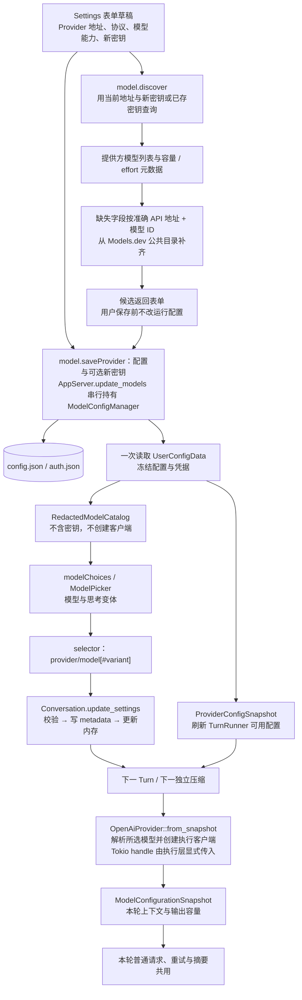
```mermaid
flowchart TB
    Form["Settings 表单草稿<br/>Provider 地址、协议、模型能力、新密钥"] --> Discover["model.discover<br/>用当前地址与新密钥或已存密钥查询"]
    Discover --> Remote["提供方模型列表与容量 / effort 元数据"]
    Remote --> Missing["缺失字段按准确 API 地址 + 模型 ID<br/>从 Models.dev 公共目录补齐"]
    Missing --> Candidates["候选返回表单<br/>用户保存前不改运行配置"]
    Form --> Save["model.saveProvider：配置与可选新密钥<br/>AppServer.update_models 串行持有 ModelConfigManager"]
    Candidates --> Save
    Save --> Disk[("config.json / auth.json")]
    Save --> Parsed["一次读取 UserConfigData<br/>冻结配置与凭据"]
    Parsed --> ProviderSnapshot["ProviderConfigSnapshot<br/>刷新 TurnRunner 可用配置"]
    Parsed --> Catalog["RedactedModelCatalog<br/>不含密钥，不创建客户端"]
    Catalog --> Picker["modelChoices / ModelPicker<br/>模型与思考变体"]
    Picker --> Selector["selector：provider/model[#variant]"]
    Selector --> Settings["Conversation.update_settings<br/>校验 → 写 metadata → 更新内存"]
    Settings --> Next["下一 Turn / 下一独立压缩"]
    ProviderSnapshot --> Next
    Next --> Factory["OpenAiProvider::from_snapshot<br/>解析所选模型并创建执行客户端<br/>Tokio handle 由执行层显式传入"]
    Factory --> Frozen["ModelConfigurationSnapshot<br/>本轮上下文与输出容量"]
    Frozen --> Requests["本轮普通请求、重试与摘要共用"]
```

提供方表单通过一个 RPC 保存配置与可选新密钥；Host 完成两份文件的写入后，从一次读取生成执行快照与脱敏目录，只发布一次最终状态。密钥写入失败明确返回部分保存，并按实际磁盘刷新，表单可以重试。快照保留冻结的 `UserConfigData`，校验时直接解析实际 selector；默认选择损坏或其他提供方未完成配置，不妨碍显式选择可用模型。快照本身不携带 Tokio handle，也不创建网络对象：具体 Provider 的构造入口接收快照、selector 与执行层句柄。

模型目录、预设与保存请求共用 `ModelConfigurationInput`。已有配置缺失或无效的协议保留原值供编辑，保存与执行分别在模型解析边界校验；新建模型的 Chat 默认值属于编辑器。

`base_url` 的含义只由模型层一处解释：保存与查询先规范输入形状（去首尾空白与结尾斜杠，不改写你写明的地址），再剥掉写明的已知端点得到 API 根——根逐字使用，中间层不替消费者补版本段——Chat、Responses 与 `/models` 三种地址都由这一个根派生；设置表单不承担地址清理。

新任务立即保存显式 selector；运行时改设置复用当前写者，空闲时短开写者，失败保持原选择；相同选择不重复写入，执行开始不回扫设置历史。每轮捕获自己的模型快照，活动轮不随设置变化。表单地址、凭据、提供方或协议变更后丢弃旧发现结果；公共目录请求不携带用户地址或凭据。发现失败保留认证、网络、限流／过载、请求和响应格式类别：配置与认证问题引导修正设置，暂时不可用或无效目录允许稍后重试或手动添加。缺失元数据不伪造成能力，thinking 开关或 budget 不等同于 effort 档位。

源码：[ModelConfigManager / 快照](../crates/model/src/config/manager.rs) · [selector 与已解析选择](../crates/model/src/config/selection.rs) · [发现与补齐](../crates/model/src/config/discovery.rs) · [端点与 wire 选项](../crates/model/src/openai/wire.rs) · [具体 Provider](../crates/model/src/openai/provider.rs) · [Settings](../crates/cli/web/src/components/Settings.tsx) · [模型选择](../crates/cli/web/src/modelChoices.ts)。

## 12. 模型请求、协议适配、重试与续接

### 12.1 从模型消息到网络，再回到 Agent

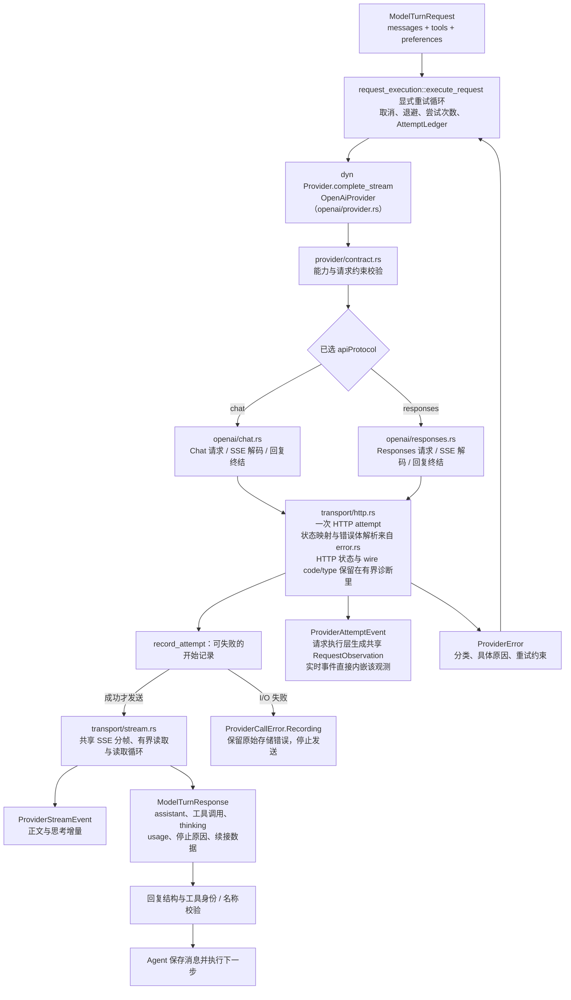
```mermaid
flowchart TB
    Request["ModelTurnRequest<br/>messages + tools + preferences"] --> Retry["request_execution::execute_request 显式重试循环<br/>取消、退避、尝试次数、AttemptLedger"]
    Retry --> Provider["dyn Provider.complete_stream<br/>OpenAiProvider（openai/provider.rs）"]
    Provider --> Validate["provider/contract.rs<br/>能力与请求约束校验"]
    Validate --> Protocol{"已选 apiProtocol"}
    Protocol -->|"chat"| Chat["openai/chat.rs<br/>Chat 请求 / SSE 解码 / 回复终结"]
    Protocol -->|"responses"| Responses["openai/responses.rs<br/>Responses 请求 / SSE 解码 / 回复终结"]
    Chat --> Transport["transport/http.rs<br/>一次 HTTP attempt<br/>状态映射与错误体解析来自 error.rs<br/>HTTP 状态与 wire code/type 保留在有界诊断里"]
    Responses --> Transport
    Transport --> Record["record_attempt：可失败的开始记录"]
    Record -->|"成功才发送"| SSE["transport/stream.rs<br/>共享 SSE 分帧、有界读取与读取循环"]
    SSE --> Deltas["ProviderStreamEvent<br/>正文与思考增量"]
    Record -->|"I/O 失败"| StorageError["ProviderCallError.Recording<br/>保留原始存储错误，停止发送"]
    Transport --> Attempts["ProviderAttemptEvent<br/>请求执行层生成共享 RequestObservation<br/>实时事件直接内嵌该观测"]
    SSE --> Reply["ModelTurnResponse<br/>assistant、工具调用、thinking<br/>usage、停止原因、续接数据"]
    Reply --> Check["回复结构与工具身份 / 名称校验"]
    Check --> Agent["Agent 保存消息并执行下一步"]
    Transport --> Error["ProviderError<br/>分类、具体原因、重试约束"]
    Error --> Retry
```

普通生成和摘要共同调用 `request_execution`，传输层只执行一次 attempt。提供方完成请求校验后，必须成功完成开始记录才会发送 HTTP；结束记录失败同样沿类型化错误返回。观测追加失败停止执行，保留存储或校验原因。可重试错误最多尝试三次，等待可取消。可见正文与思考不改变错误的可重试性；重试前通过 `item/discarded` 清除该次临时输出，使用相同请求输入再次尝试。最终失败或取消的半截内容保存为 `assistant_interrupted` 显示记录，刷新后仍可查看，但不进入后续模型上下文或摘要。成功回复才保存为正式 assistant 消息。

生成和摘要使用同一错误分类与 attempt 预算决定重试；摘要请求不发布对话增量。精确的上下文溢出进入[缩减恢复](#context)，不当作普通网络重试。SSE 按帧顺序解析和分派，协议终态一到即完成该次回复，后续无关尾帧不再参与解析或完整性校验；正文提前结束只按截断判定，不再等待连接关闭。未知 `finish_reason`、非法 choice / 工具调用 `index` 明确失败，字段缺失与字段非法不混为一谈。Chat 工具调用分片中的名称或参数为 null 时表示本片段无更新，最终工具身份仍完整校验。工具调用只保存 ID、名称与一个 JSON 参数值；畸形 JSON 保留为字符串值。参数是否为对象、是否符合具体工具要求，统一由工具 preflight 校验并返回工具错误；回复结构和工具身份无效时在 Provider 边界失败。

### 12.2 可展示思考与私有续接数据

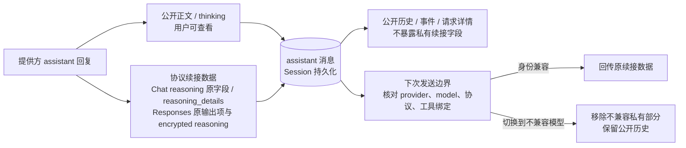
```mermaid
flowchart LR
    Reply["提供方 assistant 回复"] --> Visible["公开正文 / thinking<br/>用户可查看"]
    Reply --> Private["协议续接数据<br/>Chat reasoning 原字段 / reasoning_details<br/>Responses 原输出项与 encrypted reasoning"]
    Visible --> Session[("assistant 消息<br/>Session 持久化")]
    Private --> Session
    Session --> History["公开历史 / 事件 / 请求详情<br/>不暴露私有续接字段"]
    Session --> Boundary["下次发送边界<br/>核对 provider、model、协议、工具绑定"]
    Boundary -->|"身份兼容"| Continue["回传原续接数据"]
    Boundary -->|"切换到不兼容模型"| PublicOnly["移除不兼容私有部分<br/>保留公开历史"]
```

改变 effort 不改变历史身份；未选变体时保留服务端默认行为。签名或加密条目按原协议保存，不能从显示出来的思考文本重建。

源码：[Provider 接缝](../crates/model/src/provider/mod.rs) · [协议校验](../crates/model/src/provider/contract.rs) · [具体 Provider](../crates/model/src/openai/provider.rs) · [Chat 协议](../crates/model/src/openai/chat.rs) · [Responses 协议](../crates/model/src/openai/responses.rs) · [传输](../crates/model/src/transport/mod.rs) · [状态与错误体解析](../crates/model/src/error.rs) · [SSE 分帧](../crates/model/src/transport/stream.rs) · [请求执行与重试](../crates/agent/src/request_execution.rs) · [reasoning 类型](../crates/model/src/types/reasoning.rs) · [消息投影](../crates/agent/src/message.rs)。

## 13. Harness 指令、项目指令与技能

```mermaid
flowchart TB
    Prompt["prompts.rs<br/>Harness 规则、工具说明、运行环境"] --> Developer["Developer 消息"]
    Registry["ToolRegistrySnapshot<br/>工具描述与 schema"] --> Developer
    Registry --> Schemas["请求工具定义"]
    UserAgents["用户数据目录 AGENTS.md"] --> Loader["core.load_agent_instructions<br/>统一预算与来源路径"]
    ProjectAgents["项目根到 cwd 的 AGENTS.md"] --> Loader
    Loader --> Prepared["TurnRunner<br/>准备阶段读取首次指令"]
    Prepared --> Refresh["Agent.apply_instructions<br/>消费已加载内容"]
    Loader --> Reload["Agent.refresh_instructions<br/>压缩后重新读取"]
    Reload --> Refresh
    Refresh --> Current["Agent 当前文件指令<br/>直接覆盖，不写入会话"]
    SkillDirs["项目与用户技能目录"] --> Skills["core.skills<br/>每轮及压缩后发现目录<br/>调用时加载正文"]
    Reload --> Skills
    Skills --> Catalog["当前 SkillCatalog<br/>模型先看到名称、说明与文件路径"]
    Catalog --> Developer
    Catalog --> ModelSkill["模型调用 read 读取技能文件"]
    Skills --> Candidates["Web 的 /技能 候选"]
    Candidates --> Manual["Web / --json / steer 输入开头 /名称"]
    Manual --> Load["手动正文加载器<br/>来源文件与相对资源目录"]
    ModelSkill --> ToolResult["read 结果保存为 tool result"]
    Load --> SkillEntry["手动调用保存 skill_instructions"]
    Current --> Prefix["请求指令前缀"]
    Developer --> Prefix
    SkillEntry --> Context["ContextView → 对话历史"]
    ToolResult --> Context
```

用户数据目录与项目指令目录指向同一路径时，该来源只加载一次。文件指令每文件最多读取 32 KiB 加一个截断判定字节、合计 64 KiB，截断有反馈；读取失败和保留前缀中的非法 UTF-8 终止准备，截断后的内容不读取。Harness 规则与 Skill 目录提示是独立的 Developer 消息；本轮读取的项目文件内容作为历史之前的 User 消息，手动 Skill 正文是触发输入之前的 User 消息，模型通过 `read` 读取的技能文件则是工具结果。直接用户输入作为 `AgentMessage::User` 落盘，在首轮请求中位于历史末尾；后续工具步骤中它自然成为对话历史。文件指令在每轮开始及压缩后重新读取并直接覆盖本轮值，不比较内容或写入会话；已有会话中的旧指令记录不参与请求。技能目录在每轮及压缩后发现，只读取 frontmatter；模型按目录中的文件路径使用 `read` 获取完整内容，手动调用时重新读取并校验 UTF-8，正文随输入留在会话历史中。技能加载不自动运行脚本；`user-invocable: false` 隐藏手动入口，`disable-model-invocation: true` 隐藏模型目录项；元数据损坏在发现时按文件报错，手动正文读取失败在加载时报告，不遮蔽其他有效技能。

源码：[提示词](../crates/agent/src/prompts.rs) · [项目指令](../crates/core/src/project_instructions.rs) · [Skills](../crates/core/src/skills.rs) · [refresh_instructions / load_and_record_manual_skill](../crates/agent/src/agent/request.rs) · [工具注册](../crates/agent/src/tools/registry.rs)。目录与格式见[Skills 安装约定](INSTALL.md#skills)。

## 14. 模型上下文与压缩

### 14.1 同一日志派生不同视图

```mermaid
flowchart LR
    Ledger[("Session 原始条目<br/>始终保留完整消息")]
    Ledger --> Context["ContextView<br/>有效历史位置、工具剪枝引用<br/>历史估算与压缩切点"]
    Ledger --> Public["公开历史 / 轨迹<br/>仍可查看原始工具输出"]
    Message["message / skill_instructions"] -->|"追加可压缩历史"| Context
    Prune["tool_result_pruned"] -->|"在原位置替换已有工具内容"| Context
    Compact["compaction<br/>summary + firstKeptEntryId"] -->|"替换当前历史前缀"| Context
    Context --> History["当前可发送历史<br/>普通回复为完整视图，摘要为切点前缀"]
    History --> Request["build_request / PreparedCompaction<br/>指令前缀 + 所选历史"]
    Developer["Harness / 当前 Skill 目录提示与冻结工具定义<br/>普通请求与摘要共用"] --> Request
    Files["Agent 本轮文件指令<br/>压缩后重新读取"] --> Request
```

### 14.2 请求前压力处理与溢出恢复

```mermaid
flowchart TB
    Start["prepare_request<br/>使用本轮文件指令"] --> Estimate["压力 = 指令前缀 + 工具 + 历史估价<br/>加本轮最近同模型请求的实测差值校正"]
    Estimate --> Pressure{"达到窗口 90%？"}
    Pressure -->|"否"| Send["发送正常请求"]
    Pressure -->|"是"| Prune["工具结果剪枝<br/>超过 8192 字符的结果<br/>保留前 4096 + 后 1024 字符"]
    Prune --> Measure["写 tool_result_pruned<br/>重建 ContextView，重新计量"]
    Measure --> Need{"仍需缩减？"}
    Need -->|"否"| Send
    Need -->|"是"| Cut["find_cut_point<br/>保留至少窗口 10% 的近期内容<br/>切点向前保护完整工具批次"]
    Cut --> Summary["PreparedCompaction<br/>先选原生前缀<br/>再装配系统 / 工具定义 / 摘要指令<br/>复用 Agent 请求执行，输出上限 8192 Token"]
    Summary --> Valid{"非空且完整？"}
    Valid -->|"是"| Commit["写 compaction 与保留锚点<br/>重建上下文，重新加载文件指令"]
    Commit -->|"自动摘要最多两次"| Need
    Valid -->|"否或可跳过的摘要失败"| Send
    Need -->|"摘要次数用尽"| Send
    Send -->|"精确的 context_length_exceeded"| Forced["每步成功后重置的溢出恢复<br/>有效缩减后才重发"]
    Forced -->|"成功缩减"| Send
    Forced -->|"不能缩减 / 恢复失败"| Error["明确失败，保留原因"]
```

生成请求声明的输出上限取模型输出上限与「窗口 − 压力 − 安全余量」的较小者，安全余量为窗口 5%、最多 4096 Token；压缩完成后的重发不再单独校验回答空间。手动压缩与溢出恢复跳过比例保留预算，保留最后一个完整消息或工具单元；手动压缩走独立 operation，复用取消、模型快照和写者规则。准备、Agent 构造、开始写入、执行、中断与终态写入保留各自的类型化错误来源，到 CLI/Web 呈现边界才转成文本；Agent 内部通过同一 `AgentError` 传播失败。可以跳过并继续的只有「摘要内容不可用」与已耗尽自身重试预算的暂时失败；不可重试的 provider 失败、取消、会话存储失败与指令刷新失败直接停止。溢出恢复失败时，最终错误保留恢复失败的真实类型与字段，最初的溢出只作为错误文字与诊断保留，两者不再互相覆盖。

独立压缩的结果分三类，都不改变任务本身的状态：成功落盘摘要时反馈就是历史里的压缩条目；没有可替换的内容时不发送摘要请求，只给出不带消息的完成终态，界面显示“没有可压缩的内容”；摘要被校验拒绝或执行失败时给出带真实原因的失败终态，界面在压缩行显示该原因。终态携带来源（普通回合或独立压缩），界面据此决定反馈位置与是否影响任务状态。

摘要输出上限取 8192 与模型输出上限的较小者，与窗口压力、实测校正无关；成功落盘后由同一压缩完成路径重建上下文并刷新文件指令。摘要与剪枝只增加替换记录，不删除原消息。锚点必须仍在活动上下文中，连续压缩不会把已被替换的旧摘要重新带回保留区。

首次摘要按目标、约束、进度、关键决定、下一步和关键上下文生成固定结构；再次压缩时，从有效历史中取出上一份摘要，只用本次新覆盖的消息更新该结构。自动、手动和溢出恢复均复用这条路径。

摘要请求与其他请求一样经统一请求账本计量：其 provider usage 记录在该请求自己的 request observation 上，会话累计与工作台展示都由账本聚合，compaction 条目只保存 summary 与 firstKeptEntryId。

源码：[ContextView](../crates/agent/src/session/context.rs) · [压力、剪枝与请求准备](../crates/agent/src/agent/request.rs) · [预算政策、摘要准备与结果校验](../crates/agent/src/compaction.rs) · [溢出恢复](../crates/agent/src/agent/mod.rs) · [独立压缩入口](../crates/runtime/src/runner.rs)。

## 15. 工具注册、调度与副作用边界

### 15.1 工具定义、执行与结果共用一条路径

```mermaid
flowchart TB
    Specs["各工具 spec + ToolRegistrySnapshot"] --> Prompt["系统提示词中的工具名单"]
    Specs --> Schema["provider_schemas：模型工具定义"]
    Calls["模型 tool calls，按声明顺序"] --> Preflight["preflight：工具查找与参数解析"]
    Specs --> Preflight
    Preflight -->|"非法参数 / 未知工具"| Rejected["模型可见失败，不启动 worker"]
    Preflight -->|"PreparedTool"| Batch["execute_tool_batch"]
    Batch --> ReadOnly["相邻 read / glob / grep<br/>最多 8 个 worker 并行"]
    Batch --> Barrier["bash / edit / write<br/>等待前序只读组，按声明顺序串行"]
    Batch -->|"worker panic 或无法创建"| HostFatal["宿主故障：不生成工具结果<br/>停止后续派发与本执行链"]
    ReadOnly --> Result["ToolExecution<br/>content、is_error、diff、duration_ms、read_source"]
    Barrier --> Result
    Rejected --> Result
    Result --> Persist["完成一项即保存 tool result"]
    Persist --> Event["发布 tool/execution/end"]
    Persist --> ModelOrder["ContextView 按调用顺序归组<br/>日志按实际完成顺序保存"]
```

### 15.2 文件与 shell 的内部边界

```mermaid
flowchart LR
    Edit["edit：当前文件精确匹配<br/>多处命中要求 replaceAll"] --> Lock["mutation_lock<br/>进程共享同路径互斥"]
    Write["write：完整覆盖"] --> Lock
    Lock --> Read["锁内读取 / 匹配 / 生成新内容"]
    Read --> Atomic["临时文件 + atomic replace<br/>保留既有文件权限"]
    Atomic --> Diff["similar 生成真实 diff<br/>模型收简短回执，UI 收独立差异"]
    Bash["bash：解析参数与 shell"] --> Exec["exec / capture / pump<br/>进程启动、输出收集、超时与取消"]
    Exec --> Tree["Windows Job Object<br/>每次调用拥有整个子进程树"]
    Tree --> Finish["调用结束回收后代进程"]
    Exec --> Truncate["truncate<br/>有界显示 + 超长输出临时日志"]
    Search["glob / grep"] --> Walk["walk.rs<br/>共同遍历、取消检查、跳过反馈"]
    Walk --> Partial["子目录失败保留可用结果并报告<br/>根目录失败则直接失败"]
```

同路径锁覆盖跨任务、跨批次的 edit/write，解析父目录别名，末级文件保持目录项替换语义；外部程序和 bash 的写入不受此锁约束。工具不要求先调用 `read`。`edit` 将 LF/CRLF 视为等价行尾，其他空白精确匹配，未命中部分保留原字节与 BOM，并在准备完成、真正原子替换之前做最后一次取消判定。找不到文件、参数无效这类预期失败仍是模型可见的工具结果；worker 的 panic 与 worker 无法创建属于宿主故障：不生成工具结果、不继续派发，按宿主故障出口停止本执行链。

Windows 的后台 shell 子进程也在本次调用结束时回收；长任务需在同一次调用内前台执行。新工作区文件使用系统默认权限，私有配置使用独立的仅所有者文件创建规则。

`grep` 的匹配结果最多 500 行、50KB，达到任一限制即停止并提示缩小查询；单行保持 1024 字节上限。`bash` 收尾读取失败会与退出码、超时或取消原因一起报告，保留已经捕获的输出。

`bash` 连续收集完整输出，首份进度立即发布，后续累计尾部快照最多每 100 毫秒发布一次；静默期间由既有输出轮询交付待更新内容。最终工具结果直接携带完整的有界结果与截断说明，不等待进度间隔，也不依赖客户端拼接历史进度。

源码：[注册与派发](../crates/agent/src/tools/registry.rs) · [批次调度](../crates/agent/src/tools/batch.rs) · [路径锁](../crates/agent/src/tools/mutation.rs) · [edit](../crates/agent/src/tools/edit.rs) · [write](../crates/agent/src/tools/write.rs) · [bash](../crates/agent/src/tools/bash/mod.rs) · [进程树](../crates/agent/src/tools/bash/job_object.rs) · [遍历](../crates/agent/src/tools/walk.rs) · [文件原子替换](../crates/core/src/lib.rs)。

## 16. 请求观测与定义快照

```mermaid
flowchart TB
    Request["ModelTurnRequest"] --> Definitions["Developer 指令与工具定义"]
    Definitions --> Snapshot[("request_definitions<br/>相同定义复用已有记录")]
    Request --> Preferences["本次请求选项"]
    Snapshot --> Reference["RequestContext：定义 ID + 选项"]
    Reference --> Start[("model_request：开始")]
    Attempt["AttemptLedger"] --> Start
    Attempt --> End[("model_request：结束、错误、用量")]
    Start --> Head["追加成功返回安全请求头<br/>历史读取复用同一构造"]
    Snapshot --> Head
    End --> Head
    Head --> UI["实时事件与历史轨迹"]
    Attempt --> Usage["RequestAccounting：所有尝试的实测用量"]
    Usage --> Terminal["轮次或独立压缩终态"]
```

请求观测不进入模型上下文，不另存每次请求的完整对话。实时 `provider/attempt` 与持久历史轨迹直接携带同一个 `RequestObservation`；事件自身只补充 threadId、turnId、protocol 与重试等待，不在后端拆字段、前端再拼回。失败类别与稳定诊断码都随该观测持久化，实时事件从同一份记录派生，重试后最终成功的请求仍能回溯前几次为何失败。请求身份只由该观测承载，内嵌的 context 与展开 header 都不再复制同一个 id。用量未上报时保持未知，任一尝试缺失用量时合计标记不完整；缓存字段缺失与明确零命中有不同含义。历史投影从请求记录的 context 直接解析定义；结束观测保留开始观测的请求头、读取错误与开始记录时间。定义引用损坏会显示错误，核心历史仍可阅读。观测追加失败停止执行并保留原因。

源码：[请求执行与用量](../crates/agent/src/request_execution.rs) · [定义索引](../crates/agent/src/session/request.rs) · [SessionData](../crates/agent/src/session/manager.rs) · [历史投影](../crates/runtime/src/history.rs)。

## 17. 历史读取、写入与异常恢复

### 17.1 Session 条目与派生对象

```mermaid
flowchart TB
    JSONL[("严格 JSONL v9<br/>header：id、version、cwd、timestamp")]
    JSONL --> Data["SessionData<br/>原始条目与定义位置索引，只读能力"]
    Data --> Context["ContextView<br/>构建 Agent 时派生的模型有效历史"]
    Data --> Operations["reduce_operations<br/>操作终态、未闭合工具"]
    Data --> Turns["index_turn_history<br/>Turn 条目范围、终态与手动停止"]
    Turns --> Summary["summarize_thread<br/>名称、模型、updatedAt、状态与轮数"]
    Turns --> Page["IndexedTurn.project<br/>只展开请求的历史页"]
    Data --> Requests["RequestContext → definitions<br/>遍历请求记录时直接展开系统及工具定义"]
    Summary --> Catalog["ThreadCatalog<br/>create / list / resume / rename / archive"]
    Page --> Catalog
    Requests --> Page
    Catalog --> Cache["摘要按文件状态缓存<br/>最近一次完整只读 ThreadSnapshot"]
    Cache --> WB["AppServer baseline / 历史分页"]
```

`message`、`compaction`、`metadata`、`record` 是日志中的不同条目类型；`instructions`、`skill_instructions`、`tool_result_pruned`和请求观测属于 record 的具体种类。操作记录决定恢复事实，模型历史只消费与上下文相关的种类。终态记录只有在本轮全部工具调用都已闭合时才被采信；带未闭合工具调用的终态记录不构成可信终态，由既有修复路径按未知结果处理。

### 17.2 重新打开会话时发生什么

```mermaid
flowchart TB
    Open["打开已存在 Session"] --> Mode{"只读还是写入？"}
    Mode -->|"只读"| Read["SessionData<br/>校验完整文件，派生只读投影"]
    Read -->|"尾部需要修复"| ReadError["明确拒绝只读打开<br/>交由写打开的修复路径处理"]
    Mode -->|"写入"| Lock["WriterLockCoordinator<br/>取得进程内会话写者守卫"]
    Lock -->|"已有写者"| Conflict["WriterConflict<br/>保留独立错误语义"]
    Lock -->|"取得锁"| Manager["SessionManager<br/>持锁读取与格式校验"]
    Manager --> Rewrite["需要时原子重写<br/>修复撕裂尾部<br/>保留完整条目的 ID、顺序和内容"]
    Rewrite --> Repair["repair_interrupted_operation"]
    Repair --> Unknown["未闭合工具：结果未知<br/>要求先检查现状"]
    Repair --> Interrupted["至多一个未终结 operation<br/>补 interrupted 终态"]
    Unknown --> Ready["可继续的新写者"]
    Interrupted --> Ready
    Ready --> Append["新操作与消息追加"]
    Append -->|"I/O 部分失败"| Stop["停止此写者后续追加<br/>保留原始错误"]
    Stop -->|"关闭后重新打开"| Open
```

程序启动时先取得数据目录的 `instance.lock` 系统锁，退出即释放；单个会话的并发写入由共享进程内守卫拒绝。新历史只接受 v9，旧文件不自动迁移。终态记录保留状态、错误与停止事实；模型用量由请求观测记录汇总，截断反馈只用于本次运行结果。

恢复不自动重放文件修改或 shell 副作用。归约会验证完整 operation ledger，但只返回仍未结束的那一个 operation；已结束的历史操作不保留派生状态。更早版本会话被拒绝打开；损坏的核心结构与非尾部非法内容明确失败。目录列表区分「文件确实不在」与「本次读不出」：只有本进程仍持有写者且日志尾部尚未写完时，才沿用已确认有效的旧摘要；其他读取错误、或没有可信旧摘要时，整次列表明确失败，不把读失败当成会话被删除。历史读取不要求 cwd 仍可访问，执行与压缩准备时才验证目录。任务归档通过 catalog 移入 `archived/`，列表按日志派生的 `updatedAt` 排序。

打开已存在会话时先核对 header 的身份与目录：id 必须与请求的 threadId 一致，header 的 cwd 必须与请求所属工作区指向同一目录（与项目归属使用同一套路径身份规则）。校验在尾部修复之前完成，不一致按作用域冲突拒绝，只读打开与修复写回都不改动文件字节；因此拿错工作区时不会把修复结果写进该会话。

恢复打开复用同次校验的 operation 状态，并将修复后的只读数据交给现有历史缓存；写者锁随数据交接释放。只读打开不派生模型上下文：压缩锚点或剪枝引用失效在构建 Agent（普通执行或独立压缩）时失败，列表与元数据读取不受其影响。任务目录查询只用已有 Slot 或目录摘要取 cwd，不为查询恢复会话。

选中任务结算后，浏览器先读取历史，再刷新工作台列表；历史读取已填充同版本摘要缓存，列表直接复用。缓存只持有最近一份完整历史和轻量摘要；读者持有的快照保持不可变。

源码：[Session 格式](../crates/agent/src/session/format.rs) · [SessionData / SessionManager](../crates/agent/src/session/manager.rs) · [JSONL 文件处理](../crates/agent/src/session/file.rs) · [进程内写者守卫](../crates/agent/src/session/writer_lock.rs) · [恢复](../crates/agent/src/session/repair.rs) · [操作归约](../crates/agent/src/session/operation.rs) · [回合索引与摘要](../crates/runtime/src/history.rs) · [目录](../crates/runtime/src/thread_catalog.rs)。

## 18. 构建、发布与无交互入口

```mermaid
flowchart TB
    React["crates/cli/web/src<br/>package-lock.json"] --> Build["npm build<br/>tsc -b + vite build"]
    Build --> Dist["crates/cli/web/dist"]
    Dist --> Cargo["build.rs 检查构建输入<br/>static_files.rs 嵌入资源"]
    Rust["Rust workspace"] --> Cargo
    Cargo --> Binary["singularity 可执行程序<br/>运行时不需要 Node 或源码目录"]
    Binary --> Web["默认启动 WebUI<br/>--port / --no-open"]
    Binary --> JSON["--json goal / 可选 --model<br/>每次创建并保存新 Session"]
    JSON --> Runtime["Conversation → TurnRunner → Agent"]
    Runtime --> Renderer["JsonlRenderer<br/>TurnEvent 逐行输出"]
    Renderer --> Summary["正常返回追加 summary<br/>stdout 已失败则不再写任何行<br/>completed=0 / interrupted=130 / 失败=1"]
    Binary --> Release["release workflow<br/>Windows 打包脚本"]
    Package["package-release.ps1<br/>压缩包与校验和"] --> Release
    Release --> Artifacts["Windows 发布包 / SHA256"]
```

JSONL 准备失败也输出 failed summary。stdout 写入失败后该输出通道不再能确认行边界，因此不再追加任何行（含 summary），执行事实照常持久化；输出故障与准备／任务结果合并成唯一的进程结果，两者都保留，中断仍以 130 退出。外部强制终止或异常进程退出不保证 summary。评估器属于独立仓库，本项目只维护无交互执行接口。

源码：[前端 build](../crates/cli/web/package.json) · [build.rs](../crates/cli/build.rs) · [资源嵌入](../crates/cli/src/web/static_files.rs) · [JSONL 输出](../crates/cli/src/jsonl_mode.rs) · [发布 workflow](../.github/workflows/release.yml) · [打包脚本](../.github/scripts/package-release.ps1)。构建、检查与发布命令见[开发指南](development.md)。

## 19. 按改动目的定位关联代码

| 要改变的行为 | 规则或状态的维护入口 | 需要一起检查的使用方 |
| --- | --- | --- |
| 新增或调整工具 | `tools/registry.rs` 与对应工具；并行语义在 `PreparedTool`，调度在 `batch.rs` | 提示词名单、模型 schema、参数预检、取消、结果落盘、公开历史与实时事件；显示差异时查看 `timeline.ts`、`trajectory.ts`。 |
| 修改文件写入行为 | `tools/edit.rs`、`write.rs`、`mutation.rs`、`core/lib.rs` | 两种写工具、跨任务同路径、权限与行尾、模型回执、独立 diff 字段。 |
| 改变发送、排队或停止 | `runtime/conversation.rs`；单轮收尾在 `runner.rs` | Web 控制 RPC、Composer 队列、运行期队列、历史恢复、JSONL 共享执行入口。 |
| 改变终态或事件字段 | `protocol/event.rs`、`protocol/params.rs` 与 runtime 投影 | JSONL、Web 事件 envelope、活动快照、前端协议、正文、轨迹、用量；协议 wire 样例。 |
| 修改历史或会话格式 | `agent/session/format.rs`、`manager.rs`、`file.rs` | `ContextView`、operation 归约、repair、请求索引、catalog 摘要、分页与前端历史。 |
| 改变模型接入或能力 | `model/config`、`provider/contract.rs`、`openai`、`transport` | selector 与冻结快照、重试和摘要、续接身份、请求观测、设置表单、模型选择器。 |
| 调整上下文预算或摘要 | `agent/request.rs`、`compaction.rs`、`session/context.rs` | 正常发送、精确溢出恢复、手动压缩、文件指令刷新、用量记录；原历史与工具批次完整性。 |
| 修改指令或技能加载 | `core/project_instructions.rs`、`core/skills.rs` | Web 候选、普通输入、JSONL、steer、模型 `read` 路径、手动 Skill 正文留存与压缩后文件指令刷新。 |
| 修改项目或目录行为 | `core/workspace.rs`、`cli/web/app_server/workspace.rs`、`cli/web/workspace_files.rs`、`cli/web/directory_picker.rs` | 项目登记持久化、任务 cwd 分组投影、RPC 归属验证、文件候选、原生目录选择窗口、离线目录历史、移除条件。 |
| 改变流式展示或恢复 | `cli/web/app_server/session.rs` 的单会话投影、`AppServer` 的发布与启动、`rpcClient.ts`、`appStore.ts`、`execution.ts` | baseline 与 revision、活动/稳定历史拼接、正文和轨迹、后台任务 phase、分页、停止状态。 |
| 调整草稿、布局或滚动 | `viewPersistence.ts`、`appStore.ts`、相关组件与样式 | 分任务状态、新建任务的草稿转交、布局焦点和滚动锚点；具体交互规则见 `web-ui.md`。 |
| 改变构建或发布方式 | `web/package.json`、`build.rs`、`static_files.rs`、`.github` 脚本与 workflow | production 资源嵌入、无 Node 的运行环境、各平台打包与安装文档。 |

表中的相对路径以本图谱对应章节的源码链接为入口。交互细节由[工作台交互](web-ui.md)维护，操作命令由[开发指南](development.md)和[安装说明](INSTALL.md)维护。
