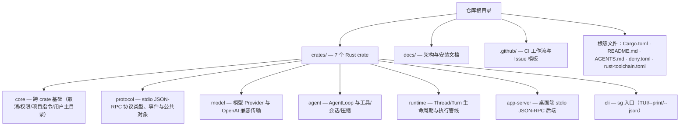
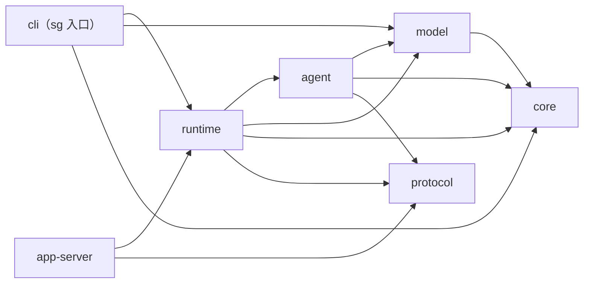
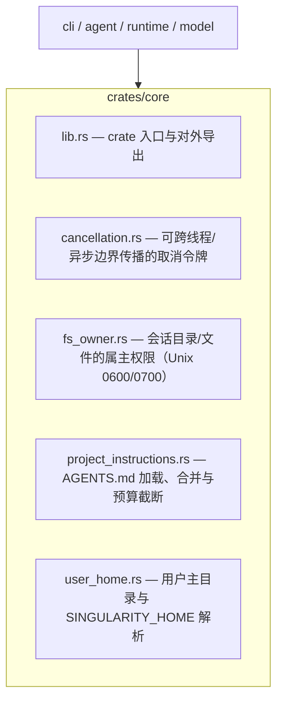
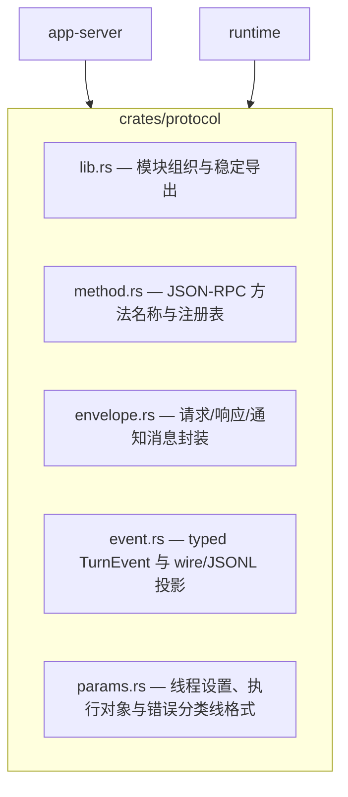
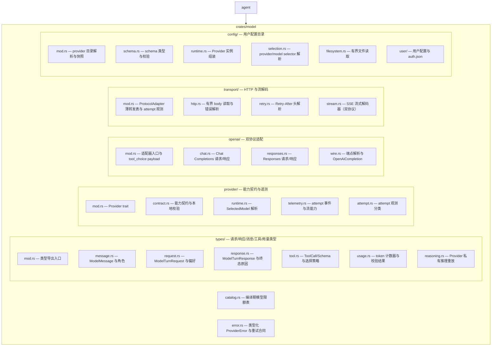
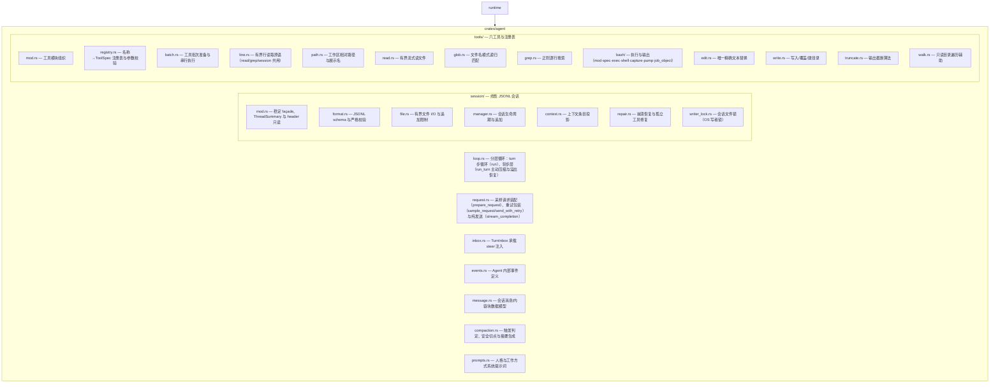
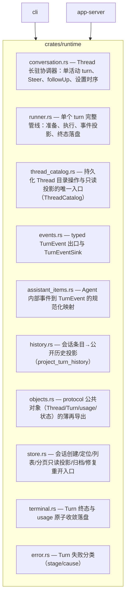
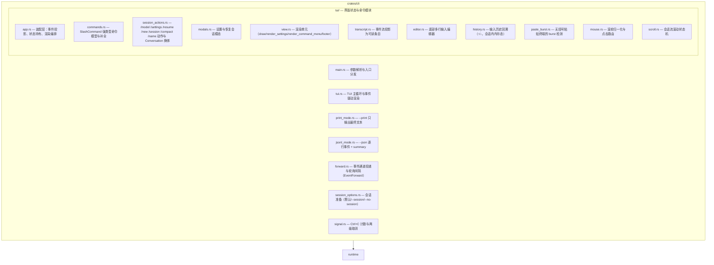
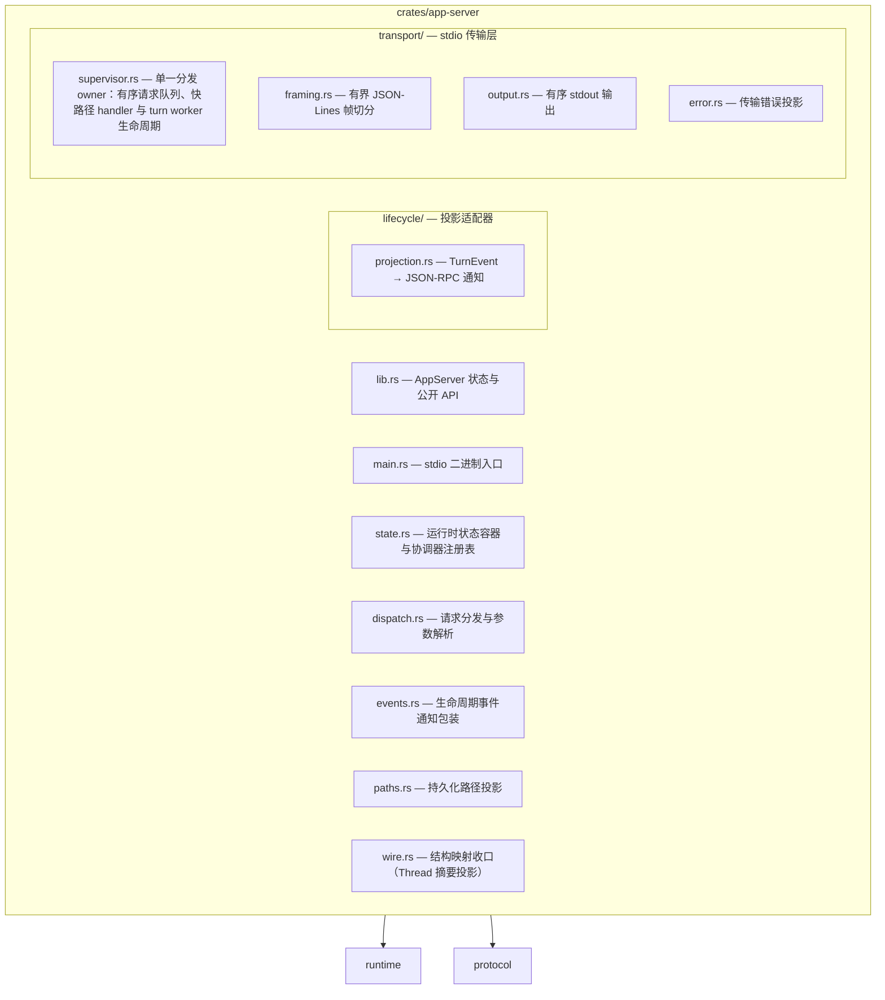
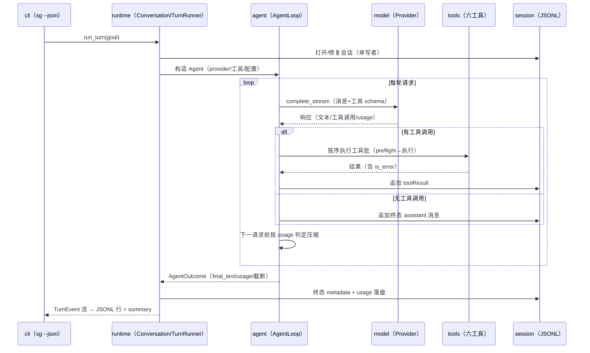

# 仓库地图（Repository Map）

> 本文是仓库的浅层导航图：先看总览与依赖，再按 crate 展开到文件。
> 深层的架构事实、协议与行为见 [`singularity.md`](singularity.md)。

## 1. 仓库总览

## 2. Crate 依赖方向

依赖只沿一个方向：`cli` 与 `app-server` 是入口，`core` 是底层基础；`protocol` 定义公共协议对象、事件枚举与 wire 线格式，`agent`（仅两个持久化共享 DTO）、`runtime` 与 `app-server` 均依赖它。

## 3. crates/core — 跨 crate 基础

无依赖的叶子 crate：取消令牌、文件权限、项目指令与用户主目录。

## 4. crates/protocol — 协议类型

单点定义 stdio JSON-RPC 的全部方法、请求/响应 envelope、生命周期事件（`TurnEvent`）、执行对象（`Thread`/`Turn`/`TurnModelUsage`/`TurnStatus`）与错误分类词表。

## 5. crates/model — Provider 与 OpenAI 兼容传输

模型消息类型、Provider 能力契约、配置快照，以及 Chat Completions / Responses 双协议的
请求序列化、流式解码与 HTTP 传输。`AgentLoop` 只执行 Provider 已声明的能力。

## 6. crates/agent — AgentLoop、工具、会话与压缩

模型无关的执行核心：分层执行循环（turn 步循环 → 轮步层 → 采样请求层 → 纯发送层）、六工具注册表、
线性 JSONL 会话与上下文压缩引擎。`runtime` 的 TurnRunner 调用这里的 `Agent`。

## 7. crates/runtime — Thread/Turn 生命周期

三种产品形态共用的唯一执行层：无交互入口与 TUI 进程内调用 `Conversation`，
app-server 通过它执行同一 runtime。`TurnRunner` 是单个 turn 的唯一所有者。

## 8. crates/cli — sg 入口

三种形态入口：无参数进入 TUI、`--print` 单次文本、`--json` 逐事件 JSONL。
全部委托 runtime，渲染只消费 typed `TurnEvent`。

## 9. crates/app-server — 桌面端后端

stdio JSON-RPC 后端：只做准入、协议对象转换与事件投影，执行全部委托 runtime。
`protocol` 类型只存在于本 crate、适配器与 runtime 的公开历史投影（
thread/read 的分页与历史投影由 runtime store 的 `paged_read` 承担）。

## 10. 一次 turn 的生命周期（跨 crate 全景）

无交互入口（`--json`）执行一个 goal 的完整链条；TUI 与 app-server 走同一 runtime。

## 11. 其他目录

- **docs/**：`singularity.md`（架构事实文档）、`INSTALL.md`（安装）、`tui-manual-verification.md`（TUI 手工验证）、`repository-map.md`（本文件）、`decisions/`（裁决记录）、`agents/`（按需读取的项目指令）。
- **.github/**：`ci.yml` 入口 → `rust-gates.yml`（supply-chain + Linux/Windows 门禁）、`release.yml`（发布打包）、Issue 模板。
- **根级文件**：`Cargo.toml`（workspace 成员与统一 lint）、`deny.toml`（依赖策略）、`rust-toolchain.toml`（固定工具链）、`AGENTS.md`（仓库指令）、`README.md`。
- **outputs/**、**.worktrees/**、**.codex/**、**plan/**、**docs/plans/** 等为本地工作产物，不入库。
