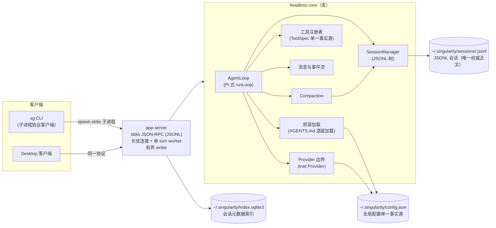
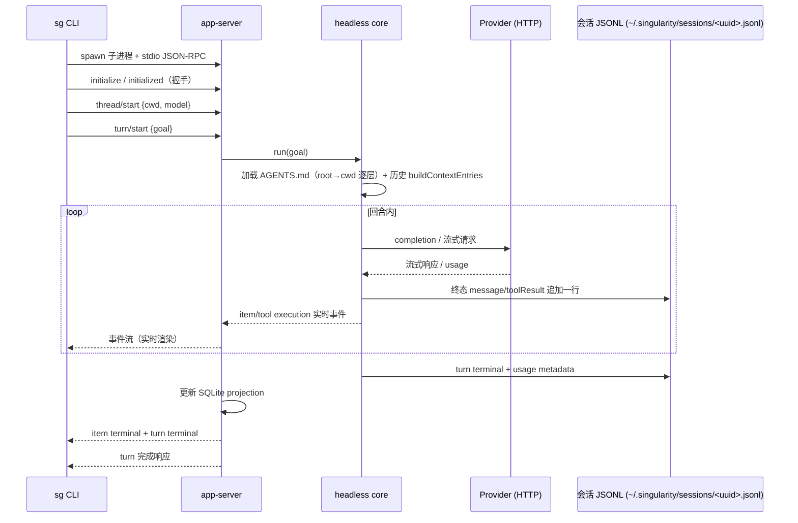
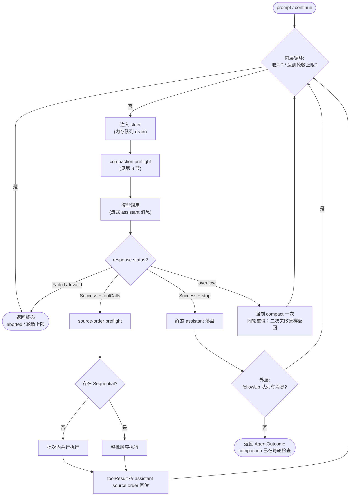
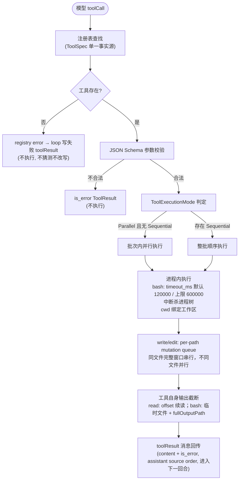
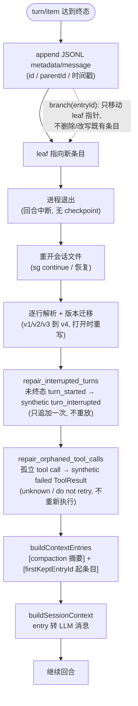
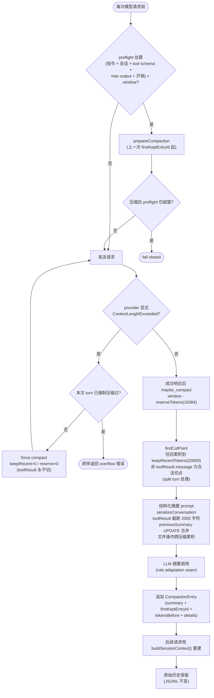
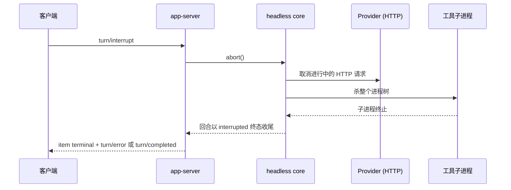
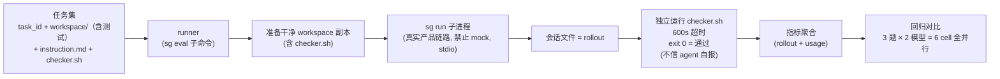

# Singularity 架构（当前实现）

> **本文档描述当前有效架构**，以当前源码为准；技术细节参考 Pi v0.84.1 一手源码和 Singularity 当前实现核查。历史实现由 Git 保存。
>
> **维护规则**：修改以下任一事实时同步更新本文：进程边界、协议 transport/命令/事件、会话格式、Compaction、工具面与工具语义、Provider/模型能力声明、配置 schema、评估工具、发布二进制。

## 1. 总览与进程架构（图 a）

采用 Codex 进程模式：单一 **headless core 库**（无进程/UI 假设）+ 瘦身 **app-server**（stdio JSON-RPC transport，单客户端连接可长驻，连接内单 turn worker 与有界 writer）+ 全部客户端走同一协议。会话正文由 JSONL 持久化，SQLite 只保存索引投影；运行时只保留当前连接所需的活动句柄和有界终态引用。

- **headless core**：AgentLoop（Pi 式 runLoop）、SessionManager（JSONL 树）、Compaction、工具注册表（ToolSpec 单一事实源）、消息与事件流、资源加载（AGENTS.md 无条件逐层加载）、Provider 边界（trait Provider）。
- **app-server**：JSON-RPC（JSONL framing）；命令/事件协议包含 thread/turn/item 生命周期、公开 history projection、settings、usage 与 capabilities；输出队列有界，满时阻塞，不主动丢事件。
- **传输**：CLI 每次命令启动独立 **stdio app-server 子进程**；Desktop 可保持一个长驻 stdio 连接并在同一进程中执行多轮、切换设置、取消和重连。没有 TCP daemon、cursor/gap replay 或独立 Desktop UI。
- **客户端**：`sg` CLI（一次性 stdio 子进程客户端）；Desktop 接入复用同一协议、配置和会话。
- **共享事实**：`%USERPROFILE%\.singularity\config.json`（全局配置单一事实源）；`~/.singularity/auth.v1-*.json`（私有认证文件，Unix 0600，Windows 继承目录 ACL）；会话 JSONL 为 `~/.singularity/sessions/<uuid>.jsonl`，SQLite 仅保存 `~/.singularity/index.sqlite3` 中的轻量索引。
- **依赖方向**：客户端只依赖协议层与 core；产品 crate 不依赖 evaluation。

（图 a：进程架构）

## 2. 主调用链（图 b）

`sg run <goal>` 完整链路：spawn 独立 app-server stdio 子进程 → 握手（initialize/initialized）→ `thread/start`（创建 `~/.singularity/sessions/<uuid>.jsonl` 并写入索引）→ `turn/start`（先追加 `turn_started` metadata，再把 goal 交给 core）→ core 逐层加载项目指令（root→cwd）与历史（buildContextEntries）→ AgentLoop 运行 → provider 调用和工具事件实时回传客户端 → 终态消息、terminal metadata、usage 追加到 JSONL → SQLite 更新索引 → 发布 item/turn 终态事件。`sg continue` 和 Desktop 重连都通过索引定位并重开既有会话文件，继续操作追加新 turn。

（图 b：主调用链）

## 3. AgentLoop 循环（图 c）

Pi 式双层循环。内层每轮迭代：检查取消与轮数上限 → drain steer 队列注入 user 消息 → compaction preflight → 模型调用（流式 assistant 消息）→ 仅 `Success` 响应执行工具并把 toolResult 按序回传 → 进入下一轮；无 toolCall 的 `Success` 响应持久化终态 assistant 消息。一个 assistant response 的工具批次先按 source order 完成查找、参数校验和执行模式 preflight；无 `Sequential` 工具时实际并行执行，有任一 `Sequential` 工具时整批顺序执行。生命周期事件按实际完成/回调到达顺序交付，durable ToolResult 始终按 assistant source order 写入并用于下一次请求；取消会传播给批次内所有工具并等待其终态结果收敛。内层退出后进入外层：drain followUp 队列，仍有消息则继续内层，否则返回聚合结果。

- **steer / followUp 是 thread 级内存队列**：纯内存投递，进程退出即丢；不持久化、无幂等键。有 turn 在跑时实时注入并返回 outcome=active；turn 已终态时按 turn→thread 历史映射入 thread 待办队列并返回 outcome=queued，下一次 `turn/start` 取走注入；未知 turn 返回 not found。steer 在工具执行完成后、下一次模型调用前注入；followUp 在 agent 即将停止时注入。
- **模型失败语义**：`Success` 才持久化 assistant 消息或执行工具；`Failed`/`Invalid` 直接以 typed provider 错误结束，不在 AgentLoop 层做整轮重试。显式上下文溢出（`ContextLengthExceeded`）强制压缩一次后重试同一轮（见第 6 节），第二次失败按原错误返回。
- 停止条件：无工具调用的成功 assistant 响应；外部取消（aborted，不视为模型错误）；达到 `max_turns` 上限；模型错误或会话错误直接返回。

（图 c：AgentLoop 循环）

## 4. 工具执行链（图 d）

模型 toolCall → 注册表查找（单一事实源 ToolSpec）→ source-order JSON Schema 参数校验与 preflight → 按 `ToolExecutionMode` 执行（默认 `Parallel`；任一 `Sequential` 时整批顺序）→ 进程内工具继承宿主权限执行 → 工具自身完成输出截断/超时/进程树终止 → `ToolExecution {content, is_error}` 按 assistant source order 回传。**无 before/after hook**：校验失败返回 is_error 结果，注册层错误（如未知工具）由 loop 包装为失败的 toolResult，不终止整轮。

**工具面（裁决 3，对齐 Pi）**：`ToolRegistry::new()` 只注册 read/bash/edit/write；文档不再声明未注册的 grep/find/ls。工具 schema 见第 12.2 节。

**执行可靠性（裁决 5，对齐 Pi，实测调整）**：

- 超时：bash 缺少 `timeout_ms` 时使用 120000 ms；显式值必须是 integer 1..=600000，上限 600000 ms。
- 输出截断：bash 保留最后 2000 行 / 50 KiB，超限写入系统临时文件并返回 `fullOutputPath`；read 仅返回尾部与 `offset` 续读提示，不写临时文件。
- 中断：abort 信号杀死整个进程树。
- 工作目录绑定会话/任务工作区。
- `write`/`edit` 的完整文件修改窗口由小型 per-path mutation queue 串行化：key 是规范化执行环境身份（canonical cwd）与 canonical absolute path；已有路径通过 `canonicalize` 解析，缺失路径按最近存在祖先规范化，路径别名/符号链接指向同一目标时共享 key。目录准备、读—匹配—计算—写入均在临界区；不同文件仍可并行，lease 释放后无消费者 entry 从 map 清除。

（图 d：工具执行链）

## 5. Session 持久化与恢复（图 e）

会话格式语义对齐 Pi（裁决 10）：JSONL 树（v4），每个 entry 有 `id` 与 `parentId`（带时间戳），消息 role 为 user / assistant / toolResult 等，另有 compaction 和不进入模型上下文的 metadata entry。metadata 类型包括 `turn_started`、`turn_completed`、`turn_failed`、`turn_interrupted`、`thread_settings`、`usage` 与最终 item 事实；它们与消息共享同一 append seam，不构成第二事实源。v4 起消息 `content` 为内容块数组（`text` / `thinking` / `tool_call`），一次模型响应 = 一条 assistant 消息；工具结果按 `toolCallId` 关联的独立 toolResult 消息回写，并持久化 `isError` 语义；thinking 块随会话持久化，续接时仅在 provider/model/reasoning binding 兼容时投影 provider-private replay（不兼容时丢弃私有 replay，保留可见 thinking/message/tool history）。存放于 `~/.singularity/sessions/<uuid>.jsonl`（header UUID 即 session id），迁移旧项目 `.singularity/agent-sessions/` 时先备份到 `~/.singularity/backups/` 并校验。**会话 JSONL 是唯一持久事实源**：无 checkpoint、无 cursor/gap replay；重开时对未终态的 `turn_started` 只追加一次 synthetic `turn_interrupted`，对孤立 tool call 补 synthetic failed ToolResult，均不重新执行工具。SQLite `session_index` 只保存 session_id/rollout_path/cwd/title/model/status/created_at/updated_at/token_usage 等轻量投影，不保存对话正文。

- 落盘时机：turn 启动先把 `turn_started` metadata 和当前 user 消息追加 JSONL；随后只有终态 assistant/toolResult/compaction 消息、turn terminal metadata 和标准化 usage 追加 JSONL，流式 delta 不落盘。终态发布顺序固定为 JSONL → SQLite → 协议通知。进程崩溃时已追加的 user/assistant tool-call 条目保留，不存在的回合不写入状态。
- 追加即推进 leaf；**分支只移动 leaf 指针**，不删除、不改写既有条目。
- 恢复：重开文件 → 逐行解析 + 版本迁移 → `repair_orphaned_tool_calls`（有 tool_call_id 但无后续 ToolResult 的 assistant 条目，追加 synthetic failed ToolResult：`[previous execution outcome unknown; do not retry]`；不重写/删除原条目、绝不重新执行工具）→ `buildContextEntries`（取路径中最近 compaction entry：`[compaction 摘要]` + `firstKeptEntryId` 起的原始条目；被总结的旧条目从 context 省略但保留在文件）→ `buildSessionContext` 转 LLM 消息。
- metadata、custom、label、model_change、thinking_level_change、session_info 等非消息条目不进模型 context；公开 `session/read` 只返回稳定的 message/thinking/tool_call/tool_result/turn/settings/usage/compaction projection，不返回 raw SessionEntry、parent/tree、迁移字段或 provider-private replay。`session_index.status` 只表示 turn 状态：尚无 turn 时为 null（缺失值），turn 运行中为 active，终态为 completed/failed/interrupted；启动扫描会从 JSONL 修复 active/usage/model 的 SQLite 投影。`sg continue`/resume 不改变终态，继续操作总是新 turn。

（图 e：Session 持久化与恢复）

## 6. Compaction（图 f）

对齐 Pi 算法，并叠加 preflight 与显式 overflow 兜底：

- **触发**：每次模型请求前先做 preflight：估算 `系统/开发者指令 + 会话消息（含历史 tool call 的 id/name/raw_arguments 与 tool 消息的 tool_call_id）+ tool schema + max_output_tokens + 32 token 开销`，超过 context window 则先压缩并在压缩后仍超窗时 fail closed。每次成功的模型响应后，`maybe_compact` 用 `contextWindow − reserveTokens(16384)` 判定；contextTokens 取最近有效 assistant usage 的 totalTokens + 其后的消息估算，无可用 usage 时全量估算（字符 UTF-16 长度/4）。
- **显式溢出兜底**（裁决 8）：provider 以 `ContextLengthExceeded` 显式报溢出（流式错误或 Failed 响应）时，强制 compaction 一次（`keepRecentTokens=0` / `reserveTokens=0`，toolResult 仍不切）并重试同一轮；第二次溢出按原错误返回，不无限压缩。失败请求未持久化 assistant/error/length 消息，因此无需移除尾部消息。
- **切点**：`findCutPoint` 从最新往回累积估计 token 直到达到 keepRecentTokens(20000)，取其后最近合法切点；合法切点 = 非 toolResult 的 message（user / assistant / bashExecution / custom / branchSummary / compactionSummary），**toolResult 永不切**（必须跟随其 tool call）；split turn 时摘要范围回到该 turn 起点。
- **摘要**：结构化摘要 prompt（serializeConversation 序列化，tool result 截断 2000 字符）；摘要系统指令与普通请求共用 developer→system→user role adaptation seam；Responses 输入中首段 system/developer 进入 `instructions`，历史中部的 developer 投影为 `system`，避免发送兼容端点不接受的 developer role；有 previousSummary 时用 UPDATE prompt 合并更新；文件操作（read/modified 列表）跨多次压缩累积；摘要调用是一次性 prompt，不写缓存，provider 传输层重试负责可重试网络错误。
- **落盘与重建**：追加 CompactionEntry（summary + firstKeptEntryId + tokensBefore + previousSummary + 文件操作 details）→ 每次请求通过 `buildSessionContext()` 重建消息，session 内存态不保留旧上下文 → **原始历史保留**（JSONL 与文件条目不变）。
- **降级**：post-response compaction 的摘要生成失败（provider/无效响应）记录后跳过，不丢弃已完成轮次；会话写入错误仍传播。
- **二次压缩**：从上一次 compaction 的 firstKeptEntryId 起，之前保留的消息再次进入总结范围；previousSummary 走 UPDATE 合并；最新 context 条目已是 compaction 时不重复压缩（两次压缩之间必须有新消息）。

（图 f：Compaction 数据流）

## 7. 取消/中断传播（图 g）

`turn/interrupt` → app-server → core `abort()` → 取消进行中的 provider HTTP 请求 + 杀死工具子进程树 → 回合以 `interrupted`/`cancelled` 终态收尾（已落盘条目保留，运行中未完成的工具只产生失败/未知说明，不补成功结果）。中断前工具已产生的 workspace 副作用不回滚（照 Pi：取消不宣称回滚副作用）。

（图 g：取消/中断传播）

## 8. Evaluation（图 h）

轻量回归评估工具（裁决 2），独立于产品 crate（不进入产品协议与发布包）：

- **任务集**（通用格式）：task_id + `workspace/`（几百~1000 行项目，含测试）+ `instruction.md` + `checker.sh`。
- **执行规模**：3 题 × 2 模型 = 6 cell 全并行（一次 3 题以控制供应商并发；模型组：opencode-go/deepseek-v4-flash#max、longcat/LongCat-2.0#high；当前题集：warehouse-audit / billing-calc / cache-ttl）。
- **流程**：准备干净 workspace 副本（含 checker.sh）→ 子进程跑 `sg run --json`（**真实产品链路，禁止 fake/mock**；每 cell 均为独立 stdio 子进程）→ 收集会话文件（rollout）→ 独立运行 checker.sh（exit 0 = 通过；**绝不采信 agent 自报**；600s 超时防挂死）→ 从 rollout + usage 聚合指标。
- **判分语义**：turn 失败但 checker 通过时判 passed（workspace 状态是客观证据）；checker 输出经读取线程边读边同步捕获（孙进程持管道不 EOF 也能拿到已读部分）。
- **指标**：通过/失败/部分得分；中断/崩溃/超时；总时长；token 总量；缓存命中率；成本估算；耗时拆解；工具调用数；工具失败数；重复动作。
- 每次 harness 改动后重跑，指标按模型分组对比。

（图 h：Evaluation 产品链）

## 9. Provider 与模型

**静态能力声明**（裁决 8）：每个模型静态声明能力（context window、max output、reasoning 档位、工具支持），来源为内置模型表 + 用户 models/config 覆盖；不做网络探测或能力协商。context window 未声明时保留 `unknown` 元数据，执行时本地 compaction 预算以默认 128000 兜底。显式溢出重试兜底见第 6 节。

- **Provider 边界**：`trait Provider`；保留 OpenAI-compatible 双协议 adapter（Chat Completions / Responses），同一请求对象投影两条 wire 路径，共用请求校验、重试、响应归一化；`finish_reason=length`/`content_filter` 作为未完成响应 fail closed。
- **usage 记账**：Provider 返回 usage 时记录 input/output/total、cached input、reasoning token 与 cost，供评估指标与诊断使用；缺少原始 usage 时各计数保持 unknown、`usage_present=false` 且 `cost_estimate=null`，不把缺失伪装成零消费。成本按 `(input − cached)×input价 + cached×cache价 + output×output价` 计（input 已含缓存命中，命中部分按 cache 价）。
- **重试**：传输层单次 complete 最多 6 次 attempt（首次 + 最多 5 次重试），只重试可重试的网络/timeout/body 读取错误与 HTTP 429/5xx；backoff 以 50 ms 为基数逐次翻倍，每次等待检查取消。AgentLoop 不对传输层耗尽后的瞬时错误做整轮重试；仅在显式上下文溢出时按第 6 节强制压缩一次并重试同一轮。
- **思考档位**：每模型显式声明 reasoning 档位；Chat 与 Responses 分别按各自 wire 合同发送对应字段。
- **失败诊断**：失败投影稳定 typed 分类（阶段、transport 类别、HTTP status、校验码等）+ 脱敏后的真实错误文本（敏感内容降级为 `Internal error`，不包含 API key、endpoint 原始请求/响应）；错误保留真实因果差异，不靠字符串匹配驱动控制流。
- **配置校验**：配置值在本地信任边界完整校验，fail closed，不静默 trim/纠正；错误不携带原始值；API key 只通过配置引用的环境变量名解析，不进入会话/日志。

## 10. 配置与项目指令

**配置单一事实源**：`%USERPROFILE%\.singularity\config.json`（全局）+ 进程环境层（`SINGULARITY_MODELS_CONFIG` 等）；providers / models / 默认设置全部在此，CLI 与桌面端读同一文件。进程启动时捕获一次配置快照。私有认证文件 `~/.singularity/auth.v1-*.json` 按 Pi 策略保护：Unix 上 0600，Windows 上不做额外 ACL 管理（访问由目录 ACL 决定）。会话目录 `~/.singularity/sessions/`、索引 `~/.singularity/index.sqlite3` 与备份目录 `~/.singularity/backups/` 同理（Unix 0700/0600，Windows 继承目录 ACL）。

**资源加载（裁决 7 修订）**：AGENTS.md 与 Pi 一致**无条件逐层加载**（root→cwd），无 trust 门控。按 root→cwd 顺序逐层收集项目指令文件（每层优先 AGENTS.override.md，否则 AGENTS.md），合并后经 developer→system→user role adaptation seam 注入，不修改 user goal；单文件 ≤ 32 KiB、合并总计 ≤ 64 KiB；来源 SHA-256 作为可验证 provenance。

## 11. 客户端与协议

**客户端**：`sg` CLI 是 app-server 协议客户端，每次命令 spawn 独立 stdio 子进程；Desktop 可保持同一连接长驻。CLI 命令：`sg run <goal>`（发起新回合）、`sg continue <session-id>`（重开既有会话继续）、`sg threads`（全部会话 + cwd）、`sg session read|delete`、`sg config`（doctor / models / import-env）、`sg eval`。Desktop UI 不在本仓库实现，只消费同一 headless core/app-server 协议。

**JSON-RPC 传输合同**（stdio JSON-Lines framing）：

- 每行一个完整 JSON 值；JSONL 只负责 framing，不改变 JSON-RPC 2.0 语义。
- 所有 envelope 带 `jsonrpc: "2.0"`，由互斥的 request / notification / success / error 表示；request id 只接受字符串或可精确表示的 JSON 整数，`null` 仅用于服务端无法关联合法请求时的 response/error id；error envelope 不允许省略 `id`；响应按解析后的合法 id 关联。
- 错误码：`-32700`（解析失败）、`-32600`（无效请求）、`-32601`（未知方法）、`-32602`（无效参数）、`-32603`（内部错误）、`-32007`（协商能力缺失/unsupported）。错误诊断原则（§9 方案 A）：`-32603` 透出保留真实因果的脱敏文本（如 DB/锁/provider 错误原文），文本疑似含密钥时回退 `Internal error`；`data` 仅允许显式脱敏内容。
- batch 没有 stdio 消费者；transport 对 batch frame 直接返回 `-32600` 拒绝。
- 方法注册表（method 名、params/result schema）是命令合同的唯一事实源。

**命令/事件集（当前实现）**：initialize/initialized、server/capabilities、thread/start、thread/list、thread/resume、thread/settings、session/read、session/delete、turn/start、turn/steer、turn/followUp、turn/interrupt、agent/capability、server/shutdown。turn/steer 与 turn/followUp 为 thread 级队列：有 turn 在跑实时注入并返回 outcome=active，turn 已终态则入 thread 待办、下次 `turn/start` 取走并返回 outcome=queued（Pi 式，不拒绝），未知 turn 返回 not found。`thread/settings` 只持久化非敏感 provider/model/reasoning 选择，当前 turn 使用启动时快照，下一 turn 生效。`server/capabilities` 返回 protocolVersion 和固定 feature list；缺失能力按 typed unsupported 处理。`session/read` 有界解析并返回公开 history items（message/thinking/tool_call/tool_result/turn/settings/usage/compaction），不返回 raw SessionEntry、全文 delta 或 private replay；CLI 通过显式 `sg run --session-reference <id>` 把该结果投影为 untrusted reference material（仅 user/assistant/toolResult 字符串文本，带来源 id、non-instructional 声明、16 KiB/4096 token 硬上限），当前请求用独立 `CURRENT REQUEST` 边界分隔；目标文本不做隐式语言解析。实际发出的事件为 thread/started、turn/started、item/started、item/agentMessage/delta、item/completed、item/failed、turn/completed、turn/error（失败 turn 的 turn 级终态，携带 typed stage/cause、脱敏 message 与 willRetry，对齐 Codex ErrorNotification）、tool/execution/start、tool/execution/update、tool/execution/end（工具生命周期，对齐 Pi tool_execution_start/_update/_end；start/update 携带 `toolCallId`、`toolName`、`args`，update 另带 `partialResult`，end 携带结构化 `result` 与 `isError`）。每个 started item 恰有一个 terminal；并行工具按完成顺序发布事件，ToolResult 按模型 source order 写入 JSONL。**会话 JSONL 是唯一持久记录**。

**客户端失败语义**：CLI 用 typed params/result 与 JsonRpcId 关联请求，只把 matching response 之前的 notification 与 response 关联；EOF、子进程退出、超时、非法 envelope 与 JSON-RPC error 均为非零退出。防御细节：残留子进程可能直写非 JSON 行（含 lossy 替换后的坏字节），客户端跳过非 JSON 行不终止协议（真正的 response 行仍被解析）；客户端事件投影只保留各事件合同字段，不透传未知 envelope 字段。

## 12. 保留的技术细节

### 12.1 脱敏与工具输出合同

- 工具执行结果是 `ToolExecution {content: String, is_error: bool}`，追加为会话 `toolResult` message 后按原样进入 LLM 上下文（role `tool` + tool_call_id），并在公开 history 中投影为带 `isError` 的 `tool_result` item；没有把流式 delta 永久化为独立事件。
- bash 对流式输出做控制字符过滤（保留 `\t`/`\n`/`\r`），并按 tail 规则截断（最后 2000 行 / 50 KiB）；超限内容写入系统临时文件并通过 `fullOutputPath` 文本标记返回，不向模型发送原文件内容。read 单行 ≤ 4 MiB、单次扫描 ≤ 64 MiB，超限仅返回尾部与 `offset` 续读提示，不写临时文件。工具生命周期事件按 Pi 合同广播参数、partial result 与结构化 result；会话 `toolResult` 仍是 LLM 上下文的权威结果消息。
- 工具结果文本不包含 provider 原始响应；raw tool arguments 同时存在于会话 assistant 的 `tool_call` 内容块 `args` 字段及 N7 工具生命周期事件，用于客户端关联与展示。不做受保护路径拒绝规则（对齐 Pi：工具信任后直接执行）；密钥边界由 provider 错误脱敏承担，不做统一的全文本 secret 扫描。

### 12.2 工具 schema（对齐 Pi）

| 工具 | schema | 语义要点 |
| --- | --- | --- |
| read | `{path, offset?, limit?}` | 文本文件有界读取（非图片）；单行 ≤ 4 MiB，单次扫描 ≤ 64 MiB；超限只提示 offset 续读，不写临时文件/fullOutputPath；offset 1-indexed，limit 自动 clamp 到 2000 |
| bash | `{command, timeout_ms?}` | 缺省 `timeout_ms` 使用 120000；显式 schema 为 integer `1..=600000`，负数/浮点/字符串/null/溢出为 typed 参数错误；输出截断最后 2000 行/50 KiB，超限写临时文件并返回 fullOutputPath；含 exitCode；abort 杀进程树（Unix 独立进程组） |
| edit | `{path, oldString, newString}` | 单次精确文本替换（唯一匹配，否则 is_error）；保留行尾风格；结果含 diff / firstChangedLine |
| write | `{path, content}` | 写文件（新建或覆盖） |
| grep / find / ls | 不实现 | 当前 `ToolRegistry::new()` 只注册 read/bash/edit/write；可选只读工具面未注册 |

### 12.3 会话落盘细节

- 流式期间的消息 delta 不落盘；终态 user/assistant/toolResult/compaction 消息各追加一行，turn lifecycle/settings/usage 作为 metadata 追加到同一 JSONL。
- turn 启动时当前 user 消息立即写盘（先于第一次模型请求），进程崩溃后重开会话可看到该 user 消息。
- `turn_started` 在 SQLite active 投影和 `turn/started` 通知之前写盘；terminal metadata 与 usage 在 SQLite 终态投影和终态通知之前写盘。assistant tool-call 消息与其 toolResult 配对写盘；崩溃造成孤立 tool call 时，可写恢复路径先补 synthetic failed ToolResult（unknown / do not retry），不重写原条目、不重新执行工具。metadata 永远不进入模型 context。

### 12.4 错误码与错误合同

- JSON-RPC 标准错误码（`-32700` / `-32600` / `-32601` / `-32602` / `-32603`）与"不回显原始输入"合同见第 11 节。
- 项目级错误码由 core 定义（`ErrorCode`），具体清单以协议层当前类型和错误映射为准。

### 12.5 维护规则与验证

- 本文与真实架构同步维护（见头部维护规则）。
- 验证按变更风险选择：纯文档、决策记录或提示词修改检查最终内容、链接并运行 `git diff --check`；代码、协议、持久化、并发、安全或 Provider 变更再按影响范围运行定向测试、构建检查和必要的真实链路验证；完整 workspace 检查或 Evaluation 不是默认门禁。
- 影响 AgentLoop / provider / 工具 / 会话 / compaction 时，通过 `sg → app-server → core` 产品链跑一次真实 Provider 任务核对链路。
- 评估铁律（裁决 2）：harness 链路验证必须真实模型调用，禁止 fake/mock；mock 只允许于纯逻辑单元测试（解析、切点算法等与链路行为无关处）。

## 13. 当前维护边界

- 本文只描述当前有效的进程边界、协议、会话格式、AgentLoop、Compaction、工具语义、Provider 能力声明、配置和评估入口。
- 已移除机制、迁移过程、阶段状态和历史提交由 Git 保存，不在架构事实源中维护。
- 修改上述任一事实时，必须同步更新对应章节并运行受影响的静态、定向和真实链路验证。
