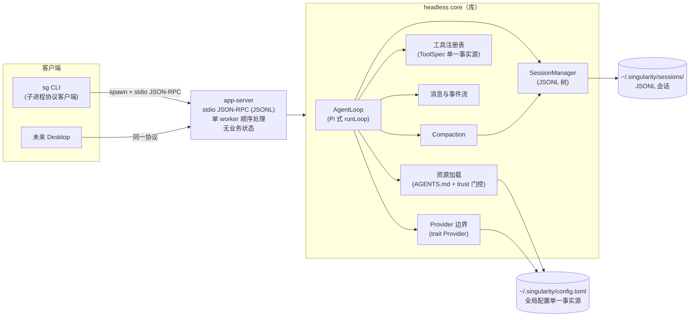
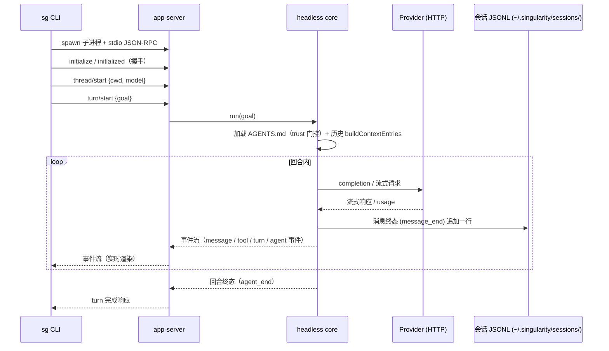
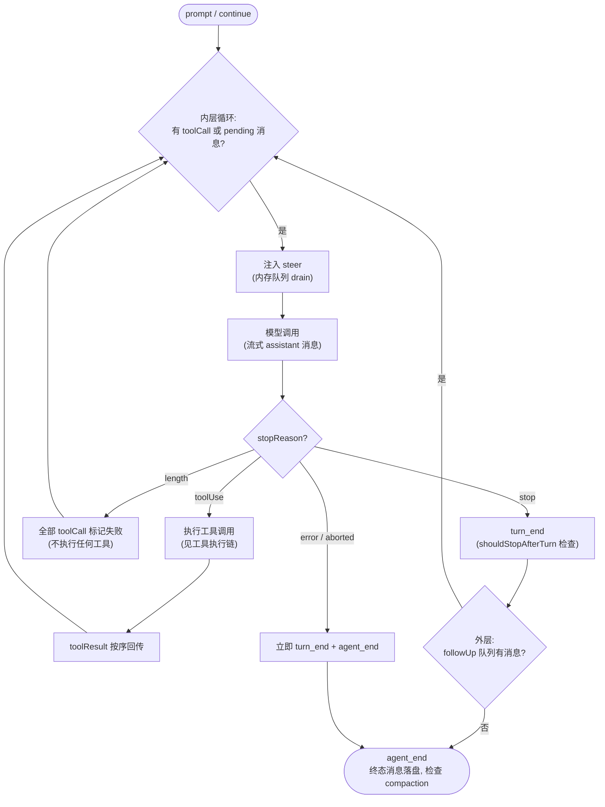
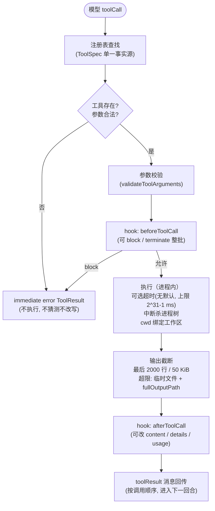
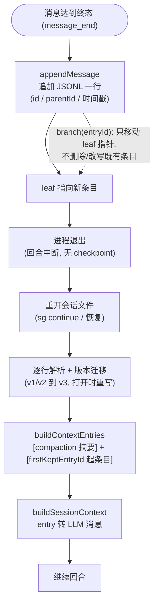
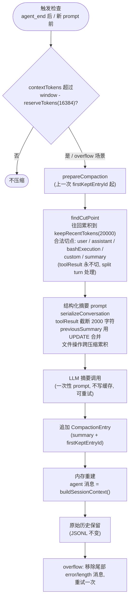
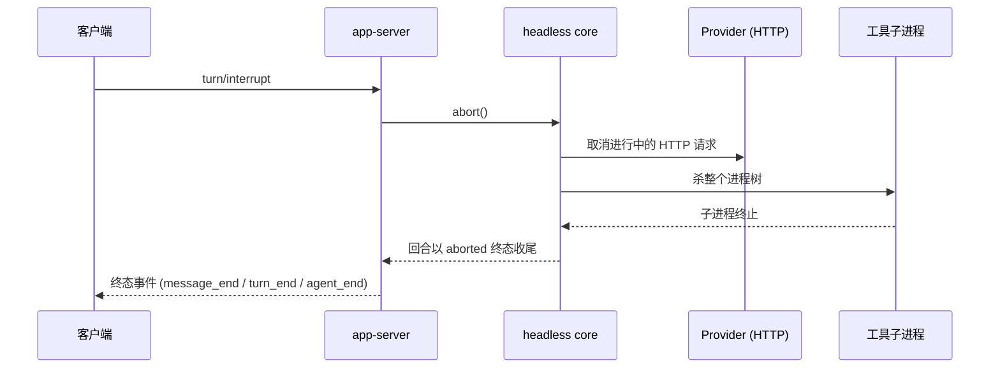
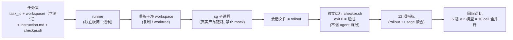

# Singularity 架构（重构目标形态）

> **演进状态说明**：本文档描述重构**目标架构**，依据 `outputs/arch-review/00-decision-baseline.md`（十项裁决 + 目标形态 + 重构计划）绘制；技术细节对照其中引用的 Pi v0.84.1 一手源码核查记录（`outputs/arch-review/01`、`02`）与当前源码。**重构进行中**（Phase 1–7，状态见附录 B），各 Phase 完成后本文实时更新；当前源码可能与本文不一致，以本文目标形态为准。已移除机制的细节不展开，见附录 A；历史实现由 Git 保存。
>
> **维护规则**：修改以下任一事实时同步更新本文：进程边界、协议 transport/命令/事件、会话格式、Compaction、工具面与工具语义、Provider/模型能力声明、trust 决策、配置 schema、评估工具、发布二进制。

## 1. 总览与进程架构（图 a）

采用 Codex 进程模式（裁决 4）：单一 **headless core 库**（无进程/UI 假设）+ 瘦身 **app-server**（stdio JSON-RPC transport，单 worker 顺序处理，无业务状态）+ 全部客户端走同一协议。业务状态（历史 seed、输入组装、工具装配、trust 决策）全部下沉到 core。

- **headless core**：AgentLoop（Pi 式 runLoop）、SessionManager（JSONL 树）、Compaction、工具注册表（ToolSpec 单一事实源）、消息与事件流、资源加载（AGENTS.md + trust 门控）、Provider 边界（trait Provider）。
- **app-server**：stdio JSON-RPC（JSONL framing）；命令/事件协议收敛为 Pi RPC 级命令集 + 事件流；无 7 态 Turn、无 trace 合同、无 cursor/gap/背压/全局排序、无 16-worker 池。
- **客户端**：`sg` CLI（子进程 spawn app-server + JSON-RPC）；未来 Desktop 同协议、同配置、同会话。
- **共享事实**：`~/.singularity/config.toml`（全局配置单一事实源，CLI 与桌面端读同一文件）；`~/.singularity/sessions/`（JSONL 会话，唯一持久记录）。
- **依赖方向**：客户端只依赖协议层与 core；产品 crate 不依赖 evaluation。

（图 a：进程架构）

## 2. 主调用链（图 b）

`sg run <goal>` 完整链路：spawn app-server 子进程 → LSP 式握手（initialize/initialized）→ `thread/start`（记录 cwd 与模型）→ `turn/start`（goal 交给 core）→ core 加载项目指令（trust 门控）与历史（buildContextEntries）→ AgentLoop 运行 → provider 调用 → 事件实时回传客户端 → 消息终态追加到会话 JSONL。`sg continue` 重开既有会话文件，走同一条链。

（图 b：主调用链）

## 3. AgentLoop 循环（图 c）

Pi 式双层循环（裁决 4/9）。内层每轮迭代：drain steer 队列注入消息 → 模型调用（流式 assistant 消息）→ 有 toolCall 则执行工具并把 toolResult 按序回传 → 进入下一轮；`stopReason` 为 error/aborted 立即收尾，length 时不执行任何工具（全部标记失败）。内层退出后进入外层：drain followUp 队列，仍有消息则继续内层，否则 `agent_end` 收尾。

- **steer / followUp 是内存队列**（裁决 9）：纯内存投递，进程退出即丢；不持久化、无幂等键。steer 在工具执行完成后、下一次模型调用前注入；followUp 在 agent 即将停止时注入。
- 回合结束后的处理（照 Pi 语义）：可重试错误自动重试（有上限）；compaction 检查（见第 6 节）；队列中仍有消息则继续。
- 停止条件：`stop`（无工具调用、正常完成）、`length`（输出截断，工具不执行）、`toolUse`（继续执行工具）、`error`/`aborted`（立即终止）。

（图 c：AgentLoop 循环）

## 4. 工具执行链（图 d）

模型 toolCall → 注册表查找（单一事实源 ToolSpec）→ 参数校验 → `beforeToolCall` hook（可 block；terminate 可终止整批）→ 执行（进程内，无 sandbox）→ 输出截断 → `afterToolCall` hook（可改 content/details/usage）→ toolResult 按调用顺序回传。

**工具面（裁决 3，对齐 Pi）**：默认 read/bash/edit/write；可选只读 grep/find/ls。工具 schema 见第 12.2 节。

**执行可靠性（裁决 5，对齐 Pi）**：

- 超时可选、无默认；上限保护 2^31-1 ms。
- 输出截断：保留最后 2000 行 / 50 KiB，超限写入临时文件并返回 fullOutputPath。
- 中断：abort 信号杀死整个进程树。
- 工作目录绑定会话/任务工作区。
- 不实现并发修改检测（Pi 没有；遇到真实覆盖冲突场景再按需加）。

（图 d：工具执行链）

## 5. Session 持久化与恢复（图 e）

会话格式语义对齐 Pi（裁决 10）：JSONL 树（v3），每个 entry 有 `id` 与 `parentId`（带时间戳），七类消息 role（user / assistant / toolResult / bashExecution / custom / branchSummary / compactionSummary），compaction entry，打开时 v1/v2→v3 迁移（迁移即重写文件）。存放于 `~/.singularity/sessions/` 自管目录。**会话 JSONL 是唯一持久事实源**（裁决 1）：无 checkpoint、无 turn 级崩溃恢复；进程退出即中断，重开会话即继续。

- 落盘时机：只有终态消息（`message_end`）追加 JSONL；流式 delta 不落盘；纯 user 消息在第一条 assistant 消息之前不写盘（照 Pi 语义）。
- 追加即推进 leaf；**分支只移动 leaf 指针**，不删除、不改写既有条目。
- 恢复：重开文件 → 逐行解析 + 版本迁移 → `buildContextEntries`（取路径中最近 compaction entry：`[compaction 摘要]` + `firstKeptEntryId` 起的原始条目；被总结的旧条目从 context 省略但保留在文件）→ `buildSessionContext` 转 LLM 消息。
- 事件条目不进 context（custom / label / model_change / thinking_level_change / session_info 只作树内记录）。

（图 e：Session 持久化与恢复）

## 6. Compaction（图 f）

对齐 Pi 算法（裁决 10 目标数据流）：

- **触发**：`agent_end` 后（及新 prompt 前）检查；`contextTokens` 超过 `contextWindow − reserveTokens(16384)` 时压缩；contextTokens 取最近有效 assistant usage 的 totalTokens（无可用 usage 时按消息估算：字符数/4，图片按 4800 字符）。溢出场景（error 文本 pattern / 静默溢出 stop+input 超 window / length+output=0+input≥0.99·window）同样触发。
- **切点**：`findCutPoint` 从最新往回累积估计 token 直到达到 keepRecentTokens(20000)，取其后最近合法切点；合法切点 = user / assistant / bashExecution / custom / summary 类消息，**toolResult 永不切**（必须跟随其 tool call）；split turn 时摘要范围回到该 turn 起点。
- **摘要**：结构化摘要 prompt（serializeConversation 序列化，tool result 截断 2000 字符）；有 previousSummary 时用 UPDATE prompt 合并更新；文件操作（read/modified 列表）跨多次压缩累积；摘要调用是一次性 prompt，不写缓存，可重试。
- **落盘与重建**：追加 CompactionEntry（summary + firstKeptEntryId + tokensBefore + 文件操作 details）→ 内存重建：agent 消息状态替换为 `buildSessionContext()` 结果 → **原始历史保留**（JSONL 与文件条目不变）。
- **二次压缩**：从上一次 compaction 的 firstKeptEntryId 起，之前保留的消息再次进入总结范围；previousSummary 走 UPDATE 合并；最后一条 entry 已是 compaction 时不重复压缩（两次压缩之间必须有新消息）。
- **溢出重试兜底**（裁决 8）：overflow 场景压缩成功后移除尾部 error/length assistant 消息并重试被打断的回合，只重试一次。

（图 f：Compaction 数据流）

## 7. 取消/中断传播（图 g）

`turn/interrupt` → app-server → core `abort()` → 取消进行中的 provider HTTP 请求 + 杀死工具子进程树 → 回合以 aborted 终态收尾（终态消息落盘）。中断前工具已产生的 workspace 副作用不回滚（照 Pi：取消不宣称回滚副作用）。

（图 g：取消/中断传播）

## 8. Evaluation（图 h）

轻量回归评估工具（裁决 2），独立于产品 crate（不进入产品协议与发布包）：

- **任务集**（通用格式）：task_id + `workspace/`（几百~1000 行项目，含测试）+ `instruction.md` + `checker.sh`。
- **执行规模**：固定 5 题 × 2 模型 = 10 cell 全并行（定基线暂定模型组：opencode-go/deepseek-v4-flash@max、longcat/LongCat-2.0@high；具体模型与选题属评估配置，实施时定稿）。
- **流程**：准备干净 workspace（复制/worktree）→ 子进程跑 `sg`（**真实产品链路，禁止 fake/mock**）→ 收集会话文件（rollout）→ 独立运行 checker.sh（exit 0 = 通过；**绝不采信 agent 自报**）→ 从 rollout + usage 聚合 12 项指标。
- **12 项指标**：通过/失败/部分得分；中断/崩溃/超时；总时长；token 总量；缓存命中率（cached/input）；成本估算；耗时拆解；工具调用数；工具失败数；重试数；重复动作（可选）；稳定性（多 trial，可选）。
- 每次 harness 改动后重跑，指标按模型分组对比；前期目标 = 先跑通链路，指标好坏其次。

（图 h：Evaluation 产品链）

## 9. Provider 与模型

**静态能力声明**（裁决 8）：删除 capability probe 体系；每个模型静态声明能力（context window、max output、reasoning 档位、工具支持），来源为内置模型表 + 用户 models/config 覆盖；context window 未声明时保持 unknown，不做网络探测或能力协商。溢出重试兜底保留（见第 6 节）。

- **Provider 边界**：`trait Provider`；保留 OpenAI-compatible 双协议 adapter（Chat Completions / Responses），同一请求对象投影两条 wire 路径，共用请求校验、重试、响应归一化；`finish_reason=length`/`content_filter` 作为未完成响应 fail closed。
- **usage 记账**：每次调用回传 input/output/total、cached input、reasoning token 与 cost（含 cached_input_tokens/cost 字段），供评估指标与诊断使用。
- **重试**：单次 complete 最多 6 次 attempt（首次 + 最多 5 次重试），只重试可重试的网络/timeout/body 读取错误与 HTTP 429/5xx；backoff 以 50 ms 为基数逐次翻倍，每次等待检查取消。
- **思考档位**：每模型显式声明 reasoning 档位；Chat 与 Responses 分别按各自 wire 合同发送对应字段。
- **失败诊断**：失败投影稳定 typed 分类（阶段、transport 类别、HTTP status、校验码等），不包含 API key、endpoint、原始请求/响应或原始错误文本；错误保留真实因果差异，不靠字符串匹配驱动控制流。
- **配置校验**：配置值在本地信任边界完整校验，fail closed，不静默 trim/纠正；错误不携带原始值；API key 只通过配置引用的环境变量名解析，不进入会话/日志。

## 10. 配置与信任

**配置单一事实源**：`~/.singularity/config.toml`（全局）+ 项目覆盖；providers / models / 默认设置全部在此，CLI 与桌面端读同一文件。进程启动时捕获一次配置快照。具体 schema（providers/models/默认设置）参照现有 config.json 迁移，实施时定稿（遗留事项）。

**trust 决策（裁决 7）**：对齐 Pi——陌生项目 ask / always / never；决策持久化到信任存储（CLI 显式覆盖 → 是否存在项目资源 → 信任存储 → 默认策略 → 交互选择）。**不信任的项目不加载项目指令、技能与扩展**。cap-std 路径硬化（nofollow capability 绑定）已删除。

**资源加载**：按 root→cwd 顺序逐层收集项目指令文件（每层优先 AGENTS.override.md，否则 AGENTS.md），合并后作为 developer message 注入，不修改 user goal；单文件 ≤ 32 KiB、合并总计 ≤ 64 KiB；来源与 aggregate SHA-256 作为内部校验事实。

## 11. 客户端与协议

**客户端**：`sg` CLI 是 app-server 子进程协议客户端（spawn + stdio JSON-RPC）；未来 Desktop 走同一协议、同一配置、同一会话。CLI 命令：`sg run <goal>`（发起新回合）、`sg continue`（重开既有会话继续）、`sg turn`（status / interrupt / resume / pause / input，input 支持 steer / follow_up 投递到内存队列）、`sg threads`、`sg config`（模型与配置管理）。approve/approvals 与 trace 命令随对应机制移除。

**stdio JSON-RPC 传输合同**：

- 每行一个完整 JSON 值；JSONL 只负责 framing，不改变 JSON-RPC 2.0 语义。
- 所有 envelope 带 `jsonrpc: "2.0"`，由互斥的 request / notification / success / error 表示；request id 只接受字符串或可精确表示的 JSON 整数，`null` 仅用于服务端无法关联合法请求时的 response/error id；error envelope 不允许省略 `id`；响应按解析后的合法 id 关联。
- 错误码：`-32700`（解析失败）、`-32600`（无效请求）、`-32601`（未知方法）、`-32602`（无效参数）、`-32603`（内部错误）；标准错误不回显原始输入或内部诊断，`data` 仅允许显式脱敏内容。
- batch 按输入顺序串行分发；notification 项不产生响应；batch response 保持输入顺序。
- 方法注册表（method 名、params/result schema）是命令合同的唯一事实源。

**命令/事件集（目标形态）**：收敛为 Pi RPC 级命令集 + 事件流——initialize/initialized 握手、thread 生命周期命令（start/fork/resume 等）、turn 命令（start/input/pause/resume/interrupt/status 等）、server/shutdown；事件流为实时输出，使用 Pi 事件集（agent_start / agent_end / agent_settled、turn_start / turn_end、message_start / message_update / message_end、tool_execution_start / update / end、compaction_start / compaction_end、session_compact、session_start / session_shutdown 等），**会话文件是唯一持久记录**。最终命令清单在 Phase 2/6 定稿（遗留事项）。

**客户端失败语义**：CLI 用 typed params/result 与 JsonRpcId 关联请求，只把 matching response 之前的 notification 与 response 关联；EOF、子进程退出、超时、非法 envelope 与 JSON-RPC error 均为非零退出；客户端事件投影只含安全字段，不泄露 raw payload。

## 12. 保留的技术细节

### 12.1 脱敏与工具输出合同

- core 维护敏感文本检测（敏感词表 + secret 形状检测：sk- / ghp_ / AKIA / AIza / JWT / bearer / flag 等）与保护路径规则（`.git` / `.agents` / `.singularity` 等元数据名）。
- 工具输出先经过统一敏感检查与大小边界，再投影为 `ToolResult`：安全、未截断且在上限内的 JSON 保持结构化 `content`；文本摘要、敏感结果、超限与截断结果降级为有界且脱敏的 `preview`；`content` 与 `preview` 互斥。
- 发送给模型的 tool result 只包含 ok、工具/调用标识、稳定 error_code、截断标记与已过滤的安全内容；不包含 raw arguments、路径、密钥或内部审计元数据；失败路径不回显 raw arguments 或错误原文。

### 12.2 工具 schema（对齐 Pi）

| 工具 | schema | 语义要点 |
| --- | --- | --- |
| read | `{path, offset?, limit?}` | 读文件/图片 |
| bash | `{command, timeout?}` | 超时可选无默认（上限 2^31-1 ms）；输出截断最后 2000 行/50 KiB，超限写临时文件并返回 fullOutputPath；含 exitCode；abort 杀进程树 |
| edit | `{path, edits:[{oldText,newText}]}` | 精确文本替换，一次多编辑，串行化；结果含 diff / firstChangedLine |
| write | `{path, content}` | 写文件 |
| grep（可选只读） | `{pattern, path?, glob?, ignoreCase?, literal?, context?, limit?}` | 尊重 .gitignore，默认 100 匹配上限 |
| find（可选只读） | `{pattern, path?, limit?}` | 默认 1000 结果上限 |
| ls（可选只读） | `{path?, limit?}` | 默认 500 条目上限 |

### 12.3 会话落盘细节（照 Pi）

- 流式期间的消息 delta 不落盘；只有 `message_end` 的终态消息追加一行。
- 纯 user 消息在第一条 assistant 消息之前不写盘（进程崩溃即丢失）。

### 12.4 错误码与错误合同

- JSON-RPC 标准错误码（`-32700` / `-32600` / `-32601` / `-32602` / `-32603`）与"不回显原始输入"合同见第 11 节。
- 项目级错误码由 core 定义（`ErrorCode`），具体清单随协议收敛（Phase 2/6）定稿。

### 12.5 维护规则与验证

- 本文与真实架构同步维护（见头部维护规则）。
- 收口验证命令：`cargo fmt --all -- --check`、`cargo check --workspace --all-targets --all-features --locked`、`cargo clippy --workspace --all-targets --all-features --locked --no-deps -- -D warnings`、`cargo test --workspace --all-targets --locked --no-fail-fast`、`git diff --check`。
- 影响 AgentLoop / provider / 工具 / 会话 / compaction 时，通过 `sg → app-server → core` 产品链跑一次真实 Provider 任务核对链路。
- 评估铁律（裁决 2）：harness 链路验证必须真实模型调用，禁止 fake/mock；mock 只允许于纯逻辑单元测试（解析、切点算法等与链路行为无关处）。

## 附录 A：已移除机制清单

以下机制已从目标架构移除（裁决详见 `outputs/arch-review/00-decision-baseline.md`；历史实现由 Git 保存）：

| 机制 | 裁决 | 去向 |
| --- | --- | --- |
| checkpoint 体系（TurnCheckpoint / ApprovalCheckpoint、resume epoch、tool_executions unknown 归约、v5–v8 codec） | 1 | 无 checkpoint；会话 JSONL 为唯一持久事实源 |
| SQLite SessionStore（v13 schema、11 张表、WAL、workspace execution guard） | 1/6 | 删除；换 JSONL 会话 |
| trace 体系（TraceEvent / typed span / TransportTraceSink、trace/list\|show\|tail\|metrics 方法） | 6 | 删除；会话文件即完整记录，事件流为实时输出 |
| 16-worker 请求池、控制/事件双队列、cursor/gap、输出全局排序 | 4 | 单 worker 顺序处理 |
| Approval / Policy 链（PolicyEngine、PermissionProfile、approval/decision 等） | 3/5/7 | 删除；trust 决策替代 |
| Sandbox（sandbox / windows-sandbox crate：restricted-token、Job Object、namespace/seccomp/Landlock、elevated setup；command-runner / setup 二进制） | 5 | 命令进程内执行；二进制 Phase 7 退役 |
| capability probe 体系（约 3236 行 negotiation + 持久化缓存） | 8 | 静态能力声明 |
| 旧 Evaluation（task_set v6 / result v9 / evidence v4、三维 gate、sandbox preflight、source-template cache、publication） | 2 | 轻量回归工具（第 8 节） |
| 旧工具面 read/list/grep/patch/command 及 patch 原子发布 / WorkspaceContentRevision | 3 | Pi 工具面 read/bash/edit/write（+可选只读集） |
| 项目指令 cap-std nofollow 硬化（capability 绑定、nlink / handle-relative 校验） | 7 | trust + 简单加载 |
| 7 态 Turn 状态机（running / paused / suspended / blocked / completed / failed / cancelled 等） | 1/4 | 无 turn 状态机；进程退出即中断 |
| turn_inputs / inputId 幂等键、steer/follow_up 持久化消费关系 | 9 | 内存队列，无幂等键 |
| artifact 体系（artifact refs、artifact/fetch） | 6 | 删除 |
| OpenTelemetry exporter 边界（原 §12.1） | 6 | 无外部遥测；不引入 exporter |
| config.json 环境层（SINGULARITY_MODELS_CONFIG 等旧配置入口） | 遗留事项 3 | 迁移到 config.toml |
| 死表面（evaluator_only 字段、ItemKind::Plan、turn_diff_updated、CLI 死订阅、docs/audits 空目录） | Phase 1 | 由 Phase 1 剥离 |

## 附录 B：重构阶段状态表

| Phase | 内容 | 状态 |
| --- | --- | --- |
| 1 | 剥离死表面（evaluator_only、ItemKind::Plan、turn_diff_updated、CLI 死订阅、docs/audits 空目录） | **完成**（提交 `8c44439b`） |
| 2 | 新建 JSONL SessionManager + Pi 式 Agent 循环 + Compaction + 事件流（新模块，与旧机制并存不切换） | **完成**（提交 `5213e604` / `602303d` / `d2e79e0` / `da6c689`：message/session/compaction/tools/loop + 真实模型端到端） |
| 3 | 移除 Sandbox / Policy / Approval 链；命令改为进程内执行（截断/超时/杀进程树）；删除 policy / sandbox / windows-sandbox crate | **部分完成**：3a 已切换 app-server turn 执行到新核心（提交 `2df1d7fa`）；3b（删三 crate + 旧 AgentLoop）调查中 |
| 4 | 删除 Store / Checkpoint 体系，切换会话事实源；删除 trace 存储与指标体系 | 未开始（与 3b 联动，依赖面盘点中） |
| 5 | Provider 简化：删 capability probe 全链，静态声明 + 用户覆盖；保留双协议 adapter / 重试 / usage 记账 | 未开始 |
| 6 | 客户端收敛：app-server 瘦身为单 worker stdio transport、业务状态下沉 core、CLI 改协议客户端、配置改共享全局 config.toml | 未开始 |
| 7 | 清理与文档：退役 command-runner / setup 二进制、删除旧迁移、重写本文档、项目指令 trust 化（删 cap-std） | 未开始 |
