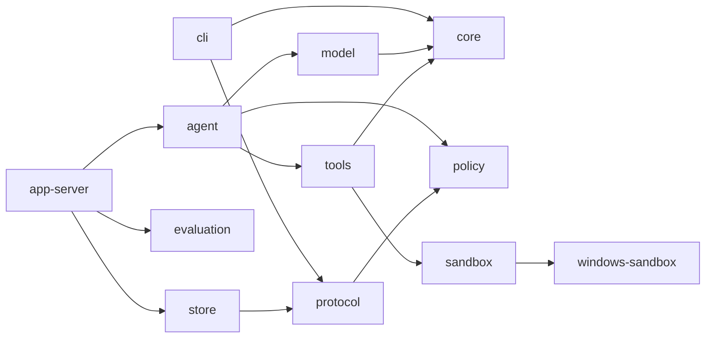

# Singularity 当前架构

本文只描述当前 Rust 源码。历史结构和已经移除的接口由 Git 历史保存。

## 1. 系统边界

Singularity 是 Windows 本地命令行编码代理，由四个 release binary 组成：

| Binary | 所属 crate | 职责 |
| --- | --- | --- |
| `sg` | `crates/cli` | 解析用户命令，启动 app-server，发送和渲染 stdio JSON-RPC |
| `singularity_app_server` | `crates/app-server` | 拥有 thread/turn 生命周期、AgentLoop 装配、持久化和 evaluation runner |
| `singularity-command-runner` | `crates/windows-sandbox` | elevated sandbox 中的受限命令 runner |
| `singularity-windows-sandbox-setup` | `crates/windows-sandbox` | UAC 提权后配置受限账户、ACL 和网络隔离 |

四个文件在 release 中同目录部署。`sg` 只发现同目录的 app-server；sandbox helper 也从当前 executable 的同目录或资源目录解析。缺失 helper 时关闭失败，不搜索或调用另一个 agent runtime。

生产 AgentLoop 只在 Windows 宣告可用。非 Windows 构建保留协议、数据模型和确定性测试能力，但 `AgentLoopCapability::current()` 返回 blocked，因为没有严格命令 sandbox。

## 2. Crate 边界

| Crate | 直接职责 | 关键对象 |
| --- | --- | --- |
| `core` | 公共错误码、脱敏检测、取消令牌、项目指令加载 | `CancellationToken`、`ProjectInstructions`、`ErrorCode` |
| `protocol` | stdio JSON-RPC 方法和公共传输对象 | `JsonRpcMessage`、`Thread`、`Turn`、`Item`、`TraceEvent` |
| `policy` | 权限 profile、规则优先级和 approval 决策 | `PermissionProfile`、`PolicyEngine`、`ApprovalRequest` |
| `windows-sandbox` | Codex 来源的 Windows restricted-token、Job Object、ACL、WFP 和 elevated helper 实现 | `PermissionProfile`、`ElevatedSandboxProfileCaptureRequest` |
| `sandbox` | 产品命令请求/结果模型及 Windows adapter | `CommandRequest`、`CommandResult`、`WindowsSandboxBackend` |
| `tools` | 模型可见工具注册、准入、工作区文件操作和 command adapter | `ToolBroker`、`ToolResult`、`WorkspaceTools` |
| `model` | provider 配置快照、模型对象、OpenAI-compatible HTTP adapter | `ProviderConfigSnapshot`、`ModelTurnRequest`、`OpenAiProvider` |
| `agent` | 上下文组装、模型/工具循环、approval checkpoint resume 和 completion gate | `AgentLoop`、`AgentLoopInput`、`AgentLoopResult` |
| `store` | SQLite thread/turn/item/trace/approval/artifact ledger | `SessionStore`、`StartedTurn`、`CommittedTurnOutcome` |
| `evaluation` | `evaluation.task_set/v4` manifest、计划和 `evaluation.result/v4` result 数据模型 | `EvaluationManifest`、`WorkspacePlan`、`EvaluationResult` |
| `app-server` | 协议调度、runtime 装配、并发 turn、持久化和 evaluation 执行 | `AppServer` |
| `cli` | 最终用户命令和 app-server 子进程客户端 | `Command`、`AppServerClient` |

依赖方向：



CLI 不直接依赖 agent、model、tools 或 store。公共协议对象只在 `protocol` 定义，安全执行细节不进入 protocol。

## 3. 主调用链

```text
sg run <goal>
  -> AppServerClient::spawn
  -> initialize / initialized
  -> agent/capability
  -> thread/start
  -> turn/start
     -> SessionStore::create_turn_with_input_trace_and_history
     -> AppEvent::turn_started
     -> AppServer::run_agent_loop
        -> load_project_instructions_from_cwd
        -> AgentLoop::run
           -> assemble context
           -> OpenAiProvider::complete
           -> ToolBroker admission
           -> WorkspaceTools execution
           -> append tool result or next model turn
           -> completion gate
     -> SessionStore::commit_turn_outcome
     -> terminal item events
     -> AppEvent::turn_completed
     -> turn/start response
```

`singularity_app_server` 的 stdin 主线程继续处理 protocol 请求；每个 `turn/start` 由独立 worker 使用新的 SQLite connection 执行，因此同一进程可以在 turn 运行时接收 `turn/interrupt`。stdout 由单独 writer 串行输出 JSONL，避免 worker 交叉写坏消息边界。

## 4. Thread、Turn 与 Continue

### Thread

`Thread` 字段为 `thread_id`、`model`、`cwd`、`status`。`thread/start` 把当前 CLI 工作目录规范化为绝对目录并持久化；后续 turn 始终使用该 workspace。`status` 只有 `active` 和 `archived`。

### Turn

`Turn` 字段为 `turn_id`、`thread_id`、`status`、`agent_loop_status`。公共状态映射如下：

| Agent 状态 | Turn 状态 | 含义 |
| --- | --- | --- |
| `running` | `running` | worker 正在执行 |
| `completed` | `completed` | completion gate 已接受 final answer |
| `blocked` | `blocked` | 等待 approval 或外部条件 |
| `failed` | `failed` | provider、context、tool 或 runtime 终止失败 |
| `cancel_requested` | 保持原 `running` / `blocked` | 已记录取消请求，worker 正在收敛；该行是中间状态，不是 Turn 终态 |
| `cancelled` | `interrupted` | 取消已经传播并完成 |

`turn/started` 在 AgentLoop 调用前发送；终态 item、`turn/completed` 和 matching response 在事务提交后发送。失败、blocked 或 cancelled 不伪造成功 assistant item。

### Continue

`sg continue` 先调用 `thread/resume`，再创建一个新的 `turn/start`。app-server 从 SQLite 读取最多 64 个已完成历史 turn，只投影成按 turn/item sequence 排序的 user/assistant conversation message。当前 turn 不会重复进入 history。

## 5. 项目指令与上下文

`core::load_project_instructions_from_cwd` 从最近的 `.git` marker 确定 workspace root，按 root 到 thread cwd 的顺序读取每层 `AGENTS.md`：

- 单文件最大 32 KiB，总计最大 64 KiB。
- 文件必须是 workspace 内的普通 UTF-8 文件。
- symlink/junction 解析到 workspace 外、I/O 失败、非法 UTF-8 或超限都关闭失败。
- 指令作为 developer message 注入，不修改 user goal。

`AgentLoopInput` 包含 thread/turn 标识、user input、model preference、turn 上限、项目指令、历史、interrupt 标志和 approval grants；默认最大模型回合数为 16，调用方仍可逐 turn 配置。模型请求只保留本次 provider 调用所需的 `request_id`，工具请求只保留 tool call 标识、名称和原始参数；运行状态不再复制 run/session/task/phase/action 占位字段。AgentLoop 读取 `Provider::protocol_contract()`，按 adapter 静态协议约束和配置声明的 context/output 上限预留 developer 指令、tool schema、消息 framing、固定开销以及输出空间。这些字段不是动态 provider 探测结果。当前保守估算按每 4 个 ASCII 字符约 1 token、每个非 ASCII 字符 1 token，并另计消息 framing、工具 schema、developer 指令、固定开销和输出预算；它用于关闭失败的容量门禁，不声称等同 provider tokenizer。当前输入不能容纳时直接返回 context overflow，而不是截断任务含义；历史只按完整的 user/assistant 对保留，并保持原始对话顺序。`ContextBundle` 只保留消息、包含/排除项和真实预算；最终 AgentLoop trace 记录脱敏后的包含/排除 item ID、预算明细和模型回合上限，不记录消息内容。

## 6. AgentLoop

`AgentLoop::run` 的真实步骤为：

1. 组装 developer、history 和当前 user message。
2. 构造 `ModelTurnRequest` 和 builtin tool schema；developer instruction 明确要求每个 assistant response 最多发出一个 tool call 并等待结果后再继续，OpenAI-compatible adapter 在带工具请求中同时发送 `tool_choice=auto` 和 `parallel_tool_calls=false`，并按 adapter capability contract 检查完整请求是否适合 context window。
3. 调用 provider，并在调用前后检查 `CancellationToken`。
4. 在执行前按 provider capabilities 验证 response、tool call 数量、名称和 JSON arguments；违反单 tool-call 边界的响应不会执行、选择或规范化任何 rejected call。若错误严格匹配 `provider_single_tool_call_contract_violated`、`response_validation` 及两个 single-call validation codes，AgentLoop 在仍有 turn budget 且未取消时最多追加一次固定脱敏的 developer recovery feedback，再发起一个新的 single-call model turn；第二次违规或没有剩余回合时保持 typed provider failure。
5. 通过 `PolicyEngine` 得到 allow、deny 或 ask。
6. ask 时生成绑定 request/thread/turn/tool call 的内部 checkpoint；checkpoint 与 pending approval 在 store 的同一事务中写入，包含继续运行所需的 messages、既有 tool results、已消费 grants、approval count、completion tracker 和 model-turn offset。
7. 执行允许的工具，把 `ToolResult::to_message_payload()` 按原顺序作为 tool message 送回下一模型回合；失败结果直接作为模型反馈，repairable failure 由 completion tracker 和下一回合反馈处理。
8. 没有 tool call 时应用 completion gate，接受或拒绝 final answer。

checkpoint、pending tool call、原始 prompt、provider payload 和内部 audit metadata 不序列化到 `AgentLoopResult`、CLI response 或普通 trace payload。checkpoint 同时保存 `provider_contract_recovery_attempt_count`、model usage 和 provider attempts；该 recovery 计数与 provider transport retry、普通 tool repair count 分开。allow-resume 只接受当前 active blocked turn 的一次性 decision，校验 checkpoint 的完整绑定后恢复原 messages、tool results、已消费 grants、approval count 和 model-turn offset，再执行 pending tool 并继续模型循环；取消、失败和 max-turn 返回都保留恢复前的回合计数。

当下一次 model request 超出 context budget 时，AgentLoop 使用确定性的 `compact_model_messages`：保留全部 system 消息、初始 developer 指令、最新 user 消息和最近完整的 assistant/tool 配对，把较早消息和原始 tool output 换成包含 `agent_context_compaction`、压缩数量、失败数量、plan 当前摘要、verification 摘要、recovery 计数，以及当前仍有效的 verification、plan 和 repeated-repair 控制指令的 developer 摘要；保留的 tool 消息只带 `ok`、错误码、截断标记和重新读取提示。只有压缩后 token 数严格下降且仍在窗口内才应用，否则返回 context overflow。`AgentContextTrace` 记录 `compaction_count`、`compacted_message_count`、压缩前后 token 数，并进入普通 agent trace；approval checkpoint 同时保存该 trace、plan、completion tracker、model usage、provider attempts、repair 和 tool-call fingerprint 状态。resume 会校验 checkpoint 的绑定、plan/completion、provider attempt 和 compaction 单调性，再从同一状态继续，损坏或不一致时 fail closed。

completion gate 保持以下不变量：

- final answer 不能为空。
- 没有 manifest 指定的 typed verification 时，edit/patch 之后以及最后一次 workspace mutation 之后必须观察到成功 command。
- typed verification requirement 使用 canonical command scope 的 SHA-256 digest 和大于零的成功次数；所有要求的 digest/count 都必须由独立成功 command result 满足，mutation 会清空此前的满足计数。
- 存在未解决的可修复 tool failure 时不能完成。
- 若已建立 plan，所有 plan step 必须为 `completed`；否则 final answer 被拒绝并要求再次调用 `builtin.update_plan`。
- 达到 turn 上限、provider error 或 context overflow 返回 failed，不改写为 completed。

`builtin.update_plan` 是 AgentLoop 的控制工具，不执行 workspace 操作。公开输入只有 `steps`：至少 1、最多 64 个 step；每个 step 的 `step` 非空且最多 512 个字符，`status` 只能是 `pending`、`in_progress` 或 `completed`，step 文本去空白后必须唯一且最多一个 `in_progress`。输入和嵌套 step 都拒绝 unknown fields。成功调用更新内存中的 plan 并递增 `plan_update_count`，结果只返回脱敏的 plan summary；plan 的最后完成状态由 completion gate 强制检查。

`AGENT_DEVELOPER_INSTRUCTIONS` 要求多步骤工作使用 `builtin.update_plan` 保持简洁计划，在证据或失败改变路径时更新，并在 final answer 前完成；简单只读或单步工作跳过计划。

## 7. Model 与 provider

`ProviderConfigSnapshot` 在 app-server 启动时只捕获一次配置。进程环境层优先；如果该层完全没有 provider 变量，则从当前目录向上查找最近 `.env`。`SINGULARITY_MODEL`、`SINGULARITY_BASE_URL`、`SINGULARITY_API_KEY`、`SINGULARITY_MODEL_CONTEXT_TOKENS` 和 `SINGULARITY_MODEL_MAX_OUTPUT_TOKENS` 必须来自同一层，`SINGULARITY_MODEL_PROVIDER` 缺失时使用 `openai_compatible`。context window 默认为 128000，output limit 默认 4096；这些 token limit 是配置声明的 contract 上限，请求超过上限时在发送前失败。

Provider 失败通过 `ProviderDiagnostic` 投影稳定的 `code`、`stage`、transport category、命中 timeout 时的配置 deadline 秒数、HTTP status 和 response validation codes。该对象不包含 API key、Authorization、endpoint、prompt、原始响应、provider/model 名称或底层 error source；AgentLoop、app-server trace 与 Evaluation result/report 只持久化这一安全投影。原始错误 message 仍经过公共边界脱敏，诊断字段不会因 message 被整体替换为 `[redacted]` 而丢失。timeout deadline 通过本地 hanging HTTP transport 回归测试验证，不用字段序列化代替真实 reqwest 超时路径。

`OpenAiProvider` 把 `ModelTurnRequest` 投影到 OpenAI-compatible `/chat/completions`，使用 reqwest rustls 客户端。每次 complete 在 current-thread Tokio runtime 中执行可取消 HTTP future；配置/client/runtime 初始化、请求校验与发送、HTTP status、body read、JSON decode 和 response validation 使用稳定的结构化诊断。OpenAI-compatible 实现不一定遵守 `parallel_tool_calls=false`；若响应仍包含多个 tool calls，adapter 在任何工具执行前关闭失败，返回 `provider_single_tool_call_contract_violated` / `unsupported_capability`，Evaluation 依据 `response_*` diagnostic stage 将其归为运行时 `provider_response` blocker，而不是静态 `provider_configuration` blocker。AgentLoop 只对这一精确 typed violation 做一次有界恢复：不把 rejected assistant/tool calls写回下一请求，只追加固定脱敏 feedback；恢复回合仍执行单调用请求约束。请求发送前的本地 validation 即使使用 `InvalidRequest` category，也不会归因于 Provider response。adapter 不会执行部分调用、静默丢弃其余调用或伪造兼容结果。`AgentLoopResult` 和 `AgentRunStatus` 在内部携带 typed `ModelErrorCategory`（不进入 serde、CLI 或普通 trace）；Evaluation 同时依据类别和稳定 diagnostic stage 映射 `BlockerKind`，不从 human-readable error 文本推断。

一次 provider complete 最多执行 3 次 attempt，重试只覆盖可重试的网络/timeout 或 response body read 错误，以及 HTTP 429 和 5xx；请求本地校验、JSON decode 和 response validation 不通过时不重试。重试 backoff 以 50 ms 为基数并逐次翻倍（在最多 3 次 attempt 下实际等待 50 ms、100 ms），且每次等待都检查 cancellation。每次响应或错误携带 `ProviderAttemptMetadata` 的 `attempt_count`、`retry_count` 和总 `latency_ms`；AgentLoop 按真实 model turn 累加这些字段，contract recovery 不伪装成 provider retry。`ModelUsage` 同时累计 input/output/total、cached input、reasoning token 和可选 cost；这些是诊断和 evaluation 投影，不改变 completion 或 blocker 语义。

公共 `providerConfiguration` 只表示配置状态，包含来源、snapshot id、`configured`、`configurationBlocker` 和三个字段的 present/missing；它不声称网络或模型请求已经成功。Provider error 只投影稳定 code、阶段、可靠 transport 类别、HTTP status 和 response validation codes。API key、base URL 原值、Authorization header、原始 response 和原始 prompt 不进入 CLI、Evaluation 或 trace。

## 8. Tool、Policy 与 Approval

模型可见工具固定为：

```text
builtin.read
builtin.list
builtin.grep
builtin.edit
builtin.patch
builtin.command
builtin.update_plan
```

产品运行时向 `ToolBroker` 注册具有真实 executor 的 workspace `builtin.*` 工具和 `builtin.update_plan` 控制工具，`ToolRegistry` 也拒绝非 builtin 命名空间。workspace 模型 schema 与 input type 由 `crates/tools` 的 `workspace_tool_specs()` 共用同一份公开合同；`builtin.update_plan` 由 agent control schema 注册。普通 runtime 注册全部 builtin，Evaluation 再按 manifest 的 `allowed_tools` 筛选，并对 `builtin.command` 收窄为 manifest smoke command 的 exact `const` schema。所有 input 都拒绝 unknown fields；read 支持 1-based 行范围和有界字符输出，list 支持默认关闭的有界递归与深度，grep 支持大小写控制、确定性遍历和精确 truncation。长单行被字符上限截断时不返回无法推进的 `next_line_start`。AgentLoop 在 Policy resource projection 之前按各 builtin input type 校验参数；非法参数直接构造可修复的 `invalid_tool_arguments`，不生成 `ToolBrokerDecision`、不调用 Policy、ToolBroker 或 executor。其脱敏 audit 明确记录 `policy_evaluated=false` 和 `executor_started=false`；真实 profile 越界和 Policy deny 仍关闭失败。当前没有 MCP 工具执行路径，也不会向模型暴露 MCP schema。

Evaluation 中存在两套独立的 exact verification 合同：AgentLoop 内部的 typed verification completion gate 只依据 canonical command-scope digest/count 判断 final answer 是否可接受；Agent stage 完成后，app-server 再从 `AgentLoopResult.tool_results` 独立检查 manifest 的 post-agent smoke，限定为最后一次 edit/patch 之后的成功 `builtin.command`，按同一 canonical cwd、timeout、sandbox/network scope 计算 digest，并为重复 smoke 要求不同的成功 result。前者阻止过早 final，后者决定 `agent` stage 是否 passed；两者都不能用相似命令、旧 mutation 前结果或 timeout/network 设置差异冒充 exact 证据。

默认 workspace-write profile 是 network denied、approval on-request、protected paths enforced。read 和 sandbox command 有显式 allow rule；写入仍经过路径敏感性和 protected path 检查。`WorkspaceTools` 对所有路径执行 lexical normalize、canonicalize existing parent、workspace containment 和 protected component 检查；多文件 patch 先验证全部目标，再写入，并在中途失败时回滚已经修改的文件。

当策略返回 ask 时，AgentLoop 生成与 thread、turn、tool call 和资源绑定的 `ApprovalRequest`，同时持久化只供 runtime 使用的 `PendingToolCall` checkpoint。Turn Blocked、request、checkpoint 和 approval trace 在同一事务提交。allow/deny 是单次消费；defer 只写脱敏审计事件，不写 decision ledger、不消费 approval，也不删除 checkpoint。只有 allow 需要 active thread 和当前可用的 workspace：workspace 在 claim 前检查，thread active 状态还会在 Store claim 事务内重检，条件不满足时不消费 request。deny 不执行工具，不依赖 thread 是否 archived 或 workspace 是否仍存在；它在 decision 同一事务终结 Turn 并删除 checkpoint。defer 同样不依赖这两个执行条件，保留 Blocked Turn、request 和 checkpoint。客户端不能通过 `approval/request` 自行向 ledger 注入请求。

allow 在 decision ledger 同一事务把 `pending` 直接认领为 `executing`。AgentLoop 返回后，Turn outcome、terminal trace 和 checkpoint 删除在同一事务提交；若继续运行后再次 ask，旧 execution 完成、下一 request/checkpoint 和 Turn Blocked 也在该事务内交接。claim 之后的普通 AppServer continuation 错误会在当前进程归约为 Failed Turn 并原子删除 executing checkpoint；进程中断留下的 executing checkpoint 由启动恢复归约为 Interrupted 或 successor handoff，Store 持续不可写时则可能延迟终态提交。

主进程启动恢复先验证所有 Approval、checkpoint、Turn 和 decision binding，再执行任何修改。没有 successor 的遗留 `executing` 被归约为 `Interrupted` 和 `approval_execution_outcome_unknown`；历史版本留下的较早 `executing` 加一个较晚且合法的 `pending` 被视为半交接，只删除旧 execution，并保留下一 Approval、checkpoint 和 Blocked Turn。歧义拓扑或损坏 checkpoint 使整个恢复事务失败且不修改数据库。两种可恢复路径都记录 `tool_replayed=false`，当前保证是 at-most-once execution attempt，不宣称 exactly-once。

pending Approval 等待期间没有运行中的工具；此时 `turn/interrupt` 在一个事务内把 Turn 终结为 `Interrupted/cancelled`、删除 unresolved Approval 和 checkpoint，并记录 `pending_approval_cancelled=true` 的 cancellation trace，不生成 decision ledger。interrupt handler 会在该事务提交后直接发送 terminal event。若 Allow 已 claim 为 `executing`，interrupt 只把 `agent_loop_status` 写为 `cancel_requested`，Turn 在 worker 收敛前仍保持原来的 `blocked`；同一个 cancellation token 会传播到 resumed AgentLoop 和在途 sandbox command。工具在收到取消前可能已经产生 workspace 内副作用，取消不宣称回滚这些副作用。最终 Approval outcome 提交把 Turn 归约为 `Interrupted/cancelled`，让取消覆盖本地晚到结果，并拒绝把下一 Approval handoff 到 terminal Turn。

`ToolOutput.content` 先经过统一的敏感文本检查与大小边界，再投影到 `ToolResult`。安全、未截断且在上限内的 JSON 保持为结构化 `content`；文本摘要、敏感结果、超限结果和 source-truncated 结果降级为有界且脱敏的 `preview`。`content` 与 `preview` 在模型 payload 中互斥，因此 `retry_inputs` 等机器字段不会被压入二次编码的 JSON 字符串。发送给模型的 tool result 另外只包含 `ok`、工具/调用标识、可用的 artifact references、错误码和截断标记；内部 result id、raw arguments、approval id、policy id、audit metadata 和 secret-like 文本不投影。截断结果已有 artifact reference 时不重复发送 content 或 preview；只有内部 result id 而没有 artifact reference 时仍保留有界 preview。`ModelMessage.content` 按 Provider 协议承载一次序列化后的整个安全 payload，OpenAI-compatible adapter 不再把其中的结构化 content 单独字符串化。完整 `ToolResult` 只存在于当前 `AgentLoopResult`，并可在等待下一 Approval 时作为内部 checkpoint 的一部分暂存。普通 runtime 的终态 SessionStore 不建立 ToolResult ledger：Turn/assistant item 保存终态，Trace 只保存状态、计数、verification、provider diagnostic 和从 ToolResult 提取的脱敏 audit 摘要。

## 9. Windows sandbox

`sandbox::WindowsSandboxBackend` 是 `windows-sandbox` 的产品 adapter。该底层代码来自 OpenAI Codex `codex-rs/windows-sandbox-rs` 的固定提交，来源、删改范围和许可证记录在 `crates/windows-sandbox/UPSTREAM.md`。

执行路径：

```text
CommandToolInput
  -> CommandRequest
  -> validate workspace root / cwd / requested modes
  -> resolve argv[0] from host PATH/PATHEXT and canonicalize it
  -> add safe toolchain roots as read/execute-only ACL roots
  -> map to Windows PermissionProfile
  -> run_windows_sandbox_capture_for_permission_profile_elevated
     -> automatic UAC setup when required
     -> offline or online restricted account
     -> restricted token + ACL + private desktop + Job Object
  -> if and only if requested profile supports it:
       run_windows_sandbox_capture (unelevated restricted token)
  -> CommandResult with enforcement metadata
```

规则：

- `read-only` 和 `workspace-write` 可映射；`danger-full-access` 在 sandbox backend 中明确拒绝。
- network denied 映射到 restricted network，必须使用 elevated offline identity；不能走 unelevated fallback。
- network allowed 可以在 elevated 路径失败且 restricted token 足够时走 unelevated 路径。
- 产品层只表达单一 workspace root 与 `denied` / `allowed` 两种网络模式，不要求用户维护 allowlist 或额外读写根目录配置。
- `argv[0]` 可以解析到 workspace 外的宿主机工具链；PATH 相对项、敏感目录、盘符根目录和整个用户目录不会成为动态读根。只有可执行文件享有该例外，其他参数中的外部数据路径仍在执行前拒绝。
- Windows 的 `.cmd`/`.bat` 工具入口（例如 npm）会由适配层转换为受控的 `cmd.exe` 调用；脚本路径或参数包含空白、引号、环境展开或 shell 元字符时直接拒绝，不把结构化 argv 降级成任意 shell 字符串。
- Windows adapter 使用非 verbatim 的 canonical path，避免 `\\?\` cwd/argv 破坏 Python、pip 等依赖普通 Win32 路径语义的工具。
- child environment 删除 secret-like 变量，并把 pip/npm cache 隔离到可写 `TEMP` 下的 Singularity 专用目录，避免读取宿主用户 cache；输出有界并再次做敏感标记检查。普通命令使用 `host_sanitized` 环境策略；Evaluation 的 setup、baseline、Agent command、public 与 hidden 统一使用 `evaluation_isolated`，额外移除 `SINGULARITY_*` 以及会重定向或注入 Cargo/Rust、Node、Python、Go 构建行为的宿主覆盖变量，同时保留 PATH、系统目录、TEMP 和工具链 home。
- 父进程正常退出、timeout 或 cancel 都会在 join stdout/stderr capture reader 前关闭或终止 Job Object；elevated runner 的 control transport EOF/read error 也会终止其中的进程树。
- `local_process_fallback` 始终为 false；没有无沙箱 executor。

`AgentLoopCapability::current()` 在 Windows 表示该实现可用，并不提前触发 UAC probe。真正 setup 和权限检查发生在第一条 command 上；任何失败通过 tool/evaluation blocker 暴露。

## 10. Cancel 与 Shutdown

每个活动 turn 在 app-server 内注册一个 `CancellationToken`。`turn/interrupt`：

1. 先在同进程 registry 调用 `cancel()`。
2. 调用 `SessionStore::request_turn_cancellation`：只有纯 pending Approval 分支会在该事务内直接写成 `interrupted/cancelled` 并删除 request/checkpoint；普通运行或存在 `executing` Approval 时只写 `agent_loop_status=cancel_requested` 并追加 request trace，Turn 的持久化 `status` 暂时保持原来的 `running` / `blocked`。
3. worker 的 cancellation monitor 也轮询 SQLite，因此另一个 CLI/app-server 进程发出的 interrupt 可以传播到原 worker。

provider HTTP wait、AgentLoop 回合边界和 sandbox command 都检查同一个 token。普通运行或 `executing` Approval 的 interrupt response 报告 `cancel_requested`，但不提前发送 terminal event；worker 最终把结果提交为 `interrupted/cancelled` 后才发送 terminal item/event/response。`commit_turn_outcome` / `commit_turn_outcome_and_resolve_pending_execution` 的事务会重新读取当前 Turn；若 `agent_loop_status=cancel_requested`，Store 拒绝非 `Interrupted` outcome，AppServer 把晚到的 provider、assistant 或 tool 结果归约为 `cancelled` 后再提交。因此晚到结果不能把持久化 Turn 改回 `completed` 或 `failed`；可能追加一条 `cancelled` AgentLoop trace，但不会覆盖 Interrupted 状态。`server/shutdown` 取消所有活动 turn，再等待 worker 收敛。

## 11. Store、Trace 与 Artifact

`SessionStore` 使用 rusqlite bundled SQLite，开启 foreign keys、WAL、secure delete 和 busy timeout。默认路径为启动目录下 `.singularity/rust-app-server.sqlite3`。schema v8 的 `pending_tool_calls.execution_state` 只允许 `pending` 和 `executing`；历史状态在迁移时保守归为 `executing`。`payload` 保存经版本和 request/thread/turn/tool-call 绑定校验的内部 AgentLoop checkpoint，缺少或错绑 checkpoint 时整个写入失败。

主要表：

```text
threads
turns
items
trace_events
approvals
approval_decisions
pending_tool_calls
artifact_refs
schema_meta / schema_migrations
```

turn 创建、输入 item、history page 和 started trace 在一个事务内生成；终态 turn、可选 `ItemKind::Plan` plan item、assistant item 和 terminal trace 也在一个事务内提交。`commit_turn_outcome` 返回 `CommittedTurnOutcome.plan_item`，app-server 只有在事务成功提交后才发送 `turn/plan/updated`（随后发送 assistant item events 和 `turn/completed`）；plan item 本身使用该 turn 的 item sequence 持久化。Approval continuation 的 `commit_turn_outcome_and_resolve_pending_execution` 还在同一事务内完成 executing request 的 outcome、plan/assistant/trace 写入、旧 checkpoint 删除和下一 approval/checkpoint handoff。turn sequence 和 item sequence 是每个父级内的严格正整数，用于恢复稳定顺序。

store 在写入 item、trace 和 artifact reference 前执行敏感文本检查。检测到 secret-like 内容时保存固定 redacted 文本；trace 保存 SHA-256 payload hash，并在读取时验证完整性。`artifact/fetch` 当前只返回已经登记且脱敏的 `ArtifactRef`，不直接提供任意文件读取。

## 12. Evaluation

`sg eval run` 发送 `eval/run`，app-server 读取 `evaluation.task_set/v4` manifest 并执行 AgentLoop runner。每个 task 必须声明非空且不重复的 `capabilities`；这些标签只用于任务集覆盖审计、`WorkspacePlan` 和 result，不进入 `AgentTaskProjection` 或模型 payload：

```text
prepare source
  -> baseline workspace + evaluator patch + expected failing/passing command
  -> agent workspace + real OpenAiProvider + real AgentLoop
  -> public verification workspace
  -> hidden verification workspace
  -> atomic result.json + report.json
```

每个 stage 都通过同一个 `SandboxBackend` 执行 command。远程 source 的联网 clone 与断网 checkout 复用同一个 task workspace cwd 和 capability SID；checkout 通过 `git -C source` 定位仓库，不因 online/offline identity 切换而扩大网络权限或改换 workspace capability。baseline 和 public 使用 `public_test_patch`，hidden 只使用 `hidden_test_patch`；两者以及 baseline/public/hidden 命令都不进入 `AgentTaskProjection` 或模型 payload。public 与 hidden 必须具有不同的 patch 内容或命令 `argv`/`cwd` 证据；timeout 和 network 等执行设置不算独立证据。Evaluation 暴露的 command schema 只接受 manifest 声明的 smoke 输入，完成门使用规范化后的实际 cwd 计算同一 command scope，避免模型看到的能力与策略或验收口径分叉。Windows runner 在创建 output/run 目录或执行 task 前，按 legacy `MAX_PATH=260` 的 UTF-16 长度保守投影 result/report、task source、审计产物和四个 stage 的已知深路径；超限时直接返回错误，不创建 run 目录，也不静默缩短或迁移 operator 指定路径。严格 sandbox 中已完成但非零退出的命令，只有 stdout/stderr 明确包含 Windows 路径预算错误时才先归为 `workspace_preparation`；普通非零和缺少该证据的 `LNK1104` 仍按命令语义处理，不能充当有效 baseline failure 的基础设施例外。

模型提交结构无效的 command arguments 时，AgentLoop 在 policy 与 executor 前返回稳定的参数原因码，并从已经发送给模型的 `oneOf`/`const` schema 投影有界的结构化 `content.validation_code`、`content.retry_inputs` 与 schema 提示；`retry_inputs[*].argv` 保持 JSON string array，runtime 不把错误的字符串 argv 自动转换为数组。普通 trace 只记录原因码和未执行状态，不记录 raw arguments 或完整 content。该反馈保持 repairable，但不改变 exact smoke command、scope digest 或最后一次 mutation 后验证的完成条件。

`EvaluationTaskResult` 分开记录 stage status、`agent_completed`、`tests_passed` 和 `evaluation_passed`。`result.json` 使用 `evaluation.result/v4`；每个 task 的稳定 `evidence` 包含 workspace change 数、canonical patch digest、tool-call/model-turn/approval 计数、plan update/completion、invalid/repeated tool call、repair、completion rejection、compaction、typed verification required/satisfied、provider attempt/retry、input/output/cached/reasoning/total token、provider latency、agent duration、post-agent smoke、strict sandbox command 和 `local_process_fallback_count`。`EvaluationRunSummary` 从 task result 重算 task/scored/blocked、agent completed、tests passed、evaluation passed、basis-points success rate 和 80% core threshold，不能由调用方伪造；blocked task 不进入 scored denominator，且 typed Provider、网络、环境或 sandbox blocker 不伪装成 Agent 失败。该汇总不改变逐任务或整次运行的 `evaluation_passed` 语义。

`report.json` 另保存 source/baseline/agent/public/hidden 命令诊断、逐文件 before/after SHA-256、allowlist 判定、patch evidence 与 agent trace 路径，并可包含脱敏 `provider_diagnostic` 和本地诊断字段；这些 report-only 字段不改变稳定 result evidence 或 gate。Evaluation 直接从内存中的 `AgentLoopResult` 生成 `agent-trace.json`，记录脱敏 context/compaction trace、plan、recovery、model usage、provider attempts、verification、tool outcomes 和 audit events；`tool_outcomes` 仅投影 tool call/name、`ok`、错误码和截断标记，`audit_events` 只保留脱敏 command scope、approval、sandbox enforcement 和 fallback 摘要。result、report 和 trace 都不持久化完整 `ToolResult`，也不保存 prompt、raw response、raw arguments、content、preview、artifact refs 或 result id。
默认产物目录为 `work/evaluations/<run-id>`；`result.json` 是稳定 v4 result，`report.json` 是诊断报告。任一产物原子发布失败时删除不完整 run 目录。

## 13. 失败与安全不变量

- 不支持的平台、缺失 binary、缺失 provider、无效 workspace 和 sandbox setup 失败都返回明确错误，不切换执行路径。宿主机 `PATH` 中缺少工具时返回 environment/spawn failure，不伪装成 sandbox 不可用，也不暴露完整 PATH。
- CLI 只把 matching response 之前的 notification 与 response 关联；EOF、child exit、timeout 和 JSON-RPC error 都是非零退出。
- thread workspace 必须是存在的绝对目录；archive thread 不能开始或恢复 pending turn。
- protected path、workspace 越界、非法 tool arguments 和扩大 sandbox/network 权限在执行前拒绝。
- approval 必须显式绑定 thread、turn 和 tool call，不能重放。
- approval checkpoint 缺失、版本未知、身份错绑、消息/tool-call 顺序不合法或重复消费 grant 时 fail closed。
- cancelled turn 的晚到结果不能恢复为 completed。
- evaluation 的 fake/mock 测试只用于确定性回归，不能替代真实 provider + AgentLoop 证明。

## 14. 维护规则

修改以下任一事实时同步更新本文对应部分：crate 边界、release binary、protocol method/object、thread/turn 状态映射、provider 配置、tool schema、policy/approval、sandbox、store schema、trace、evaluation stage 或 artifact 路径。

完整收口至少运行：

```text
cargo fmt --all -- --check
cargo check --workspace --all-targets --all-features --locked
cargo clippy --workspace --all-targets --all-features --locked --no-deps -- -D warnings
cargo test --workspace --all-targets --locked --no-fail-fast
git diff --check
```

影响 AgentLoop、provider、工具、sandbox、approval、evaluation、trace 或 completion 时，还必须运行一次真实 provider 的 `sg eval run` 并核对 result、report 和 trace。
