# Singularity 架构图谱

这份图谱用于看懂项目、追踪一次操作，以及定位代码和改动影响。图中的英文名对应源码对象或函数，中文说明其用途；每组图下提供源码入口。实线表示调用、传递或拥有，虚线表示派生、引用或边界条件，具体关系以箭头文字为准。状态图描述生命周期，时序图从上到下阅读。

## 导航

| 要回答的问题 | 从这里进入 |
| --- | --- |
| 程序由哪些部分组成，哪些运行在同一进程？ | [系统总览](#system)、[源码依赖](#modules) |
| 项目、任务、回合是什么关系，谁拥有状态？ | [对象与所有权](#ownership)、[数据位置](#storage) |
| 正文、轨迹、草稿从哪里来，刷新怎样恢复？ | [前端视图](#frontend)、[连接与同步](#sync) |
| 一次发送怎样到模型、工具和最终结果？ | [执行主链](#execution)、[Agent 循环](#agent) |
| 运行中补充、排队、停止会发生什么？ | [控制与执行窗口](#controls)、[取消与收尾](#cancellation) |
| 模型设置、协议、重试和用量怎样串起来？ | [模型配置](#models)、[模型请求](#provider)、[请求记录](#requests) |
| 模型实际看到什么，长任务怎样压缩？ | [指令与技能](#instructions)、[上下文](#context) |
| 工具怎样并行、改文件和管理进程？ | [工具执行](#tools) |
| 重启或异常退出后怎样恢复？ | [历史与恢复](#recovery) |
| 改某个能力，应一起检查哪些地方？ | [改动影响导航](#impact) |
| 源码怎样成为可运行程序，外部评估怎样接入？ | [构建与入口](#delivery) |

## 1. 系统总览

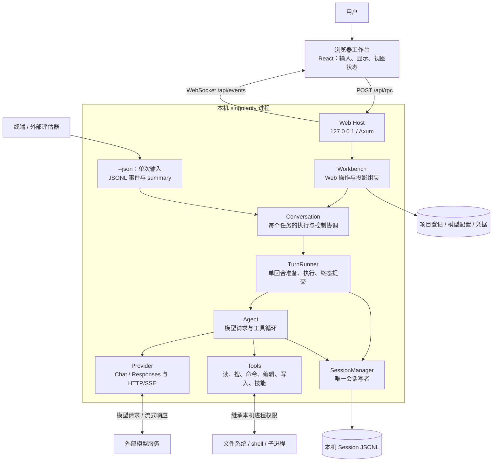
```mermaid
flowchart TB
    User["用户"] --> Browser["浏览器工作台<br/>React：输入、显示、视图状态"]
    Evaluator["终端 / 外部评估器"] --> Json["--json：单次输入<br/>JSONL 事件与 summary"]
    subgraph Process["本机 singularity 进程"]
        Host["Web Host<br/>127.0.0.1 / Axum"] --> WB["Workbench<br/>Web 操作与投影组装"]
        WB --> Conversation["Conversation<br/>每个任务的执行与控制协调"]
        Json --> Conversation
        Conversation --> Runner["TurnRunner<br/>单回合准备、执行、终态提交"]
        Runner --> Agent["Agent<br/>模型请求与工具循环"]
        Agent --> Provider["Provider<br/>Chat / Responses 与 HTTP/SSE"]
        Agent --> Tools["Tools<br/>读、搜、命令、编辑、写入、技能"]
        Runner --> Session["SessionManager<br/>唯一会话写者"]
        Agent --> Session
    end
    Browser -->|"POST /api/rpc"| Host
    Host -->|"WebSocket /api/events"| Browser
    Provider <-->|"模型请求 / 流式响应"| API["外部模型服务"]
    Tools <-->|"继承本机进程权限"| Machine["文件系统 / shell / 子进程"]
    Session --> Ledger[("本机 Session JSONL")]
    WB --> Config[("项目登记 / 模型配置 / 凭据")]
```

浏览器刷新或关闭只断开控制面，Host 内的执行继续。项目分组决定任务目录与导航归属；工具使用本机权限，Workspace 不构成文件访问沙箱。外部评估器通过 `--json` 使用同一执行层，自行负责超时、进程终止和判分。

源码：[程序入口](../crates/cli/src/main.rs) · [Host](../crates/cli/src/web/host.rs) · [Workbench](../crates/cli/src/web/workbench.rs) · [共享执行层](../crates/runtime/src/lib.rs)。产品边界见[宪章](constitution.md)。

## 2. 源码依赖与模块职责

下图只画 Rust crate 的直接生产依赖；箭头从使用方指向被使用方。测试使用的依赖另见各 crate 的 Cargo.toml。

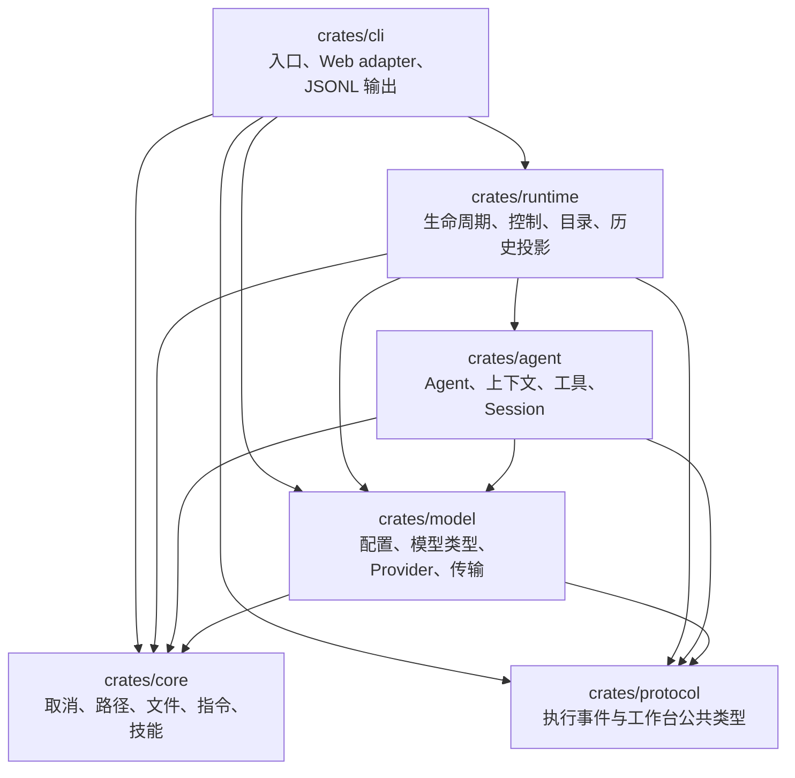
```mermaid
flowchart TB
    CLI["crates/cli<br/>入口、Web adapter、JSONL 输出"] --> Runtime["crates/runtime<br/>生命周期、控制、目录、历史投影"]
    CLI --> Model["crates/model<br/>配置、模型类型、Provider、传输"]
    CLI --> Core["crates/core<br/>取消、路径、文件、指令、技能"]
    CLI --> Protocol["crates/protocol<br/>执行事件与工作台公共类型"]
    Runtime --> Agent["crates/agent<br/>Agent、上下文、工具、Session"]
    Runtime --> Model
    Runtime --> Core
    Runtime --> Protocol
    Agent --> Model
    Agent --> Core
    Agent --> Protocol
    Model --> Core
    Model --> Protocol
```

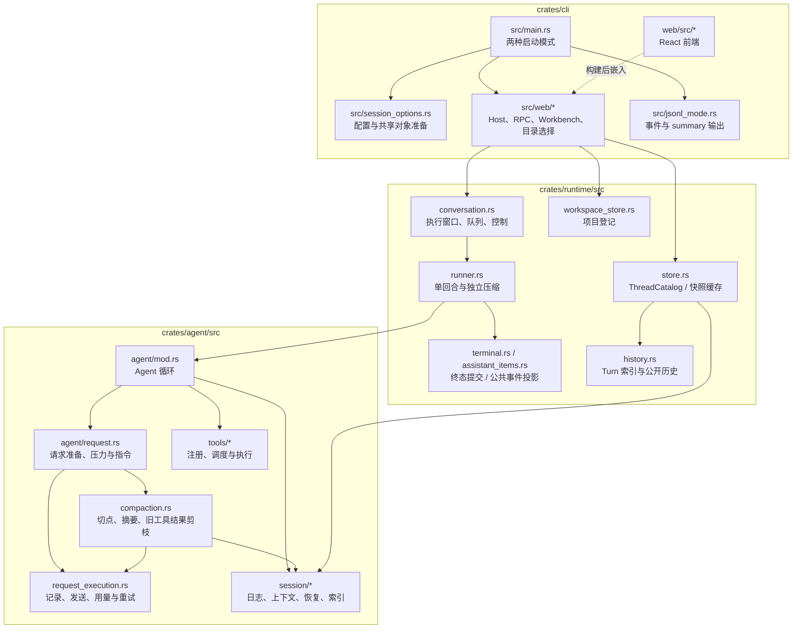
```mermaid
flowchart TB
    subgraph CliSource["crates/cli"]
        Main["src/main.rs<br/>两种启动模式"] --> Setup["src/session_options.rs<br/>配置与共享对象准备"]
        Main --> Web["src/web/*<br/>Host、RPC、Workbench、目录选择"]
        Main --> JSONL["src/jsonl_mode.rs<br/>事件与 summary 输出"]
        Front["web/src/*<br/>React 前端"] -. "构建后嵌入" .-> Web
    end
    subgraph RuntimeSource["crates/runtime/src"]
        Conv["conversation.rs<br/>执行窗口、队列、控制"] --> Run["runner.rs<br/>单回合与独立压缩"]
        Run --> Terminal["terminal.rs / assistant_items.rs<br/>终态提交 / 公共事件投影"]
        Catalog["store.rs<br/>ThreadCatalog / 快照缓存"] --> History["history.rs<br/>Turn 索引与公开历史"]
        WS["workspace_store.rs<br/>项目登记"]
    end
    subgraph AgentSource["crates/agent/src"]
        Loop["agent/mod.rs<br/>Agent 循环"] --> Requests["agent/request.rs<br/>请求准备、压力与指令"]
        Loop --> Tool["tools/*<br/>注册、调度与执行"]
        Requests --> Compact["compaction.rs<br/>切点、摘要、旧工具结果剪枝"]
        Requests --> Execute["request_execution.rs<br/>记录、发送、用量与重试"]
        Compact --> Execute
        Loop --> Sessions["session/*<br/>日志、上下文、恢复、索引"]
        Compact --> Sessions
    end
    Web --> Conv
    Web --> Catalog
    Web --> WS
    Run --> Loop
    Catalog --> Sessions
```

`core` 与 `protocol` 不依赖其他内部 crate。前端通过协议与 Host 通信，与可执行程序同目录维护，不导入 Rust 内部实现。`runtime/events.rs` 与 `runtime/objects.rs` 是运行层公开协议的导出入口，定义仍由 `protocol` 维护。

源码：[Cargo workspace](../Cargo.toml) · [Runtime 导出](../crates/runtime/src/lib.rs) · [Agent 导出](../crates/agent/src/lib.rs) · [Model 导出](../crates/model/src/lib.rs) · [前端依赖](../crates/cli/web/package.json)。

## 3. 对象、身份与状态所有权

### 3.1 项目、任务、回合与请求

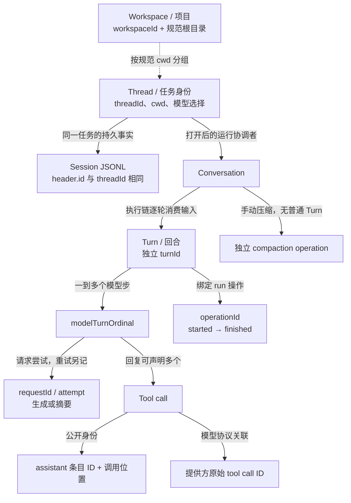
```mermaid
flowchart TB
    Workspace["Workspace / 项目<br/>workspaceId + 规范根目录"] -. "按规范 cwd 分组" .-> Thread["Thread / 任务身份<br/>threadId、cwd、模型选择"]
    Thread -->|"同一任务的持久事实"| Session["Session JSONL<br/>header.id 与 threadId 相同"]
    Thread -->|"打开后的运行协调者"| Conversation["Conversation"]
    Conversation -->|"执行链逐轮消费输入"| Turn["Turn / 回合<br/>独立 turnId"]
    Turn -->|"一到多个模型步"| Step["modelTurnOrdinal"]
    Step -->|"请求尝试，重试另记"| Request["requestId / attempt<br/>生成或摘要"]
    Step -->|"回复可声明多个"| Call["Tool call"]
    Call -->|"公开身份"| PublicID["assistant 条目 ID + 调用位置"]
    Call -->|"模型协议关联"| ProviderID["提供方原始 tool call ID"]
    Turn -->|"绑定 run 操作"| Operation["operationId<br/>started → finished"]
    Conversation -->|"手动压缩，无普通 Turn"| CompactOp["独立 compaction operation"]
```

公开工具身份用于实时与历史展示，避免提供方重复使用调用 ID 时合并不同工具；模型仍使用原始协议 ID。项目登记保存根目录，任务依据自己的 cwd 动态归组，不另存一份项目内任务清单。

### 3.2 Host 与浏览器的状态归属

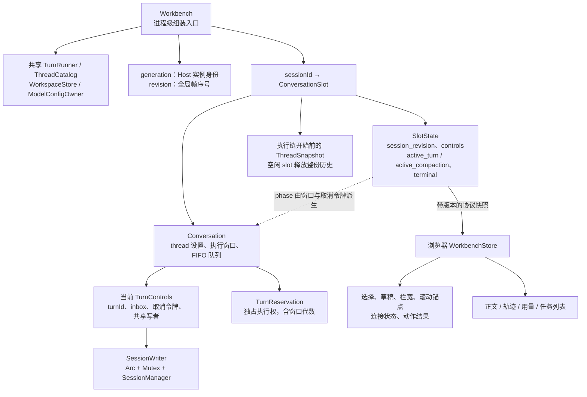
```mermaid
flowchart TB
    WB["Workbench<br/>进程级组装入口"] --> Shared["共享 TurnRunner / ThreadCatalog<br/>WorkspaceStore / ModelConfigOwner"]
    WB --> Order["generation：Host 实例身份<br/>revision：全局帧序号"]
    WB --> Slots["sessionId → ConversationSlot"]
    Slots --> Conv["Conversation<br/>thread 设置、执行窗口、FIFO 队列"]
    Slots --> Projection["SlotState<br/>session_revision、controls<br/>active_turn / active_compaction、terminal"]
    Slots --> Stable["执行链开始前的 ThreadSnapshot<br/>空闲 slot 释放整份历史"]
    Conv --> Running["当前 TurnControls<br/>turnId、inbox、取消令牌、共享写者"]
    Conv --> Reservation["TurnReservation<br/>独占执行权，含窗口代数"]
    Running --> Writer["SessionWriter<br/>Arc + Mutex + SessionManager"]
    Projection -. "phase 由窗口与取消令牌派生" .-> Conv
    Projection -->|"带版本的协议快照"| Store["浏览器 WorkbenchStore"]
    Store --> UIState["选择、草稿、栏宽、滚动锚点<br/>连接状态、动作结果"]
    Store --> Views["正文 / 轨迹 / 用量 / 任务列表"]
```

不同任务可并行；一个任务同一时刻只有一个普通执行链或独立压缩窗口。`TurnReservation` 保持到调用方完成投影收尾，旧预订只释放自己开启的窗口。写者只在追加或读取时短暂加锁，不跨模型等待与工具执行持锁。

源码：[Workbench / ConversationSlot / SlotState](../crates/cli/src/web/workbench.rs) · [Conversation / TurnReservation / TurnControls](../crates/runtime/src/conversation.rs) · [SessionWriter](../crates/agent/src/session/mod.rs) · [工具身份](../crates/agent/src/session/format.rs)。

## 4. 数据位置与唯一维护方

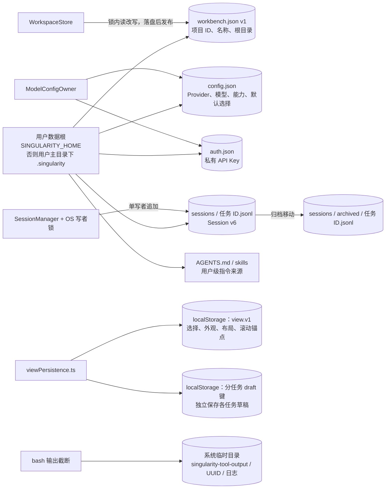
```mermaid
flowchart LR
    Home["用户数据根<br/>SINGULARITY_HOME<br/>否则用户主目录下 .singularity"] --> WorkbenchFile[("workbench.json v1<br/>项目 ID、名称、根目录")]
    Home --> Config[("config.json<br/>Provider、模型、能力、默认选择")]
    Home --> Auth[("auth.json<br/>私有 API Key")]
    Home --> Ledger[("sessions / 任务 ID.jsonl<br/>Session v6")]
    Ledger -->|"归档移动"| Archive[("sessions / archived / 任务 ID.jsonl")]
    Home --> Instructions["AGENTS.md / skills<br/>用户级指令来源"]
    WorkspaceStore["WorkspaceStore"] -->|"锁内读改写，落盘后发布"| WorkbenchFile
    ModelOwner["ModelConfigOwner"] --> Config
    ModelOwner --> Auth
    Manager["SessionManager + OS 写者锁"] -->|"单写者追加"| Ledger
    Browser["viewPersistence.ts"] --> View[("localStorage：view.v1<br/>选择、外观、布局、滚动锚点")]
    Browser --> Draft[("localStorage：分任务 draft 键<br/>独立保存各任务草稿")]
    Bash["bash 输出截断"] --> Temp[("系统临时目录<br/>singularity-tool-output / UUID / 日志")]
```

| 数据 | 维护边界与读取方 |
| --- | --- |
| 项目身份 | `CanonicalWorkspacePath` 规范化路径及比较键；`WorkspaceStore` 维护登记；bootstrap 按同一登记快照分组任务。读取历史身份不要求原目录仍存在。 |
| 模型与凭据 | `ModelConfigOwner` 串行修改并生成运行快照、脱敏目录；浏览器只写新密钥，不从目录读回密钥。 |
| 会话事实 | `SessionManager` 写入，`SessionData` 只读；上下文、控制恢复、历史、摘要、请求详情均从同一日志派生。 |
| 视图与草稿 | `viewPersistence.ts` 读取、迁移、保存，storage event 同步标签；旧内嵌草稿先迁入分任务键，已有分键值优先，迁移失败保留旧容器。 |
| 临时工具输出 | 工具结果给出实际日志路径；新建输出时清理超过七天的旧输出，保存失败明确反馈。 |

移除项目只移除登记，归档任务只移动日志。运行中或仍有持久待处理输入的任务会阻止移除所属项目。私有配置使用仅所有者访问的文件与原子替换；Session 追加的“先写后发布”不承诺断电持久性，写者退出后保留锁文件路径供复用。

源码：[数据根](../crates/core/src/user_home.rs) · [路径身份](../crates/core/src/workspace.rs) · [项目登记](../crates/runtime/src/workspace_store.rs) · [配置](../crates/model/src/config/runtime.rs) · [会话目录](../crates/runtime/src/store.rs) · [视图持久化](../crates/cli/web/src/viewPersistence.ts) · [输出截断](../crates/agent/src/tools/truncate.rs)。文件维护见[安装说明](INSTALL.md#数据更新与卸载)。

## 5. 前端视图、数据派生与交互入口

### 5.1 页面组件怎样接入共同状态

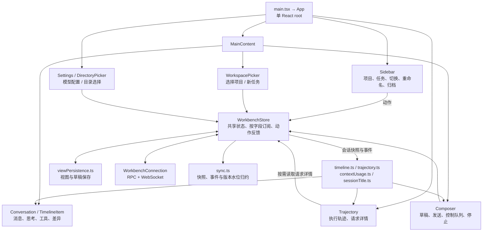
```mermaid
flowchart TB
    Root["main.tsx → App<br/>单 React root"] --> Sidebar["Sidebar<br/>项目、任务、切换、重命名、归档"]
    Root --> Main["MainContent"]
    Main --> Workspace["WorkspacePicker<br/>选择项目 / 新任务"]
    Main --> ConversationView["Conversation / TimelineItem<br/>消息、思考、工具、差异"]
    Main --> Composer["Composer<br/>草稿、发送、控制队列、停止"]
    Root --> Trajectory["Trajectory<br/>执行轨迹、请求详情"]
    Root --> Settings["Settings / DirectoryPicker<br/>模型配置 / 目录选择"]
    Sidebar -->|"动作"| Store["WorkbenchStore<br/>共享状态、按字段订阅、动作反馈"]
    Workspace --> Store
    Composer --> Store
    Settings --> Store
    Trajectory -->|"按需读取请求详情"| Store
    Store -->|"会话快照与事件"| Derived["timeline.ts / trajectory.ts<br/>contextUsage.ts / sessionTitle.ts"]
    Derived --> ConversationView
    Derived --> Trajectory
    Derived --> Composer
    Store <--> Persistence["viewPersistence.ts<br/>视图与草稿保存"]
    Store <--> Connection["WorkbenchConnection<br/>RPC + WebSocket"]
    Store --> Sync["sync.ts<br/>快照、事件与版本水位归约"]
```

### 5.2 历史与流式内容怎样组成当前画面

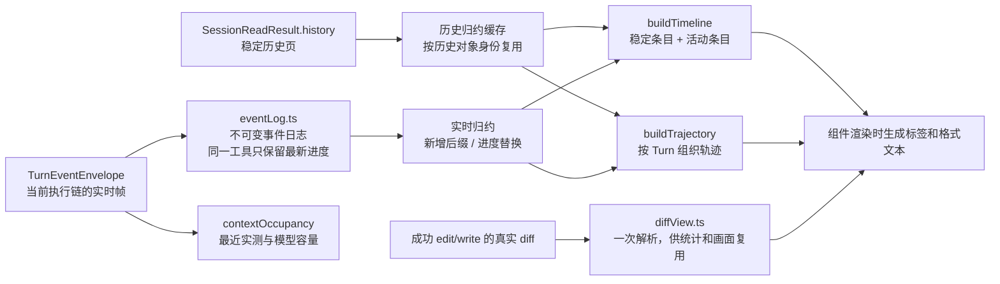
```mermaid
flowchart LR
    Baseline["SessionReadResult.history<br/>稳定历史页"] --> Historical["历史归约缓存<br/>按历史对象身份复用"]
    Frames["TurnEventEnvelope<br/>当前执行链的实时帧"] --> Log["eventLog.ts<br/>不可变事件日志<br/>同一工具只保留最新进度"]
    Log --> Active["实时归约<br/>新增后缀 / 进度替换"]
    Historical --> Timeline["buildTimeline<br/>稳定条目 + 活动条目"]
    Active --> Timeline
    Historical --> Trace["buildTrajectory<br/>按 Turn 组织轨迹"]
    Active --> Trace
    Frames --> Usage["contextOccupancy<br/>最近实测与模型容量"]
    Timeline --> Render["组件渲染时生成标签和格式文本"]
    Trace --> Render
    ToolResult["成功 edit/write 的真实 diff"] --> Diff["diffView.ts<br/>一次解析，供统计和画面复用"]
    Diff --> Render
```

执行链期间，Host 固定链开始前的历史，实时投影覆盖该链内各回合；收尾后从日志刷新历史并清除实时投影。因此浏览器可以分别归约再拼接。同一 Turn 的首条用户消息使用共享展示 key，结算与重新打开后保持不变；后续输入与无 Turn 前导条目保留条目身份。分页加载核对会话、连接代次和分页锚点；刷新尾页只保留连续重叠的已加载前缀。

`inputTrigger.ts` 维护 `@文件`、`/技能` 候选触发；`modelChoices.ts` 从共同模型目录生成选择；`interactions.ts` 与 `Menu`、`Dialog`、`Disclosure` 等组件维护共享交互。主题和布局样式位于 `styles/tokens.css`、`styles/app.css`、`styles/model-picker.css`。各面板保留自己的展开与焦点状态，任务正文与列表共用同一任务名称来源。

源码：[App](../crates/cli/web/src/app.tsx) · [Store](../crates/cli/web/src/store.ts) · [时间线](../crates/cli/web/src/timeline.ts) · [轨迹](../crates/cli/web/src/trajectory.ts) · [事件日志](../crates/cli/web/src/eventLog.ts) · [输入候选](../crates/cli/web/src/inputTrigger.ts) · [差异](../crates/cli/web/src/diffView.ts)。具体显示与操作约定见[工作台交互](workbench.md)。

## 6. Web 协议、来源边界与同步

### 6.1 请求怎样到达业务对象

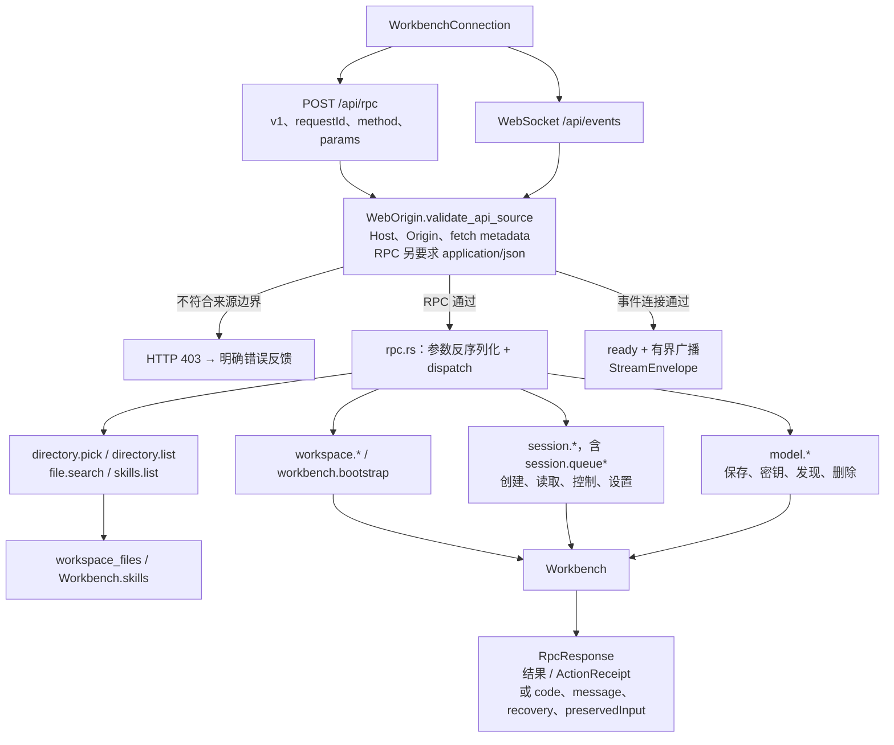
```mermaid
flowchart TB
    Browser["WorkbenchConnection"] --> RPC["POST /api/rpc<br/>v1、requestId、method、params"]
    Browser --> WS["WebSocket /api/events"]
    RPC --> Origin["WebOrigin.validate_api_source<br/>Host、Origin、fetch metadata<br/>RPC 另要求 application/json"]
    WS --> Origin
    Origin -->|"不符合来源边界"| Forbidden["HTTP 403 → 明确错误反馈"]
    Origin -->|"RPC 通过"| Dispatch["rpc.rs：参数反序列化 + dispatch"]
    Dispatch --> Files["directory.pick / directory.list<br/>file.search / skills.list"]
    Dispatch --> Projects["workspace.* / workbench.bootstrap"]
    Dispatch --> Sessions["session.*，含 session.queue*<br/>创建、读取、控制、设置"]
    Dispatch --> Models["model.*<br/>保存、密钥、发现、删除"]
    Files --> FileAdapter["workspace_files / Workbench.skills"]
    Projects --> WB["Workbench"]
    Sessions --> WB
    Models --> WB
    WB --> Receipt["RpcResponse<br/>结果 / ActionReceipt<br/>或 code、message、recovery、preservedInput"]
    Origin -->|"事件连接通过"| Broadcast["ready + 有界广播<br/>StreamEnvelope"]
```

Host 只绑定 loopback，不开放 CORS，也不维护浏览器登录 token 或 cookie。页面及资源校验 Host，API 另校验请求来源；这阻止浏览器跨源控制，不认证本机进程身份。同步文件与历史操作由 `spawn_blocking` 执行，模型发现和原生目录选择走各自异步入口。

### 6.2 首次打开、断线与刷新恢复

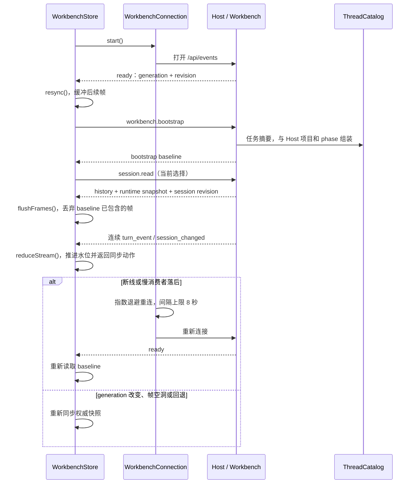
```mermaid
sequenceDiagram
    participant View as WorkbenchStore
    participant Conn as WorkbenchConnection
    participant Host as Host / Workbench
    participant Catalog as ThreadCatalog
    View->>Conn: start()
    Conn->>Host: 打开 /api/events
    Host-->>View: ready：generation + revision
    View->>View: resync()，缓冲后续帧
    View->>Host: workbench.bootstrap
    Host->>Catalog: 任务摘要，与 Host 项目和 phase 组装
    Host-->>View: bootstrap baseline
    View->>Host: session.read（当前选择）
    Host-->>View: history + runtime snapshot + session revision
    View->>View: flushFrames()，丢弃 baseline 已包含的帧
    Host-->>View: 连续 turn_event / session_changed
    View->>View: reduceStream()，推进水位并返回同步动作
    alt 断线或慢消费者落后
        Conn->>Conn: 指数退避重连，间隔上限 8 秒
        Conn->>Host: 重新连接
        Host-->>View: ready
        View->>View: 重新读取 baseline
    else generation 改变、帧空洞或回退
        View->>View: 重新同步权威快照
    end
```

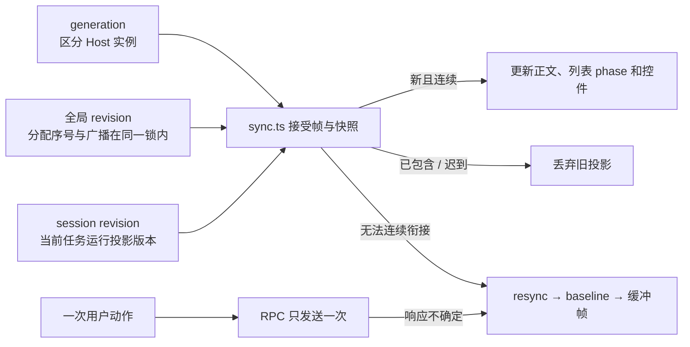
```mermaid
flowchart LR
    Generation["generation<br/>区分 Host 实例"] --> Gate["sync.ts 接受帧与快照"]
    Global["全局 revision<br/>分配序号与广播在同一锁内"] --> Gate
    SessionRevision["session revision<br/>当前任务运行投影版本"] --> Gate
    Gate -->|"新且连续"| Apply["更新正文、列表 phase 和控件"]
    Gate -->|"已包含 / 迟到"| Ignore["丢弃旧投影"]
    Gate -->|"无法连续衔接"| Resync["resync → baseline → 缓冲帧"]
    Mutation["一次用户动作"] --> Once["RPC 只发送一次"]
    Once -->|"响应不确定"| Resync
```

普通目录刷新不推进事件消费游标，投影版本与执行事件水位分别维护。会话控制的接受、`SlotState` 投影与对应发布按同一会话顺序完成；完整工作台替换快照的构造和发布也串行，较早事实不会在结算或较新快照之后取得更高版本。运行中的 `stopping` 不被后续流式帧改回 `running`。断线保留草稿，发送按钮按连接状态禁用；网络恢复读取状态，不自动重放 mutation。

`protocol/rpc.rs` 维护方法、参数与结果的关联，RPC adapter 按方法标记解析和序列化。`StreamEvent` 将消息类型与载荷关联；前端声明从 Rust DTO 生成，`WorkbenchTurnEvent` 的时间补充由真实序列化 fixture 验证。`sync.ts` 归约快照、事件与水位并返回所需动作；Store 执行读取、缓冲与重连，组件继续使用生产单例，测试注入传输依赖。

源码：[工作台 DTO](../crates/protocol/src/workbench.rs) · [RPC 合同](../crates/protocol/src/rpc.rs) · [RPC adapter](../crates/cli/src/web/rpc.rs) · [来源校验](../crates/cli/src/web/origin.rs) · [连接](../crates/cli/web/src/connection.ts) · [同步归约](../crates/cli/web/src/sync.ts) · [Store](../crates/cli/web/src/store.ts)。生成与序列化检查见[协议测试](../crates/protocol/tests/contract.rs)和[前端合同测试](../crates/cli/web/tests/contract.test.mjs)。

## 7. 一次发送的完整执行主链

### 7.1 接受输入并启动后台执行链

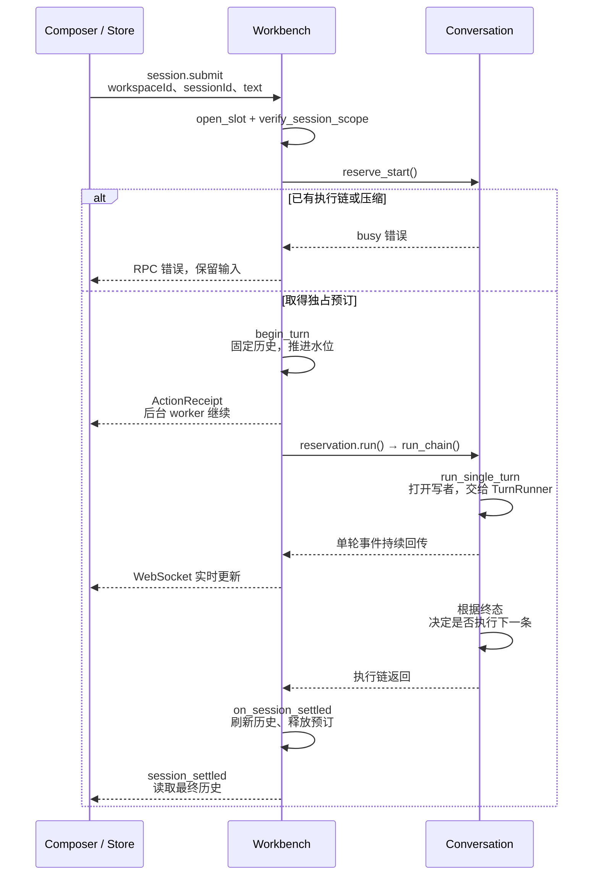
```mermaid
sequenceDiagram
    participant UI as Composer / Store
    participant WB as Workbench
    participant Conv as Conversation
    UI->>WB: session.submit<br/>workspaceId、sessionId、text
    WB->>WB: open_slot + verify_session_scope
    WB->>Conv: reserve_start()
    alt 已有执行链或压缩
        Conv-->>WB: busy 错误
        WB-->>UI: RPC 错误，保留输入
    else 取得独占预订
        WB->>WB: begin_turn<br/>固定历史，推进水位
        WB-->>UI: ActionReceipt<br/>后台 worker 继续
        WB->>Conv: reservation.run() → run_chain()
        Conv->>Conv: run_single_turn<br/>打开写者，交给 TurnRunner
        Conv-->>WB: 单轮事件持续回传
        WB-->>UI: WebSocket 实时更新
        Conv->>Conv: 根据终态<br/>决定是否执行下一条
        Conv-->>WB: 执行链返回
        WB->>WB: on_session_settled<br/>刷新历史、释放预订
        WB-->>UI: session_settled<br/>读取最终历史
    end
```

### 7.2 单轮执行与日志、事件的先后关系

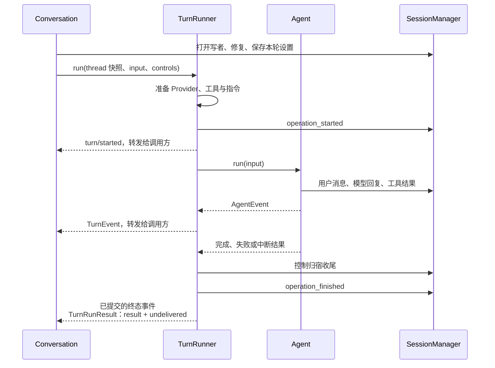
```mermaid
sequenceDiagram
    participant Conv as Conversation
    participant Runner as TurnRunner
    participant Agent as Agent
    participant Log as SessionManager
    Conv->>Log: 打开写者、修复、保存本轮设置
    Conv->>Runner: run(thread 快照、input、controls)
    Runner->>Runner: 准备 Provider、工具与指令
    Runner->>Log: operation_started
    Runner-->>Conv: turn/started，转发给调用方
    Runner->>Agent: run(input)
    Agent->>Log: 用户消息、模型回复、工具结果
    Agent-->>Runner: AgentEvent
    Runner-->>Conv: TurnEvent，转发给调用方
    Agent-->>Runner: 完成、失败或中断结果
    Runner->>Log: 控制归宿收尾
    Runner->>Log: operation_finished
    Runner-->>Conv: 已提交的终态事件<br/>TurnRunResult：result + undelivered
```

`TurnRunner` 持有单回合生命周期，`Conversation` 持有跨回合队列；一个回合可包含多个模型请求。`start_turn` 成功写入 `operation_started` 后才进入已开始阶段；此后的控制归宿或终态提交失败归为 `Terminalization`。操作开始记录只包含身份与类型，用户文本随后由 Agent 追加。Runner 无论成功还是失败都通过 `TurnRunResult` 交回带完整身份的未交付控制，由 Conversation 决定归宿。持久边界对应的完成事件先写日志再发布；正文与工具进度增量可在最终消息写入前显示。`ActionReceipt` 只确认动作是否接受，执行事实由后续事件与快照提供。

源码：[Store.submit](../crates/cli/web/src/store.ts) · [Workbench.submit / spawn_operation](../crates/cli/src/web/workbench.rs) · [Conversation.run_chain / run_single_turn](../crates/runtime/src/conversation.rs) · [TurnRunner.run](../crates/runtime/src/runner.rs) · [TerminalCommit](../crates/runtime/src/terminal.rs)。

## 8. Agent 内部循环

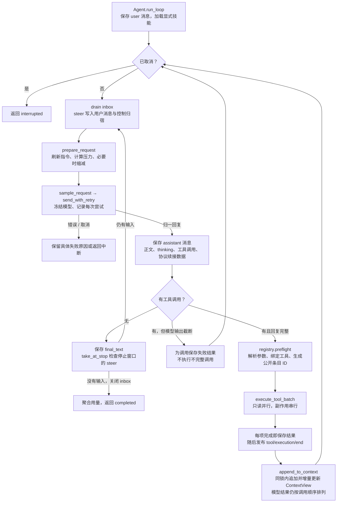
```mermaid
flowchart TB
    Input["Agent.run_loop<br/>保存 user 消息，加载显式技能"] --> Cancel{"已取消？"}
    Cancel -->|"是"| Abort["返回 interrupted"]
    Cancel -->|"否"| Inbox["drain inbox<br/>steer 写入用户消息与控制归宿"]
    Inbox --> Prepare["prepare_request<br/>刷新指令、计算压力、必要时缩减"]
    Prepare --> Request["sample_request → send_with_retry<br/>冻结模型、记录每次尝试"]
    Request -->|"错误 / 取消"| Failure["保留具体失败原因或返回中断"]
    Request -->|"归一回复"| Assistant["保存 assistant 消息<br/>正文、thinking、工具调用、协议续接数据"]
    Assistant --> Calls{"有工具调用？"}
    Calls -->|"无"| Stop["保存 final_text<br/>take_at_stop 检查停止窗口的 steer"]
    Stop -->|"仍有输入"| Inbox
    Stop -->|"没有输入，关闭 inbox"| Completed["聚合用量，返回 completed"]
    Calls -->|"有，但模型输出截断"| Truncated["为调用保存失败结果<br/>不执行不完整调用"]
    Truncated --> Cancel
    Calls -->|"有且回复完整"| Preflight["registry.preflight<br/>解析参数、绑定工具、生成公开条目 ID"]
    Preflight --> Batch["execute_tool_batch<br/>只读并行，副作用串行"]
    Batch --> Results["每项完成即保存结果<br/>随后发布 tool/execution/end"]
    Results --> Context["append_to_context<br/>同锁内追加并增量更新 ContextView<br/>模型结果仍按调用顺序排列"]
    Context --> Cancel
```

工具自身失败成为 `is_error` 结果供模型决定下一步；会话写入失败通过错误通道停止执行。运行中输入在模型步边界或自然停止窗口注入，已经发出的模型请求不会被改写。

源码：[Agent.run_loop / inject_controls / run_turn](../crates/agent/src/agent/mod.rs) · [请求准备](../crates/agent/src/agent/request.rs) · [请求执行](../crates/agent/src/request_execution.rs) · [TurnInbox](../crates/agent/src/agent/inbox.rs) · [AgentEvent](../crates/agent/src/events.rs) · [公共事件投影](../crates/runtime/src/assistant_items.rs)。

## 9. 控制队列与执行窗口

### 9.1 同一任务的独占窗口

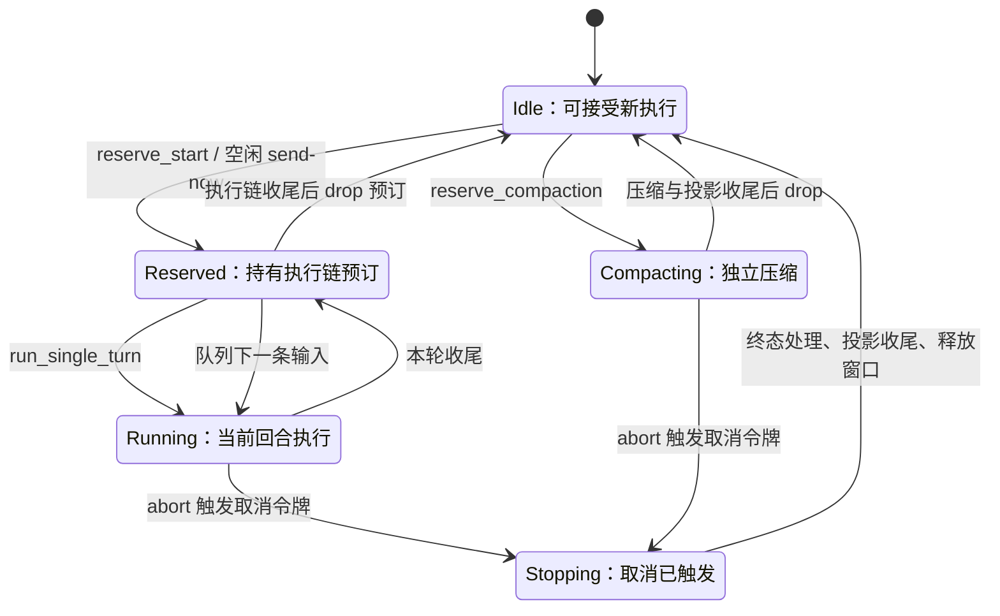
```mermaid
stateDiagram-v2
    state "Idle：可接受新执行" as Idle
    state "Reserved：持有执行链预订" as Reserved
    state "Running：当前回合执行" as Running
    state "Compacting：独立压缩" as Compacting
    state "Stopping：取消已触发" as Stopping
    [*] --> Idle
    Idle --> Reserved: reserve_start / 空闲 send-now
    Reserved --> Running: run_single_turn
    Running --> Reserved: 本轮收尾
    Reserved --> Running: 队列下一条输入
    Reserved --> Idle: 执行链收尾后 drop 预订
    Idle --> Compacting: reserve_compaction
    Compacting --> Idle: 压缩与投影收尾后 drop
    Running --> Stopping: abort 触发取消令牌
    Compacting --> Stopping: abort 触发取消令牌
    Stopping --> Idle: 终态处理、投影收尾、释放窗口
```

`Stopping` 是公共 phase，直接由 Running/Compacting 内的取消令牌派生；内部仍持有原操作窗口。同一 Session 的普通提交、空闲 send-now 和压缩共享独占规则。

### 9.2 不同输入动作怎样汇合

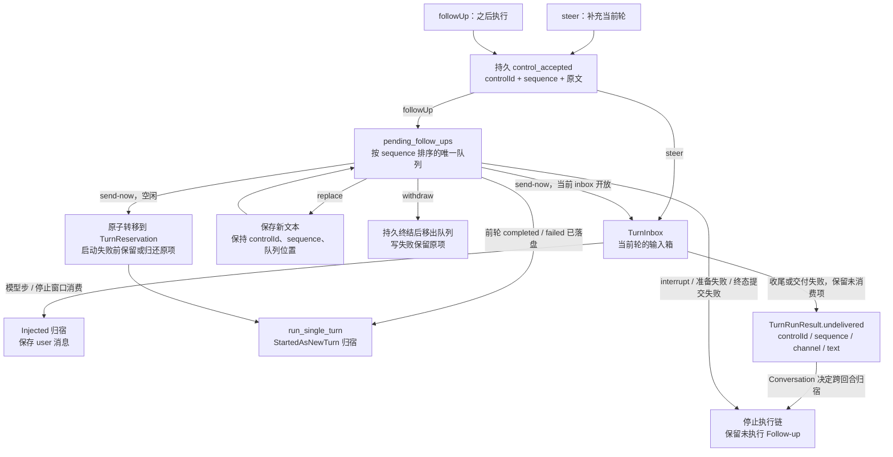
```mermaid
flowchart TB
    Steer["steer：补充当前轮"] --> Accepted["持久 control_accepted<br/>controlId + sequence + 原文"]
    Follow["followUp：之后执行"] --> Accepted
    Accepted -->|"steer"| Inbox["TurnInbox<br/>当前轮的输入箱"]
    Accepted -->|"followUp"| Queue["pending_follow_ups<br/>按 sequence 排序的唯一队列"]
    Inbox -->|"模型步 / 停止窗口消费"| Injected["Injected 归宿<br/>保存 user 消息"]
    Queue -->|"replace"| Replaced["保存新文本<br/>保持 controlId、sequence、队列位置"]
    Replaced --> Queue
    Queue -->|"withdraw"| Withdrawn["持久终结后移出队列<br/>写失败保留原项"]
    Queue -->|"send-now，当前 inbox 开放"| Inbox
    Queue -->|"send-now，空闲"| Reserve["原子转移到 TurnReservation<br/>启动失败前保留或归还原项"]
    Queue -->|"前轮 completed / failed 已落盘"| Next["run_single_turn<br/>StartedAsNewTurn 归宿"]
    Reserve --> Next
    Inbox -->|"收尾或交付失败，保留未消费项"| Handoff["TurnRunResult.undelivered<br/>controlId / sequence / channel / text"]
    Handoff -->|"Conversation 决定跨回合归宿"| Retain
    Queue -->|"interrupt / 准备失败 / 终态提交失败"| Retain["停止执行链<br/>保留未执行 Follow-up"]
```

`ControlSnapshot` 从日志统一归约，包含原文、channel、sequence、disposition 和 Turn 归宿。恢复时只在 `Conversation` 构造处装入待执行队列；编辑、撤回、提升与后台消费操作同一条输入。已落盘的普通失败终态允许执行下一条 Follow-up，中断则结束执行链。

源码：[Conversation 控制方法](../crates/runtime/src/conversation.rs) · [控制记录与 disposition](../crates/agent/src/session/format.rs) · [reduce_controls](../crates/agent/src/session/operation.rs) · [Workbench.apply_control](../crates/cli/src/web/workbench.rs) · [Composer](../crates/cli/web/src/components/Composer.tsx)。

## 10. 停止、失败与终态提交

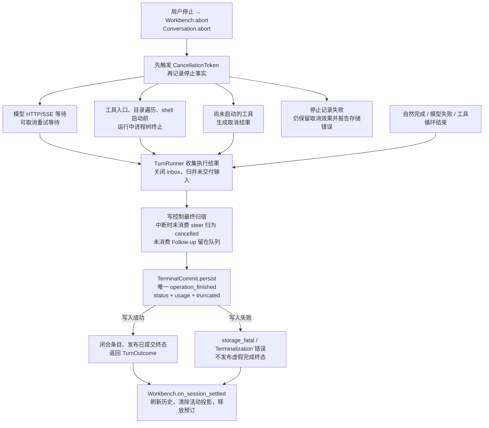
```mermaid
flowchart TB
    Stop["用户停止 → Workbench.abort<br/>Conversation.abort"] --> Signal["先触发 CancellationToken<br/>再记录停止事实"]
    Signal --> Model["模型 HTTP/SSE 等待<br/>可取消重试等待"]
    Signal --> Tools["工具入口、目录遍历、shell 启动前<br/>运行中进程树终止"]
    Signal --> Unstarted["尚未启动的工具<br/>生成取消结果"]
    Signal --> JournalError["停止记录失败<br/>仍保留取消效果并报告存储错误"]
    Model --> Finish["TurnRunner 收集执行结果<br/>关闭 inbox，归并未交付输入"]
    Tools --> Finish
    Unstarted --> Finish
    Normal["自然完成 / 模型失败 / 工具循环结束"] --> Finish
    Finish --> Controls["写控制最终归宿<br/>中断时未消费 steer 归为 cancelled<br/>未消费 Follow-up 留在队列"]
    Controls --> Commit["TerminalCommit.persist<br/>唯一 operation_finished<br/>status + usage + truncated"]
    Commit -->|"写入成功"| Publish["闭合条目、发布已提交终态<br/>返回 TurnOutcome"]
    Commit -->|"写入失败"| Fatal["storage_fatal / Terminalization 错误<br/>不发布虚假完成终态"]
    Publish --> Settled["Workbench.on_session_settled<br/>刷新历史，清除活动投影，释放预订"]
    Fatal --> Settled
```

追加 I/O 失败后，该写者停止后续写入，避免向半行 JSONL 继续追加；重新打开写者后由既有修复路径处理尾部。进度或客户端输出失败不改写执行事实。`operation_finished` 是回合终态的唯一持久来源；Web 收尾投影中的错误反馈不能代替它。

Runner 在决定终态前原子关闭本轮取消接受窗口并取走此前已接受的取消；先完成接受的停止随本轮收敛，先完成关闭的自然终态使后续停止明确返回“当前任务不可停止”，且不再写入 Pending。接受路径在同一边界内完成允许检查、Pending 落盘和内存归属；取消信号仍先于该次写盘，写盘失败不撤销停止效果。

源码：[取消令牌](../crates/core/src/cancellation.rs) · [TurnControls.accept_cancel / Conversation.abort](../crates/runtime/src/conversation.rs) · [Runner 收尾](../crates/runtime/src/runner.rs) · [TerminalCommit / fail_stop_terminalization](../crates/runtime/src/terminal.rs) · [追加写入](../crates/agent/src/session/manager.rs)。

## 11. 模型配置与选择

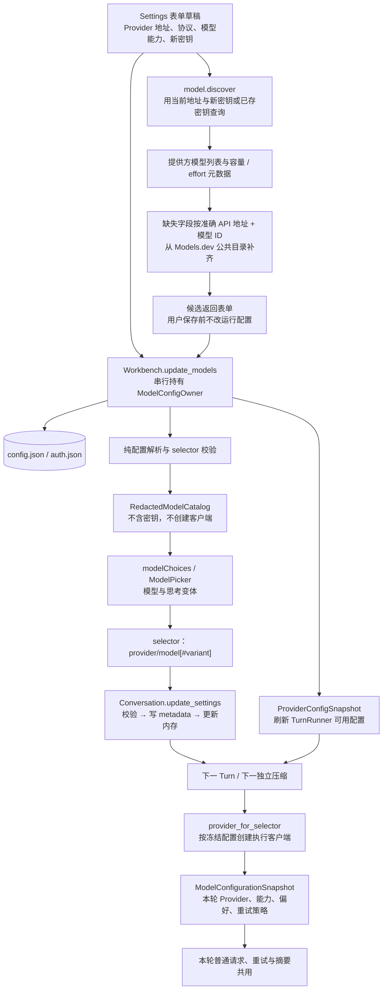
```mermaid
flowchart TB
    Form["Settings 表单草稿<br/>Provider 地址、协议、模型能力、新密钥"] --> Discover["model.discover<br/>用当前地址与新密钥或已存密钥查询"]
    Discover --> Remote["提供方模型列表与容量 / effort 元数据"]
    Remote --> Missing["缺失字段按准确 API 地址 + 模型 ID<br/>从 Models.dev 公共目录补齐"]
    Missing --> Candidates["候选返回表单<br/>用户保存前不改运行配置"]
    Form --> Save["Workbench.update_models<br/>串行持有 ModelConfigOwner"]
    Candidates --> Save
    Save --> Disk[("config.json / auth.json")]
    Save --> ProviderSnapshot["ProviderConfigSnapshot<br/>刷新 TurnRunner 可用配置"]
    Save --> Parsed["纯配置解析与 selector 校验"]
    Parsed --> Catalog["RedactedModelCatalog<br/>不含密钥，不创建客户端"]
    Catalog --> Picker["modelChoices / ModelPicker<br/>模型与思考变体"]
    Picker --> Selector["selector：provider/model[#variant]"]
    Selector --> Settings["Conversation.update_settings<br/>校验 → 写 metadata → 更新内存"]
    Settings --> Next["下一 Turn / 下一独立压缩"]
    ProviderSnapshot --> Next
    Next --> Factory["provider_for_selector<br/>按冻结配置创建执行客户端"]
    Factory --> Frozen["ModelConfigurationSnapshot<br/>本轮 Provider、能力、偏好、重试策略"]
    Frozen --> Requests["本轮普通请求、重试与摘要共用"]
```

新任务立即保存显式 selector；运行时改设置复用当前写者，空闲时短开写者，失败保持原选择。每轮捕获自己的模型快照，活动轮不随设置变化。表单地址、凭据、提供方或协议变更后丢弃旧发现结果；公共目录请求不携带用户地址或凭据。缺失元数据不伪造成能力，thinking 开关或 budget 不等同于 effort 档位。

源码：[ModelConfigOwner / 快照](../crates/model/src/config/runtime.rs) · [selector](../crates/model/src/config/selection.rs) · [发现与补齐](../crates/model/src/config/discovery.rs) · [Settings](../crates/cli/web/src/components/Settings.tsx) · [模型选择](../crates/cli/web/src/modelChoices.ts)。

## 12. 模型请求、协议适配、重试与续接

### 12.1 从模型消息到网络，再回到 Agent

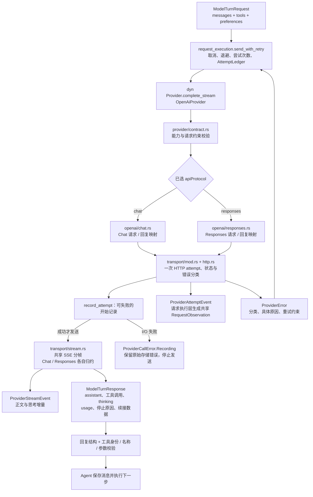
```mermaid
flowchart TB
    Request["ModelTurnRequest<br/>messages + tools + preferences"] --> Retry["request_execution.send_with_retry<br/>取消、退避、尝试次数、AttemptLedger"]
    Retry --> Provider["dyn Provider.complete_stream<br/>OpenAiProvider"]
    Provider --> Validate["provider/contract.rs<br/>能力与请求约束校验"]
    Validate --> Protocol{"已选 apiProtocol"}
    Protocol -->|"chat"| Chat["openai/chat.rs<br/>Chat 请求 / 回复映射"]
    Protocol -->|"responses"| Responses["openai/responses.rs<br/>Responses 请求 / 回复映射"]
    Chat --> Transport["transport/mod.rs + http.rs<br/>一次 HTTP attempt、状态与错误分类"]
    Responses --> Transport
    Transport --> Record["record_attempt：可失败的开始记录"]
    Record -->|"成功才发送"| SSE["transport/stream.rs<br/>共享 SSE 分帧<br/>Chat / Responses 各自归约"]
    SSE --> Deltas["ProviderStreamEvent<br/>正文与思考增量"]
    Record -->|"I/O 失败"| StorageError["ProviderCallError.Recording<br/>保留原始存储错误，停止发送"]
    Transport --> Attempts["ProviderAttemptEvent<br/>请求执行层生成共享 RequestObservation"]
    SSE --> Reply["ModelTurnResponse<br/>assistant、工具调用、thinking<br/>usage、停止原因、续接数据"]
    Reply --> Check["回复结构 + 工具身份 / 名称 / 参数校验"]
    Check --> Agent["Agent 保存消息并执行下一步"]
    Transport --> Error["ProviderError<br/>分类、具体原因、重试约束"]
    Error --> Retry
```

普通生成和摘要共同调用 `request_execution`，传输层只执行一次 attempt。提供方完成请求校验后，必须成功完成开始记录才会发送 HTTP；结束记录失败同样沿类型化错误返回。真实 I/O 失败停止执行，非 I/O 的观测拒绝继续按原约定报告诊断。默认上限是三次尝试；可重试错误且尚未提交可见回复时才继续，等待可取消。精确的上下文溢出进入[缩减恢复](#context)，不当作普通网络重试。工具身份完整且已注册时，畸形 JSON 参数可保留原文交由工具反馈；其他协议无效情况在 Provider 边界失败。

### 12.2 可展示思考与私有续接数据

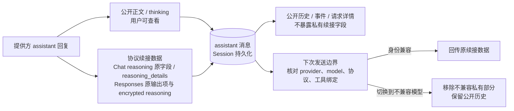
```mermaid
flowchart LR
    Reply["提供方 assistant 回复"] --> Visible["公开正文 / thinking<br/>用户可查看"]
    Reply --> Private["协议续接数据<br/>Chat reasoning 原字段 / reasoning_details<br/>Responses 原输出项与 encrypted reasoning"]
    Visible --> Session[("assistant 消息<br/>Session 持久化")]
    Private --> Session
    Session --> History["公开历史 / 事件 / 请求详情<br/>不暴露私有续接字段"]
    Session --> Boundary["下次发送边界<br/>核对 provider、model、协议、工具绑定"]
    Boundary -->|"身份兼容"| Continue["回传原续接数据"]
    Boundary -->|"切换到不兼容模型"| PublicOnly["移除不兼容私有部分<br/>保留公开历史"]
```

改变 effort 不改变历史身份；未选变体时保留服务端默认行为。签名或加密条目按原协议保存，不能从显示出来的思考文本重建。

源码：[Provider](../crates/model/src/provider/mod.rs) · [协议校验](../crates/model/src/provider/contract.rs) · [传输](../crates/model/src/transport/mod.rs) · [SSE](../crates/model/src/transport/stream.rs) · [请求执行与重试](../crates/agent/src/request_execution.rs) · [reasoning 类型](../crates/model/src/types/reasoning.rs) · [消息投影](../crates/agent/src/message.rs)。

## 13. 系统提示词、项目指令与技能

```mermaid
flowchart TB
    Prompt["prompts.rs<br/>系统规则、工具说明、运行环境"] --> System["请求的系统提示词"]
    Registry["ToolRegistrySnapshot<br/>工具描述与 schema"] --> System
    Registry --> Schemas["请求工具定义"]
    UserAgents["用户数据目录 AGENTS.md"] --> Loader["core.load_agent_instructions<br/>统一预算与来源路径"]
    ProjectAgents["项目根到 cwd 的 AGENTS.md"] --> Loader
    Loader --> Refresh["Agent.refresh_instructions<br/>每个模型步和摘要后重新核对"]
    Refresh -->|"内容变化或已被压缩"| Instructions["持久 instructions 记录"]
    Refresh -->|"相同且仍可见"| Keep["沿用当前上下文，不重复注入"]
    SkillDirs["项目与用户技能目录"] --> Skills["core.skills<br/>发现、优先级、元数据校验、正文加载"]
    Skills --> Catalog["每 Turn 的 SkillCatalog 快照<br/>模型先看到名称与说明"]
    Catalog --> ModelSkill["模型调用 skill 工具"]
    Skills --> Candidates["Web 的 /技能 候选"]
    Candidates --> Manual["Web / --json / steer 输入开头 /名称"]
    Manual --> Load["同一正文加载器<br/>来源文件与相对资源目录"]
    ModelSkill --> Load
    Load --> SkillEntry["显式调用保存 skill_instructions<br/>工具调用保存 tool result"]
    Instructions --> Context["ContextView → 请求历史"]
    SkillEntry --> Context
```

文件指令每文件最多 32 KiB、合计 64 KiB，截断有反馈，真实读取失败终止准备；用户直接指令和系统规则优先。摘要后重新加载文件，文件本身仍是权威来源。技能只按需加载正文，不自动运行脚本；`user-invocable: false` 隐藏手动入口，`disable-model-invocation: true` 隐藏模型目录与工具入口，损坏技能按文件报错而不遮蔽其他有效技能。

源码：[提示词](../crates/agent/src/prompts.rs) · [项目指令](../crates/core/src/project_instructions.rs) · [Skills](../crates/core/src/skills.rs) · [refresh_instructions / load_manual_skill](../crates/agent/src/agent/request.rs) · [工具注册](../crates/agent/src/tools/registry.rs)。目录与格式见[Skills 安装约定](INSTALL.md#skills)。

## 14. 模型上下文与压缩

### 14.1 同一日志派生不同视图

```mermaid
flowchart LR
    Ledger[("Session 原始条目<br/>始终保留完整消息")]
    Ledger --> Context["ContextView<br/>按日志顺序归约模型可见历史"]
    Ledger --> Public["公开历史 / 轨迹<br/>仍可查看原始工具输出"]
    Message["message / instructions / skill_instructions"] -->|"追加可见内容"| Context
    Prune["tool_result_pruned"] -->|"在原位置替换已有工具内容"| Context
    Compact["compaction<br/>summary + firstKeptEntryId"] -->|"替换当前历史前缀"| Context
    Context --> History["摘要 + 保留区消息<br/>工具结果按声明顺序归组"]
    History --> Request["assemble_messages / build_request"]
    System["系统提示词 + 工具定义<br/>不属于历史替换区"] --> Request
```

### 14.2 请求前压力处理与溢出恢复

```mermaid
flowchart TB
    Start["prepare_request<br/>刷新文件指令"] --> Estimate["压力 = 系统 + 工具 + 历史估价<br/>加本轮最近同模型请求的实测差值校正"]
    Estimate --> Pressure{"达到窗口 90%<br/>或回答预留空间不足？"}
    Pressure -->|"否"| Send["发送正常请求"]
    Pressure -->|"是"| Cut["find_cut_point<br/>保留至少窗口 10% 的近期内容<br/>切点向前保护完整工具批次"]
    Cut --> Prune["旧工具结果剪枝<br/>仅切点前超过 8192 字符的结果<br/>保留前 4096 + 后 1024 字符"]
    Prune --> Measure["写 tool_result_pruned<br/>重建 ContextView，重新计量"]
    Measure --> Need{"仍需缩减？"}
    Need -->|"否"| Send
    Need -->|"是"| Summary["CompactionEngine<br/>原生前缀 + 系统 / 工具 + 摘要指令<br/>摘要输出上限 8192 Token"]
    Summary --> Valid{"非空、完整、无工具调用<br/>且真正缩小替换区？"}
    Valid -->|"是"| Commit["写 compaction 与保留锚点<br/>重建上下文，重新加载文件指令"]
    Commit -->|"自动摘要最多两次"| Need
    Valid -->|"否或一般摘要失败"| Room["不提交无效摘要<br/>检查是否仍有回答空间"]
    Room -->|"足够"| Send
    Room -->|"不足"| Error["明确失败，保留原因"]
    Need -->|"摘要次数用尽"| Room
    Send -->|"精确的 context_length_exceeded"| Forced["本 Turn 最多一次溢出恢复<br/>有效缩减后才重发"]
    Forced -->|"成功缩减"| Send
    Forced -->|"不能缩减 / 恢复失败"| Error
```

回答预留为窗口 10%，受模型输出上限约束；安全余量为窗口 5%，最多 4096 Token。手动压缩与溢出恢复跳过比例保留预算，保留最后一个完整消息或工具单元；手动压缩走独立 operation，复用取消、模型快照和写者规则。取消与会话存储失败直接停止，不按普通摘要失败继续。

摘要与剪枝只增加替换记录，不删除原消息。锚点必须仍在活动上下文中，连续压缩不会把已被替换的旧摘要重新带回保留区。

源码：[ContextView](../crates/agent/src/session/context.rs) · [压力、预算、剪枝与请求准备](../crates/agent/src/agent/request.rs) · [CompactionEngine](../crates/agent/src/compaction.rs) · [溢出恢复](../crates/agent/src/agent/mod.rs) · [独立压缩入口](../crates/runtime/src/runner.rs)。

## 15. 工具注册、调度与副作用边界

### 15.1 工具定义、执行与结果共用一条路径

```mermaid
flowchart TB
    Specs["各工具 spec + ToolRegistrySnapshot"] --> Prompt["系统提示词中的工具名单"]
    Specs --> Schema["provider_schemas：模型工具定义"]
    Calls["模型 tool calls，按声明顺序"] --> Preflight["preflight：工具查找与参数解析"]
    Specs --> Preflight
    Preflight -->|"非法参数 / 未知工具"| Rejected["模型可见失败，不启动 worker"]
    Preflight -->|"PreparedTool"| Batch["execute_tool_batch"]
    Batch --> ReadOnly["相邻 read / glob / grep / skill<br/>最多 8 个 worker 并行"]
    Batch --> Barrier["bash / edit / write<br/>等待前序只读组，按声明顺序串行"]
    ReadOnly --> Result["ToolExecution<br/>content、is_error、diff、duration"]
    Barrier --> Result
    Rejected --> Result
    Result --> Persist["完成一项即保存 tool result"]
    Persist --> Event["发布 tool/execution/end"]
    Persist --> ModelOrder["ContextView 按调用顺序归组<br/>日志按实际完成顺序保存"]
```

### 15.2 文件与 shell 的内部边界

```mermaid
flowchart LR
    Edit["edit：当前文件精确匹配<br/>多处命中要求 replaceAll"] --> Lock["mutation_lock<br/>进程共享同路径互斥"]
    Write["write：完整覆盖"] --> Lock
    Lock --> Read["锁内读取 / 匹配 / 生成新内容"]
    Read --> Atomic["临时文件 + atomic replace<br/>保留既有文件权限"]
    Atomic --> Diff["similar 生成真实 diff<br/>模型收简短回执，UI 收独立差异"]
    Bash["bash：解析参数与 shell"] --> Exec["exec / capture / pump<br/>进程启动、输出收集、超时与取消"]
    Exec --> Tree["Windows Job Object<br/>每次调用拥有整个子进程树"]
    Tree --> Finish["调用结束回收后代进程"]
    Exec --> Truncate["truncate<br/>有界显示 + 超长输出临时日志"]
    Search["glob / grep"] --> Walk["walk.rs<br/>共同遍历、取消检查、跳过反馈"]
    Walk --> Partial["子目录失败保留可用结果并报告<br/>根目录失败则直接失败"]
```

同路径锁覆盖跨任务、跨批次的 edit/write，解析父目录别名，末级文件保持目录项替换语义；外部程序和 bash 的写入不受此锁约束。工具不要求先调用 `read`。`edit` 将 LF/CRLF 视为等价行尾，其他空白精确匹配，未命中部分保留原字节与 BOM。

Windows 的后台 shell 子进程也在本次调用结束时回收；长任务需在同一次调用内前台执行。新工作区文件使用系统默认权限，私有配置使用独立的仅所有者文件创建规则。

源码：[注册与派发](../crates/agent/src/tools/registry.rs) · [批次调度](../crates/agent/src/tools/batch.rs) · [路径锁](../crates/agent/src/tools/mutation.rs) · [edit](../crates/agent/src/tools/edit.rs) · [write](../crates/agent/src/tools/write.rs) · [bash](../crates/agent/src/tools/bash/mod.rs) · [进程树](../crates/agent/src/tools/bash/job_object.rs) · [遍历](../crates/agent/src/tools/walk.rs) · [文件原子替换](../crates/core/src/fs_owner.rs)。

## 16. 请求观测、用量与详情索引

```mermaid
flowchart TB
    Attempt["AttemptLedger<br/>预分配 assistant 结果条目 ID<br/>同时作为 requestId"] --> Start["请求 started 观测"]
    Attempt --> Finish["completed / failed / cancelled 观测<br/>耗时、错误分类、已知用量"]
    Request["类型化 ModelTurnRequest"] --> Encode["session/request.rs：encode_request"]
    Encode --> Content[("request_content<br/>不可变消息 / 工具定义，按内容去重")]
    Encode --> Context["RequestContext<br/>消息条目 ID、工具条目 ID、模型偏好"]
    Context --> Observation[("model_request<br/>按 requestId 关联开始与终态")]
    Start --> Observation
    Finish --> Observation
    Observation --> Index["SessionData.RequestIndex<br/>观察索引与内容引用"]
    Content --> Index
    Index --> Head["request_head<br/>列表 / 分页投影头部与必要定义"]
    Index --> Details["request_details<br/>按需还原完整请求"]
    Head --> Projection["实时 provider/attempt<br/>公开历史中的 request 条目"]
    Details --> RPC["session.request → Store.loadRequest<br/>Trajectory 详情"]
    Finish --> Usage["RequestAccounting<br/>合计所有尝试，包括摘要与失败"]
    Usage --> Terminal["Turn / 独立压缩终态用量"]
```

用量未上报时保持未知，任一尝试缺失用量时合计标记不完整；缓存字段缺失与明确零命中有不同含义。观测与请求详情不进入模型上下文。请求内容引用在查看时校验，损坏时返回 `requestError`，不阻止核心历史恢复；模型完成后的观测结构或容量拒绝发诊断，真实会话 I/O 失败仍停止执行。

源码：[AttemptLedger / RequestAccounting](../crates/agent/src/request_execution.rs) · [请求编码与索引](../crates/agent/src/session/request.rs) · [SessionData 请求读取](../crates/agent/src/session/manager.rs) · [历史请求投影](../crates/runtime/src/history.rs) · [ThreadSnapshot](../crates/runtime/src/store.rs) · [观测协议](../crates/protocol/src/params.rs)。

## 17. 历史读取、写入与异常恢复

### 17.1 Session 条目与派生对象

```mermaid
flowchart TB
    JSONL[("严格 JSONL v6<br/>header：id、version、cwd、timestamp")]
    JSONL --> Data["SessionData<br/>原始条目与请求索引，只读能力"]
    Data --> Context["ContextView<br/>模型有效历史"]
    Data --> Controls["reduce_controls<br/>待处理输入与最终归宿"]
    Data --> Operations["reduce_operations<br/>操作终态、未闭合工具"]
    Data --> Summary["project_session<br/>名称、模型、用量、updatedAt、状态"]
    Data --> Turns["index_turn_history<br/>Turn 条目范围"]
    Turns --> Page["IndexedTurn.project<br/>只展开请求的历史页"]
    Data --> Requests["RequestIndex<br/>头部与详情"]
    Summary --> Catalog["ThreadCatalog<br/>create / list / resume / rename / archive"]
    Page --> Catalog
    Requests --> Catalog
    Catalog --> Cache["摘要按文件状态缓存<br/>最近一次完整只读 ThreadSnapshot"]
    Cache --> WB["Workbench baseline / 历史分页 / 请求详情"]
```

`message`、`compaction`、`metadata`、`record` 是日志中的不同条目类型；`instructions`、`skill_instructions`、`tool_result_pruned`、控制和请求观测属于 record 的具体种类。操作记录决定恢复事实，模型历史只消费与上下文相关的种类。

### 17.2 重新打开会话时发生什么

```mermaid
flowchart TB
    Open["打开已存在 Session"] --> Mode{"只读还是写入？"}
    Mode -->|"只读"| Read["SessionData<br/>校验完整文件，派生只读投影"]
    Read --> LegacyRead["v5 在内存规范化为引用表示<br/>不修改原文件"]
    Read -->|"尾部需要修复"| ReadError["明确拒绝只读打开<br/>交由写打开的修复路径处理"]
    Mode -->|"写入"| Lock["WriterLockCoordinator<br/>取得 OS 单写者锁"]
    Lock -->|"已有写者"| Conflict["WriterConflict<br/>保留独立错误语义"]
    Lock -->|"取得锁"| Manager["SessionManager<br/>持锁读取与格式校验"]
    Manager --> Rewrite["需要时原子重写<br/>v5 迁移为 v6 / 修复撕裂尾部<br/>保留完整条目的 ID、顺序和内容"]
    Rewrite --> Repair["repair_interrupted_operations"]
    Repair --> Unknown["未闭合工具：结果未知<br/>要求先检查现状"]
    Repair --> Interrupted["未终结 operation<br/>补 interrupted 终态"]
    Unknown --> Ready["可继续的新写者"]
    Interrupted --> Ready
    Ready --> Append["新操作与消息追加"]
    Append -->|"I/O 部分失败"| Stop["停止此写者后续追加<br/>保留原始错误"]
    Stop -->|"关闭后重新打开"| Open
```

恢复不自动重放文件修改或 shell 副作用。更早版本会话被拒绝打开；损坏的核心结构与非尾部非法内容明确失败。历史读取不要求 cwd 仍可访问，执行与压缩准备时才验证目录。任务归档通过 catalog 移入 `archived/`，列表按日志派生的 `updatedAt` 排序。

源码：[Session 格式](../crates/agent/src/session/format.rs) · [SessionData / SessionManager](../crates/agent/src/session/manager.rs) · [JSONL 文件处理](../crates/agent/src/session/file.rs) · [OS 写者锁](../crates/agent/src/session/writer_lock.rs) · [恢复](../crates/agent/src/session/repair.rs) · [操作归约](../crates/agent/src/session/operation.rs) · [摘要投影](../crates/agent/src/session/projection.rs) · [目录](../crates/runtime/src/store.rs)。

## 18. 构建、发布与无交互入口

```mermaid
flowchart TB
    React["crates/cli/web/src<br/>package-lock.json"] --> Build["npm build<br/>tsc -b + vite build"]
    Build --> Dist["crates/cli/web/dist"]
    Dist --> Cargo["build.rs 检查构建输入<br/>static_files.rs 嵌入资源"]
    Rust["Rust workspace"] --> Cargo
    Cargo --> Binary["singularity 可执行程序<br/>运行时不需要 Node 或源码目录"]
    Binary --> Web["默认启动 WebUI<br/>--port / --no-open"]
    Binary --> JSON["--json goal / 可选 --model<br/>每次创建并保存新 Session"]
    JSON --> Runtime["Conversation → TurnRunner → Agent"]
    Runtime --> Renderer["JsonlRenderer<br/>TurnEvent 逐行输出"]
    Renderer --> Summary["正常返回追加 summary<br/>completed=0 / interrupted=130 / 失败=1"]
    Binary --> Release["release workflow<br/>签名与打包脚本"]
    Shared["release-common.ps1<br/>release root / workflow output"] --> Release
    Release --> Artifacts["发布包 / 校验信息 / SBOM"]
```

JSONL 准备失败也输出 failed summary；stdout 首次 I/O 失败被保留并导致失败退出。外部强制终止或异常进程退出不保证 summary。评估器属于独立仓库，本项目只维护无交互执行接口。

源码：[前端 build](../crates/cli/web/package.json) · [build.rs](../crates/cli/build.rs) · [资源嵌入](../crates/cli/src/web/static_files.rs) · [JSONL 输出](../crates/cli/src/jsonl_mode.rs) · [发布 workflow](../.github/workflows/release.yml) · [共享发布脚本](../.github/scripts/release-common.ps1)。构建、检查与发布命令见[开发指南](development.md)。

## 19. 按改动目的定位关联代码

| 要改变的行为 | 规则或状态的维护入口 | 需要一起检查的使用方 |
| --- | --- | --- |
| 新增或调整工具 | `tools/registry.rs` 与对应工具；并行语义在 `PreparedTool`，调度在 `batch.rs` | 提示词名单、模型 schema、参数预检、取消、结果落盘、公开历史与实时事件；显示差异时查看 `timeline.ts`、`trajectory.ts`。 |
| 修改文件写入行为 | `tools/edit.rs`、`write.rs`、`mutation.rs`、`core/fs_owner.rs` | 两种写工具、跨任务同路径、权限与行尾、模型回执、独立 diff 字段。 |
| 改变发送、排队或停止 | `runtime/conversation.rs`；单轮收尾在 `runner.rs`、`terminal.rs` | Web 控制 RPC、Composer 队列、Session 控制归约、重启恢复、JSONL 共享执行入口。 |
| 改变终态或事件字段 | `protocol/event.rs`、`protocol/params.rs` 与 runtime 投影 | JSONL、Web 事件 envelope、活动快照、前端协议、正文、轨迹、用量；协议 wire 样例。 |
| 修改历史或会话格式 | `agent/session/format.rs`、`manager.rs`、`file.rs` | `ContextView`、operation/control 归约、repair、请求索引、catalog 摘要、分页与前端历史。 |
| 改变模型接入或能力 | `model/config`、`provider/contract.rs`、`openai`、`transport` | selector 与冻结快照、重试和摘要、续接身份、请求观测、设置表单、模型选择器。 |
| 调整上下文预算或摘要 | `agent/request.rs`、`compaction.rs`、`session/context.rs` | 正常发送、精确溢出恢复、手动压缩、文件指令刷新、用量记录；原历史与工具批次完整性。 |
| 修改指令或技能加载 | `core/project_instructions.rs`、`core/skills.rs` | Web 候选、普通输入、JSONL、steer、skill 工具、上下文持久化与压缩后刷新。 |
| 修改项目或目录行为 | `core/workspace.rs`、`runtime/workspace_store.rs`、`cli/web/workspace_files.rs` | 项目登记、任务 cwd 分组、RPC 归属验证、文件候选、离线目录历史、移除条件。 |
| 改变流式展示或恢复 | `Workbench` 的 slot 投影、`connection.ts`、`store.ts`、`eventLog.ts` | baseline 与 revision、活动/稳定历史拼接、正文和轨迹、后台任务 phase、分页、停止状态。 |
| 调整草稿、布局或滚动 | `viewPersistence.ts`、`store.ts`、相关组件与样式 | 分任务状态、跨标签同步、草稿迁移、布局焦点和滚动锚点；具体交互规则见 `workbench.md`。 |
| 改变构建或发布方式 | `web/package.json`、`build.rs`、`static_files.rs`、`.github` 脚本与 workflow | production 资源嵌入、无 Node 的运行环境、各平台打包与安装文档。 |

表中的相对路径以本图谱对应章节的源码链接为入口。交互细节由[工作台交互](workbench.md)维护，操作命令由[开发指南](development.md)和[安装说明](INSTALL.md)维护。
