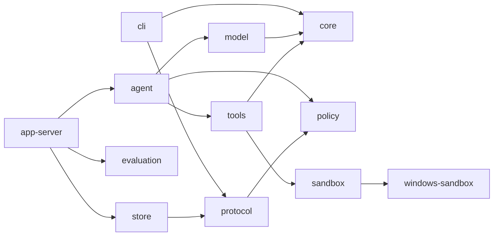

# Singularity 当前架构

本文只描述当前 Rust 源码。历史结构和已经移除的接口由 Git 历史保存。

## 1. 系统边界

Singularity 是本地命令行编码代理；核心合同保持平台无关，当前 Windows 发行包由四个 release binary 组成：

| Binary | 所属 crate | 职责 |
| --- | --- | --- |
| `sg` | `crates/cli` | 解析用户命令，启动 app-server，发送和渲染 stdio JSON-RPC |
| `singularity_app_server` | `crates/app-server` | 拥有 thread/turn 生命周期、AgentLoop 装配、持久化和 evaluation runner |
| `singularity-command-runner` | `crates/windows-sandbox` | elevated sandbox 中的受限命令 runner |
| `singularity-windows-sandbox-setup` | `crates/windows-sandbox` | UAC 提权后配置受限账户、ACL 和网络隔离 |

四个文件在 release 中同目录部署。`sg` 只发现同目录的 app-server；sandbox helper 也从当前 executable 的同目录或资源目录解析。缺失 helper 时关闭失败，不搜索或调用另一个 agent runtime。

生产 AgentLoop 只在当前绑定的 backend 声明 strict command sandbox 能力时可用。发行包目前绑定 Windows adapter；非 Windows 构建保留协议、数据模型和确定性测试能力，默认 backend 明确返回 unavailable，后续原生 adapter 可在不修改 Agent 核心语义的情况下接入。

## 2. Crate 边界

| Crate | 直接职责 | 关键对象 |
| --- | --- | --- |
| `core` | 公共错误码、脱敏检测、取消令牌、项目指令加载 | `CancellationToken`、`ProjectInstructions`、`ErrorCode` |
| `protocol` | stdio JSON-RPC 方法和公共传输对象 | `JsonRpcMessage`、`Thread`、`Turn`、`Item`、`TraceEvent` |
| `policy` | 权限 profile、规则优先级和 approval 决策 | `PermissionProfile`、`PolicyEngine`、`ApprovalRequest` |
| `windows-sandbox` | Codex 来源的 Windows restricted-token、Job Object、ACL、WFP 和 elevated helper 实现 | `PermissionProfile`、`ElevatedSandboxProfileCaptureRequest` |
| `sandbox` | 产品命令请求/结果模型及 Windows adapter | `CommandRequest`、`CommandResult`、`WindowsSandboxBackend` |
| `tools` | 模型可见工具注册、准入、工作区文件操作和 command adapter | `ToolBroker`、`ToolResult`、`WorkspaceTools` |
| `model` | provider 配置快照、模型对象、OpenAI-compatible HTTP adapter | `ProviderConfigSnapshot`、`ModelTurnRequest`、`OpenAiProvider` |
| `agent` | 上下文组装、模型/工具循环、approval checkpoint resume 和 completion gate | `AgentLoop`、`AgentLoopInput`、`AgentLoopResult` |
| `store` | SQLite thread/turn/item/trace/approval/artifact ledger | `SessionStore`、`StartedTurn`、`CommittedTurnOutcome` |
| `evaluation` | `evaluation.task_set/v4` manifest、计划和 `evaluation.result/v4` result 数据模型 | `EvaluationManifest`、`WorkspacePlan`、`EvaluationResult` |
| `app-server` | 协议调度、runtime 装配、跨 thread 并发、持久化和 evaluation 执行 | `AppServer` |
| `cli` | 最终用户命令和 app-server 子进程客户端 | `Command`、`AppServerClient` |

依赖方向：



CLI 不直接依赖 agent、model、tools 或 store。公共协议对象只在 `protocol` 定义，安全执行细节不进入 protocol。

## 3. 主调用链

```text
sg run <goal>
  -> AppServerClient::spawn
  -> initialize / initialized
  -> agent/capability
  -> thread/start
  -> turn/start
     -> SessionStore::create_turn_with_input_trace_and_history
     -> AppEvent::turn_started
     -> AppServer::run_agent_loop
        -> load_project_instructions_from_cwd
        -> AgentLoop::run
           -> assemble context
           -> OpenAiProvider::complete
           -> ToolBroker admission
           -> WorkspaceTools execution
           -> append tool result or next model turn
           -> completion gate
     -> SessionStore::commit_turn_outcome
     -> terminal item events
     -> AppEvent::turn_completed
     -> turn/start response
```

`singularity_app_server` 的 stdin 主线程继续处理 protocol 请求；每个 `turn/start` 和可能继续运行 AgentLoop 的 `approval/decision` 由独立 request worker 使用新的 SQLite connection 执行，因此同一进程可以在 turn 或 approval continuation 运行时接收 `turn/interrupt` 和 `server/shutdown`。不同 workspace 可以并发，同一 workspace 由 Store execution guard 串行。进程最多同时接纳 16 个 request worker，stdin reader 和 stdout writer 分别使用容量 64 与 256 的有界队列；worker 超限或输出背压耗尽都在继续产生副作用前 fail closed。worker 复用同一个 active-turn cancellation registry；stdout 由单独 writer 串行输出 JSONL，写入、flush、队列满或 transport disconnect 会先锁存全局 execution stop、取消已登记 turn，再终止 app-server，因此竞态中稍后登记的 turn 也从创建时即为 cancelled。

## 4. Thread、Turn 与 Continue

### Thread

`Thread` 字段为 `thread_id`、`model`、`cwd`、`status`。`thread/start` 把当前 CLI 工作目录规范化为绝对目录并持久化；后续 turn 始终使用该 workspace。`status` 只有 `active` 和 `archived`。

### Turn

`Turn` 字段为 `turn_id`、`thread_id`、`status`、`agent_loop_status`。公共状态映射如下：

| Agent 状态 | Turn 状态 | 含义 |
| --- | --- | --- |
| `running` | `running` | worker 正在执行 |
| `completed` | `completed` | completion gate 已接受 final answer |
| `blocked` | `blocked` | 等待 approval 或外部条件 |
| `failed` | `failed` | provider、context、tool 或 runtime 终止失败 |
| `cancel_requested` | 保持原 `running` / `blocked` | 已记录取消请求，worker 正在收敛；该行是中间状态，不是 Turn 终态 |
| `cancelled` | `interrupted` | 取消已经传播并完成 |

`turn/started` 在 AgentLoop 调用前发送；终态 item、`turn/completed` 和 matching response 在事务提交后发送。失败、blocked 或 cancelled 不伪造成功 assistant item。

`turn/start` 在创建 Turn 前取得基于 Store 文件和 canonical workspace 的跨进程 `WorkspaceExecutionGuard`，并持有到 AgentLoop outcome 提交完成；SQLite 的同一 `BEGIN IMMEDIATE` 事务还会拒绝该 workspace 已存在任何非终态 Turn。OS 文件锁区分仍存活的 owner，SQLite 约束保留持久状态，因此同一 Store 中共享一个 workspace 的不同 logical thread 也不会并发修改同一文件树；不同 workspace 不被全局串行化。`thread/archive` 和 `thread/delete` 仍只拒绝目标 thread 自身存在非终态 Turn。

### Continue

`sg continue` 先调用 `thread/resume`，再创建一个新的 `turn/start`。app-server 从 SQLite 读取最多 64 个已完成历史 turn，只投影成按 turn/item sequence 排序的 user/assistant conversation message。当前 turn 不会重复进入 history。

## 5. 项目指令与上下文

`core::load_project_instructions_from_cwd` 从最近的 `.git` marker 确定 workspace root，按 root 到 thread cwd 的顺序读取每层 `AGENTS.md`：

- 单文件最大 32 KiB，总计最大 64 KiB。
- 文件必须是 workspace 内的普通 UTF-8 文件。
- symlink/junction 解析到 workspace 外、I/O 失败、非法 UTF-8 或超限都关闭失败。
- 指令作为 developer message 注入，不修改 user goal。

`AgentLoopInput` 包含 thread/turn 标识、user input、model preference、turn 上限、项目指令、历史、interrupt 标志和 approval grants；默认最大模型回合数为 16，调用方仍可逐 turn 配置。模型请求只保留本次 provider 调用所需的 `request_id`，工具请求只保留 tool call 标识、名称和原始参数；运行状态不再复制 run/session/task/phase/action 占位字段。AgentLoop 在每次 run 和 approval resume 前调用 `Provider::negotiate_tool_capabilities`，按 effective model 返回的 contract 建立 request，并使用该 contract 的 tool-definition mode、strict tool schema、并行工具调用能力、每请求最大工具定义数和 context/output 上限。对同一 `ProviderConfigSnapshot` 与 effective model，已有成功 negotiation 时命中 snapshot cache；只有 cache miss 才执行固定、无用户数据的 capability probe。OpenAI-compatible probe 依次验证产品上限内的 direct tool definitions、Agent 实际发送的 developer/user 角色、strict schema、parallel/single 调用，以及 assistant tool calls、逐调用 tool result 与下一模型回合原生调用组成的完整历史。若 probe 响应出现 reasoning content，adapter 还必须通过固定控制证明工具回合已关闭该模式；控制不支持、未生效或后续真实工具响应再次出现 reasoning content 都 typed fail closed，不保存或回放私有 reasoning。direct profile 是默认；只有单 router probe 也完整成立时才返回独立的 routed mode，direct mode 的容量不足不会由 Agent 隐式改写。真实业务参数始终在本地信任边界接受完整 `ToolSpec` validation，未验证的 system message 与 JSON mode 保持关闭。当前保守估算按每 4 个 ASCII 字符约 1 token、每个非 ASCII 字符 1 token，并另计消息 framing、当回合实际可见工具 schema、developer 指令、固定开销和输出预算；有界工具视图按协商 mode 的直接工具集合或单个 router schema 计入预算。它用于关闭失败的容量门禁，不声称等同 provider tokenizer。当前输入不能容纳时直接返回 context overflow，而不是截断任务含义；历史只按完整的 user/assistant 对保留，并保持原始对话顺序。`ContextBundle` 只保留消息、包含/排除项和真实预算；最终 AgentLoop trace 记录脱敏后的包含/排除 item ID、预算明细和普通工作回合上限，不记录消息内容。`model_turn_limit` 是该 trace-only 诊断字段：它只表示普通工作回合预算，不包含最多一次 terminal finalization；若 `finalization_ready()` 在最后一个允许的工作响应处理后才成立，AgentLoop 才允许恰好一次超出该预算的 finalization-only provider 调用，`model_turns`、usage 和 provider attempts 按实际 provider 调用累计，否则仍按 max turns fail closed。

`ProviderProtocolContract` 把 native tools、direct/routed tool-definition mode、strict schema、`supports_parallel_tool_calls`、每请求工具定义容量、required tool choice 和工具 reasoning 模式作为独立能力。Provider contract 只声明是否支持并行；Agent 在 `ToolChoicePolicy.max_tool_calls` 中持有本地请求上限，并在声明支持并行时将无副作用、无依赖的只读 batch 上限设为 8，否则设为 1。`Direct` 是默认；`Routed` 只有 adapter 实际验证对应 envelope 后才可协商，不能从容量不足推断。OpenAI-compatible adapter 不把 `auto` 下的一次自愿工具调用当成 `required` 证据，因此当前协商保持 `supports_required_tool_choice=false`；其他 adapter 只有依据自身明确且可验证的协议合同才可声明该能力。普通工作回合使用 `Auto` 并投影真实工具；当 required verification 已通过，且存在的显式 plan 也已完成时，AgentLoop 从同一内存状态派生一次 finalization-only 请求，不再投影工具并使用 `None`。如果 readiness 只在最后一个普通工作回合响应处理后成立，普通工作预算之外至多发送这一次终态请求；`allows_final` 或 plan completed 本身都不能触发该阶段，因为简单只读任务在首轮前即可允许模型直接回答，而 model-reported plan 状态也不单独证明副作用已完成；本地 completion、plan 和 verification gate 仍决定 final 是否可接受，而不把 Agent 状态机责任转嫁给 provider。

## 6. AgentLoop

`AgentLoop::run` 的真实步骤为：

1. 组装 developer、history 和当前 user message。
2. 协商 provider tool capabilities，按返回 contract 构造 `ModelTurnRequest` 和 builtin tool schema。`Direct` mode 始终投影真实 ToolSpec；定义数超过已协商容量时直接拒绝，不隐式切换。模型输入 schema 使用可移植 JSON Schema 子集：真正可省略的字段保持 optional 且使用单一值类型，不为迁就某个 strict dialect 改写成 required + nullable union；只有当前全部工具 schema 本身满足 strict 约束时才发送 `strict=true`。只有明确协商 `Routed` mode 时才只投影 exclusive、无 workspace 副作用的 `builtin_invoke_tool`，其本地生成的 `oneOf/const` schema 为每个真实已注册工具绑定 `tool_name` 与完整 `arguments` 合同。模型在同一个调用中提交目标工具和完整参数；adapter 先验证本次 router 名称、JSON envelope 和调用上限，AgentLoop 再确定性解包为真实工具调用，并在 Policy、Approval 和任何副作用前完成真实 `ToolSpec`、profile、workspace 与整批 preflight。模型不能让 Agent 猜测或静默裁剪工具集合。有界视图和单调用 provider 每个 response 最多一个调用；显式协商多调用能力时，developer instruction 只允许同一 response 放入彼此独立的只读调用，mutation、command、plan、approval-sensitive 或依赖前序结果的调用必须单独提交。
3. 调用 provider，并在协商前、等待期间和返回后检查 `CancellationToken`；typed cancellation 与 token cancellation 都归约为 `Cancelled`。
4. adapter 先按协商上限和本次 `request.tools` 的实际名称验证完整 response；超出请求上限、隐藏工具、名称/ID/JSON envelope 非法时不选择、不规范化也不执行任何调用。AgentLoop 不针对 provider 错误码重试；typed provider failure 保留原始因果并结束当前 run。
5. AgentLoop 先把 router envelope 确定性解包为 canonical 工具调用，再对 response 中全部调用执行整批 preflight：验证工具可见性、`ToolSpec` model/executable input contract、profile binding、workspace/protected-path 边界和 `PolicyEngine` 的 allow/deny/ask。approval grant 先在临时集合中匹配，只有整批获准执行后才提交消费；任一成员非法时不执行合法子集。router 自身不能作为目标工具，也不形成第二份权限或执行路径。
6. 多调用批次只有在全部工具的 execution mode 都是 `parallel_read` 且全部 allow/approved 时才并发执行；结果按原调用顺序回传。任何 exclusive 或 ask 成员使整批零执行，并要求模型把 mutation、command、plan 或 approval-sensitive 调用单独提交。只读批次允许部分执行失败，但全部结果仍按序返回；取消发生后丢弃晚到批次结果。
7. 单个 ask 生成绑定 request/thread/turn/tool call 的内部 checkpoint；checkpoint 与 pending approval 在 store 的同一事务中写入，包含继续运行所需的 messages、既有 tool results、已消费 grants、approval count、completion tracker 和 model-turn offset。
8. 执行允许的工具，把 `ToolResult::to_message_payload()` 按原顺序作为 tool message 送回下一模型回合；router 调用在 provider-facing assistant/tool history 中保持实际暴露的 router 名称和 outer envelope，payload、内部 `ToolResult`、Policy、Approval、pending call 和执行状态使用唯一解包后的真实工具名称与参数。pending Approval checkpoint 会从保存的 provider-facing envelope 重新经过同一真实 `ToolSpec` 和 profile binding，再与 canonical pending call 比较，拒绝名称或参数篡改。typed repairable failure 由 completion tracker 和下一回合反馈处理；宿主 PATH 中不存在或绝对路径不可用的可执行文件归为 `command_executable_unavailable` capability，当前 adapter 无法安全表达的 batch 调用归为 typed unsupported，两者都在零执行后把安全原因返回下一模型回合。真正的 sandbox backend/infrastructure/timeout/cancelled 仍终止当前 run，不伪装成普通输入修复。
9. 没有 tool call 时应用 completion gate，接受或拒绝 final answer；repairable failure 或 completion/plan/verification 状态仍不可 final 时，下一 `ModelTurnRequest` 携带 typed tool result 或固定 developer feedback并继续使用 `Auto`。required verification 已通过，且存在的显式 plan 也已完成后，run 与 approval resume 共用的下一请求进入 finalization-only：`tools=[]`、`tool_choice=None`、本地 tool-call 上限为 0，只收集最终文本；若该 readiness 恰好在最后一个普通工作回合响应后才成立，则允许一次超出普通回合预算的同一终态请求。provider 仍返回结构化 tool call 时按既有 response validation fail closed，不进入 Policy 或执行器。只有合法非空 final text 才能完成。反馈同时列出全部未满足的 plan 与 verification 不变量，不以其中一个遮蔽另一个；普通文本不能绕过本地 completion gate。

checkpoint、pending tool call、原始 prompt、provider payload 和内部 audit metadata 不序列化到 `AgentLoopResult`、CLI response 或普通 trace payload。checkpoint 保存 model usage、provider attempts、completion/plan、context compaction、recovery metrics 和 tool-call fingerprints，但不作为 provider capability 真值。allow-resume 只接受当前 active blocked turn 的一次性 decision，校验 checkpoint 的完整绑定后恢复原 messages、tool results、已消费 grants、approval count 和 model-turn offset，重新协商当前 effective model 的 capabilities，再执行 pending tool 并继续模型循环；取消、失败和 max-turn 返回都保留恢复前的回合计数。

当下一次 model request 超出 context budget 时，AgentLoop 使用确定性的 `compact_model_messages`：保留全部 system 消息、初始 developer 指令、最新 user 消息和最近完整的 assistant/tool 配对，把较早消息和原始 tool output 换成包含 `agent_context_compaction`、压缩数量、失败数量、plan 当前摘要、verification 摘要、recovery 计数，以及当前仍有效的 verification、plan 和 repeated-repair 控制指令的 developer 摘要；保留的 tool 消息只带 `ok`、错误码、截断标记和重新读取提示。只有压缩后 token 数严格下降且仍在窗口内才应用，否则返回 context overflow。`AgentContextTrace` 记录 `compaction_count`、`compacted_message_count`、压缩前后 token 数，并进入普通 agent trace；approval checkpoint 同时保存该 trace、plan、completion tracker、model usage、provider attempts、repair 和 tool-call fingerprint 状态。resume 会校验 checkpoint 的绑定、plan/completion、provider attempt 和 compaction 单调性，再从同一状态继续，损坏或不一致时 fail closed。

completion gate 保持以下不变量：

- final answer 不能为空。
- 没有 manifest 指定的 typed verification 时，edit/patch 之后以及最后一次 workspace mutation 之后必须观察到成功 command。
- typed verification requirement 使用 canonical command scope 的 SHA-256 digest 和大于零的成功次数；所有要求的 digest/count 都必须由独立成功 command result 满足，mutation 会清空此前的满足计数。
- 存在未解决的可修复 tool failure 时不能完成。
- 若已建立 plan，所有 plan step 必须为 `completed`；否则 final answer 被拒绝并要求再次调用 `builtin_update_plan`。
- 普通工作回合达到 turn 上限时，只有在最后一个允许的工作响应处理后已满足 `finalization_ready()` 才允许一次 terminal finalization；该请求的 provider error、取消、空文本或结构化 tool call 仍 fail closed。没有 readiness 时，达到上限仍返回 failed，不改写为 completed。

`builtin_update_plan` 是 AgentLoop 的控制工具，不执行 workspace 操作。公开输入只有 `steps`：至少 1、最多 64 个 step；每个 step 的 `step` 非空且最多 512 个字符，`status` 只能是 `pending`、`in_progress` 或 `completed`，step 文本去空白后必须唯一且最多一个 `in_progress`。输入和嵌套 step 都拒绝 unknown fields。模型 schema 的说明与本地 validator 来自同一合同；shape、空计划、空/过长/重复 step、数量上限和多个 `in_progress` 分别返回稳定 validation code，不压成一个不可操作错误。成功调用更新内存中的 plan 并递增 `plan_update_count`，结果只返回脱敏的 plan summary；plan 的最后完成状态由 completion gate 强制检查。

`builtin_invoke_tool` 是只在 Provider adapter 明确协商 `Routed` tool-definition mode 时投影给模型的 AgentLoop 控制工具，容量不足本身不会启用它。它要求一个非空 `tool_name` 和对象型 `arguments`；动态 schema 由当前 `ToolRegistry` 中每个真实工具的模型输入合同生成，并排除 router 自身。AgentLoop 在同一回合解包后重新执行真实工具的本地 validation、profile binding、整批 preflight、Policy 和 Approval；未知工具、递归调用或非法 envelope 在 executor 前以 typed failure 拒绝。它不持久化成第二份能力、授权状态或执行器。

`AGENT_DEVELOPER_INSTRUCTIONS` 要求多步骤工作使用 `builtin_update_plan` 保持简洁计划，在证据或失败改变路径时更新，并在 final answer 前完成；简单只读或单步工作跳过计划。

## 7. Model 与 provider

`ProviderConfigSnapshot` 在 app-server 启动时只捕获一次配置。进程环境层优先；如果该层完全没有 provider 变量，则从当前目录向上查找最近 `.env`。`SINGULARITY_MODEL`、`SINGULARITY_BASE_URL`、`SINGULARITY_API_KEY` 和 token limits 必须来自同一层，`SINGULARITY_MODEL_PROVIDER` 缺失时使用 `openai_compatible`。context window 默认 128000，output limit 默认 4096；用户不配置 tool-call、tool-definition、required、strict 或 wire protocol 能力。

每次 run/resume 都调用 capability negotiation；对同一 `ProviderConfigSnapshot` 与 effective model，已有成功结果时命中 per-effective-model snapshot cache，只有 cache miss 才执行固定、无用户数据的 probe。未固定 endpoint 的 OpenAI-compatible base URL 依次尝试 Responses 与 Chat Completions；显式以 `/responses` 或 `/chat/completions` 结尾的 URL 只使用对应协议。协议切换只接受 typed `UnsupportedCapability` 或 HTTP 400/404/422，认证、网络、限流、5xx、取消、JSON decode、body/envelope validation 和无法安全重放的输出都保留原始因果并终止。最终协议作为 `ProviderCapabilityMetadata.api_protocol` 进入安全 trace，但不进入 Agent execution model，也不替代独立的工具能力 contract。没有当前 tools 且没有历史 tool call/result 的独立 Provider 调用，在未显式固定 Responses 时保持 Chat Completions；只要请求仍携带工具历史，包括 `tools=[]` 的 finalization-only 回合，就继续使用同一 effective model 已协商并缓存的协议与能力合同。

OpenAI-compatible adapter 使用固定 developer/user 消息，依次验证产品上限 8 个 direct definitions 下的 strict parallel、strict single、non-strict parallel 和 non-strict single；strict profile 证明 schema 约束，non-strict direct profile 只证明原生结构化调用形态和数量，不冒充 schema conformance。首轮候选成立后，adapter 把原生 assistant tool calls 和固定安全 tool results 按真实 wire 结构回传，并要求下一回合仍返回原生 structured call；第二轮文本、缺失、非法调用或 reasoning history 不成立时不缓存该 profile。若首轮响应暴露 reasoning content，先用 adapter 控制关闭工具 reasoning，再用同一多轮探测验证关闭结果。只有 direct profile 都不成立时才验证包含 8 个真实 router 同形分支的 non-strict envelope；该探测只有完整成立才返回 `RoutedSingle` profile 与 `tool_definition_mode=routed`，Agent 不从 `max_tools_per_request=1` 自行推断路由。接受超过 8 个定义的上游不会被乐观投影为更大的运行时保证；未验证的 system message、JSON mode 和 required tool choice 不进入 OpenAI-compatible contract。每个候选 wire protocol 最多验证 5 个 profile，失败与 usage/attempt metadata 通过既有 single-flight 共享；仅完整多轮探测成功才写 snapshot cache。routed mode 下 AgentLoop 只发送一个 `builtin_invoke_tool` 定义并把每个真实工具的完整模型输入合同嵌入其有界 schema；整个 invocation 在一个模型回合内完成，不建立 provider capability 之外的选择状态。

Provider 失败通过 `ProviderDiagnostic` 投影稳定的 `code`、`stage`、transport category、命中 timeout 时的配置 deadline 秒数、HTTP status 和 response validation codes。该对象不包含 API key、Authorization、endpoint、prompt、原始响应、provider/model 名称或底层 error source；AgentLoop、app-server trace 与 Evaluation result/report 只持久化这一安全投影。原始错误 message 仍经过公共边界脱敏，诊断字段不会因 message 被整体替换为 `[redacted]` 而丢失。timeout deadline 通过本地 hanging HTTP transport 回归测试验证，不用字段序列化代替真实 reqwest 超时路径。

`OpenAiProvider` 使用 reqwest rustls 客户端，并把同一个 `ModelTurnRequest` 分别投影为 Responses typed items 或 Chat Completions messages。Responses 请求把开头连续的 system/developer 基础指令合并到顶层 `instructions`，其余对话保持在 typed `input`；它使用 flat function definitions、`store=false`、`function_call`/`function_call_output` 的 `call_id` 关联和 `reasoning.effort=none`。adapter 只重放当前合同理解且本地验证过的 message/function items，出现非空 reasoning、未知 output item 或未知 message content part 时 fail closed。Chat Completions 使用标准 nested function definitions 与 assistant `tool_calls`/tool messages；若多轮工具调用或 history-only finalization 暴露 reasoning，只有固定 `thinking.type=disabled` 控制被真实 probe 证明后才采用。history-only finalization 仍保留原生 assistant tool call 与 tool result history，并在没有当前工具定义时发送该 reasoning control；Provider 违反合同时两条路径都 typed fail closed。两条 wire 路径共用同一个请求 validation、bounded body、retry、response normalization 和本地完整 `ToolSpec` response validation，不形成第二套 Agent 或工具执行路径。

每次 complete 在 current-thread Tokio runtime 中执行可取消 HTTP future；配置/client/runtime 初始化、请求校验与发送、HTTP status、body read、JSON decode 和 response validation 使用稳定的结构化诊断。成功响应按 `Content-Length` 和实际流式累计字节执行 8 MiB 硬上限，超限以 typed response-body failure 终止且不重试、不保存原始 body。请求上限为 1 时发送 `parallel_tool_calls=false`，显式上限大于 1 时才发送 `true`；只有 contract 声明能力且当前全部 tool schema 通过本地 strict-compatibility 检查时才发送 `strict=true`。普通 AgentLoop 请求保持 `tool_choice="auto"`；显式 `Required` 请求只有 contract 预先声明支持时才可发送，否则在本地拒绝。provider 返回调用数超过协商上限、required 响应没有工具调用、返回无法安全回放的工具 reasoning，或把完整 `<tool_call>...</tool_call>` envelope 放进 assistant text 而没有 native structured call 时，adapter 在任何工具执行前返回稳定 response validation；文本 envelope 只拒绝、不解析也不执行。工具名在 `ToolRegistry`、`ModelToolSchema`、wire tool definitions/responses 和 assistant tool-call 历史中保持同一个 `builtin_*` canonical name，adapter 不添加、剥离或猜测别名；后续工具结果只按 `call_id`/`tool_call_id` 关联前序调用，不猜测或重复命名。AgentLoop 不猜测、挑选或改写调用，也不把该错误当 transport retry。请求发送前的本地 validation 即使使用 `InvalidRequest` category，也不会归因于 Provider response。Provider adapter 和 Agent 本地 trust boundary 对非法 response 都保留 `JsonSchema` category、`ResponseValidation` stage 与稳定 validation codes；Evaluation 同时依据类别和稳定 diagnostic stage 映射 `BlockerKind`，不从 human-readable error 文本推断。

一次 provider complete 最多执行 3 次 attempt，重试只覆盖可重试的网络/timeout 或 response body read 错误，以及 HTTP 429 和 5xx；请求本地校验、JSON decode 和 response validation 不通过时不重试。重试 backoff 以 50 ms 为基数并逐次翻倍（在最多 3 次 attempt 下实际等待 50 ms、100 ms），且每次等待都检查 cancellation。每次响应或错误携带 `ProviderAttemptMetadata` 的 `attempt_count`、`retry_count` 和总 `latency_ms`；AgentLoop 按真实 model turn 累加这些字段。`ModelUsage` 同时累计 input/output/total、cached input、reasoning token 和可选 cost；这些是诊断和 evaluation 投影，不改变 completion 或 blocker 语义。

公共 `providerConfiguration` 只表示配置状态，包含来源、snapshot id、`configured`、`configurationBlocker` 和三个字段的 present/missing；它不声称网络或模型请求已经成功。Provider error 只投影稳定 code、阶段、可靠 transport 类别、HTTP status 和 response validation codes。API key、base URL 原值、Authorization header、原始 response 和原始 prompt 不进入 CLI、Evaluation 或 trace。普通 agent trace 与 Evaluation `agent-trace.json` 可以记录安全的 `provider_protocol`，仅包含可选 contract 和 capability metadata；不会记录 model 名、prompt、raw response、key 或 base_url。HTTP 200 但返回文本伪工具调用时 fail closed，本地完整 `ToolSpec` validation 不关闭。

## 8. Tool、Policy 与 Approval

产品注册的工具为：

```text
builtin_read
builtin_list
builtin_grep
builtin_edit
builtin_patch
builtin_command
builtin_update_plan
builtin_invoke_tool
```

产品运行时向 `ToolBroker` 注册具有真实 executor 的 workspace `builtin_*` 工具和两个 AgentLoop 控制工具；注册不等于同一回合全部模型可见，实际投影由协商后的 tool-definition mode 与容量共同决定。`ToolRegistry` 拒绝非 builtin 命名空间。每个 `ToolSpec` 同时拥有模型 schema、execution mode、model-input validator 和 execution-input validator；普通工具默认共享同一 validator，只有信任边界不同的工具才显式分离。模型 schema 表达调用方实际需要提交的最小输入：Rust `Option` 或具有本地默认值的字段不进入 `required`，也不使用 `type: [T, null]` 伪装 strict schema；本地 validator 仍完整拒绝非法类型、范围和 unknown fields。`builtin_command` 的模型合同只接受 `argv`、`cwd` 和 `timeout_seconds`，模型不能提交 `sandbox_mode`、`network_access` 或其他内部策略字段。Evaluation 用一对一 exact binding 把每个公开 smoke model input 映射到包含逐命令 sandbox/network 的 execution input；schema、prompt 和 `retry_inputs` 只投影 model side。AgentLoop 先对一个响应的全部调用完成 model validation、唯一 binding、profile 约束和 workspace preflight，任一失败时不对该批其他成员执行 Policy、Approval 或 executor；随后才统一求 Policy decision。ToolBroker 在 Allow/Approved 的执行闸门再次验证 execution contract 和 exact execution allowlist，直接调用方也不能绕过。所有 input 都拒绝 unknown fields；read 支持 1-based 行范围和有界字符输出，list 支持默认关闭的有界递归与深度，grep 支持大小写控制、确定性遍历和精确 truncation。长单行被字符上限截断时不返回无法推进的 `next_line_start`。非法参数直接构造可修复的 `invalid_tool_arguments`，不猜测或改写 argv；其脱敏 audit 明确记录 `policy_evaluated=false` 和 `executor_started=false`。当前没有 MCP 工具执行路径，也不会向模型暴露 MCP schema。

Evaluation 中存在两套独立的 exact verification 合同：AgentLoop 内部的 typed verification completion gate 只依据 canonical command-scope digest/count 判断 final answer 是否可接受；Agent stage 完成后，app-server 再从 `AgentLoopResult.tool_results` 独立检查 manifest 的 post-agent smoke，限定为最后一次 edit/patch 之后的成功 `builtin_command`，按同一 canonical cwd、timeout、sandbox/network scope 计算 digest，并为重复 smoke 要求不同的成功 result。前者阻止过早 final，后者决定 `agent` stage 是否 passed；两者都不能用相似命令、旧 mutation 前结果或 timeout/network 设置差异冒充 exact 证据。

默认 workspace-write profile 是 network denied、approval on-request、protected paths enforced。read 和 sandbox command 有显式 allow rule；写入仍经过路径敏感性和 protected path 检查。`PermissionDecisionCause` 区分 rule、hook、network profile、protected resource、no matching rule 和 approval policy；AgentLoop 再投影为 input/visibility/capability/policy/profile/workspace/protected/approval/sandbox/backend/infrastructure/execution/timeout/cancelled 的 `ToolFailureKind`，恢复性由类型和少量稳定 execution code 决定，不解析 human-readable reason。`WorkspaceTools` 对所有路径执行 lexical normalize、canonicalize existing parent、workspace containment 和 protected component 检查；多文件 patch 先验证全部目标，再写入，并在中途失败时回滚已经修改的文件。

edit/patch 只有在目标字节实际变化时才返回成功；no-op 在整批写入前作为可修复 input failure 拒绝，不能更新 completion mutation 状态或生成虚假 changed-file 证据。

当策略返回 ask 时，AgentLoop 生成与 thread、turn、tool call 和资源绑定的 `ApprovalRequest`，同时持久化只供 runtime 使用的 `PendingToolCall` checkpoint；pending 保存已经过 model admission、exact binding 和 profile 约束的 execution input，而不是重新暴露模型输入。resume 在匹配和消费 Approval 前重新验证 execution validator、exact execution allowlist 与当前 profile，持久化输入被篡改或权限收窄时 fail closed。Turn Blocked、request、checkpoint 和 approval trace 在同一事务提交。allow/deny 是单次消费；defer 只写脱敏审计事件，不写 decision ledger、不消费 approval，也不删除 checkpoint。只有 allow 需要 active thread 和当前可用的 workspace：workspace 在 claim 前检查，thread active 状态还会在 Store claim 事务内重检，条件不满足时不消费 request。deny 不执行工具，不依赖 thread 是否 archived 或 workspace 是否仍存在；它在 decision 同一事务终结 Turn 并删除 checkpoint。defer 同样不依赖这两个执行条件，保留 Blocked Turn、request 和 checkpoint。客户端不能通过 `approval/request` 自行向 ledger 注入请求。

allow 在 decision ledger 同一事务把 `pending` 直接认领为 `executing`。tool continuation 的 Allow 在 claim 前取得同一 workspace execution guard、登记 cancellation token，并由 Store 的 `BEGIN IMMEDIATE` 事务原子确认该 workspace 不存在其他非终态 Turn；跨进程 interrupt 若先提交则 claim 不成立，claim 若先提交则后续 interrupt 进入已登记 token 的可取消执行区。该 guard 与 token 持有到 AgentLoop outcome、terminal trace、checkpoint 删除或下一 checkpoint handoff 提交完成；Deny、Defer 和 generic approval 不启动 AgentLoop，也不占用该 guard。`approval/decision` 的 continuation 在独立 request worker 中恢复，主 stdin loop 不同步等待 AgentLoop。claim 之后的普通 AppServer continuation 错误会在当前进程归约为 Failed Turn 并原子删除 executing checkpoint；进程中断留下的 executing checkpoint 由后续安全恢复归约为 Interrupted 或 successor handoff，Store 持续不可写时则可能延迟终态提交。

启动恢复和非终态 `turn/status` 只在成功取得对应 workspace execution guard 后修改状态；锁被其他进程持有时视为 live owner 并跳过。取得 guard 后会检查该 execution scope 内的所有 logical thread，因此同 workspace 的另一个 thread 也能在 owner 丢失后清理 stale Turn。每个 logical thread 都在独立事务内先验证 Approval、checkpoint、Turn 和 decision binding，再执行该 thread 的恢复：合法的 Blocked + pending checkpoint 保持可恢复；无 owner 的 Running、CancelRequested 或非法 Blocked 归约为 Interrupted 并记录 `execution_owner_lost`。没有 successor 的遗留 `executing` 归约为 `Interrupted` 和 `approval_execution_outcome_unknown`；较早 `executing` 加一个较晚且合法的 `pending` 视为半交接，只删除旧 execution并保留下一 Approval。某个 thread 存在歧义拓扑或损坏 checkpoint 时，该 thread 的恢复事务失败且不修改其数据库状态；此前已安全恢复的 sibling thread 不回滚。所有恢复路径记录 `tool_replayed=false`，当前保证是 at-most-once execution attempt，不宣称 exactly-once。

pending Approval 等待期间没有运行中的工具；此时 `turn/interrupt` 在一个事务内把 Turn 终结为 `Interrupted/cancelled`、删除 unresolved Approval 和 checkpoint，并记录 `pending_approval_cancelled=true` 的 cancellation trace，不生成 decision ledger。interrupt handler 会在该事务提交后直接发送 terminal event。若 Allow 已 claim 为 `executing`，interrupt 只把 `agent_loop_status` 写为 `cancel_requested`，Turn 在 worker 收敛前仍保持原来的 `blocked`；同一个 cancellation token 会传播到 resumed AgentLoop 和在途 sandbox command。工具在收到取消前可能已经产生 workspace 内副作用，取消不宣称回滚这些副作用。最终 Approval outcome 提交把 Turn 归约为 `Interrupted/cancelled`，让取消覆盖本地晚到结果，并拒绝把下一 Approval handoff 到 terminal Turn。

`ToolOutput.content` 先经过统一的敏感文本检查与大小边界，再投影到 `ToolResult`。安全、未截断且在上限内的 JSON 保持为结构化 `content`；文本摘要、敏感结果、超限结果和 source-truncated 结果降级为有界且脱敏的 `preview`。`content` 与 `preview` 在模型 payload 中互斥，因此 `retry_inputs` 等机器字段不会被压入二次编码的 JSON 字符串。发送给模型的 tool result 另外只包含 `ok`、工具/调用标识、可用的 artifact references、稳定 `error_code`、`failure_kind` 和截断标记；内部 result id、raw arguments、approval id、policy id、audit metadata 和 secret-like 文本不投影。workspace/protected/sandbox/rollback 错误使用固定安全摘要，不回显敏感路径或底层错误。截断结果已有 artifact reference 时不重复发送 content 或 preview；只有内部 result id 而没有 artifact reference 时仍保留有界 preview。`ModelMessage.content` 按 Provider 协议承载一次序列化后的整个安全 payload。完整 `ToolResult` 只存在于当前 `AgentLoopResult`，并可在等待下一 Approval 时作为内部 checkpoint 的一部分暂存。普通 runtime 的终态 SessionStore 不建立 ToolResult ledger：Turn/assistant item 保存终态，Trace 只保存状态、计数、verification、provider diagnostic 和从 ToolResult 提取的脱敏 audit 摘要。

## 9. Windows sandbox

`sandbox::WindowsSandboxBackend` 是 `windows-sandbox` 的产品 adapter。该底层代码来自 OpenAI Codex `codex-rs/windows-sandbox-rs` 的固定提交，来源、删改范围和许可证记录在 `crates/windows-sandbox/UPSTREAM.md`。

执行路径：

```text
CommandToolInput
  -> CommandRequest
  -> validate workspace root / cwd / requested modes
  -> resolve argv[0] from host PATH/PATHEXT and canonicalize it
  -> add safe toolchain roots as read/execute-only ACL roots
  -> map to Windows PermissionProfile
  -> run_windows_sandbox_capture_for_permission_profile_elevated
     -> automatic UAC setup when required
     -> offline or online restricted account
     -> restricted token + ACL + private desktop + Job Object
  -> if and only if requested profile supports it:
       run_windows_sandbox_capture (unelevated restricted token)
  -> CommandResult with enforcement metadata
```

规则：

- `read-only` 和 `workspace-write` 可映射；`danger-full-access` 在 sandbox backend 中明确拒绝。
- network denied 映射到 restricted network，必须使用 elevated offline identity；不能走 unelevated fallback。
- network allowed 可以在 elevated 路径失败且 restricted token 足够时走 unelevated 路径。
- 产品层只表达单一 workspace root 与 `denied` / `allowed` 两种网络模式，不要求用户维护 allowlist 或额外读写根目录配置。
- `argv[0]` 可以解析到 workspace 外的宿主机工具链；PATH 相对项、敏感目录、盘符根目录和整个用户目录不会成为动态读根。只有可执行文件享有该例外，其他参数中的外部数据路径仍在执行前拒绝。
- Windows 的 `.cmd`/`.bat` 工具入口（例如 npm）会由适配层转换为受控的 `cmd.exe` 调用；脚本路径或参数包含空白、引号、环境展开或 shell 元字符时以 typed unsupported 零执行拒绝，不把结构化 argv 降级成任意 shell 字符串。PATH 中不存在或绝对路径不可用的可执行文件使用独立的 executable-unavailable capability 失败边界：Agent 可在有界下一回合选择合法输入，Evaluation 的固定命令仍归为 environment blocker；敏感可执行路径继续按 policy denied 拒绝。
- Windows adapter 使用非 verbatim 的 canonical path，避免 `\\?\` cwd/argv 破坏 Python、pip 等依赖普通 Win32 路径语义的工具。
- child environment 删除 secret-like 变量，并把 pip/npm cache 隔离到可写 `TEMP` 下的 Singularity 专用目录，避免读取宿主用户 cache；输出有界并再次做敏感标记检查。普通命令使用 `host_sanitized` 环境策略；Evaluation 的 setup、baseline、Agent command、public 与 hidden 统一使用 `evaluation_isolated`，额外移除 `SINGULARITY_*` 以及会重定向或注入 Cargo/Rust、Node、Python、Go 构建行为的宿主覆盖变量，同时保留 PATH、系统目录、TEMP 和工具链 home。
- 父进程正常退出、timeout 或 cancel 都会在 join stdout/stderr capture reader 前关闭或终止 Job Object；elevated runner 的 control transport EOF/read error 也会终止其中的进程树。
- `local_process_fallback` 始终为 false；没有无沙箱 executor。

AppServer 从当前绑定的 `SandboxBackend::capabilities()` 投影 AgentLoop 可用性；Agent 核心不判断宿主平台。strict 判定依赖文件系统、网络、环境、路径准入、进程树终止、超时和输出限制等平台无关保证，不要求 Windows restricted token 或 Job Object 机制字段。默认 Windows adapter 声明 strict 能力时不会提前触发 UAC probe，真正 setup 和权限检查发生在第一条 command 上；其他平台只有绑定同一合同下的 strict adapter 才会声明可用，否则明确返回 `strict_command_sandbox_unavailable`。任何运行失败通过 tool/evaluation blocker 暴露，Evaluation 也只有执行元数据明确为 `Strict` 的命令才计入 strict sandbox 证据。

## 10. Cancel 与 Shutdown

每个活动 turn 在 app-server 内注册一个 `CancellationToken`。`turn/interrupt`：

1. 先在同进程 registry 调用 `cancel()`。
2. 调用 `SessionStore::request_turn_cancellation`：只有纯 pending Approval 分支会在该事务内直接写成 `interrupted/cancelled` 并删除 request/checkpoint；普通运行或存在 `executing` Approval 时只写 `agent_loop_status=cancel_requested` 并追加 request trace，Turn 的持久化 `status` 暂时保持原来的 `running` / `blocked`。
3. worker 的 cancellation monitor 也轮询 SQLite，因此另一个 CLI/app-server 进程发出的 interrupt 可以传播到原 worker。

provider HTTP wait、AgentLoop 回合边界和 sandbox command 都检查同一个 token。普通运行或 `executing` Approval 的 interrupt response 报告 `cancel_requested`，但不提前发送 terminal event；worker 最终把结果提交为 `interrupted/cancelled` 后才发送 terminal item/event/response。`commit_turn_outcome` / `commit_turn_outcome_and_resolve_pending_execution` 的事务会重新读取当前 Turn；若 `agent_loop_status=cancel_requested`，Store 拒绝非 `Interrupted` outcome，AppServer 把晚到的 provider、assistant 或 tool 结果归约为 `cancelled` 后再提交。因此晚到结果不能把持久化 Turn 改回 `completed` 或 `failed`；可能追加一条 `cancelled` AgentLoop trace，但不会覆盖 Interrupted 状态。`server/shutdown` 先锁存全局 execution stop，再取消所有当前或随后登记的 turn，并在同一个全局 5 秒宽限期内等待 request worker 与 stdout writer 收敛；仍未响应时进程以失败状态退出，让 OS 释放执行锁，后续进程再按持久状态恢复，而不是无限等待。

## 11. Store、Trace 与 Artifact

`SessionStore` 使用 rusqlite bundled SQLite，开启 foreign keys、WAL、secure delete 和 busy timeout。默认路径为启动目录下 `.singularity/rust-app-server.sqlite3`。同一 Store namespace 中每个 canonical workspace 另有一个稳定、空内容、不会删除或重建的相邻 sidecar lock file；`WorkspaceExecutionGuard` 只持有标准库 `File` 锁，不把平台句柄或 sandbox 语义泄漏到 Agent、Protocol 或 Evaluation。锁文件名只包含带命名空间的 workspace identity 的 SHA-256，不保存原始路径、prompt、工具参数或用户内容；文件锁随进程/handle 关闭释放。缺少 workspace 的遗留 thread 使用 thread-scoped identity 仅供安全恢复，不能启动 AgentLoop；`:memory:` Store 不提供跨进程执行所有权并 fail closed。schema v8 的 `pending_tool_calls.execution_state` 只允许 `pending` 和 `executing`；历史状态在迁移时保守归为 `executing`。`payload` 保存经版本和 request/thread/turn/tool-call 绑定校验的内部 AgentLoop checkpoint，缺少或错绑 checkpoint 时整个写入失败。

主要表：

```text
threads
turns
items
trace_events
approvals
approval_decisions
pending_tool_calls
artifact_refs
schema_meta / schema_migrations
```

turn 创建、输入 item、history page 和 started trace 在一个事务内生成；终态 turn、可选 `ItemKind::Plan` plan item、assistant item 和 terminal trace 也在一个事务内提交。`commit_turn_outcome` 返回 `CommittedTurnOutcome.plan_item`，app-server 只有在事务成功提交后才发送 `turn/plan/updated`（随后发送 assistant item events 和 `turn/completed`）；plan item 本身使用该 turn 的 item sequence 持久化。Approval continuation 的 `commit_turn_outcome_and_resolve_pending_execution` 还在同一事务内完成 executing request 的 outcome、plan/assistant/trace 写入、旧 checkpoint 删除和下一 approval/checkpoint handoff。turn sequence 和 item sequence 是每个父级内的严格正整数，用于恢复稳定顺序。

store 在写入 item、trace 和 artifact reference 前执行敏感文本检查。检测到 secret-like 内容时保存固定 redacted 文本；trace 保存 SHA-256 payload hash，并在读取时验证完整性。`artifact/fetch` 当前只返回已经登记且脱敏的 `ArtifactRef`，不直接提供任意文件读取。

## 12. Evaluation

`sg eval run` 发送 `eval/run`，app-server 读取 `evaluation.task_set/v4` manifest 并执行 AgentLoop runner。每个 task 必须声明非空且不重复的 `capabilities`；这些标签只用于任务集覆盖审计、`WorkspacePlan` 和 result，不进入 `AgentTaskProjection` 或模型 payload：

```text
prepare source
  -> baseline workspace + evaluator patch + expected failing/passing command
  -> agent workspace + real OpenAiProvider + real AgentLoop
  -> public verification workspace
  -> hidden verification workspace
  -> atomic result.json + report.json
```

每个 stage 都通过同一个 `SandboxBackend` 执行 command。远程 source 的联网 clone 与断网 checkout 复用同一个 task workspace cwd 和 capability SID；checkout 通过 `git -C source` 定位仓库，不因 online/offline identity 切换而扩大网络权限或改换 workspace capability。baseline 和 public 使用 `public_test_patch`，hidden 只使用 `hidden_test_patch`；两者以及 baseline/public/hidden 命令都不进入 `AgentTaskProjection` 或模型 payload。manifest `allowed_tools` 继续严格限定任务可执行工具；内部 `builtin_invoke_tool` 不属于 manifest 能力，Evaluation 始终注册它，但只有明确协商 routed mode 时才由 AgentLoop 投影，router schema 也只包含 manifest 允许并实际注册的真实工具。public 与 hidden 必须具有不同的 patch 内容或命令 `argv`/`cwd` 证据；timeout 和 network 等执行设置不算独立证据。Evaluation 暴露的 command schema、prompt 和 retry evidence 只包含 manifest smoke 的 `argv`/`cwd`/`timeout_seconds`；同一 registry 内部的一对一 binding 保存 `workspace_write` 和该条命令自身的 network 设置。即使 task profile 因另一条命令允许网络，denied smoke 仍绑定为 denied。完成门使用规范化后的实际 cwd 与 bound sandbox/network 计算同一 command scope，避免模型能力、执行策略和验收口径分叉。Windows runner 只在 run-level preflight 阶段按 legacy `MAX_PATH=260` 的 UTF-16 长度保守投影 result/report、task source、审计产物和四个 stage 的已知深路径；超限时直接返回错误，不创建 run 目录，也不静默缩短或迁移 operator 指定路径。严格 sandbox 中 execution status 为 Completed 的非零命令按命令语义处理，不根据 stdout/stderr marker 升级为 path-budget 或 workspace-preparation blocker；它也不能充当有效 baseline failure 的基础设施例外。

模型提交结构无效的 command arguments 时，AgentLoop 在 policy 与 executor 前返回稳定的参数原因码，并从已经发送给模型的 `oneOf`/`const` schema 投影有界的结构化 `content.validation_code`、`content.retry_inputs` 与 schema 提示；`retry_inputs[*].argv` 保持 JSON string array，runtime 不把错误的字符串 argv 自动转换为数组。普通 trace 只记录原因码和未执行状态，不记录 raw arguments 或完整 content。是否允许下一模型回合只由稳定的 `failure_kind` 和少量 execution code 决定，与 task、provider、错误文本或当前 verification 分数无关；被拒绝的调用不执行，也不会因 verification 已满足而进入专用收敛分支。

`EvaluationTaskResult` 分开记录 stage status、`agent_completed`、`tests_passed` 和 `evaluation_passed`。`result.json` 使用 `evaluation.result/v4`；每个 task 的稳定 `evidence` 包含 workspace change 数、canonical patch digest、tool-call/model-turn/approval 计数、plan update/completion、invalid/repeated tool call、repair、completion rejection、compaction、typed verification required/satisfied、provider attempt/retry、input/output/cached/reasoning/total token、provider latency、agent duration、post-agent smoke、strict sandbox command 和 `local_process_fallback_count`。`EvaluationRunSummary` 从 task result 重算 task/scored/blocked、agent completed、tests passed、evaluation passed、basis-points success rate 和 80% core threshold，不能由调用方伪造；blocked task 不进入 scored denominator，且 typed Provider、网络、环境或 sandbox blocker 不伪装成 Agent 失败。该汇总不改变逐任务或整次运行的 `evaluation_passed` 语义。

`report.json` 另保存每个 task 的 source provenance（Local fixture 的 manifest-relative 路径与 materialized source tree SHA-256，RemoteGit 的脱敏 repository、完整 immutable commit 与 materialized source tree SHA-256）、source/baseline/agent/public/hidden 命令诊断、逐文件 before/after SHA-256、allowlist 判定、patch evidence 与 agent trace 路径，并可包含脱敏 `provider_diagnostic` 和本地诊断字段；这些 report-only 字段不改变稳定 result evidence 或 gate。Evaluation 直接从内存中的 `AgentLoopResult` 生成 `agent-trace.json`，记录脱敏 context/compaction trace、plan、recovery、model usage、provider attempts、verification、`provider_protocol`、tool outcomes 和 audit events；`provider_protocol` 仅含可选 contract 与 capability metadata，`tool_outcomes` 仅投影 tool call/name、`ok`、错误码和截断标记，`audit_events` 只保留脱敏 command scope、approval、sandbox enforcement 和 fallback 摘要。result、report 和 trace 都不持久化完整 `ToolResult`，也不保存 model 名、prompt、raw response、raw arguments、content、preview、artifact refs、key 或 base_url。
默认产物目录为 `work/evaluations/<run-id>`；`result.json` 是稳定 v4 result，`report.json` 是诊断报告。任一产物原子发布失败时删除不完整 run 目录。

## 13. 失败与安全不变量

- 不支持的平台、缺失 binary、缺失 provider、无效 workspace 和 sandbox setup 失败都返回明确错误，不切换执行路径。Agent 请求的可执行文件不在宿主 `PATH` 或绝对路径不可用时返回 `command_executable_unavailable` capability，允许模型在有界下一回合提交新的合法 argv；Evaluation 自身固定命令的同一事实归为 environment blocker。两条路径都零执行、不伪装成 sandbox 不可用，也不暴露完整 PATH。
- CLI 只把 matching response 之前的 notification 与 response 关联；EOF、child exit、timeout 和 JSON-RPC error 都是非零退出。
- thread workspace 必须是存在的绝对目录；archive thread 不能开始或恢复 pending turn。
- protected path、workspace 越界、非法 tool arguments 和扩大 sandbox/network 权限在执行前拒绝。
- approval 必须显式绑定 thread、turn 和 tool call，不能重放。
- approval checkpoint 缺失、版本未知、身份错绑、消息/tool-call 顺序不合法或重复消费 grant 时 fail closed。
- cancelled turn 的晚到结果不能恢复为 completed。
- evaluation 的 fake/mock 测试只用于确定性回归，不能替代真实 provider + AgentLoop 证明。

## 14. 维护规则

修改以下任一事实时同步更新本文对应部分：crate 边界、release binary、protocol method/object、thread/turn 状态映射、provider 配置、tool schema、policy/approval、sandbox、store schema、trace、evaluation stage 或 artifact 路径。

完整收口至少运行：

```text
cargo fmt --all -- --check
cargo check --workspace --all-targets --all-features --locked
cargo clippy --workspace --all-targets --all-features --locked --no-deps -- -D warnings
cargo test --workspace --all-targets --locked --no-fail-fast
git diff --check
```

影响 AgentLoop、provider、工具、sandbox、approval、evaluation、trace 或 completion 时，还必须运行一次真实 provider 的 `sg eval run` 并核对 result、report 和 trace。
