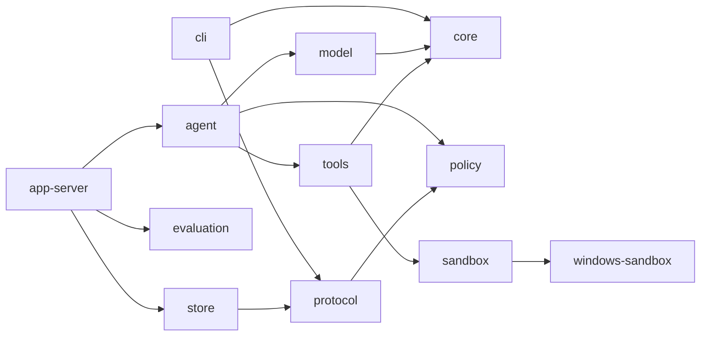

# Singularity 当前架构

本文只描述当前 Rust 源码。历史结构和已经移除的接口由 Git 历史保存。

## 1. 系统边界

Singularity 是 Windows 本地命令行编码代理，由四个 release binary 组成：

| Binary | 所属 crate | 职责 |
| --- | --- | --- |
| `sg` | `crates/cli` | 解析用户命令，启动 app-server，发送和渲染 stdio JSON-RPC |
| `singularity_app_server` | `crates/app-server` | 拥有 thread/turn 生命周期、AgentLoop 装配、持久化和 evaluation runner |
| `singularity-command-runner` | `crates/windows-sandbox` | elevated sandbox 中的受限命令 runner |
| `singularity-windows-sandbox-setup` | `crates/windows-sandbox` | UAC 提权后配置受限账户、ACL 和网络隔离 |

四个文件在 release 中同目录部署。`sg` 只发现同目录的 app-server；sandbox helper 也从当前 executable 的同目录或资源目录解析。缺失 helper 时关闭失败，不搜索或调用另一个 agent runtime。

生产 AgentLoop 只在 Windows 宣告可用。非 Windows 构建保留协议、数据模型和确定性测试能力，但 `AgentLoopCapability::current()` 返回 blocked，因为没有严格命令 sandbox。

## 2. Crate 边界

| Crate | 直接职责 | 关键对象 |
| --- | --- | --- |
| `core` | 公共错误码、脱敏检测、取消令牌、项目指令加载 | `CancellationToken`、`ProjectInstructions`、`ErrorCode` |
| `protocol` | stdio JSON-RPC 方法和公共传输对象 | `JsonRpcMessage`、`Thread`、`Turn`、`Item`、`TraceEvent` |
| `policy` | 权限 profile、规则优先级和 approval 决策 | `PermissionProfile`、`PolicyEngine`、`ApprovalRequest` |
| `windows-sandbox` | Codex 来源的 Windows restricted-token、Job Object、ACL、WFP 和 elevated helper 实现 | `PermissionProfile`、`ElevatedSandboxProfileCaptureRequest` |
| `sandbox` | 产品命令请求/结果模型及 Windows adapter | `CommandRequest`、`CommandResult`、`WindowsSandboxBackend` |
| `tools` | 模型可见工具注册、准入、工作区文件操作和 command adapter | `ToolBroker`、`ToolResult`、`WorkspaceTools` |
| `model` | provider 配置快照、模型对象、OpenAI-compatible HTTP adapter | `ProviderConfigSnapshot`、`ModelTurnRequest`、`OpenAiProvider` |
| `agent` | 上下文组装、模型/工具循环、repair、approval resume 和 completion gate | `AgentLoop`、`AgentLoopInput`、`AgentLoopResult` |
| `store` | SQLite thread/turn/item/trace/approval/artifact ledger | `SessionStore`、`StartedTurn`、`CommittedTurnOutcome` |
| `evaluation` | evaluation v2 manifest、计划和 result 数据模型 | `EvaluationManifest`、`WorkspacePlan`、`EvaluationResult` |
| `app-server` | 协议调度、runtime 装配、并发 turn、持久化和 evaluation 执行 | `AppServer` |
| `cli` | 最终用户命令和 app-server 子进程客户端 | `Command`、`AppServerClient` |

依赖方向：



CLI 不直接依赖 agent、model、tools 或 store。公共协议对象只在 `protocol` 定义，安全执行细节不进入 protocol。

## 3. 主调用链

```text
sg run <goal>
  -> AppServerClient::spawn
  -> initialize / initialized
  -> agent/capability
  -> thread/start
  -> turn/start
     -> SessionStore::create_turn_with_input_trace_and_history
     -> AppEvent::turn_started
     -> AppServer::run_native_agent_loop
        -> load_project_instructions_from_cwd
        -> AgentLoop::run
           -> assemble context
           -> OpenAiProvider::complete
           -> ToolBroker admission
           -> WorkspaceTools execution
           -> repair or next model turn
           -> completion gate
     -> SessionStore::commit_turn_outcome
     -> terminal item events
     -> AppEvent::turn_completed
     -> turn/start response
```

`singularity_app_server` 的 stdin 主线程继续处理 protocol 请求；每个 `turn/start` 由独立 worker 使用新的 SQLite connection 执行，因此同一进程可以在 turn 运行时接收 `turn/interrupt`。stdout 由单独 writer 串行输出 JSONL，避免 worker 交叉写坏消息边界。

## 4. Thread、Turn 与 Continue

### Thread

`Thread` 字段为 `thread_id`、`model`、`cwd`、`status`。`thread/start` 把当前 CLI 工作目录规范化为绝对目录并持久化；后续 turn 始终使用该 workspace。`status` 只有 `active` 和 `archived`。

### Turn

`Turn` 字段为 `turn_id`、`thread_id`、`status`、`agent_loop_status`。公共状态映射如下：

| Agent 状态 | Turn 状态 | 含义 |
| --- | --- | --- |
| `running` | `running` | worker 正在执行 |
| `completed` | `completed` | completion gate 已接受 final answer |
| `blocked` | `blocked` | 等待 approval 或外部条件 |
| `failed` | `failed` | provider、context、tool 或 runtime 终止失败 |
| `cancel_requested` | `interrupted` | 已记录取消，worker 正在收敛 |
| `cancelled` | `interrupted` | 取消已经传播并完成 |

`turn/started` 在 AgentLoop 调用前发送；终态 item、`turn/completed` 和 matching response 在事务提交后发送。失败、blocked 或 cancelled 不伪造成功 assistant item。

### Continue

`sg continue` 先调用 `thread/resume`，再创建一个新的 `turn/start`。app-server 从 SQLite 读取最多 64 个已完成历史 turn，只投影成按 turn/item sequence 排序的 user/assistant conversation message。当前 turn 不会重复进入 history。

## 5. 项目指令与上下文

`core::load_project_instructions_from_cwd` 从最近的 `.git` marker 确定 workspace root，按 root 到 thread cwd 的顺序读取每层 `AGENTS.md`：

- 单文件最大 32 KiB，总计最大 64 KiB。
- 文件必须是 workspace 内的普通 UTF-8 文件。
- symlink/junction 解析到 workspace 外、I/O 失败、非法 UTF-8 或超限都关闭失败。
- 指令作为 developer message 注入，不修改 user goal。

`AgentLoopInput` 包含 thread/turn 标识、user input、model preference、turn 上限、项目指令、历史、interrupt 标志和 approval grants。`assemble_context_items` 按优先级和 token 预算选择项目指令、历史与当前输入；当前输入不能容纳时直接返回 context overflow，而不是截断任务含义。

## 6. AgentLoop

`AgentLoop::run` 的真实步骤为：

1. 组装 developer、history 和当前 user message。
2. 构造 `ModelTurnRequest` 和六个 builtin tool schema。
3. 调用 provider，并在调用前后检查 `CancellationToken`。
4. 验证模型 tool call 名称和 JSON arguments。
5. 通过 `PolicyEngine` 得到 allow、deny 或 ask。
6. 执行允许的工具，把 `ToolResult::to_message_payload()` 作为 tool message 送回模型。
7. 对可修复 tool failure 记录 `ToolRepair`，要求后续模型回合处理。
8. 没有 tool call 时应用 completion gate，接受或拒绝 final answer。

completion gate 保持以下不变量：

- final answer 不能为空。
- edit/patch 之后必须至少观察到一个成功 command。
- 最后一次 workspace mutation 之后必须有成功 command。
- 存在未解决的可修复 tool failure 时不能完成。
- 达到 turn 上限、provider error 或 context overflow 返回 failed，不改写为 completed。

## 7. Model 与 provider

`ProviderConfigSnapshot` 在 app-server 启动时只捕获一次配置。进程环境层优先；如果该层完全没有 provider 变量，则从当前目录向上查找最近 `.env`。`SINGULARITY_MODEL`、`SINGULARITY_BASE_URL`、`SINGULARITY_API_KEY` 必须来自同一层，`SINGULARITY_MODEL_PROVIDER` 缺失时使用 `openai_compatible`。

`OpenAiProvider` 把 `ModelTurnRequest` 投影到 OpenAI-compatible `/chat/completions`，使用 reqwest rustls 客户端。每次 complete 在 current-thread Tokio runtime 中执行可取消 HTTP future；超时、认证、rate limit、网络、model 配置和 response schema 错误保留不同类别。

公共 readiness 只包含来源、snapshot id、ready、blocker code 和三个字段的 present/missing。API key、base URL 原值、Authorization header、原始 response 和原始 prompt 不进入 CLI 或 trace。

## 8. Tool、Policy 与 Approval

模型可见工具固定为：

```text
builtin.read
builtin.list
builtin.grep
builtin.edit
builtin.patch
builtin.command
```

`ToolBroker` 只接受 `builtin.*` 和 `mcp.<server>.<tool>` 命名。未知工具、非法参数、deny 和 ask 都不会调用 executor。

默认 native profile 是 workspace-write、network denied、approval on-request、protected paths enforced。read 和 sandbox command 有显式 allow rule；写入仍经过路径敏感性和 protected path 检查。`WorkspaceTools` 对所有路径执行 lexical normalize、canonicalize existing parent、workspace containment 和 protected component 检查；多文件 patch 先验证全部目标，再写入，并在中途失败时回滚已经修改的文件。

当策略返回 ask 时，AgentLoop 生成与 thread、turn、tool call 和资源绑定的 `ApprovalRequest`，同时持久化 `PendingToolCall`。`approval/decision` 是单次消费：只有 allow、绑定完全匹配、原 turn 仍 blocked、thread active 时才恢复该 pending call，然后继续完整 AgentLoop；deny/defer 不执行工具。客户端不能通过 `approval/request` 自行向 ledger 注入请求。

发送给模型的 tool result 只包含安全状态、摘要、preview、artifact reference 和 repair hint；raw arguments、approval id、policy id、audit metadata 和 secret-like 文本不投影。

## 9. Windows sandbox

`sandbox::WindowsSandboxBackend` 是 `windows-sandbox` 的产品 adapter。该底层代码来自 OpenAI Codex `codex-rs/windows-sandbox-rs` 的固定提交，来源、删改范围和许可证记录在 `crates/windows-sandbox/UPSTREAM.md`。

执行路径：

```text
CommandToolInput
  -> CommandRequest
  -> validate workspace root / cwd / requested modes
  -> map to Windows PermissionProfile
  -> run_windows_sandbox_capture_for_permission_profile_elevated
     -> automatic UAC setup when required
     -> offline or online restricted account
     -> restricted token + ACL + private desktop + Job Object
  -> if and only if requested profile supports it:
       run_windows_sandbox_capture (unelevated restricted token)
  -> CommandResult with enforcement metadata
```

规则：

- `read-only` 和 `workspace-write` 可映射；`danger-full-access` 在 sandbox backend 中明确拒绝。
- network denied 映射到 restricted network，必须使用 elevated offline identity；不能走 unelevated fallback。
- network allowed 可以在 elevated 路径失败且 restricted token 足够时走 unelevated 路径。
- 产品层只表达单一 workspace root 与 `denied` / `allowed` 两种网络模式，不暴露 allowlist 或额外读写根目录配置。
- child environment 删除 secret-like 变量；输出有界并再次做敏感标记检查。
- timeout 或 cancel 会终止 Job Object 中的进程树。
- `local_process_fallback` 始终为 false；没有无沙箱 executor。

`AgentLoopCapability::current()` 在 Windows 表示该实现可用，并不提前触发 UAC probe。真正 setup 和权限检查发生在第一条 command 上；任何失败通过 tool/evaluation blocker 暴露。

## 10. Cancel 与 Shutdown

每个活动 turn 在 app-server 内注册一个 `CancellationToken`。`turn/interrupt`：

1. 先在同进程 registry 调用 `cancel()`。
2. 事务性把 SQLite turn 写成 `interrupted/cancel_requested` 并追加 trace。
3. worker 的 cancellation monitor 也轮询 SQLite，因此另一个 CLI/app-server 进程发出的 interrupt 可以传播到原 worker。

provider HTTP wait、AgentLoop 回合边界和 sandbox command 都检查同一个 token。`commit_turn_outcome` 在提交前重新读取持久化取消状态，因此取消之后晚到的 provider completion、assistant item 或 trace 不能覆盖 interrupted。`server/shutdown` 取消所有活动 turn，再等待 worker 收敛。

## 11. Store、Trace 与 Artifact

`SessionStore` 使用 rusqlite bundled SQLite，开启 foreign keys、WAL、secure delete 和 busy timeout。默认路径为启动目录下 `.singularity/rust-app-server.sqlite3`。

主要表：

```text
threads
turns
items
trace_events
approvals
approval_decisions
pending_tool_calls
artifact_refs
schema_meta / schema_migrations
```

turn 创建、输入 item、history page 和 started trace 在一个事务内生成；终态 turn、可选 assistant item 和 terminal trace 也在一个事务内提交。turn sequence 和 item sequence 是每个父级内的严格正整数，用于恢复稳定顺序。

store 在写入 item、trace 和 artifact reference 前执行敏感文本检查。检测到 secret-like 内容时保存固定 redacted 文本；trace 保存 SHA-256 payload hash，并在读取时验证完整性。`artifact/fetch` 当前只返回已经登记且脱敏的 `ArtifactRef`，不直接提供任意文件读取。

## 12. Evaluation

`sg eval run` 发送 `eval/run`，app-server 读取 `evaluation.task_set/v2` manifest 并执行 Rust native runner：

```text
prepare source
  -> baseline workspace + evaluator patch + expected failing/passing command
  -> agent workspace + real OpenAiProvider + real AgentLoop
  -> public verification workspace
  -> hidden verification workspace
  -> atomic result.json + report.json
```

每个 stage 都通过同一个 `SandboxBackend` 执行 command。agent 只能看到 `agent.instructions`、allowed paths/tools 和 smoke commands；evaluator patch、baseline/public/hidden 命令不进入模型 payload。

`EvaluationTaskResult` 分开记录 stage status、`agent_completed`、`tests_passed` 和 `evaluation_passed`。全部 task 通过时 run 才通过。blocker 分类包括 environment、workspace preparation、provider configuration、provider authentication、network、sandbox 和 agent runtime。report 另外记录 changed/disallowed files、smoke、model turns、tool calls、approval count、trace path 和 `local_process_fallback_count`。

默认产物目录为 `work/evaluations/<run-id>`；`result.json` 是稳定 v2 result，`report.json` 是诊断报告。任一产物原子发布失败时删除不完整 run 目录。

## 13. 失败与安全不变量

- 不支持的平台、缺失 binary、缺失 provider、无效 workspace 和 sandbox setup 失败都返回明确错误，不切换执行路径。
- CLI 只把 matching response 之前的 notification 与 response 关联；EOF、child exit、timeout 和 JSON-RPC error 都是非零退出。
- thread workspace 必须是存在的绝对目录；archive thread 不能开始或恢复 pending turn。
- protected path、workspace 越界、非法 tool arguments 和扩大 sandbox/network 权限在执行前拒绝。
- approval 必须显式绑定 thread、turn 和 tool call，不能重放。
- cancelled turn 的晚到结果不能恢复为 completed。
- evaluation 的 fake/mock 测试只用于确定性回归，不能替代真实 provider + AgentLoop 证明。

## 14. 维护规则

修改以下任一事实时同步更新本文对应部分：crate 边界、release binary、protocol method/object、thread/turn 状态映射、provider 配置、tool schema、policy/approval、sandbox、store schema、trace、evaluation stage 或 artifact 路径。

完整收口至少运行：

```text
cargo fmt --all -- --check
cargo check --workspace --all-targets --all-features --locked
cargo clippy --workspace --all-targets --all-features --locked --no-deps -- -D warnings
cargo test --workspace --all-targets --locked --no-fail-fast
git diff --check
```

影响 AgentLoop、provider、工具、sandbox、approval、evaluation、trace 或 completion 时，还必须运行一次真实 provider 的 `sg eval run` 并核对 result、report 和 trace。
