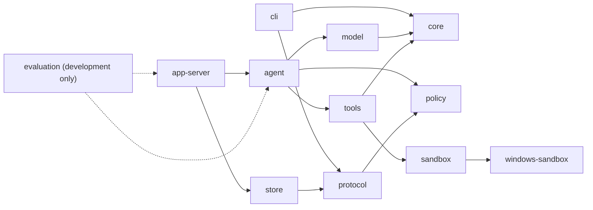

# Singularity 当前架构

本文只描述当前 Rust 源码。历史结构和已经移除的接口由 Git 历史保存。

## 1. 系统边界

Singularity 是本地命令行编码代理；核心合同保持平台无关，当前 Windows 发行包由四个 release binary 组成：

| Binary | 所属 crate | 职责 |
| --- | --- | --- |
| `sg` | `crates/cli` | 解析用户命令，启动 app-server，发送和渲染 stdio JSON-RPC |
| `singularity_app_server` | `crates/app-server` | 拥有 thread/turn 生命周期、AgentLoop 装配和持久化 |
| `singularity-command-runner` | `crates/windows-sandbox` | elevated sandbox 中的受限命令 runner |
| `singularity-windows-sandbox-setup` | `crates/windows-sandbox` | UAC 提权后配置受限账户、ACL 和网络隔离 |

四个文件在 release 中同目录部署。`sg` 只发现同目录的 app-server；sandbox helper 也从当前 executable 的同目录或资源目录解析。缺失 helper 时关闭失败，不搜索或调用另一个 agent runtime。

生产 AgentLoop 只在当前绑定的 backend 声明 strict command sandbox 能力时可用。Windows 构建绑定 restricted-token/Job Object adapter；Linux 构建绑定 user/mount/network/PID namespace、seccomp 与 Landlock adapter。当前没有 macOS strict adapter，无法满足同一合同的平台明确返回 unavailable，不会退回本地进程执行。

## 2. Crate 边界

| Crate | 直接职责 | 关键对象 |
| --- | --- | --- |
| `core` | 公共错误码、脱敏检测、取消令牌、项目指令加载 | `CancellationToken`、`ProjectInstructions`、`ErrorCode` |
| `protocol` | stdio JSON-RPC 方法和公共传输对象 | `JsonRpcMessage`、`Thread`、`Turn`、`Item`、`TraceEvent` |
| `policy` | 权限 profile、规则优先级和 approval 决策 | `PermissionProfile`、`PolicyEngine`、`ApprovalRequest` |
| `windows-sandbox` | Codex 来源的 Windows restricted-token、Job Object、ACL、WFP 和 elevated helper 实现 | `PermissionProfile`、`ElevatedSandboxProfileCaptureRequest` |
| `sandbox` | 产品命令请求/结果模型及 Windows/Linux strict adapter | `CommandRequest`、`CommandResult`、`WindowsSandboxBackend`、`LinuxSandboxBackend` |
| `tools` | 模型可见工具注册、准入、工作区文件操作和 command adapter | `ToolBroker`、`ToolResult`、`WorkspaceTools` |
| `model` | provider 配置快照、模型对象、OpenAI-compatible HTTP adapter | `ProviderConfigSnapshot`、`ModelTurnRequest`、`OpenAiProvider` |
| `agent` | 上下文组装、模型/工具循环、approval checkpoint resume 和 natural stop | `AgentLoop`、`AgentLoopInput`、`AgentLoopResult` |
| `store` | SQLite thread/turn/item/trace/approval/artifact history and recovery state | `SessionStore`、`StartedTurn`、`CommittedTurnOutcome` |
| `evaluation` | 开发期 Evaluation manifest、runner、task/trial result 与安全 evidence；不进入产品协议或发布包 | `EvaluationManifest`、`WorkspacePlan`、`EvaluationResult`、`EvaluationEvidence` |
| `app-server` | 协议调度、runtime 装配、跨 thread 并发和持久化 | `AppServer` |
| `cli` | 最终用户命令和 app-server 子进程客户端 | `Command`、`AppServerClient` |

依赖方向：



CLI 不直接依赖 agent、model、tools 或 store。公共协议对象只在 `protocol` 定义，安全执行细节不进入 protocol。

### JSON-RPC 2.0 传输合同

stdio 的每一行是一个完整 JSON 值；JSONL 只负责 framing，不改变 JSON-RPC 2.0 语义。所有 envelope 都必须带 `jsonrpc: "2.0"`，并由互斥的 request、notification、success 或 error 类型表示。request id 只接受字符串或可精确表示的 JSON 整数；`null` 仅用于服务端无法关联合法请求时的 response/error id，带小数的 number 与 request `id: null` 都按 Invalid Request 处理。响应按解析后的合法 id 原样关联，error envelope 不允许省略 `id`。`METHOD_REGISTRY` 是 method 名、调用类型、params schema 和 result schema 的唯一事实源；dispatcher 与 CLI 都从该 registry 查找并校验合同。

单请求、空 batch 和 mixed batch 都受支持。batch 按输入顺序串行分发，不并行执行有副作用项；notification 项即使 method 未知或 params 非法也不产生响应，全 notification batch 不输出任何行。batch response 保持请求项的输入顺序；`turn/start`、`turn/resume` 和 `approval/decision` 等长 worker 方法不在 batch 中执行，请求项返回标准 `-32600` Invalid Request，notification 项按 notification 合同不产生响应，其余 batch 项继续按原合同处理。解析失败、无效请求、未知方法、无效参数和内部错误分别使用 `-32700`、`-32600`、`-32601`、`-32602` 和 `-32603`；合法调用触发的 runtime 状态冲突使用项目错误 `-32005`，请求工作线程容量已满使用 `-32006`，两者都不占用标准错误码。标准错误不回显原始输入或内部诊断，`data` 仅允许显式脱敏内容。

## 3. 主调用链

```text
sg run <goal>
  -> AppServerClient::spawn
  -> initialize / initialized
  -> agent/capability
  -> thread/start
  -> turn/start
     -> SessionStore::create_allocated_turn_with_input_trace_and_history
     -> AppEvent::turn_started
     -> AppServer::run_agent_loop
        -> load_project_instructions(thread.cwd, thread.cwd)
        -> AgentLoop::run(input, AgentLoopCallbacks)
           -> assemble context
           -> OpenAiProvider completion / Responses streaming
           -> ToolBroker admission
           -> WorkspaceTools execution
           -> append typed tool result or next model turn
           -> validate assistant-only response, persist ModelResponseCommitted, then Completed
     -> SessionStore::commit_turn_outcome
     -> terminal item events
     -> AppEvent::turn_completed
     -> turn/start response

turn/resume <turn-id>
  -> SessionStore::claim_suspended_turn (claim a paused or suspended turn)
  -> decode and advance the typed TurnCheckpoint resume-attempt epoch
  -> AgentLoop::resume(input, AgentContinuation::Turn, AgentLoopCallbacks)
     -> continue the same turn from the last safe boundary without rerunning an unknown tool call
  -> the same checkpoint/event and terminal-outcome path as turn/start
```

当 AgentLoop 返回 blocked approval 时，`AgentLoopResult.pending_approvals` 中每个 `PendingApprovalOccurrence` 同时拥有 request 与 opaque typed checkpoint；AppServer 只在写入 Store 前通过 `ApprovalCheckpoint::encode` 投影 serialized payload 和显式 tool-call binding。`approval/decision` 从 Store 取回 opaque payload 后，在 claim/resume 前通过同一 occurrence codec 解码；恢复调用使用 `AgentLoop::resume(input, AgentContinuation::Approval, callbacks)`，在批准工具的副作用前后复用同一 `ToolCallsReady`/`ToolResultsCommitted` durable checkpoint callback，Store 不读取 checkpoint 字段。该 `ApprovalCheckpoint` 是 approval continuation 的独立 fail-closed 合同，不与普通 turn 的 `TurnCheckpoint` 或 `turn_checkpoints` 表合并。

`singularity_app_server` 的 Tokio stdin owner 继续处理 protocol 请求；单请求中的 `turn/start`、`turn/resume` 和可能继续运行 AgentLoop 的 `approval/decision` 由独立 blocking request worker 使用新的 SQLite connection 执行，因此同一进程可以在 turn 或 continuation 运行时接收 `turn/input`、`turn/pause`、`turn/interrupt` 和 `server/shutdown`。batch 始终在 stdin owner 按项串行处理。不同 workspace 可以并发，同一 workspace 由 Store execution guard 串行。进程最多同时接纳 16 个 request worker；stdout 使用容量 64 的控制响应队列和容量 256 的事件通知队列，由单独异步 writer 按全局 reserve order 合并两条队列写出。只有 typed `Progress` + `BestEffort` 事件在 event queue 满时可以丢弃，并以 `event/gap` 显式声明丢弃的 cursor 范围；其非阻塞 `try_send`、order reservation 与 gap commit 在同一短临界区完成，SQLite 写入不在该锁内执行。`State` 和 `Gap` 事件走可靠背压，不静默丢失，并在可能阻塞的发送前释放全局排序锁。Turn 创建与 approval checkpoint 提供显式 `TransportTraceBinding`，transport 不解析公共 JSON 推断 thread/turn；Full 成功登记 drop 后写 `EventQueueDrop`，gap 成功进入可靠队列后写 `EventGap`，frame 的 JSON、换行和 flush 全部成功后由 `spawn_blocking` 写 `WriterVisible`。这些 sample 使用同一 trusted-reopen SQLite Trace；Store/projector/writer 失败会锁存全局 execution stop 并终止 transport。worker 超限和控制队列过载遵守各自的错误或背压合同；真实 transport 断开或 write/flush 失败同样 fail closed。worker 复用同一个 active-turn cancellation registry；stdout 仍由唯一 writer 串行输出 JSONL。

每次 app-server stdio transport 启动时生成独立的 trace-session UUID；drop、gap 和 writer-visible event ID 同时绑定该 UUID 与进程内 output order。output order 只负责本进程排序，不再被误作跨进程全局身份，因此同一 Turn 在新的 CLI/app-server 进程中继续或恢复时可以从本地序号重新开始而不会覆盖或碰撞既有 SQLite Trace。AgentLoop 的公开入口只有 `run(input, AgentLoopCallbacks)` 与 `resume(input, AgentContinuation::{Turn,Approval}, AgentLoopCallbacks)`；事件和 durable checkpoint 通过现有 typed callback 投影，文本 delta 不再拥有独立运行时入口。

## 4. Thread、Turn 与 Continue

### Thread

`Thread` 字段为 `thread_id`、`model`、`cwd`、`status`、`sandboxMode` 和 `approvalPolicy`。后两个字段是 thread 创建时持久化的不可变安全快照：sandbox 只允许 `read-only` 或 `workspace-write`，approval 只允许 `on-request` 或 `never`，网络固定为 denied；缺省值为 `workspace-write`/`on-request`。`thread/fork` 默认继承 source 快照，显式参数才覆盖；`thread/resume`、普通 turn、continue 和 approval resume 都从 Store 读取快照。`thread/start` 把当前 CLI 工作目录规范化为绝对目录并持久化；后续 turn 始终使用该 workspace。`status` 只有 `active` 和 `archived`。

### Turn

`Turn` 字段为 `turn_id`、`thread_id`、`status`、`agent_loop_status`。公共状态映射如下：

| Agent 状态 | Turn 状态 | 含义 |
| --- | --- | --- |
| `running` | `running` | worker 正在执行 |
| `paused` | `paused` | 用户请求已在安全边界生效，保留 `TurnCheckpoint` 并释放执行 owner；可显式 `turn/resume`，不是终态 |
| `suspended` | `suspended` | owner 已退出但存在安全 `TurnCheckpoint`；可显式 `turn/resume`，不是终态 |
| `completed` | `completed` | 合法非空 assistant-only response 已通过校验并提交 `ModelResponseCommitted` |
| `blocked` | `blocked` | 等待 approval 或外部条件 |
| `failed` | `failed` | provider、context、tool 或 runtime 终止失败 |
| `cancel_requested` | 保持原 `running` / `blocked` | 已记录取消请求，worker 正在收敛；该行是中间状态，不是 Turn 终态。`paused`/`suspended` 没有 owner，不进入该中间态：用户 interrupt 直接终态化 |
| `cancelled` | `interrupted` | 取消已经传播并完成 |

`event/subscribe` 的 event type 列表是 app-server 进程内共享的并发快照，不写入 Store；主请求线程更新后，已创建的 request worker 在下一次事件通知读取时可见最新列表。每次通知只在短暂读取锁内复制快照，锁不跨越事件构造或其他 I/O；已经构造或发送的事件不追溯重过滤。`turn/started` 在 AgentLoop 调用前发送；终态 item、`turn/completed` 和 matching response 在事务提交后发送。失败、blocked 或 cancelled 不伪造成功 assistant item。

Turn 一旦持久化为 `running`，事件通知、AgentLoop、approval checkpoint、cancellation monitor 或 terminal outcome 的失败都会在同一个请求编排路径立即尝试 typed `failed` terminalization；失败原因只投影稳定的 stage/cause 分类，不把 Store、SQLite 或 workspace 原文带到公共错误。终态提交前，编排路径停止并在有界窗口内收敛 cancellation monitor，再以原子冻结的 typed outcome 区分 `InfrastructureFailure` 与 `UserCancellation`；monitor 无法在窗口内收敛时按基础设施失败处理。若并发路径已经安全提交 `blocked`、`completed`、`failed`、`interrupted` 或 `cancelled`，补偿会保留该状态；补偿本身失败时同时返回原始 stage/cause 与脱敏的 `store`、`state_changed` 或 `event_notification` cleanup 分类。

`turn/start` 在创建 Turn 前取得基于 Store 文件和 canonical workspace 的跨进程 `WorkspaceExecutionGuard`，并持有到 AgentLoop outcome 提交完成；SQLite 的同一 `BEGIN IMMEDIATE` 事务还会拒绝该 workspace 已存在任何非终态 Turn。OS 文件锁区分仍存活的 owner，SQLite 约束保留持久状态，因此同一 Store 中共享一个 workspace 的不同 logical thread 也不会并发修改同一文件树；不同 workspace 不被全局串行化。`thread/archive` 和 `thread/delete` 仍只拒绝目标 thread 自身存在非终态 Turn。

### Continue 与交互式 Turn

`sg continue` 先调用 `thread/resume`，再创建一个新的 `turn/start`。app-server 优先读取最近一个 completed turn 的完整 `TurnCheckpoint`，并把它作为 fresh turn 的唯一历史 seed；AgentLoop 在进程内一次性派生 `HistoricalModelContext`，保留 checkpoint 中有序的模型消息、provider-private reasoning、`ToolResultOccurrence` 与 context trace，不按公共 assistant 文本重新拼接工具轨迹，也不建立第二个持久事实源。只有最近 completed turn 没有 checkpoint 时，app-server 才回退为最多 64 个已完成历史 turn 的公开 user/assistant conversation message。当前 turn 不会重复进入 history。

`turn/input` 接受调用方提供的 `inputId`、`delivery` 和非空 `input`，只允许向非终态 Turn 写入新消息。`inputId` 是幂等键：同一 Turn、delivery 和内容的重复请求即使在 Turn 随后终态化后也返回既有结果，换绑 Turn、delivery 或内容则 fail closed；终态 Turn 的新 `inputId` 仍被拒绝。每批内容先作为真实 `ItemKind::UserMessage` 按该 Turn 的 item sequence 持久化；`turn_inputs` 只保存 `inputId`、所引用 item、`steer`/`follow_up` 和 pending/consumed 消费关系，不复制消息正文，也不是第二消息事实源。

`steer` 在下一个完整 checkpoint 边界可见，不改变已经发出的 `ModelTurnRequest`；`follow_up` 只在当前响应已经完整提交或即将进入 terminal-response 请求时可见。多个 eligible input 按 item sequence 稳定消费，并在同一 SQLite 事务中把消费关系改为 consumed、写入已经包含这些 user message 的新 `TurnCheckpoint`。新输入使此前的 completion readiness 失效；下一请求回到普通 `Auto` 与五工具表面，直到新的 revision-bound command evidence 建立，不创建或恢复模型可见的 plan 状态；workspace revision、真实 tool result 和 command observation 仍是完成判断的唯一事实。若 `steer` 在线性化工具执行前到达，`begin_tool_executions_at_checkpoint` 不登记执行 owner，AgentLoop 为每个未执行的结构化调用追加 typed `ToolResult`，其 `error_code` 为 `not_executed_due_to_user_input`，再处理新 user message；若执行 owner 已先登记，输入等待完整 `ToolResult` 的安全边界，不能取消、猜测或重试已经开始的副作用。

`turn/pause` 与取消及 owner 丢失不同：终态 Turn 拒绝该请求，已经 `paused` 的 Turn 幂等保持；`suspended` Turn 因没有活动 owner，可立即转为 `paused`；其他非终态 Turn 只持久化 pause request。存在活动 AgentLoop 时，它到下一个安全 checkpoint 边界后才在同一事务中保存 checkpoint、清除请求并转为 `paused`。若同一边界也有 eligible input，Store 原子提交其消费、新 checkpoint 和 `paused` 状态。`Paused` 保留用户意图且不生成 `Interrupted`；`Suspended` 表示进程 owner 丢失后存在安全恢复边界；`Interrupted` 是取消已经收敛或没有安全恢复边界的终态。

`turn/resume` 只接受 `paused` 或 `suspended` Turn。取得同 workspace execution guard 后，Store 在一个 `BEGIN IMMEDIATE` 事务中完成单 owner claim并把同一 Turn 改回 `running`；AppServer 随后解码并校验持久化的 typed `TurnCheckpoint`，递增、保存 `resume_attempt` epoch，再从 checkpoint 的完整 message/tool-result 状态继续，不创建新 Turn，也不合成“continue”用户消息。claim 后任一失败都会释放该 claim：尚无在途副作用时回到 `suspended`，已登记为 `running` 的工具则先归约为 `unknown` 再悬挂，避免留下无 owner 的 `running` Turn。若该 Turn 存在 `unknown` tool execution，claim 直接拒绝，既不调用 provider，也不消费排队输入；系统不能猜测外部副作用结果或自动重新执行该工具。

AgentLoop 在完整 model response、工具执行前后和 model request 前发布 typed checkpoint 边界；Store 的终态提交在同一个写事务中重新检查 `pause_requested` 和所有 pending `turn_inputs`。只要任一项存在，`Completed`、`Failed` 或 `Interrupted` 提交就返回 `TurnBoundaryPending` 且不产生终态副作用；AppServer 随即从最后一个 durable checkpoint 原子消费该边界并继续同一 Turn。因而晚到 input/pause 与 terminal response 的先后由 SQLite 写事务决定，不会把已接受但未消费的用户输入静默越过，也不会把该竞争误归约成失败终态。

Approval decision 使用同一 boundary gate。Allow 只有在同一事务确认没有更早的 steer/pause 时才可把待执行工具标记为 executing；边界已经存在或在事务前竞争到达时，AppServer 重新读取并把 ApprovalCheckpoint 原子移交为普通 TurnCheckpoint。Deny 在没有 interactive boundary 时保持既有 failed 终态；若已有 steer、follow_up 或 pause，则记录 deny decision 但不 terminalize，追加 model-visible `approval_denied`/cancelled ToolResult，删除旧 pending execution，按 item sequence 消费真实 UserMessage，并把同一 Turn 置为 `running` 或 `paused`。旧工具在两种 handoff 中都不会执行。

## 5. 项目指令与上下文

普通 Thread runtime 不向上寻找 `.git`：Thread create/fork 先从输入路径逐组件 `nofollow` 绑定 `WorkspaceTools` 根 capability，再持久化与该对象身份一致的 canonical display path；不会先跟随 symlink/junction 后把外部目标当成 workspace。每次 turn 和允许执行的 approval continuation 都在写入 Running turn 或记录 allow decision 前，从持久化路径完成一次根 capability 绑定，并把同一个 `WorkspaceTools` 实例贯穿项目指令、AgentLoop、文件工具和 command cwd；绑定失败不产生新的非终态 turn 或已消费的 continuation。AppServer 使用该绑定的 `Thread.cwd` 同时作为 workspace root 与 cwd，调用显式边界的 `core::load_project_instructions(thread.cwd, thread.cwd)`。core 的 `load_project_instructions_from_cwd` 仅保留给有界的独立调用；显式 root→cwd API 按 root 到 cwd 的顺序读取每层的一个项目指令文件：若存在 `AGENTS.override.md` 则选择它，否则选择 `AGENTS.md`：

- 单文件最大 32 KiB，总计最大 64 KiB。
- canonical workspace 通过文件系统根 capability 逐分量 `nofollow` 打开，root→cwd 的每层目录都由父目录句柄相对打开；路径解析后插入的 symlink/junction/reparse point 不会成为新的 ambient 逃逸。
- 每个候选文件以目录 capability 相对 `nofollow` 打开，文件类型、hard-link count、长度和正文都从同一个已打开句柄取得；symlink/junction、非普通文件、多 hard-link 对象、I/O 失败、非法 UTF-8 或超限都关闭失败。
- 文件路径在打开后即使被替换，本轮仍只读取已经验证的原对象；来源摘要和 aggregate digest 均基于该次有界读取的实际字节。
- 合并结果作为 developer message 注入，不修改 user goal；只把合并后的正文发送给模型。
- 内部 `ProjectInstructions` 同时保存 workspace-relative source path、每个文件的 SHA-256 和按合并正文及来源顺序计算的 aggregate SHA-256。`AgentLoopInput` 在本轮固定该 aggregate digest；若产生 pending approval，内部 checkpoint 保存同一 digest，resume 只接受重新加载的同一 bounded snapshot，文件、来源顺序或 override 选择变化会在执行批准工具前以稳定错误 fail closed；绝对路径、原始 source metadata 与原始正文不进入普通 trace、CLI 或模型工具 payload。

`AgentLoopInput` 包含 thread/turn 标识、user input、model preference、turn 上限、项目指令、历史、interrupt 标志和 approval grants。fresh turn 的历史来自最近一个 completed turn 的完整 checkpoint；消息、provider reasoning replay 与 `ToolResultOccurrence` 作为同一快照恢复。每次 run/resume 先协商当前 provider contract，再按实际工具视图和 context budget 构造请求；容量、schema、reasoning 或 replay 不满足 contract 时在 provider 请求前 fail closed。`model_turn_limit` 只表示本轮允许的模型回合数，不包含任何额外 finalization 请求。

`ProviderProtocolContract` 将 native structured tools、strict schema、并行调用能力、工具定义容量和 reasoning/history 约束作为独立能力。每次真实 provider attempt 保存 typed lifecycle、usage 和诊断；产品只接受 Direct structured tools。普通请求始终保留完整工具视图，不因终态候选切换为 tools-disabled 请求。

## 6. AgentLoop


生产 turn 通过 `AgentLoop::run(input, AgentLoopCallbacks)`，普通和 approval continuation 通过 `AgentLoop::resume(input, AgentContinuation::{Turn,Approval}, AgentLoopCallbacks)`；两条公开入口共享同一状态驱动。执行步骤如下：

1. 组装 developer、history 和当前 user message，并协商 provider tool capabilities。
2. 调用 provider，验证 stream/response 与工具调用 envelope；provider failure、timeout、cancelled 或校验失败终止当前 run。
3. 对全部 tool calls 做 whole-batch preflight。输入/schema/unknown tool/policy 拒绝和普通可恢复执行失败写入 typed `ToolResult`，进入下一模型回合；Ask 生成 approval checkpoint 并返回 `Blocked`。
4. 只有全部成员允许时执行工具；保留 `ToolCallsReady`、`ToolResultsCommitted`、approval pause/resume 和 owner-loss no-replay。
5. 无 tool call 时，合法非空 assistant-only response 在 response/stream validation 和 `ModelResponseCommitted` checkpoint 成功后立即 `Completed`；空文本是 typed protocol failure。

1. 组装 developer、history 和当前 user message。
2. 协商 provider tool capabilities，按返回 contract 构造 `ModelTurnRequest` 和真实 Direct `ToolSpec`。定义数超过已协商容量时直接拒绝，不隐式切换或隐藏工具。模型输入 schema 使用可移植 JSON Schema 子集；strict 只在全部当前 schema 满足本地 strict 检查且 provider 已声明支持时发送。每个 response 的工具调用数量由 contract 和本地 `max_tool_calls` 共同约束；只有彼此独立的只读调用才允许并行，mutation、command、approval-sensitive 或依赖前序结果的调用必须按序提交。
3. 调用 provider，并在协商前、等待期间和返回后检查 `CancellationToken`；typed cancellation 与 token cancellation 都归约为 `Cancelled`。
4. adapter 先按协商上限和本次 `request.tools` 的实际名称验证完整 response；超出请求上限、缺少/重复 call ID、工具名不符合 Provider 函数名语法、assistant/tool envelope 不配对或其他结构性错误时不选择、不规范化也不执行任何调用，且不把非法调用提交到模型历史。可解析但参数 JSON、schema 或工具可见性失败的 native call 交给 AgentLoop 的 typed preflight rejection；AgentLoop 不针对 provider 错误码重试，typed provider failure 保留原始因果并结束当前 run。
5. AgentLoop 对 response 中全部 Direct tool calls 执行整批 preflight：验证工具可见性、`ToolSpec` model/executable input contract、profile binding、workspace/protected-path 边界和 `PolicyEngine` 的 allow/deny/ask。approval grant 先在临时集合中匹配，只有整批获准执行后才提交消费；任一成员非法时不执行合法子集。模型不可见的名称或外层 envelope 不会被解包、规范化或转成另一种工具调用。
6. 多调用批次只有在全部工具的 execution mode 都是 `parallel_read` 且全部 allow/approved 时才并发执行；结果按原调用顺序回传。任何 preflight rejection、exclusive 或 ask 成员使整批零执行，不执行合法子集。每个拒绝结果都保留顶层自身稳定错误和既有 `content` validation detail，并在 `content` 中明确 `batch_executed=false`、`call_executed=false`、当前 execution mode 或 preflight 类别、首个触发工具/错误/类别及下一步；模型必须先修正 preflight 失败，再把 mutation、command 或 approval-sensitive 调用单独提交并等待结果。该恢复合同不增加 Provider schema 字段，不包含 raw arguments、路径或内部 audit metadata。只读批次允许部分执行失败，但全部结果仍按序返回；取消发生后丢弃晚到批次结果。
Approval checkpoint 绑定 request/thread/turn/tool call 和项目指令 digest，保存恢复所需 messages、typed occurrences、used grants、usage、attempts、resume cursor 和 fingerprints；不保存 completion/repair/recovery policy。
8. 执行允许的 Direct 工具，把 `ToolResult::to_message_payload()` 按原顺序作为 tool message 送回下一模型回合；允许执行的 assistant/tool history 保持 canonical tool name、call ID 和本地验证后的参数。对名称符合 Provider 语法但工具不可见、参数 JSON 无法解析或本地 schema/runtime validation 失败的调用，公共历史投影保留原始工具名和 `call_id`，把未验证参数收敛为 `{}`，并返回既有 typed `ToolResult` 错误；下一请求中的 `tools` schema 仍是当前可用工具的唯一事实源，不在错误 payload 中复制工具名列表或增加自定义拒绝 envelope。名称本身不符合 Provider 语法的响应在 Model response validation 边界 fail closed，不生成 assistant tool-call 历史或配对 ToolResult，也不制造占位工具名。所有拒绝路径都不回显 raw arguments、serde 错误或敏感路径。pending Approval checkpoint 会从保存的 provider-facing call 重新经过同一真实 `ToolSpec` 和 profile binding，再与 canonical pending call 比较，拒绝名称或参数篡改。宿主 PATH 中不存在或绝对路径不可用的可执行文件归为 `command_executable_unavailable` capability，当前 adapter 无法安全表达的 batch 调用归为 typed unsupported，这些路径都在零执行后把安全原因返回下一模型回合。真正的 sandbox backend/infrastructure/timeout/cancelled 仍终止当前 run，不伪装成普通输入修复。
没有 tool call 时，响应通过 stream/response validation 且文本非空即可在 `ModelResponseCommitted` 成功后直接 `Completed`。

fresh turn/start 以最近一个 completed turn 的完整 checkpoint 为历史 seed；seed 解码、thread/turn 绑定或历史组装失败时 fail closed。当前消息、canonical messages、provider reasoning replay、tool occurrences、approval/fingerprint/usage/attempt facts 在 checkpoint 中原子恢复，不生成 repair/completion control prompt。

普通 turn 的 durable checkpoint 事件按真实副作用边界提交：`Initial` 在开始运行前保存安全状态；`BeforeModelRequest` 固化即将发出新请求前的完整状态；`ModelResponseCommitted` 只在完整响应已经进入 AgentLoop 状态后发布；`ToolCallsReady` 在一个事务中先保存 checkpoint，再在没有已接受 steer/pause 时登记 `tool_executions` 的 `running` owner；`ToolResultsCommitted` 携带同一执行批次的完整 tool-call ID 集合。Store 在同一个 `BEGIN IMMEDIATE` 事务中验证显式集合非空且唯一，并要求它与该 thread/turn 的全部 `running` execution 完全相等；任一 ID 缺失、重复、陌生、跨 Turn 或不再 `running` 都在写入前整体拒绝。验证通过后事务写入包含完整批次结果的新 checkpoint，并删除、核对全部显式 execution；单工具沿用同一机制的单元素批次。批准后的 approval continuation 也在实际工具副作用边界调用同一 callback，避免恢复后仍停留在 approval 前 checkpoint。进程或 owner 丢失时，仍在途的 execution 只转换为 `unknown`，永不自动重新执行；有安全 checkpoint 且没有 unknown execution 的 Turn 归约为 `suspended`，没有可恢复边界的 Turn 则按既有中断/失败合同终止。Store 提交 `Failed` 或 `Interrupted` 终态时，同一事务也会把该 turn 的 `running` execution 转为 `unknown` 并保留 checkpoint；`Completed` 若仍有 `running` execution 则拒绝提交。approval continuation 仍使用独立的 opaque typed `ApprovalCheckpoint` 与 `pending_tool_calls`，不把两种 checkpoint schema 混为 Store 的动态语义。

checkpoint、pending tool call、原始 prompt、provider payload 和内部 audit metadata 不序列化到 `AgentLoopResult`、CLI response 或普通 trace payload。ordinary/approval checkpoint 分别使用 v7/v8，保留 messages、provider reasoning replay、typed occurrences、workspace facts、used grants、usage、attempts、resume cursor、seen/completed fingerprints 和 context trace；删除 completion/repair/recovery 派生字段。旧 v5/v6 decoder 仍由普通 decode 入口按版本分派读取，迁移 seam 尚未从普通 runtime 入口切断，待后续 Phase3 收敛；当前 runtime 不新增第二套 legacy state。

`AgentRunStatus.audit_events` 在 Agent 到 trace 的 seam 通过 typed closed allowlist 生成：只保留受限的验证、approval decision、command scope digest、sandbox enforcement/fallback、policy 与 bounded label 字段；绝对 cwd、raw arguments、原始 reason、grant/request/decision ID 以及未知嵌套 JSON 都被丢弃。普通 `TraceEvent` 与 Evaluation 的安全投影使用同一 allowlist；pending approval 的 command audit 只读取 `PendingToolCall.resources` 中已绑定的 `PermissionResource::CommandScope` digest，缺少或非法 binding 时显式记录 `command_scope_digest=unavailable` 与 `policy_scope_binding=unavailable`，不从 raw arguments 以默认权限重算。

当下一次 model request 超出 context budget 时，AgentLoop 使用确定性的 `compact_model_messages`，保留完整 canonical messages、typed occurrences、reasoning replay 和 context trace 所需事实；压缩只替换有界 tool payload，不注入 completion/repair/verification 摘要。resume 对 occurrence binding、workspace revision、provider attempts 和 compaction 单调性 fail closed。

请求大小同时计入尚未压缩的安全 tool-result accounting；`ToolResultOccurrence` 按真实追加顺序绑定 assistant/tool messages。pending approval 使用隐藏 occurrence，Visible/Compacted/Omitted 状态有明确校验；workspace observation、revision、change summary、result_id 和 command scope digest 作为 typed execution facts 保留，不能从 raw arguments 猜测。

`AgentLoop` 的完成不依赖质量门禁：

- assistant-only response 必须经过 provider stream/response validation、文本非空校验和 `ModelResponseCommitted` checkpoint；成功后状态唯一为 `Completed`。
- 工具失败按稳定 typed 语义分类。安全可反馈的输入/schema/unknown tool/policy/普通执行失败进入 transcript 并继续；Ask 为 `Blocked`；backend/sandbox unavailable、timeout、cancelled、unknown observation、callback/store/checkpoint failure终止。
- `WorkspaceObservation`、`WorkspaceRevision`、change summary、result_id、scope digest、ToolCallsReady/ToolResultsCommitted、approval pause/resume、cancel/max-turn 和 unknown side-effect no-replay 仍是 runtime facts。


产品只接受 Direct structured tools。Provider 不支持 Direct structured tools 或当前定义容量不足时，AgentLoop 返回 typed unsupported；不通过隐式路由、文本伪调用或静默别名恢复。

`AGENT_DEVELOPER_INSTRUCTIONS` 只建议多步骤工作在模型私有上下文维护简洁 checklist；它不是工具、持久状态或完成门禁。工具只能通过 native structured tool call 提交，参数必须匹配注册 schema。

## 7. Model 与 provider

Responses 工具响应只有在实际包含 reasoning output item 时才创建 provider-private replay，并按原序列原样保存、绑定对应的 function-call IDs，供同一工具续接回放；没有 reasoning item 的合法工具响应不合成 `reasoning_effort=off` 的伪状态，也不因缺失而拒绝。存在 reasoning item 但其 ID、输出类型或 function-call 绑定非法时，仍在 provider 响应边界 fail closed。

`ProviderConfigSnapshot` 在 app-server 或 Evaluation 进程启动时只捕获一次配置。运行时优先采用显式进程环境层，否则读取用户目录的 `config.json` 及其引用的私有认证文件；项目 `.env` 只可由用户主动传给 `sg config import-env`，不会自动进入运行时。若设置 `SINGULARITY_MODELS_CONFIG`，它作为进程环境层的唯一多-provider JSON 输入。JSON 的形状是 `{default_model, providers}`，provider 键是逻辑 `provider_id`，每个 provider 的 `models` 键是 allowlist，`api_key_env` 只引用环境变量名。`default_model`、`thread.start.model` 和 fork 的 model 使用完整 `provider_id/model_id`（按第一个 `/` 切分，后续 `/` 保留在 model id）；unknown provider/model、未 allowlist 或 malformed selector 都在本地 fail closed。当前唯一 adapter 是 `openai_compatible`；其他 adapter 以 `provider_adapter_unsupported` fail closed，不借用 OpenAI transport 伪装为已支持。每个 model 恰好声明 `chat` 或 `responses` 及 context/output limits，provider/model/protocol/limits 在一个 turn/trial 内不变。context window 未声明时保持 unknown，output limit 必须显式声明；配置上限分别为 2000000 和 1000000，且已知 output 必须严格小于已知 context。

Provider 配置值在本地 client initialization 信任边界完整校验，不会静默 trim 或纠正。进程环境和显式导入文件的 provider、model、base URL、API key 及 token limit 值如果含 `CR`、`LF`、`NUL` 或首尾空白，以 `provider_configuration_invalid` typed fail closed，错误不携带原始值且不会产生 provider attempt；导入文件的标准 `CRLF` 行尾由解析器正常处理。

每次 run/resume 都调用 capability negotiation；进程环境层保留既有候选协议行为，而用户目录中的 model selection 只向 capability probe 传入该 model 的单一声明协议，不尝试另一协议或根据 URL 猜测。只有带有 typed capability-specific validation evidence 的稳定 capability rejection 才能失效已绑定的 negotiation；普通 HTTP 400/422、认证、网络、限流、5xx、取消、JSON decode、body/envelope validation 和无法安全重放的输出都保留原始因果并终止，不会被宽泛归类为能力拒绝。最终协议作为 `ProviderCapabilityMetadata.api_protocol` 进入安全 trace，但不进入 Agent execution model，也不替代独立的工具能力 contract。一次 turn 的 composite selector 在本地 snapshot 解析为具体 provider 与裸 model id；上游 JSON 的 `model` 字段永不包含 `provider_id/` 前缀。

OpenAI-compatible adapter 使用固定 developer/user 消息验证 Direct tool definitions、strict schema、parallel/single 调用和多轮原生 tool history；capability probe 的 strict schema 使用单一 object、全部 required、`additionalProperties=false` 以及 enum/有界 array 等可移植子集，不依赖根级 `oneOf`；只有完整多轮 profile 成立才写入上述 snapshot/persistent cache。思考档位由每模型的 `reasoning_variants/default_variant` 显式拥有：Chat 选中档位发送 `thinking.type=enabled` 与允许的 `reasoning_effort`，Responses 发送 `reasoning.effort` 并请求 `include=["reasoning.encrypted_content"]`。Chat assistant `reasoning_content` 与 Responses 独立 reasoning item 是绑定 provider/model/protocol/variant 的不透明 checkpoint 状态，只在同一工具续接中原样回放，不进入公共 conversation、trace、Evaluation report 或错误正文；关闭思考时不带启用字段。存在私有 replay 时：provider/model/reasoning variant 字符串不匹配在 capability probe 与 Initial checkpoint 之前本地 typed fail closed；protocol 不匹配与目标 reasoning disabled 由 transport 在完成请求构建处 typed fail closed（capability probe 不携带 replay 数据，replay 永不发往网络；完成请求 HTTP=0）；不再静默清除旧状态后继续。reasoning/history 不满足 adapter 合同、工具调用缺失或使用文本伪调用时 typed fail closed。Direct profile 不成立时直接返回 typed unsupported，Agent 也不从单纯的容量数推断替代能力。生产 app-server 只接受 canonical file-backed SQLite DB；所有 SQLite URI（包括 `:memory:` 与 `file:` 形式）、DB symlink/reparse/hard-link 以及与 cache/lock/temp 名称或 Windows alias 碰撞的 basename 都在 Store 打开前拒绝。DB/state directory 的 canonical path 是 cache 注入和后续 Store 连接的唯一事实源；crate 内部 `SessionStore::open(":memory:")` 测试用途不改变。

Provider 失败通过 `ProviderDiagnostic` 投影稳定的 `code`、`stage`、transport category、命中 timeout 时的配置 deadline 秒数、HTTP status 和 response validation codes。该对象不包含 API key、Authorization、endpoint、prompt、原始响应、provider/model 名称或底层 error source；AgentLoop、app-server trace 与 Evaluation result/report/evidence 只持久化这一安全投影。原始错误 message 仍经过公共边界脱敏，诊断字段不会因 message 被整体替换为 `[redacted]` 而丢失。timeout deadline 通过本地 hanging HTTP transport 回归测试验证，不用字段序列化代替真实 reqwest 超时路径。

`OpenAiProvider` 使用 reqwest rustls 客户端，并把同一个 `ModelTurnRequest` 分别投影为 Responses typed items 或 Chat Completions messages。Responses 请求把开头连续的 system/developer 基础指令合并到顶层 `instructions`，其余对话保持在 typed `input`；它使用 flat function definitions、`store=false`、`function_call`/`function_call_output` 的 `call_id` 关联；选中思考档位时发送已解析的 `reasoning.effort` 与 `include=["reasoning.encrypted_content"]`，并把原始 reasoning output item 在下一次工具续接中按标准 item 回放，禁止转成 Chat `reasoning_content` 或用户文本。无思考时不发送 reasoning 启用字段。adapter 对未知 output item、未知 message content part、缺失或跨 selector 的 opaque history fail closed。Chat Completions 使用标准 nested function definitions 与 assistant `tool_calls`/tool messages；响应归一化前要求 message `role=assistant`、工具调用 `type=function` 和已知内容 part discriminator，`finish_reason=length`/`content_filter` 作为未完成响应 typed fail closed；选中思考档位时发送 `thinking.type=enabled`、已解析的单一 `reasoning_effort` 和原始 assistant `reasoning_content`，不支持时只接受已由真实 probe 证明的 `thinking.type=disabled`。history-only replay 仍保留原生 assistant tool call 与 tool result history，并在没有当前工具定义时使用同一冻结 reasoning 合同；Provider 违反合同时两条路径都 typed fail closed。两条 wire 路径共用同一个请求 validation、bounded body、retry、response normalization 和本地结构校验；对合法已注册工具，`ToolSpec`、模型输入和 executable input 仍在 Agent/Tool 本地信任边界完整验证并使用 canonical tool name。合法名称的 pre-execution rejection history 保留名称和 `call_id`、清空未验证参数；非法名称在响应 validation 边界终止，不形成第二套 Agent 或工具执行路径。

每次 complete 在 current-thread Tokio runtime 中执行可取消 HTTP future；配置、请求校验、HTTP status、body、JSON decode 和 response validation 都使用稳定诊断。请求上限为 1 时发送 `parallel_tool_calls=false`，大于 1 时才发送 `true`；strict 仍由 contract 与本地 schema 检查共同决定。普通请求使用 `tool_choice="auto"`，显式 `Required` 只有 contract 声明支持时才可发送。native tool 的参数 JSON 无法解析或不是对象时，adapter 保留完整 call identity 和有限 validation errors，并以 `Success + validation errors` 交给 AgentLoop，由本地 ToolSpec 生成 typed `invalid_tool_arguments` 结果后继续下一模型回合；已注册工具的本地 schema mismatch 走同一 typed 修复路径。拒绝历史只保留可移植名称和 call id 配对，并把未验证参数归一化为空对象。缺失/重复 call id、未知或非可移植工具名、参数字段类型/缺失、reasoning/history 违约或 assistant 文本中的完整 `<tool_call>...</tool_call>` envelope 仍在 adapter/执行前 typed fail closed；文本永不解析执行。

一次 provider complete 最多执行 6 次 attempt（首次尝试之外最多重试 5 次），重试只覆盖可重试的网络/timeout 或 response body read 错误，以及 HTTP 429 和 5xx；请求本地校验、JSON decode 和 response validation 不通过时不重试。重试 backoff 以 50 ms 为基数并逐次翻倍（在最多 6 次 attempt 下实际等待 50 ms、100 ms、200 ms、400 ms、800 ms），且每次等待都检查 cancellation。每次响应或错误携带 `ProviderAttemptMetadata` 的 `attempt_count`、`retry_count` 和总 `latency_ms`；AgentLoop 按真实 provider operation 累加这些字段，能力协商在产生 model turn 前失败时也保留 `ProviderError.provider_attempt_metadata`，因此 Evaluation 不会把已发生的 probe attempts 归约为 0。`ModelUsage` 同时累计 input/output/total、cached input、reasoning token 和可选 cost；这些是诊断和 evaluation 投影，不改变 completion 或 blocker 语义。

`ProviderAttemptEvent` 位于真实 reqwest attempt 边界：每次 capability probe 或 completion 在发送 HTTP request 前同步产生 Start，同一个 request 在成功、错误、取消或安排 retry 时产生唯一 End；observer 拒绝 Start 会在网络连接前 fail closed，拒绝 End 会停止后续 retry。AgentLoop 只为这些 typed transport event 绑定 Turn/Prompt parent 与 occurrence identity，`TraceProjector` 按 callback 顺序直接写入 SQLite；最终聚合的 `ProviderAttemptMetadata` 只用于状态和 Evaluation 汇总，失败协商也只消费同一份 `ProviderError.provider_attempt_metadata` 一次，不再反向补造第二组 span。Start/End 共享 provider、model、protocol、operation phase、attempt/retry identity，End 追加 send-to-headers、TTFT、backoff、usage 和 typed error；Evaluation Report 的 TTFT 只投影该 Store 权威指标，指标缺失时只标记为无生产者或未观测。当前 provider 与 tool 执行都没有独立 admission queue，因此对应 queue timing 明确保持 unavailable，而不是把未测量值伪造成 `0 ms`；引入真实有界队列时必须从入队与开始执行的同一 occurrence 生命周期派生该指标。

公共 `providerConfiguration` 只表示配置状态，包含来源、snapshot id、`configured`、`configurationBlocker` 和三个字段的 present/missing；它不声称网络或模型请求已经成功。Provider error 只投影稳定 code、阶段、可靠 transport 类别、HTTP status 和 response validation codes。API key、base URL 原值、Authorization header、原始 response 和原始 prompt 不进入 CLI、Evaluation 或 trace。普通 agent trace 与 Evaluation `agent-trace.json` 可以记录 provider attempt 的安全投影（`provider_name`、`model_name`、实际 `protocol`、operation phase、attempt/retry 计数和终态 usage），以及可选 contract/capability metadata；不会记录 endpoint、key、Authorization、raw request/response、prompt 或 provider-private `reasoning_content`。HTTP 200 但返回文本伪工具调用时 fail closed，本地完整 `ToolSpec` validation 不关闭。

## 8. Tool、Policy 与 Approval

产品注册的工具为：

```text
read
list
grep
patch
command
```

产品运行时向 `ToolBroker` 注册五个具有真实 executor 的 Direct 工具。`ToolRegistry` 的单一 `ToolEntry` 同时拥有稳定 `ToolId`、版本、能力、authorization、typed executor 与 `ToolSpec`；所有注册工具都是模型可见的真实工具，Agent 不再按工具名称另建 Policy 或 execution 分派表。每个 `ToolSpec` 拥有模型 schema、execution mode 和一个输入 validator；同一 validator 在 model admission 与 executor 信任边界各执行一次，避免平行输入合同。模型 schema 只表达调用方需要提交的输入，sandbox/network 等执行策略由 Agent、Policy 和 backend 绑定，不进入模型 payload。`command` 的模型合同是 `{command:string,cwd?,timeout_seconds?}`，可信内部 `argv` 仅用于平台 adapter 和 Evaluation executor。AgentLoop 对一个响应的全部调用先完成 input validation、profile binding、workspace/preflight，任一失败时不对合法子集执行 Policy、Approval 或 executor；ToolBroker 在 Allow/Approved 闸门再次验证同一 execution contract。所有输入拒绝 unknown fields；非法参数返回可修复的 `invalid_tool_arguments`，不猜测、不改写 shell string，也不解析文本伪调用。

普通工作请求始终从同一注册表投影上述五个工具，不按 Evaluation task、task capability、内部验证阶段或 repair 状态裁剪。模型可见性只说明本轮可以提交哪类结构化输入，不授予文件、命令或网络权限；Policy、Approval 和 OS sandbox 在副作用边界独立决定是否允许执行。Agent completion 只要求真实最新 revision 的成功 command observation；Evaluator 自己在 Agent 结束后运行固定 public/hidden commands，因此功能评分不依赖模型调用指定工具、提交内部计划或复刻 evaluator command。

这条责任边界采用以下固定一手先例，并只移植当前消费者需要的部分：

- OpenAI Codex `775fb21d2af9b9936618fe22dd62e6f0cb3ba4a3` 的 `update_plan` 只更新 checklist/event，不拥有 approval、verification 或 completion；Singularity 采用这种责任分离，但因当前没有结构化计划消费者而明确省略该模型工具。
- Pi Agent `v0.83.0`（`845d6ff1f6643aba440341cce877ce1c43ebbc39`）默认保持 `read/write/edit/bash` 的小工具面且没有内置 plan/todo；Singularity 借鉴小表面，但以单个支持 expected-content、整批验证、原子发布和 rollback 的 `patch` 取代重叠的 write/edit。
- SWE-bench `f7bbbb2ccdf479001d6467c9e34af59e44a840f9` 以固定 repository/base commit、test patch、`FAIL_TO_PASS`/`PASS_TO_PASS` 和 evaluator tests 判断 patch；Singularity 同样让 Evaluator 拥有固定功能验证，不把 Agent 内部工具顺序当成功条件。
- Codex 的工具 exposure、approval、sandbox 与 execution lifecycle 是不同责任；Singularity 保留这种分离及自身严格安全增强，但明确省略 PTY/ConPTY、managed proxy、GUI、Codex 配置/协议/telemetry 等当前无消费者的表面。Windows 机制的逐项采用、本地差异与省略项继续以 `crates/windows-sandbox/UPSTREAM.md` 为更新基线。

默认 workspace-write profile 是 network denied、approval on-request、protected paths enforced；read-only profile 对 Write 做 hard deny，workspace-write 只允许 workspace capability 内的 direct write，命令仍经过严格 OS sandbox。`singularity_policy::workspace_policy` 是 App Server 与 Evaluation 共享的唯一装配入口：它始终加入 Read/Execute allow 规则，仅在 WorkspaceWrite+Never 时加入 Write allow 规则。这样 `Never` 只跳过真正的 approval 请求，工作区内的严格受控写入可直接执行；OnRequest 写入仍 Ask，ReadOnly 写入、敏感 workspace path、network 和显式 Ask rule 仍硬拒绝或按 approval policy 拒绝。该责任边界采用 OpenAI Codex `775fb21d2af9b9936618fe22dd62e6f0cb3ba4a3` 的 Never 不请求额外 sandbox 权限、workspace-write 直接编辑思路，但 Singularity 的本地轻量实现不引入 Codex 的 sandbox escalation/host path 表面，继续依赖 typed `WorkspaceRelativePath`、protected-path checks、pinned workspace 和 mandatory strict backend。Policy 只比较 `PermissionResource`：workspace path、command scope digest 或 tool id；`ToolId`、`WorkspaceRelativePath` 和 `CommandScopeDigest` 在构造与反序列化时都重验格式，路径拒绝 absolute/drive/ADS、反斜杠、空/`.`/`..` 分量。`PermissionProfile` 不再复制 workspace roots 或 writable directories，workspace capability 由 `WorkspaceTools` 持有。`PermissionDecisionCause` 区分 rule、filesystem profile、network profile、protected resource、no matching rule 和 approval policy；AgentLoop 再投影为 input/visibility/capability/policy/profile/workspace/protected/approval/sandbox/backend/infrastructure/execution/timeout/cancelled 的 `ToolFailureKind`，恢复性由类型和少量稳定 execution code 决定，不解析 human-readable reason。deny/protected/network 先于 approval，approval 不能扩大这些边界。

`WorkspaceTools::new` 从平台根 anchor 逐组件 no-follow 打开并保留 workspace directory capability；构造失败直接返回 typed error，AppServer 和 Evaluation 不会退化为 ambient path I/O。read/list/grep/patch 后续只从该 capability 解析 slash-separated relative components，拒绝 symlink/reparse、非普通文件、无法验证的对象身份及 link count 大于一的文件；Windows 另外从对象 handle 恢复真实相对名称后执行 protected-path 检查，并拒绝 ADS、DOS device、尾随点/空格和短名表达。Windows protected-path glob 生成会把 workspace root 的 glob 元字符按字面量转义，resolver 在选择有界扫描根时还原这些转义，合法目录名不能改变 deny pattern 语义。工具准入完成输入校验和 typed resource 投影，执行及 resume 重新经过同一 capability 边界；command scope 绑定 canonical workspace-relative cwd、timeout 与实际 sandbox/network policy。command 在调用 sandbox 前把 capability directory identity 与 ambient cwd identity 对齐并持有两侧 guard；Windows namespace guard 在执行期间禁止 delete sharing，非 Windows 产品 backend 当前明确 unavailable，不能把一次 path 检查冒充平台 sandbox。

read/list/grep 共享同一 `CancellationToken`，在开始 I/O、目录递归和 entry、固定大小文件块及阻塞读取返回边界检查，取消返回 typed `Cancelled` 并由 Agent 投影为 `tool_cancelled`；patch 不在写入中途异步打断。文件读取在同一 capability handle 上取得 pre-metadata、读取正文并取得 post-metadata，正文摘要、规范化 workspace-relative path、regular-file 类型、对象身份和稳定元数据组成内部 `WorkspaceContentRevision`；读取中任一组成部分变化都返回 typed concurrent mutation，revision 不进入模型 payload。多文件 patch 在任何目录或文件副作用前读取并验证整批目标、expected content、no-op 与 canonical duplicate；新目录逐层记录 capability identity。每次发布使用父目录 capability 下的 unique create-new temp，写入后复制原目标权限并 sync，再复核临时源完整 revision、当前目标 Content Revision 和发布后对象 identity/正文摘要。Linux 发布只通过安全 Rust 封装在已打开父目录 FD 上执行相对名称 `renameat2`：已有目标使用 `RENAME_EXCHANGE`，不存在目标使用 `RENAME_NOREPLACE`；内核或文件系统不支持必要原语时返回 typed capability blocker，不退回普通 rename。交换后同时验证新目标正文/对象身份和换出的旧 `WorkspaceContentRevision`；验证或 hook 失败时恢复旧对象，只有成功才条件清理换出的对象。Linux 的临时文件、本批次新文件和新目录清理先以 `RENAME_NOREPLACE` 移入私有随机 quarantine，再验证 revision 或 directory identity，匹配后才通过 handle-relative `unlinkat` 删除；不匹配时恢复或返回 rollback failure，不执行 check 后按原名称 unlink。中途失败仍只逆序回滚确认已经发布的对象；并发替换、恢复冲突和缺失能力保持 typed concurrent/rollback/capability 因果。其他平台继续使用各自的 capability 实现与既有 fail-closed 复核，不把 Linux 原语保证外推为跨平台保证。文件系统无法提供可靠对象身份时归为 capability failure，不误报为路径越界。相同正文但不同文件对象也拒绝沿用旧 revision，以避免把新的 capability object 误认为模型读取的对象。

patch 只有在目标字节实际变化时才返回成功；no-op 在整批写入前作为可修复 input failure 拒绝，不能更新 completion mutation 状态或生成虚假 changed-file 证据。它同时覆盖单文件替换和多文件原子变更；已删除的 `edit` 没有独立消费者所需的额外安全或原子性合同。

当策略返回 ask 时，AgentLoop 生成与 thread、turn、tool call 和类型化资源绑定的 `ApprovalRequest`，同时持久化只供 runtime 使用的 `PendingToolCall` checkpoint；pending 保存已经过 model admission、exact registry binding、workspace binding 和 profile 约束的 execution input，而不是重新暴露模型输入。resume 先用当前 workspace capability 重新绑定调用，再匹配和消费 Approval；execution validator、typed executor、exact resource set 与当前 profile 任一不一致都 fail closed。Turn Blocked、request、checkpoint 和 approval trace 在同一事务提交。Allow/Deny 是单次消费并写入 approval decision history；Defer 只写脱敏 trace event，不写最终 decision history、不消费 request，也不删除 checkpoint。只有 Allow 需要 active thread 和当前可用的 workspace：workspace 在 claim 前检查，thread active 状态还会在 Store claim 事务内重检，条件不满足时不消费 request。Deny 不执行工具，不依赖 thread 是否 archived 或 workspace 是否仍存在；它在 decision 同一事务终结 Turn 并删除 checkpoint。Defer 同样不依赖这两个执行条件，保留 Blocked Turn、request 和 checkpoint。客户端不能通过 `approval/request` 自行注入内部 approval request。

Allow 在 decision history 写入与执行认领的同一事务内把 `pending` 直接认领为 `executing`。若 Blocked Turn 已接受 `steer`，该事务改为原子删除尚未开始的 pending execution、消费有序 input、写入由同一私有 `CheckpointState` 转换出的普通 `TurnCheckpoint` 并把 Turn 恢复为 `running`；转换先为旧 Assistant ToolCall 追加 `not_executed_due_to_user_input` 的 typed ToolResult，再追加真实 UserMessage，因此允许原调用不等于执行已经被新要求废止的副作用。只有 pause control 时，事务保留 canonical pending call 于普通 checkpoint 并把 Turn 置为 `paused`；显式 resume 后仍需重新协商 capability、Policy、workspace revision 和 ToolSpec。该转换不会让 ApprovalCheckpoint 与 TurnCheckpoint 同时成为恢复权威。

没有 input/pause handoff 时，tool continuation 的 Allow 在 claim 前取得同一 workspace execution guard、登记 cancellation token，并由 Store 的 `BEGIN IMMEDIATE` 事务原子确认该 workspace 不存在其他非终态 Turn；跨进程 interrupt 若先提交则 claim 不成立，claim 若先提交则后续 interrupt 进入已登记 token 的可取消执行区。该 guard 与 token 持有到 AgentLoop outcome、terminal trace、checkpoint 删除或下一 checkpoint handoff 提交完成；Deny、Defer 和 generic approval 不启动 AgentLoop，也不占用该 guard。`approval/decision` 的 continuation 在独立 request worker 中恢复，主 stdin loop 不同步等待 AgentLoop。claim 之后的普通 AppServer continuation 错误会在当前进程归约为 Failed Turn 并原子删除 executing checkpoint；进程中断留下的 executing checkpoint 由后续安全恢复归约为 Interrupted 或 successor handoff，Store 持续不可写时则可能延迟终态提交。

启动恢复和非终态 `turn/status` 只在成功取得对应 workspace execution guard 后修改状态；锁被其他进程持有时视为 live owner 并跳过。取得 guard 后会检查该 execution scope 内的所有 logical thread，因此同 workspace 的另一个 thread 也能在 owner 丢失后清理 stale Turn。每个 logical thread 都在独立事务内先验证 Approval、checkpoint、Turn 和 decision binding，再执行该 thread 的恢复：合法的 Blocked + pending checkpoint 保持可恢复；无 owner 的 Running、CancelRequested 或非法 Blocked 归约为 Interrupted 并记录 `execution_owner_lost`。没有 successor 的遗留 `executing` 归约为 `Interrupted` 和 `approval_execution_outcome_unknown`；较早 `executing` 加一个较晚且合法的 `pending` 视为半交接，只删除旧 execution并保留下一 Approval。可归属但不一致的非终态 Turn（`suspended` 缺 checkpoint、`paused` 缺 checkpoint 或残留 pending/executing、其他 ownerless 状态的 pending/executing 计数不一致）在恢复事务内统一终态化为 `Interrupted/interrupted`：同一事务删除未解决 pending approval，写入含 `previous_status`、`previous_agent_loop_status`、`recovery_reason=inconsistent_turn_state` 与 `tool_replayed=false` 的 typed trace，保留 checkpoint 与 `unknown` execution 审计证据；无法确认身份、绑定、数据库完整性或 approval 解码失败仍保持事务失败关闭。某个 thread 存在歧义拓扑或损坏 checkpoint 时，该 thread 的恢复事务失败且不修改其数据库状态；此前已安全恢复的 sibling thread 不回滚。所有恢复路径记录 `tool_replayed=false`，当前保证是 at-most-once execution attempt，不宣称 exactly-once。

pending Approval 等待期间没有运行中的工具；此时 `turn/interrupt` 在一个事务内把 Turn 终结为 `Interrupted/cancelled`、删除 unresolved Approval 和 checkpoint，并记录 `pending_approval_cancelled=true` 的 cancellation trace，不生成 decision history。interrupt handler 会在该事务提交后直接发送 terminal event。若 Allow 已 claim 为 `executing`，interrupt 只把 `agent_loop_status` 写为 `cancel_requested`，Turn 在 worker 收敛前仍保持原来的 `blocked`；同一个 cancellation token 会传播到 resumed AgentLoop 和在途 sandbox command。工具在收到取消前可能已经产生 workspace 内副作用，取消不宣称回滚这些副作用。最终 Approval outcome 提交把 Turn 归约为 `Interrupted/cancelled`，让取消覆盖本地晚到结果，并拒绝把下一 Approval handoff 到 terminal Turn。

`ToolOutput.content` 先经过统一的敏感文本检查与大小边界，再投影到 `ToolResult`。安全、未截断且在上限内的 JSON 保持为结构化 `content`；文本摘要、敏感结果、超限结果和 source-truncated 结果降级为有界且脱敏的 `preview`。`content` 与 `preview` 在模型 payload 中互斥。发送给模型的 tool result 只包含 `ok`、工具/调用标识、稳定 `error_code`、`failure_kind`、截断标记和已经过信任边界过滤的安全内容；参数拒绝可以投影稳定 `validation_code` 与注册 schema 提示，但 Runtime 不合成 `retry_inputs`、不替模型修参数。内部 result id、raw arguments、approval id、policy id、audit metadata、secret-like 文本以及任何未登记的 artifact/diff ref 都不投影。当前 WorkspaceTools 不生成 synthetic `artifact://` 或 `diff_ref`；截断、binary、diff 和 patch 结果只保留有界、脱敏的 preview 或结构化摘要，不能让模型得到不可 fetch 的引用。workspace/protected/sandbox/rollback 错误使用固定安全摘要，不回显敏感路径或底层错误。`ModelMessage.content` 按 Provider 协议承载一次序列化后的整个安全 payload。完整 `ToolResult` 只存在于当前 `AgentLoopResult`，并可在等待下一 Approval 时作为内部 checkpoint 的一部分暂存。普通 runtime 的终态 SessionStore 不建立 ToolResult history 表：Turn/assistant item 保存终态，Trace 只保存状态、计数、verification、provider diagnostic 和从 ToolResult 提取的脱敏 audit 摘要。

`ToolResult` 另保留一个只由递归脱敏安全值计算的数值 context-token accounting；它不进入模型 payload、终态结果或 trace，也不把 raw 内容写入 checkpoint，只用于 AgentLoop 判断尚未压缩的安全 tool 结果大小。ASCII/non-ASCII estimator 由 `tools` crate 提供，Agent 与 ToolResult 共用同一规则。

## 9. Windows sandbox

`sandbox::WindowsSandboxBackend` 是 `windows-sandbox` 的产品 adapter。该底层代码来自 OpenAI Codex `codex-rs/windows-sandbox-rs` 的固定提交，来源、删改范围和许可证记录在 `crates/windows-sandbox/UPSTREAM.md`。

执行路径：

```text
CommandToolInput { command, cwd?, timeout_seconds? }
  -> CommandScriptRequest
  -> validate workspace root / cwd / policy-bound modes
  -> platform adapter selects the shell dialect and builds trusted internal argv
  -> add safe toolchain roots as read/execute-only ACL roots
  -> map to Windows PermissionProfile
  -> run_windows_sandbox_capture_for_permission_profile_elevated
     -> automatic UAC setup when required
     -> offline or online restricted account
     -> restricted token + ACL + private desktop + Job Object
  -> if and only if requested profile supports it:
       run_windows_sandbox_capture (unelevated restricted token)
  -> CommandResult with enforcement metadata
```

规则：

- thread 与 sandbox backend 只表达 `read-only` 和 `workspace-write`；不存在 unsandboxed filesystem mode 或本地进程 fallback。
- network denied 映射到 restricted network，必须使用 elevated offline identity；不能走 unelevated fallback。
- offline identity 的 setup marker 只记录期望配置，不证明网络控制仍然存在。Windows Firewall rule 是纵深防御和配置漂移信号；普通本地账户的权威强制边界是按 offline SID 限定的 persistent WFP filter：connect、bind/resource assignment、listen 和 receive/accept 默认 block。明确的 loopback TCP proxy 端口或既有 local-binding 模式只在 connect layer 获得更高权重 permit；配置这些 connect 例外时会保留客户端所需的本地地址/临时端口分配，但 listen 和 receive/accept 仍然 block。每次选择该 identity 时，adapter 都会只读核对产品自有 Firewall rule 的配置，并核对全部 WFP filter 的 key、provider、sublayer、layer、action、weight、SID 与完整条件。缺失或漂移会触发现有一次 elevated setup；setup 后仍无法按同一合同复核时在 child spawn 前 fail closed。setup 只给实际调用用户授予这些产品 filter 的 `FWPM_ACTRL_READ`，不授予修改或删除权限；network-allowed identity 不执行该检查。
- network allowed 可以在 elevated 路径失败且 restricted token 足够时走 unelevated 路径。
- 产品层只表达单一 workspace root 与 `denied` / `allowed` 两种网络模式，不要求用户维护 allowlist 或额外读写根目录配置。
- 模型提交的 command string 由 adapter 以受控 shell 方言执行；shell quoting、管道、重定向和条件语义由该 adapter 负责，模型不能提交 sandbox、network 或 capability 字段。普通 argv 和 model script 在进入 elevated backend 前使用同一 existing protected-path 投影建立 OS deny-read，workspace-write 同时建立 deny-write；命令 token 检查只是更早的拒绝层，不承担运行期强制执行，因此运行时拼接或间接解析路径不能绕过 protected metadata。Policy、Approval、workspace/protected-path、超时和严格 backend 才是安全边界，不依赖禁止 shell 字符串。
- Windows 的 `.cmd`/`.bat` 工具入口（例如 npm）由适配层转换为受控调用；PATH 中不存在或绝对路径不可用的可执行文件使用独立的 executable-unavailable capability 失败边界：Agent 可在有界下一回合提交新的合法 command string，Evaluation 的固定命令仍归为 environment blocker；敏感可执行路径继续按 policy denied 拒绝。
- Windows adapter 向 child 投影非 verbatim 的 canonical cwd/argv，避免 `\\?\` 破坏 Python、pip 等依赖普通 Win32 路径语义的工具；内部 ACL 扫描仍接受长路径 API 返回的 verbatim 路径，并在对象身份、workspace 边界和去重时把普通 disk/UNC、对应的 `\\?\` 表达和 NTFS 8.3 短名归一为同一 key。缺失叶路径只 canonicalize 最近存在祖先后重接原 tail，使 allow/deny、ACL ownership 与错误投影共享同一长路径身份；现有 reparse 入口仍保留词法路径并由 no-follow 边界拒绝或处理，不会被改写成目标路径。
- Windows filesystem preflight 在查询卷信息前只把 API 返回的 verbatim volume root 转为等价普通 Win32 root，文件系统仍无法判定时保持 fail closed。目录枚举与 workspace snapshot 使用同一枚举项 metadata；真实 NTFS 保留设备名普通文件通过已固定 parent handle、no-follow 打开并读取内容摘要，随后从同一 parent 二次打开复核完整 metadata 与对象 identity。对应目录、reparse 或无法复核的对象继续拒绝，不把内容降级为不可观察的 opaque 路径。
- `core` 是受保护元数据名称（`.git`、`.agents`、`.singularity`）的唯一事实源，`tools`、sandbox policy 和 Windows adapter 都从该策略投影；Windows writable root 缺失时物化并保护受保护元数据 sentinel；缺失 `.git` 若位于已有祖先仓库下，elevated adapter 在 child 启动前通过 no-follow handle-relative 遍历解析到最近真实祖先 marker（目录或 worktree pointer file），不创建 synthetic nested marker，从而不改变 Git ancestor discovery；无法执行该解析时仍 fail closed。
- Windows path-safety 叶模块统一拥有 disk/UNC 路径解析、`NtCreateFile.RootDirectory` handle-relative/no-follow 遍历和 `FileCaseSensitiveInfo` 准入。所有基于 pathname 的 ACL read/write/allow/deny 都只能通过该共同 opener；调用方的整批预检只保证在 SID、状态或物化副作用前拒绝复合输入，不是第二套强制边界。
- 普通 `.pem` 文件先通过只读 no-follow 固定句柄做有界内容分类：仅由结构完整、base64 解码后能由 Windows 证书 API 验证为 X.509 DER 的 `CERTIFICATE` / `TRUSTED CERTIFICATE` 块及已知公开证书元数据组成时免除 deny-read；标签正确但不是证书的任意内容、私钥、未知或畸形块、非 UTF-8、超限和读取失败仍 fail closed。非公开 PEM 在取得 ACL 权限的最终固定句柄上再次分类，再用同一句柄写 deny-read；`.pem` 始终保留 deny-write，sandbox-owned 文件需要修改 DACL 时只由 typed ACL Access Denied 触发现有 setup authority 提权重试。
- Restricted-token 路径先生成一个不可变 preflight，统一固定 canonical `sandbox_home`、实际 `cwd`、capability roots 与完整 allow/deny/deny-read ACL plan，并验证 home、`.sandbox` 和 capability-state 路径；capture 与显式 preflight 入口都必须先消费该对象，之后才可创建目录/日志、持久化 SID、物化对象或写 ACL。
- Windows ACL 通过稳定句柄读取和写入，并在 reparse/最终对象身份不确定时返回 typed unsupported/error；`GetAclInformation`、`GetAce` 和真实 deny/write ACL 失败会贯穿 setup、restricted-token fallback 和 elevated caller 关闭失败，不会被解释成“ACE 不存在”。Codex 的 `NUL` 设备 allow 只用于 stdout/stderr 兼容，是 best-effort 的附加可用性，不作为 sandbox enforcement 成功条件。默认 `.git`、`.agents`、`.singularity` metadata 保护沿用 Codex 的 `missing_path_behavior=skip`：缺失对象不成为 ACL target，已存在对象仍受保护；显式 deny 条目保持 fail-closed，并在目标缺失时通过 `NtCreateFile.RootDirectory` 逐层执行原生 handle-relative、no-follow、原子 create/open，父目录与最终目录都禁止 delete sharing。ACL 与失败清理绑定同一个返回句柄，不再重新解析 pathname。每层稳定目录句柄同时查询 `FileCaseSensitiveInfo`；当前 case-insensitive path/state 模型无法无歧义表达 NTFS 大小写碰撞对象，因此遇到 `FILE_CS_FLAG_CASE_SENSITIVE_DIR` 或查询失败时 typed/fail-closed。配置、持久状态和 glob 扫描产生的整批 ACL 候选都必须在首次 lowercase key 或 SID/ACL 副作用前完成该准入；现有最终 reparse target 不属于 pathname ACL 的可执行集合，必须在整批 preflight 阶段拒绝。最终原子创建后的父目录复检失败会通过新对象句柄回滚本次创建。对于缺失且位于已有祖先仓库下的显式 `.git` deny，elevated adapter 在此之前已将 deny-write 及显式 deny-read/deny-write override 解析到最近真实 ancestor marker，并把该 marker 句柄保持到 setup、runner spawn 和 Job Object cleanup 完成；解析失败则 fail closed，不创建 synthetic nested marker。workspace-write command 的现有 protected paths 同时进入 deny-write，未来 secret 文件名不物化。读取边界沿用 Codex 的专用 `SingularitySandboxUsers` 主体：已有 `Users`、`Authenticated Users` 或 `Everyone` read/execute 权限时不修改 ACL，否则后台 read helper 只为该 sandbox group 补 allow ACE，不向每个 workspace capability 扩散 read ACE。deny-read 在 child 启动前同步作用于同一个真实读取主体；与 Codex 一致，状态锁内先只物化并应用当前 desired set，再撤销同一 SID 的 stale paths，已删除的历史路径不会被重新创建。由于该读取主体跨 workspace 共享，elevated caller 使用第二个 native `Global` mutex 覆盖 setup 到正常 runner cleanup，并在发送 spawn request 前登记一个随机 runner mutex；runner 在启动 child 前取得该 mutex，持有到 Job Object 完整清理后才释放。父进程正常路径仍在执行锁内消费登记；父进程崩溃或 IPC 中断时，下一 caller 必须先等待 runner mutex 并回收登记，不能在旧 Job 清理完成前重配共享 ACL；等待每 50 ms 检查取消。状态 schema v4 只把本次在无既有同 SID deny 时实际新增的显式继承保护及其完整同 SID deny-ACE 指纹记为 runtime-owned，并在写 ACL 前原子记录 pending ownership；进程中断后按当前指纹提升或丢弃 pending，已完成但未提交的 stale revoke 也可幂等恢复。撤销前必须重新读取 DACL 并与持久化指纹完全一致，否则保留 stale 记录并 fail closed。已有充分 ACE 只用于 enforcement，不取得撤销所有权，v1/v2 无指纹状态迁移为 unmanaged 并永不删除，v3 指纹状态无损迁移。Windows `REVOKE_ACCESS` 不能可靠删除 deny ACE，因此撤销原语复制现有 DACL，只删除 runtime 生成的 current-object 与 inherit-only 传播 ACE；与其他拒绝合并的 ACE 会拒绝部分削弱并 fail closed。状态文件先解析并验证 canonical 最近存在祖先，再让 mutex key 与锁内全部 I/O 共用该唯一 path identity，并原子替换，使普通、verbatim 和 junction 表达共享同一跨进程协调边界且 alias 重定向不能拆分锁与 I/O；撤销失败会保留 stale 记录，后续重试仍只撤销、不物化。`WRITE_RESTRICTED` fallback 只用 restricting SID 约束写入，不能权威执行 capability deny-read，因此存在 deny-read override 或 trusted workspace-preparation authority 时明确拒绝 fallback，只允许 elevated identity。
- Elevated 与 restricted-token 产品入口只解析一次 `sandbox_home` 的 canonical 最近存在祖先，并在完整 setup、execution mutex、runner lease、state/cap I/O 和 cleanup 生命周期复用该路径；execution mutex 等待在首次准入后保持同一 native handle，不在每个有界等待周期重新打开 state path，成功取得 mutex 后再复核同一 canonical identity，复核失败则 fail closed；单次 lease reconcile 也复用首次锁定的 state path，不在等待后重新跟随调用方 alias。父进程独占持久化 deny-read state，隔离 runner 只打开父进程通过受保护 IPC 交付的随机 lease mutex，不跨身份读取真实用户的 state path。
- Windows workspace-write command 在 protected setup 前注册递归 `ReadDirectoryChangesW`；setup 完成后先启动 command guard，再结束 setup guard，避免观察空窗。setup 自身的 ACL security 通知只有在同一权威前后 snapshot 证明 workspace 内容、结构与对象身份均未变化时才可归约为空自噪声；真实变化、通知不完整或无法判定仍 fail closed。Job Object 收敛后，command guard 与命令前后 workspace snapshot 共同投影 `Changed` / `Unchanged` / `Unknown`；移除、重命名、冲突、非法路径、监视注册/读取/取消失败或缓冲溢出均保持 `Unknown`，不截断或伪造变化。该 OS adapter 是 command mutation 的事实生产者，WorkspaceTools 只推进逻辑 revision，不用测试或 Evaluation 结果反推变更。
- cancellation 在权限 setup 前后及 runner spawn 边界检查；setup refresh/提权 credential setup 期间不能中断其本身，但取消不会继续启动 sandbox child，已启动 child 仍由 runner control transport 和 Job Object 收敛。
- child environment 删除 secret-like 变量，并把 pip/npm cache、Python `PYTHONPYCACHEPREFIX`、pytest `cache_dir` 和 Cargo target 隔离到按 canonical workspace digest 分区的外部工具缓存目录：Windows isolated 子命令的 TEMP/TMP 使用绝对 `TEMP/singularity-isolated/<canonical-workspace-digest>`，工具 cache 位于该根下的 `singularity-tool-cache/<tool>/<canonical-workspace-digest>`；Linux 使用私有 `/run/singularity-tool-cache/<tool>/<canonical-workspace-digest>`，从而避免跨 trial 共享可写工具状态，也不把 Python/pytest/Cargo 产物写回 workspace。TEMP/TMP 只是辅助可写根，不会合成 workspace 的 `.git`、`.agents` 或 `.singularity` 保护对象；真实 workspace 与显式 writable root 的已有 metadata 仍保持 deny。已有 `PYTEST_ADDOPTS` 保留并追加绝对、正斜杠安全的 `-o "cache_dir=..."`。普通命令使用 `host_sanitized` 环境策略；所有需要隔离的 setup、baseline、Agent command、public 与 hidden 统一使用通用 `isolated` 策略，额外移除 `SINGULARITY_*` 以及会重定向或注入 Cargo/Rust、Node、Python、Go 构建行为的宿主覆盖变量，同时保留 PATH、系统目录、TEMP 和工具链 home。Windows 无法取得合法的 TEMP 工具 cache root 时 fail closed；Linux 的 `/run` 整体保持 `nosuid,nodev,noexec`，只有 isolated Cargo root 使用有界私有 tmpfs，保留 `nosuid,nodev` 并由 Landlock 增加最小 read/write/execute 权限，使 Cargo 生成的测试二进制可执行而不扩大 `/run` 其余区域。`host_sanitized` 保留调用方原有工具 cache 与 `CARGO_TARGET_DIR`。
- Evaluation 的固定 source preparation 操作（当前仅 `git clone`、固定 commit `checkout` 和 preflight 临时 `git init`）使用进程内可信请求来源；该来源不序列化、不进入 JSON schema，也不可由 task manifest command 或模型脚本选择。evaluator test patch 是控制面直接物化的 manifest 数据，但应用和反向应用只需要普通 workspace mutation，因此使用与 verification 相同的严格 workspace-write、断网和 protected-path enforcement，不获得 trusted preparation 的 protected-path 例外。patch 以 `git -c core.autocrlf=false apply --no-index` 的无仓库模式执行 Git 默认的整补丁原子 apply；verification 结束后无论通过或失败都执行一次原子 reverse，使同一个 trial workspace 回到 patch 前内容，同时不受宿主 Git 换行配置影响。该路径不使用允许部分应用的 `--reject`，也不为默认原子操作增加重复的 `--check` 全树校验；它不建立额外 Git metadata，保留 Git 默认的工作区外路径拒绝，并清理控制面 patch 文件。所有操作仍受相同 workspace root、network policy、Job Object、timeout、cancellation 和 revision-bound workspace observation 约束。
- trusted workspace 的 no-delete-sharing lease 会阻止 Windows 自动向 setup 前已经存在的子树传播新 DACL，因此首次 capability grant 从同一 pinned root 逐层枚举，并对每个对象使用 handle-relative、no-follow 句柄补齐继承 ACE；遍历有深度/条目上限，遇到 reparse、大小写敏感目录或无法取得 `WRITE_DAC` 时 fail closed，既有 deny ACE 保留。
- 远程 Evaluation source 以 task、repository identity 与固定 remote Git commit 映射到持久 cache 中的单个固定 `template` 目录。首次 miss 在同卷临时目录完成下载和发布前完整快照校验，再在每 key 文件锁内原子改名；失败或取消不会发布半成品。后续运行只检查固定目录存在且为目录，然后为每个 run/trial 复制出独立 workspace，不自动刷新或追踪最新 commit。Evaluation 的源码快照每次完整比较，并跳过 `.git`、`.venv`、`target`、`node_modules` 生成目录；Agent 修改、测试产物和 trace 不写回只读题目母版。
- 父进程正常退出、timeout 或 cancel 都会在 join stdout/stderr capture reader 前关闭或终止 Job Object；elevated runner 的 control transport EOF/read error 也会终止其中的进程树。
- `local_process_fallback` 始终为 false；没有无沙箱 executor。

Linux adapter 在独立 user、mount、network 与 PID namespace 中执行 argv，设置 `no_new_privs`、seccomp 和 Landlock，并清理 secret-like 宿主环境。私有 `/dev` 只暴露 `/dev/null`、`/dev/zero`、`/dev/random` 和 `/dev/urandom`；设备 staging 随后由私有 `/run` 覆盖，不向命令暴露宿主路径或额外设备。Executable resolution 将规范化 `execve` target 与保留最终 symlink 名称的 `argv[0]` 分离；未知非标准 executable 只获得自身文件的 read/execute 能力，标准 compiler、Node、Python venv/ensurepip、rustup、NVM 与 `/usr/bin/env` shebang 则只按已验证布局投影必要的只读 runtime closure，不从 `bin` 或祖父目录猜测宽泛 root。`CommandScriptRequest.runtime_executables` 只供可信调用方显式扩大该只读闭包；普通产品命令默认为空，Evaluation Agent 同样不从 evaluator command 或 hidden task 数据派生它。child 与 derived child 继承相同的 namespace/seccomp/Landlock 边界；workspace 外访问和 denied network 继续 fail closed。network-denied seccomp 允许仅存在于进程树内部的 Unix `socketpair` 传递 exec status/pidfd，但仍拒绝外部 socket、connect/bind/listen/accept。timeout/cancel 显式终止 process group，PID namespace 清理 descendants；delayed-marker 回归证明 normal exit、timeout 与 cancel 后没有 orphan 副作用。WSL 的 namespace/mount 资源在默认并行测试下可能争用，因此同机全量 sandbox 验收使用 `--test-threads=1`；这不是放宽 runtime 合同。

Linux `workspace-write` 不把真实 workspace 作为普通可写目录交给不可信命令：控制面先在 transaction-owned 临时目录中物化一份绑定初始树状态的 immutable lower snapshot，child 只能看到以该快照为 lower、私有 upper/work 为写入层的 OverlayFS view。upper 通常为空；为避免依赖内核可选的 OverlayFS inode index，仅把 workspace 内部 hardlink group 复制一次并在 upper 内重建 aliases，避免 copy-up 破坏运行期 link identity，同时不让 lower 或真实 workspace inode 进入可写层。真实 workspace 不进入 child 的普通挂载视图；受保护根只在快照中保留同类型空挂载点，再以现有只读 protected-path bind mount 覆盖。命令退出后，控制面一次捕获完整 baseline、一次验证 upper 并冻结全部操作计划（路径集合、类型、正文摘要、对象身份、链接关系、权限、时间、xattr/特殊对象和 protected-path 不变量）；提交阶段不按操作重复扫描整棵 workspace，而是通过计划时固定的父目录 capability，在每个 `renameat2(RENAME_NOREPLACE)` 线性化点重新核对父目录身份并只验证目标 leaf/subtree，最后再执行一次完整树验证。`.env`、`.git`、`.agents`、`.singularity` 及同一 protected-path 合同下的未来表示始终拒绝。transaction baseline 与 final-state 复核跳过受保护目录的内部树，但继续绑定该目录本身的类型、权限、设备与 inode；因此 AppServer 对 `.singularity` 的并发持久化不会伪造 Agent mutation，也不能掩盖受保护对象替换或普通路径变化。提交期间的并发删除、替换、父目录重定向或无法证明的对象归属会返回 typed drift/rollback failure；rollback 使用相同的 pinned-parent 与 leaf-only absence 语义，只恢复能证明属于本事务的对象，不复活或覆盖并发状态。metadata 变更先移入私有 metadata 区，在 pinned handle 上验证并原子装回；嵌套 metadata 操作留下的空目录只在 transaction-owned 私有区清理。必要 OverlayFS、Landlock 或其他内核能力缺失时只返回 typed capability blocker，不 fallback 到真实 workspace 直接写入。commit area 位于 workspace 外且不进入 child 的 Landlock 可写集合。

transaction 的 lower snapshot、upper capture、stage、apply 与 rollback 都把 symlink target bytes 当作不透明对象原样复制和比较，不解析或访问目标；目标在 child 中能否访问仍由 mount namespace 与 Landlock 决定。普通名称的 `.pem` 叶文件只有在无 protected 祖先或复合敏感文件名、大小有界、PEM 只含公开证书块且每段 DER 都经标准 X.509 解析器验证时，才作为普通公开证书进入 lower、快照和 commit；私钥、混合/畸形/超限内容及 `.env`、credential、private-key、secret 等复合路径仍按同一 protected-path 合同拒绝。大批量工具链变化已由 transaction 的冻结操作计划和最终全树复核证明时，物理 mutation 保持 `Changed`；有界 changed-path 投影无法容纳全部条目不会把已证明的变化降格为 `Unknown`，但不会伪造或截断 change summary。

### Linux 威胁模型与能力矩阵

Linux sandbox 将 command 及其全部派生进程视为不可信。受保护资产包括绑定 workspace 之外的文件、workspace protected path、宿主网络、宿主 secret 以及超出 timeout/cancellation 生命周期的派生进程。该 adapter 假设内核和调用账户本身不是恶意的，不承诺抵御特权宿主或内核被攻破；必要能力缺失时只返回明确的 unavailable/unsupported，不切换到本地进程。

| 控制项 | 运行时探测 | 强制与失败边界 | 验证入口 |
| --- | --- | --- | --- |
| User namespace | `LinuxSandboxProbe.user_namespace` | `CLONE_NEWUSER`；缺失时 strict 不可用 | `linux_probe_reports_kernel_controls_without_os_handles` |
| PID namespace | `LinuxSandboxProbe.pid_namespace` | `CLONE_NEWPID`；PID 1 退出与 process group 终止共同约束派生进程 | `linux_probe_reports_kernel_controls_without_os_handles`、`linux_timeout_and_cancellation_remove_orphaned_process_tree_side_effects` |
| Mount namespace | `mount_namespace` | `CLONE_NEWNS` 与 Landlock 路径规则隔离文件系统视图 | `linux_read_only_and_protected_mounts_reject_writes`、`linux_path_traversal_and_symlink_escape_are_denied_by_landlock` |
| Network namespace/seccomp | `network_namespace`、`seccomp` | denied 模式使用 `CLONE_NEWNET` 并拒绝网络 syscall；allowed 模式由显式策略选择 | `linux_network_seccomp_denies_and_allows_socket_creation` |
| `no_new_privs`/Landlock | `no_new_privs`、`landlock_abi >= 3` | executable/runtime 路径和 workspace 读写 mask 均 fail closed | `linux_nonstandard_executable_does_not_authorize_its_sibling_secret`、`linux_workspace_write_is_enforced_and_observed` |
| 环境与 protected path | policy-bound command preparation | 删除 secret-like 变量；执行前拒绝 protected path 及不安全 link/hardlink | `linux_child_inherits_secret_isolation_and_kernel_restrictions`、`linux_external_hardlink_is_rejected_before_execution`、`linux_read_only_and_protected_mounts_reject_writes` |
| 生命周期 | `process_tree_cleanup` | process group 终止与 PID namespace 清理覆盖正常退出、timeout 和 cancellation | `linux_normal_exit_removes_orphaned_process_tree_side_effects`、`linux_timeout_and_cancellation_kill_the_process_group` |
| cgroup v2 | `cgroup_v2`、`cgroup_delegated` | 仅观测；当前不附加或使用 cgroup controller，因此不参与 strict-ready；生命周期 enforcement 仍由 process group/PID namespace 提供 | probe 测试断言 |

AppServer 从当前绑定的 `SandboxBackend::capabilities()` 投影 AgentLoop 可用性；Agent 核心不判断宿主平台。strict 判定依赖文件系统、网络、环境、路径准入、进程树终止、超时和输出限制等平台无关保证，不要求 Windows restricted token、Job Object 或 Linux namespace 机制字段。默认 Windows adapter 声明 strict 能力时不会提前触发 UAC probe，真正 setup 和权限检查发生在第一条 command 上；Linux probe 只有在 user/mount/network/PID namespace、`no_new_privs`、seccomp、Landlock 和 process-tree cleanup 全部满足时才声明 strict。其他平台明确返回 `strict_command_sandbox_unavailable`。任何运行失败通过 tool/evaluation blocker 暴露，Evaluation 也只有执行元数据明确为 `Strict` 的命令才计入 strict sandbox 证据。

## 10. Cancel 与 Shutdown

每个活动 turn 在 app-server 内注册一个 `CancellationToken`，并由 file-backed request worker 附加独立的 cancellation monitor。monitor 的检查结果是 typed `UserCancellation` 或 `InfrastructureFailure`：SQLite `busy`/`locked` 通过 Store 的稳定 transient-contention 分类继续轮询；其他 Store 读取失败会记录基础设施失败并取消 token，不会被归约成普通 interrupted/cancelled。

`turn/interrupt`：

1. 先在同进程 registry 调用 `cancel()`。
2. 调用 `SessionStore::request_turn_cancellation`：纯 pending Approval 分支与 paused/suspended 分支都会在该事务内直接写成 `interrupted/cancelled`（ownerless turn 没有 worker 收敛，用户 interrupt 当场终态化；前者删除 request/checkpoint，后者保留 checkpoint/execution 审计证据并记录 `execution_owner_lost` trace）；普通运行或存在 `executing` Approval 时只写 `agent_loop_status=cancel_requested` 并追加 request trace，Turn 的持久化 `status` 暂时保持原来的 `running` / `blocked`。
3. worker 的 cancellation monitor 也轮询 SQLite，因此另一个 CLI/app-server 进程发出的 interrupt 可以传播到原 worker。

provider HTTP wait、AgentLoop 回合边界和 sandbox command 都检查同一个 token。monitor 的 `InfrastructureFailure` 在下一副作用边界前停止 AgentLoop/approval/terminal outcome 继续执行，并由 turn orchestration 交给 Store 的 typed `InfrastructureFailure` authority 原子归约为 `Failed`；即使持久 turn 已是 `cancel_requested`，该 authority 也不能伪装成 `Interrupted`、`Completed` 或其他状态。`UserCancellation` 才允许归约为 `interrupted/cancelled`。普通运行或 `executing` Approval 的 interrupt response 报告 `cancel_requested`，但不提前发送 terminal event；worker 最终把结果提交为 `interrupted/cancelled` 后才发送 terminal item/event/response。`commit_turn_outcome` / `commit_turn_outcome_and_resolve_pending_execution` 的普通 AgentLoop authority 会重新读取当前 Turn，并在 `agent_loop_status=cancel_requested` 时拒绝非 `Interrupted` outcome；基础设施 authority 只接受 `Failed`，并在 approval continuation 的同一事务中清理 executing checkpoint。AppServer 把晚到的 provider、assistant 或 tool 结果按当前 typed outcome 归约后再提交，因此晚到结果不能把持久化 Turn 改回 `completed` 或以普通错误覆盖 `Interrupted`。monitor 的 outcome 发布是 CAS：只有成功发布结果的 owner 才取消 token；终态提交前 stop/wake 后冻结结果，teardown 超时也先以基础设施失败冻结再 detach，晚到 monitor 不能改变 token 或终态。`server/shutdown` 先锁存全局 execution stop，再取消所有当前或随后登记的 turn，并在同一个全局 5 秒宽限期内等待 request worker 与 stdout writer 收敛；仍未响应时进程以失败状态退出，让 OS 释放执行锁，后续进程再按持久状态恢复，而不是无限等待。

## 11. Store、Trace 与 Artifact

`SessionStore` 使用 rusqlite bundled SQLite，开启 foreign keys、WAL、secure delete 和 busy timeout。默认路径为启动目录下 `.singularity/rust-app-server.sqlite3`。同一 Store namespace 中每个 canonical workspace 另有一个稳定、空内容、不会删除或重建的相邻 sidecar lock file；`WorkspaceExecutionGuard` 只持有标准库 `File` 锁，不把平台句柄或 sandbox 语义泄漏到 Agent、Protocol 或 Evaluation。锁文件名只包含带命名空间的 workspace identity 的 SHA-256，不保存原始路径、prompt、工具参数或用户内容；文件锁随进程/handle 关闭释放。缺少 workspace 的遗留 thread 使用 thread-scoped identity 仅供安全恢复，不能启动 AgentLoop；`:memory:` Store 不提供跨进程执行所有权并 fail closed。当前且唯一写入 schema 为 v13：除 v11 的稳定 Thread/Turn/Item/Approval plain-text enum、tagged `PermissionResource` 与 decision/checkpoint 合同外，`trace_events` 还持久化并交叉验证 `span_id`、`parent_span_id`、`span_kind`、`span_phase`、`span_status`、`duration_ms`、`time_to_first_token_ms`、`span_projection` 与 `metric_samples`。数据库约束只接受稳定 enum/phase/status 值，Start 不允许 terminal status/duration/metric，End 必须带 terminal status/duration，standalone metric event 不伪造 span；v13 另外加入每个 Turn 唯一的 `turn_checkpoints`、按 execution id 唯一的 `tool_executions`、引用 `ItemKind::UserMessage` 的 `turn_inputs`、`turns.pause_requested`，并把 `paused`/`suspended` 纳入 Turn 状态约束。v1-v10 打开时先将完整 schema fingerprint 与已发布合同匹配，再在首个写入前只读解码 enum、approval、trace 和关系字段；v1-v9 若历史 trace 标记已脱敏但 `payload_hash` 为空，仅按 pre-hash 合同在迁移事务内重新脱敏并计算当前 envelope hash，v10+ 或非空错误 hash 一律 fail closed；pending AgentLoop checkpoint 保持 opaque，不由 Store 解析。旧 schema 只要仍含未完成 AgentLoop checkpoint，就在首次 schema 写入前拒绝迁移并保持原库不变，不伪造或长期读取旧 checkpoint。没有 pending checkpoint 时，v10 的字符串 approval resource 只按已发布工具合同迁移：workspace tools 接受 canonical relative path，command 只接受完整 historical scope-digest envelope，`update_plan` 只接受自身 tool id；未知、歧义或非法非空资源在写入前拒绝。v11 基线转换、默认值、约束、索引、foreign key 与历史关系校验在一个 `BEGIN IMMEDIATE` 事务中完成；随后迁移到 v13 时把可判定的历史 trace 投影为规范列并验证 parent/lifecycle/metric，创建 checkpoint、execution、interactive-input 表和状态约束，不可判定或冲突数据会回滚。已标记的 v13 数据库每次 open 仍校验 schema marker/default/index、approval JSON 绑定、trace 列与 payload 的完整一致性；`0002_durable_ledger` 仅作为历史 migration id 保留，当前语义是 decision/event history，不是防篡改账本。`pending_tool_calls.execution_state` 只允许 `pending` 和 `executing`；`turn_checkpoints` 只接受 JSON object 和正数 checkpoint version；`tool_executions` 只允许 `running`/`unknown`；`turn_inputs` 只允许 `steer`/`follow_up` 与一致的 pending/consumed 时间状态。Store 把 checkpoint payload 作为 opaque serialized metadata，并在显式 request/thread/turn/tool-call/item 关系边界校验绑定。AppServer 在 persistence seam 通过 AgentLoop 的 typed `PendingApprovalOccurrence`/`ApprovalCheckpoint` 与 `TurnCheckpoint` codec 支持当前格式和上述相邻旧格式，并校验结构、resource 与 terminal/pending 指纹分区；更旧版、未来版、预置当前字段或错绑 checkpoint 在 approval decision 或 turn resume 前 fail closed。file-backed open 从文件系统 root 逐级持有 directory capability，所有父目录和最终文件均 no-follow；canonical path、held handle、唯一 link count 与平台 file identity 一致后，SQLite 才以 `NOFOLLOW` 打开已经创建的文件，并在任何会创建 WAL 状态的 pragma 前再次验证 namespace identity。trusted reopen 只能由已初始化的 Store 派生，复用相同 canonical identity 和 retained parent capability并执行结构快速校验，不重复全库 preflight。Windows capability/guard 句柄禁止 delete/rename 并拒绝 reparse point；Store 在实际行/事务边界继续校验显式关系绑定，不解析 checkpoint 字段。`thread/delete` 仅接受无非终态 turn 的 thread，并在一个 `BEGIN IMMEDIATE` 事务中按 child-first 顺序移除 approval decision/pending-call、interactive input、execution、checkpoint、approval、item、trace、artifact、turn 和 thread 行；每一层都核对受影响行数，失败会完整回滚。普通或 approval checkpoint 无法解码时，AppServer 以预期 owner/status 和可选 pending-call claim 调用 Store 的 `terminalize_checkpoint_failure`：running execution 原子归约为 `unknown`，未解决 approval 清理，turn 归约为 `failed`，保留 durable checkpoint 与 trace 审计行并写入 `failure_kind=checkpoint_decode_failed`；CAS 不匹配或事务失败不会继续 resume。

主要表：

```text
threads
turns
items
trace_events
approvals
approval_decisions
pending_tool_calls
turn_checkpoints
tool_executions
turn_inputs
artifact_refs
schema_meta / schema_migrations
```

AppServer 先预分配 turn id，再完成 monitor Store reopen、可失败的 monitor thread spawn 和 active cancellation token 注册；monitor 在 Store 提交前保持暂停。任一准备步骤失败都不会留下 `Running` Turn。准备完成后，turn、输入 item、history page 和 started trace 在一个事务内生成，commit 后才启动 monitor 和发出事件。monitor 把 SQLite busy/locked 视为临时竞争，其他读取失败产生可检查的 `InfrastructureFailure`；终态提交前由 stop/wake 与有界等待收敛 monitor，随后冻结 outcome，超时则按基础设施失败 terminalize；guard teardown 只在短暂的内存 registry 临界区取得 `active_turns` mutex，保持有界，不让 request Drop 无界阻塞。终态 turn、assistant item 和 terminal trace 也在一个事务内提交；产品不再生成 plan item 或 `turn/plan/updated` 事件。`persist_agent_approval_requests` 将整批 approval/checkpoint 交给 Store 的单一 `BEGIN IMMEDIATE` API；Store 先验证所有 request、thread/turn/tool-call/resource、唯一性和当前状态，再产生任何副作用，后续约束或 trace 写入失败会回滚整批，不留下部分 Blocked turn 或 checkpoint。Approval continuation 的 `record_approval_decision` 在 claim 事务内返回绑定 turn 快照；claim 后的读取、provider、project-instruction 或 workspace 失败都进入统一 terminalization funnel，`commit_turn_outcome_and_resolve_pending_execution` 在同一事务内完成 typed outcome、assistant/trace 写入、旧 executing checkpoint 删除和下一 approval/checkpoint handoff。turn sequence 和 item sequence 是每个父级内的严格正整数，用于恢复稳定顺序。

store 在写入 item、trace 和 artifact reference 前执行敏感文本检查。Artifact registration 必须在同一事务内确认 `run_id` 是真实 thread，若提供 `item_id` 则确认 item 属于该 thread 的 turn，并验证 kind、`artifact://` URI、SHA-256 digest、summary 和 metadata 合同；未知、跨 thread/turn/item、重复、含 ref 字段或 secret-like/protected 内容的输入 fail closed。读取时重新验证这些绑定和字段，thread 删除会级联删除其 artifact refs。当前 WorkspaceTools/AgentLoop 没有在模型可见路径前登记 backing artifact，因此不向模型投影 artifact refs；`artifact/fetch` 只返回真实已登记且仍绑定真实 thread 的脱敏 `ArtifactRef`，损坏或未绑定记录按 not found 处理，不直接提供任意文件读取。Evaluation 的 `PublicationArtifact` 仍是独立发布产物，不属于普通 runtime artifact ref。

Store 只持久化上游已经完成的 audit projection，再对 trace payload 做递归敏感文本脱敏和 hash 完整性校验；AppServer 在进入该边界前把 provider body、project-instruction 内容、workspace/raw error 和 raw arguments 投影为固定安全摘要及稳定 stage/cause/cleanup 字段，trace 只保存 typed provider diagnostic，不保存 validation 原文。ToolResult 的 canonical occurrence 另以同一 `trace_events` 行的私有 `_internal_payload` 保存并纳入 envelope hash；公开 list/tail/show 先校验后剥离该字段，因此恢复消费者可以读取完整 typed result，而公共 trace 仍只有脱敏摘要。`TraceEvent::for_turn` 固定 `run_id=thread_id`、`session_id=turn_id`、`task_id=turn_id`，所有 turn trace 写入在同一 `BEGIN IMMEDIATE` 事务内校验并插入，list/tail 批量预取绑定后统一验证。唯一可判定的历史 turn-shaped trace 按 `task_id` 归一化，存在歧义则拒绝；读取 roundtrip 不会恢复被投影丢弃的原始字段。`approvals` 直接保存并索引 `thread_id`/`turn_id`，approval request 每次读取都与 JSON payload 比较；Defer 保持 pending/resumable，不产生最终 decision history。`pending_tool_calls.payload` 不作为 Store 的第二 checkpoint schema，Store 只维护其显式关系、幂等和 execution-state；版本化 checkpoint 的唯一 codec seam 在 AppServer/AgentLoop。history 先解码所选 turn 的全部 status、kind 和 item status，再投影 user/agent，坏行不会被 SQL 过滤隐藏。

Trace span 的生命周期由 Store 的 typed API 负责：Turn/Approval/PromptAssembly/ProviderAttempt/ToolCall/PolicyDecision/SandboxExecution 等当前 span 只能由明确的 Start、状态变更和 End 事件组成；旧 Verification/FinalReview payload 只由历史 decoder read-only 读取，当前 AgentLoop 不产生对应 event。Start、End、metric sample 与对应 Turn 状态在同一 SQLite 事务中提交，重复 Start 只有在 identity 完全相同时幂等，identity 冲突、非法 parent、缺少 terminal duration 或未知状态均 fail closed。SQLite `trace_events` 是运行时唯一事实源，CLI、transport metrics 和后续导出只能查询或投影它，不得创建并行 collector、队列或内存 registry。

Provider capability-cache metric 的 trace identity 来自同一个 typed lookup observation：绑定后的 Prompt parent、model-turn ordinal、protocol、Hit/Miss、真实 lookup 时间和 occurrence index 共同构成稳定身份。Blocked Turn 恢复时新的 model turn/parent 产生新的 identity，不会因每段局部 vector index 从 0 重启而与暂停前的 metric 冲突；同一 observation 被重复投影仍保持同一 ID，并由 Store 以相同事件内容幂等接受，内容冲突仍拒绝。`turn/resume` 在解码安全 `TurnCheckpoint` 后先持久递增 `resume_attempt` epoch；该 epoch 参与恢复段的 tool/provider occurrence identity，epoch 0 保留初始运行的兼容 identity，后续进程恢复不会覆盖旧 trace。

## 12. Evaluation

Evaluation 与 App Server 直接复用 `singularity_policy::workspace_policy(WorkspaceWrite, Never)`，不维护第二套 evaluation-specific allow 规则。

Evaluation 是源码仓库中的开发工具，由独立的 `singularity-evaluation` 二进制读取 `evaluation.task_set/v6` manifest 并执行 AgentLoop runner。产品 `sg`、公共 JSON-RPC 和 `singularity_app_server` 不暴露 Evaluation 命令或方法，Windows release 也不构建或打包该二进制。runner 复用同一 Agent、Tool、Sandbox、Store 和 trace 投影实现，因此评估的是产品能力而不是第二套 runtime；Evaluation 结果不能反向定义 AgentLoop 语义。task set 必须显式声明 1 到 32 的 `trial_count`；每个 task 的非空 `capabilities` 只是冻结任务集覆盖分类，`agent` 只包含自然语言 `instructions`。Evaluation 不按 task capability 选择工具、权限或成功门禁，Agent 使用与普通 App Server 相同的五工具注册表、Policy、approval Never 和 strict sandbox：

Evaluation 的职责分层固定为：CLI 只解析 manifest、运行模式、`--full` 和 worker 数量；runner 负责 task/trial 范围选择、严格 preflight/source/stage 编排、typed report 以及 Full 模式的 gate/evidence/publication；Agent、Provider、Tool、Sandbox、Store 和 Trace 提供真实执行、安全、协议与持久化事实，Evaluation 不复制这些 runtime 语义。

```text
prepare source once as a read-only seed
  -> trial-0001/agent
  -> ...
  -> trial-N/agent
  -> publication/{result.json,report.json,evidence.json,publication.json} (full)
```

Runner 在任何 Provider trial 前先一次性验证 Provider 配置，再按 manifest 顺序物化全部 task source；只有全部 source 成功才进入 task/trial 循环。CLI 只提供 Feedback 和 Full 两种运行模式。`--max-workers` 接受 1 到 8，Full 验收使用 `--full --max-workers 6`，并发单位是独立 trial，因此代表性 manifest 的 3 个 task × 2 个 trial 最多可同时运行 6 个 trial；Feedback 固定执行一个 trial。source-preparation barrier 仍在首个 Provider 前完成，同一 trial 内的 baseline→Agent→public→hidden 阶段严格串行。worker 完成顺序不改变 manifest task 顺序和每个 task 内 trial 序号的 result/report/evidence 投影；普通 trial 失败不会取消其他 trial，外部取消或 worker panic 仍 fail closed。远程 source-template cache 在 sandbox preflight 前查询固定模板目录；正常 miss 继续按 repository 去重执行远程 probe，`entry_available` 对损坏、不可读条目或查询失败返回稳定 `source_cache_*` 错误，runner 通过 `preserve_incomplete_run` 返回 Evaluation infrastructure error，不发布 zero-sampling blocker，也不发起远程 probe、clone 或 Provider 调用。只有 preflight 后 `prepare_task_source` 阶段的 source-cache failure 才按 source-preparation blocker 归约为 zero-sampling result/report/evidence。Full 将 Result、Report、Evidence 一起原子发布；Feedback 只写同一 typed Report。任一其他 source preparation blocker 同样保持 `result.tasks` 与 trial 采样为空而 `configured_trial_count` 仍保留；已支持的 sandbox preflight 事实不会被改写成 sandbox blocker。

远程 source 在进入 preflight 前先查询持久的 source-template cache（默认位于 Evaluation output root 的同级 `source-cache/`）。cache key 由 task identity、脱敏 repository identity 与固定 remote Git commit 组成，每个 key 只拥有一个固定的 `template/` 目录；旧的 task+repository-only 目录不会命中新 revision key。首次联网获取写入同一文件系统上的临时目录，完成检查后用原子 rename 发布为该固定目录；获取失败或取消不会留下可复用条目。后续命中只把固定模板目录直接复制到本次 run-owned source。母版不包含 `.git`、setup、patch、Agent trace、result 或 publication，cache 路径不进入 Agent workspace；每个 trial 仍从母版物化新的隔离 workspace。该 cache 由同一 output-root 族内的 Evaluation 运行共享；preflight 的 `entry_available` 对损坏、不可读条目或查询失败直接沿 Evaluation infrastructure error 返回，prepare_task_source 阶段的 source-cache failure 保持已有 source-preparation blocker 归约，且不隐式重新获取。轻量 report 不保存 source cache 的获取次数、内容大小或网络传输量；命中、未命中和物化耗时只有在真实 producer 观察到时才作为 cache 指标出现。

启动任何模型 trial 前，runner 先在本次 run 所在真实文件系统创建 run-owned scratch workspace，将它 canonicalize 为唯一绝对路径，再建立互不嵌套的 capability workspace 与 `task/trial-0001/agent` task-like workspace。选定 `SandboxBackend` 的完整 capability preflight、executable/source probe 和 trusted preparation 只使用 capability workspace；随后同一 backend 在不含自建 `.git` 祖先的 task-like workspace 中，以普通 `project_verification`、`WorkspaceWrite`、network denied 和 `Isolated` 合同执行固定 no-op，并且只接受 strict、无 fallback、成功且物理 `Unchanged` 的结果。这样 preflight 验证的是 Trial 实际路径与 protected-path 解析，而不是被 capability probe 自身创建的 metadata 掩盖后的路径；失败发布唯一 `sandbox_preflight_task_workspace_unavailable` blocker、记录 `strict_task_workspace` 缺失能力，并保持零 Provider、零 trial sampling。Windows 不用 `create_dir_all` 采纳可能已存在的 scratch 叶子，而是在已固定的 plain parent 上通过 handle-relative `FILE_CREATE` 原子创建；已存在、reparse 或无法取得稳定对象 identity 的 root 直接拒绝。创建 lease 在 canonicalization 成功后显式 commit/release，保留 parent/root fingerprint；最终 cleanup 前，backend 必须释放这两个临时 workspace 的全部连续 observation session，仍有活跃使用者、锁状态不确定或释放失败均 fail closed，且不能覆盖更早的主 blocker。cleanup 只在 `symlink_metadata` 仍可见时重新 no-follow acquire、比对 fingerprint，并以同 parent、no-replace rename 原子移入 recovery sibling。identity drift、replacement、root reparse 或 quarantine/rollback 失败都 fail closed 为 cleanup blocker；child hardlink/reparse 作为不透明内容随整个 root quarantine，绝不递归删除无法证明 provenance 的 child，外部 target 保持不变。recovery sibling 保留给受控 run/task 清理，父进程崩溃可能留下该残余。随后，runner 收集 task set 的 setup、baseline、public 和 hidden evaluator command 中由宿主解析的 bare 或绝对 executable，并要求同一 backend 使用 `Isolated` 的真实净化环境完成只解析、不启动进程的 capability probe；workspace 内由前序 setup 生成的相对 executable 留到其依赖完成后的正常执行边界验证。任一固定 executable 明确不可用时发布 `sandbox_preflight_task_executable_unavailable`，backend 无法证明解析合同时发布 `sandbox_preflight_task_executable_unverified`；两者都在 Provider 创建和 trial sampling 前形成唯一 environment blocker，并把缺失 executable 或 probe capability 写入同一 preflight evidence。对 task set 中按 repository 去重后的每个 `RemoteGit`，随后在同一严格 backend 中以 `ReadOnly` filesystem 和显式 Allowed network 执行可信来源的 `git ls-remote --exit-code --no-tags <repository>`；该 probe 只验证远程仓库 transport 可达，不验证具体 commit、不修改 workspace，也不缓存或改写 manifest。只读 probe 以 completed、semantic success、零退出码、无 local-process fallback 和 strict enforcement 为成功合同；它不要求不存在的 workspace mutation evidence，但任何报告为 changed 的矛盾结果仍 fail closed。具体 commit 的存在性仍由后续真实 trusted clone/checkout 验证。只有所有远程 source probe 成功后，才用同一 trusted workspace-preparation 边界执行一次固定的断网 `git init`，证明 clone/checkout 所需的受保护 Git metadata 变化也能被严格 backend 确认；该写入路径及普通 verification 仍要求 workspace mutation 可验证。Sandbox preflight 的 profile、backend、OS/arch、filesystem、namespace、seccomp、Landlock、network 和 protected-path enforcement 等安全细节属于 Evidence/Sandbox 事实，不由轻量 report 重复保存。任何 remote source probe 失败在 provider/trial sampling 前发布 `sandbox_preflight_remote_source_unavailable` environment blocker，保留 configured trial count，但 sampled trial count 为零，且不调用 Provider、不创建 trial；trusted preparation 或其他能力缺失同样只发布一个绑定稳定错误码的 blocker。scratch 创建、canonicalization、清理或报告合同失败同样 fail closed，不在 publication 或 task workspace 上执行替代探针；没有 relaxed、local-process 或 no-sandbox fallback。

上述 remote `ls-remote` 仅用于首次 source preparation；固定模板目录命中会在网络 probe 前短路。Windows 严格合同当前只支持 NTFS；preflight 与每次 command admission 都必须从真实 workspace 证明该文件系统事实，ReFS 或未知文件系统返回稳定 capability blocker，不能通过名称推断、伪造 Linux capability 或迁移到 relaxed backend。

trusted workspace-preparation 的来源标志只由进程内 Rust API 构造，并传递到平台 adapter。Linux adapter 与 Windows adapter 都必须在各自的最小平台边界内证明隔离 staging、对象 identity/漂移校验以及失败/取消后的 rollback 才能通过 transactional workspace 合同。Windows 的 `TrustedWorkspaceLease` 同时 pin plain parent/root handles；需要 elevated helper 更新 workspace ACL 时，helper 在任何路径或 ACL 副作用前从父进程复制并核对同一个 root handle，随后只从该 handle 相对解析 root 内目标，普通路径 opener 不放宽 delete-sharing。trusted preparation 对当前已存在的 protected object 还会在同一次 setup 更新 中、通过该 pinned root 相对打开的最终对象 handle，精确撤销对应 workspace capability SID 的完整 runtime-shaped deny-write ACE；其他 SID 不受影响，包含额外权限的组合 ACE、缺少 pinned root 或对象解析不确定均 fail closed。后续普通 workspace-write child 启动前仍按原路径重新施加 protected deny。trusted transaction 仍对完整的 bounded before/after snapshot 做 identity、TOCTOU、对象类型、内容和容量验证；只有模型可见的精确 changed-path 投影超过 64 项或单路径长度上限时，控制面摘要才归约为 workspace 根 `.`，diff digest 继续绑定完整 snapshots，普通 Agent command 的精确路径门禁不变。成功命令在 identity 未漂移时 commit 保留 root，失败或取消先校验 root，再以同 parent、no-replace quarantine 收口，绝不依据 child path、hardlink 或 reparse child 递归删除。无法取得 lease、检测到 replacement/reparse/drift，或 quarantine 失败都保持稳定 blocker；recovery sibling 的保留与父进程崩溃残余是受控后续清理责任。Windows 普通 workspace-write 命令仍保持现有严格 sandbox、断网和 protected-path 合同；可序列化请求、manifest 命令和模型工具调用不能获得 trusted preparation 来源。

除 trusted workspace-write 使用自身 DELETE-capable lease 外，Windows command（包括 trusted ReadOnly probe）从 volume anchor 到 workspace root 持有完整 no-follow `WorkspaceRootLease`，每层使用 `FILE_ID_INFO` 绑定对象且不共享删除；protected target 同样固定全部祖先以及现有 leaf，缺失 leaf 后续出现、祖先被普通目录/reparse 替换或身份漂移都拒绝。公共证书 PEM 可以免除 deny-read ACL，但不会免除 target/ancestor pin，因此读取能力不会变成 setup/Job 期间替换受保护对象的能力。

每个 stage 都通过同一个 `SandboxBackend` 执行 command。全部 task source 在 run-level barrier 中各准备一次；成功 source 只作为各 trial 的只读复制种子，任一 source 失败则不创建 trial。首次 source preparation 使用联网 clone/checkout 校验精确 commit 和 detached HEAD，随后把不含 `.git` 的树发布为固定模板目录；命中缓存时跳过这些 Git 命令并直接复制模板。source copy 与快照把 Unix symlink target bytes 作为带对象类型域分离的 opaque 内容原样保存，不跟随、解析或递归进入目标，Windows reparse point 仍明确不支持。每个 trial 只物化一个固定 workspace，并且只执行一次 `workspace.setup_commands`；因此 Python venv 等绑定绝对路径的 prepared dependency 不需要复制、重写或共享缓存。baseline 先在该 workspace 证明初始失败并恢复 public patch，Agent 随后在同一路径执行；Agent 完成后，public 与 hidden 依次应用各自 evaluator patch、运行 verification 并恢复 patch。verification command 由 strict sandbox 的真实 workspace mutation 事实约束；Evaluation 在 Agent 前后各做一次完整快照，快照递归排除 `.git`、`.venv`、`target` 和 `node_modules` 等生成目录，再比较保留树的文件增删改。真实源码、预存依赖、ACL、symlink/reparse 或其他非闭集产物变化仍归为 relevant `Changed`/`Unknown` 并阻止后续 stage。baseline 和 public 使用 `public_test_patch`，hidden 只使用 `hidden_test_patch`；这些 patch 与 setup/baseline/public/hidden command 都只属于可信 Evaluator，不进入 `AgentTaskProjection` 或模型 payload。Agent projection 只包含 task id、description 和自然语言 instructions；模型工具 schema 与普通产品注册表一致，Policy 和 strict sandbox 独立约束副作用。`CommandSpec.argv` 仅供可信 Evaluator 执行器；Agent 可以自主选择任意合法且相关的验证 command，Evaluator 在 Agent 结束后独立运行冻结命令判断 patch。Windows runner 在创建 run 前把 publication、task source、最大 trial workspace 与审计产物纳入 legacy `MAX_PATH=260` 的保守预算；超限直接拒绝。

模型提交结构无效的 command arguments 时，AgentLoop 在 policy 与 executor 前返回稳定的参数原因码，并投影有界的 `content.validation_code` 与注册 schema 提示；runtime 不合成 `retry_inputs`、不把错误类型自动转换或替模型拼接另一种输入。Assistant tool call 与 ToolResult 保留原 `call_id`，下一轮继续暴露同一稳定五工具 schema，让模型依据 typed rejection 自行纠正。普通 trace 只记录原因码和未执行状态，不记录 raw arguments 或完整 content。是否允许下一模型回合只由稳定的 `failure_kind` 和少量 execution code 决定，与 task、provider、错误文本或当前分数无关；被拒绝的调用不执行，也不会因 completion evidence 已满足而进入专用收敛分支。

`result.json` 使用 `evaluation.result/v9`，并与 `evaluation.evidence/v4` 共同绑定 sandbox preflight 和 configured/sampled trial count。正式 result 的 run、task 和 trial status 只接受 `completed`、`failed` 或 `blocked` 稳定终态；`pending`/`running` 不属于 publication 合同。采样前的 run-level blocker 使用同一 schema 表达：保留配置 task/trial 分母，`sampled_trial_count`/`trial_count` 为零，`tasks` 为空且只允许 Environment、WorkspacePreparation、ProviderConfiguration、Network 或 Sandbox 等稳定 blocker 类别；不把 ProviderResponse、ProviderAuthentication 或 AgentRuntime 等采样后原因提前归约。正常 run 的每个 `EvaluationTrialResult` 分别发布：`functional_task_success` 要求 baseline、真实非空 patch evidence、public 和 hidden tests；`agent_protocol_success` 要求最终 AgentLoop 完成且无 terminal agent error。Completion gate rejection 若随后被 AgentLoop 合法恢复，不改变协议终态；`completion_rejection_count` 原样保留为恢复质量诊断，未完成或带 terminal error 的 Agent 仍为 protocol failure；`sandbox_security_success` 要求全部观察到的 command 都由 strict sandbox 执行、至少一条 strict command 且 fallback 为已知零。命令安全证据只从真实 `ToolResult` 的 typed audit/result 投影生成：缺少、无效或无法绑定 command scope 的证据计为 unknown，并阻止 sandbox gate；轻量 report 只保留 gate 结果与 failure attribution，不复制命令诊断。trial 的 `evaluation_passed` 精确等于三维合取；task 的每一维要求该 task 的全部 frozen trials 满足该维。run 以全部选定 task 为分母，functional 与 agent protocol 各要求至少 8000 basis points（4/5），sandbox 要求全部 task；run `evaluation_passed` 与 CLI 退出语义都精确等于这三个门禁，不再存在隐含 5/5 的第二门禁。trial 稳定性、model/tool/provider/token/latency 统计和 typed blocker 继续独立发布，不替代 task-level gate。

Feedback 模式选择 manifest 中第一个本地 task（没有本地 task 时选择第一个 task）并固定执行一次 trial，不增加单独的选择配置。该模式仍执行同一 strict preflight、source、setup、baseline、Agent、public、hidden、trace 和 typed report 路径；正式 typed artifact 只写 run 根目录的 `report.json`，不生成 Result/Evidence/Publication，`gate_applicable=false`。非门控诊断 sidecar 还记录 trial setup command 耗时与 run 实际峰值 trial 并发；sidecar 缺失表示观测不可用，不改变 Evaluation 结果。CLI 只把执行阻塞作为错误，不把 task 失败当作门禁失败。Full 模式执行全部 task × manifest `trial_count` 并保持 Result v9、Evidence v4、Publication v1 和正式 gate。

当前三个代表性 task 的 manifest capabilities 如下；它们是任务元数据，不选择工具、权限或 gate。

| task | 主要 capabilities | 默认 feedback |
| --- | --- | --- |
| `sqlfluff__sqlfluff-2419` | `single_file_fix`, `python`, `repository_context`, `required_verification`, `sandbox_enforcement` | 否 |
| `rust_node_calculator__multi_line_total` | `multi_file_change`, `rust`, `node`, `mixed_stack`, `failure_diagnosis`, `required_verification`, `sandbox_enforcement` | 是 |
| `repository_context__billing_report` | `repository_context`, `multi_file_change`, `failure_diagnosis`, `python`, `required_verification`, `sandbox_enforcement` | 否 |

完整 Evaluation 的 `report.json` 使用 `evaluation.report/v2`，读取时拒绝 `evaluation.report/v1`：投影 timing、provider usage/token、provider/capability/source-template cache、control-loop counters、failure attribution、三维 gates，以及直接复用的 `EvaluationTaskResult`（其中包含 task stability）。Report v2 还可投影由真实 producer 提供的 Harness 解释性指标（成功任务的 token/time 成本、工具首次尝试成功率、compaction 性能衰减、recovery completion rate、verification bypass count）；这些指标始终标记 `available` 或 `unavailable`（`no_producer`/`not_observed`），不参与三维 gate 或 `evaluation_passed`，也不以零填充替代缺失观测。Report 与 Evidence/Sandbox/Trace 的职责分离：安全与归因事实由后者保存，report 不建立第二套细节 DTO。完整 Evaluation 的 `evidence.json` 使用 `evaluation.evidence/v4`：task 级绑定 manifest、task selection 和 prepared source；run-level 零采样 blocker 只保留 task identity projection，不生成 trial evidence；正常 trial 级绑定 changed paths、真实 patch、trace、同一 trial workspace 上的 baseline/agent/public/hidden scope、sandbox/fallback 观察、真实 prompt 的安全结构投影与 SHA-256、最终实际五工具 schema SHA-256，以及不含 provider/model 原名、endpoint 或凭证的 provider/model/negotiation 指纹、API protocol 与 contract/metadata 指纹。完整脱敏 protocol contract 和 capability metadata 保存在该 trial 的 `agent-trace.json`，evidence 通过 trace digest 绑定它们；原始 prompt、raw response、raw arguments、公开 trace/report 不包含完整 `ToolResult`，完整 canonical occurrence 仅留在受 hash 保护的 SQLite 私有 trace payload 中，密钥和 base URL 不落盘，evaluator patch 与 hidden command 不进入模型输入。passed trial 必须同时具备 source、trace、prompt/schema 和已协商 provider 证据。

Report timing 只保留 run/trial、source preparation、setup、baseline、Agent、public、hidden、turn、tool 和 local-overhead 等阶段耗时；不增加文件系统内容、网络传输量或命令级细节字段。Provider usage 只发布 Provider 实际返回的 token 与 attempt/latency 事实；prefix hit ratio 没有真实 producer 时保持 `no_producer`，不得把 cached input tokens 占总 input 的比例命名为命中率。Source-template cache 只按固定目录的 hit/miss 与物化耗时投影到允许的 cache 指标，不保存获取次数或模板内容大小。

Evaluation 在每个 trial 的 Agent 前后都读取一次完整 workspace snapshot。快照递归排除 `.git`、`.venv`、`target` 和 `node_modules` 等生成目录，记录保留树的文件增删改及内容摘要；快照读取失败、root identity 漂移或路径重叠均 fail closed。命令安全所需的 workspace mutation、路径和完整性事实仍由 SandboxBackend、Trace 和 Evidence 在真实边界产生，Evaluation 只投影 gate/failure 结果，不维护第二套观察状态，也不把这些细节复制进轻量 report。

完整 Evaluation 的 `report.json` 只保存上述轻量指标、gates、failure attribution 和直接复用的 `EvaluationTaskResult`，不嵌入完整 `EvaluationResult` 或第二套 task/trial 投影；result、report、evidence 的唯一正式发布入口仍是同一 `publication/publication.json` manifest。

独立 runner 为本次开发评估创建隔离的 trace Store，每个 run/task/trial 建立显式的 external Task/Turn typed span；Agent 阶段使用 `AgentLoop::run_with_events`，回调事件和最终 provider/cache observations 仍由产品使用的同一个 `TraceProjector` 写入 SQLite。trial worker 只在一次短 trace 投影或查询期间取得该原始内存 `SessionStore` 的互斥，不在 Provider、sandbox、setup 或 workspace 等待期间持锁，也不创建第二 SQLite、collector 或事后合并事实源。trial 目录中的 `agent-trace.json` 使用 `evaluation.agent-trace/v2`，只由 Store 查询并导出；`EvaluationReport` 的 timing/provider 指标从这些权威观察投影，task 列表直接复用 `EvaluationTaskResult`，Trace/Evidence 继续拥有 command 与完整性事实。Evaluation 的 trace 写入失败、trace mutex poison、worker panic/failure 或取消在全部 scoped worker join 后 fail closed，不能发布伪造的 publication；取消时只保留 manifest 前缀。

## 12.1 OpenTelemetry 边界

仓库当前没有 OpenTelemetry exporter。未确定 endpoint、TLS/auth、Collector 可用性、队列容量、重试/drop、flush 和 shutdown 合同前，不增加 no-op 或占位 exporter，也不把 SQLite trace 的成功误报为外部遥测发送成功。后续若产品合同明确要求外部导出，必须先定义这些边界并以 SQLite typed trace 作为可审计本地事实源；否则保持未实现并明确报告。

Agent workspace 的 before/after 快照保留完整 materialized tree；仅在生成 agent 变更与 patch evidence 时，Evaluation 才按闭集规则忽略非 source-owned 且由常见工具链生成的派生路径。未知路径以及 pristine source 已存在的路径仍进入 changed-path、patch 和异常修改审计，不会被 task-specific answer allowlist 隐藏或提前提示给模型。该归因过滤不改变 source tree digest、`evaluation.evidence/v4`、`evaluation.result/v9` 或任何三维 gate 语义；evaluator patch、测试和 `.git` 等安全资产继续由统一 protected-path 与最终 integrity evidence 保护。

默认产物目录为 `std::env::temp_dir()/singularity/evaluations/<run-id>`，避免开发仓库的 protected metadata 成为 Trial workspace 的意外祖先；显式 `output_root` 与 `SINGULARITY_EVAL_OUTPUT_DIR` 仍可覆盖，但同样必须通过真实 task-layout preflight。result/report/evidence 与 `publication.json` 先完整序列化并 fsync 到同一 staging directory，再以一次 directory rename 固化为不可变 `publication/`。manifest 保存三项相对路径、逐文件 SHA-256 和 artifact-set SHA-256；消费者只把 `publication/publication.json` 视为发布入口。崩溃发生在 directory rename 前时只留下 staging，rename 后四项同时可见，因而不会暴露混合版本或半发布三元组。采样开始后的 infrastructure、publication 或 cancellation failure 不删除已经提交的 task/trial 目录；runner 在 run 根目录原子写入 `evaluation.failure/v1` 的 `failure.json`，只保存稳定 failure kind 和经敏感文本检查、长度受限的错误摘要。该文件用于诊断未发布 run，不能替代 `publication/publication.json`，也不改变 Evaluation 评分。

## 13. 失败与安全不变量

- 不支持的平台、缺失 binary、缺失 provider、无效 workspace 和 sandbox setup 失败都返回明确错误，不切换执行路径。Agent 请求的可执行文件不在宿主 `PATH` 或绝对路径不可用时返回 `command_executable_unavailable` capability，允许模型在有界下一回合提交新的合法 command string；Evaluation 自身固定命令的同一事实归为 environment blocker。两条路径都零执行、不伪装成 sandbox 不可用，也不暴露完整 PATH。
- CLI 使用 method 对应的 typed params/result 和 `JsonRpcId` 关联请求，只把 matching response 之前的 notification 与 response 关联；EOF、child exit、timeout、非法 envelope 和 JSON-RPC error 都是非零退出。
- thread workspace 必须是存在的绝对目录；archive thread 不能开始或恢复 pending turn。
- protected path、workspace 越界、非法 tool arguments 和扩大 sandbox/network 权限在执行前拒绝。
- approval 必须显式绑定 thread、turn 和 tool call，不能重放。
- approval checkpoint 缺失、版本未知、身份错绑、消息/tool-call 顺序不合法或重复消费 grant 时 fail closed。
- `tool_executions` 的 owner 丢失只将 `running` 归约为持久 `unknown`；unknown execution 会阻止 `turn/resume`，不得自动重放外部工具副作用。
- 只有包含完整安全 `TurnCheckpoint` 且不存在 unknown execution 的 `paused`/`suspended` turn 才可由单 owner `turn/resume` 认领；resume attempt epoch 递增后才生成新的 trace occurrence identity。
- `turn_inputs` 只记录 `ItemKind::UserMessage` 的消费关系；终态提交与 pending input/pause 检查在同一事务内，不能跳过已接受的用户输入。
- cancelled turn 的晚到结果不能恢复为 completed。
- evaluation 的 fake/mock 测试只用于确定性回归，不能替代真实 provider + AgentLoop 证明。

## 14. 维护规则

修改以下任一事实时同步更新本文对应部分：crate 边界、release binary、protocol method/object、thread/turn 状态映射、provider 配置、tool schema、policy/approval、sandbox、store schema、trace、evaluation stage 或 artifact 路径。

Windows elevated setup 对 sandbox group 与 writable-root capability SID 使用同一目标 DACL 快照；继承的 `FILE_DELETE_CHILD` 不触发无法收敛的显式 ACL 刷新，runner 启动不加载用户 profile 并以 5 ms 间隔轮询就绪。

Windows isolated child 启动前，controller 逐层物化并 canonical 验证按 workspace digest 分区的 pip、npm、python、pytest、DeepEval、cargo 六个工具缓存 leaf，并把 `DEEPEVAL_CACHE_FOLDER` 指向该 trial 外部目录，使 ACL 解析覆盖 child 的实际可写目录；任一 reparse 或边界不一致均 fail closed。

完整收口至少运行：

```text
cargo fmt --all -- --check
cargo check --workspace --all-targets --all-features --locked
cargo clippy --workspace --all-targets --all-features --locked --no-deps -- -D warnings
cargo test --workspace --all-targets --locked --no-fail-fast
git diff --check
```

影响 AgentLoop、provider、工具、sandbox、approval、trace 或 completion 时，还必须在代表性工作区通过 `sg -> AppServer -> AgentLoop` 产品链运行一次普通真实 Provider 任务，并核对 Turn、revision-bound verification 和终态。修改 Evaluation runner、task set 或评估证据合同时，再独立运行 `cargo run --locked -p singularity_evaluation --bin singularity-evaluation -- run <manifest> --run-id <id> --json` 并核对 result、report 和 trace；Evaluation 不能替代产品链验收，也不属于发布门禁本身。
