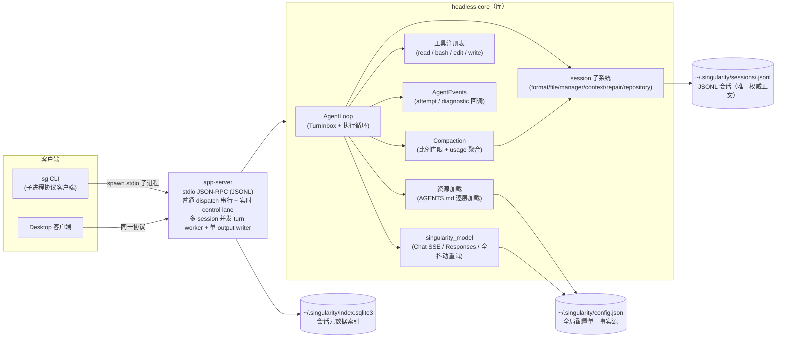
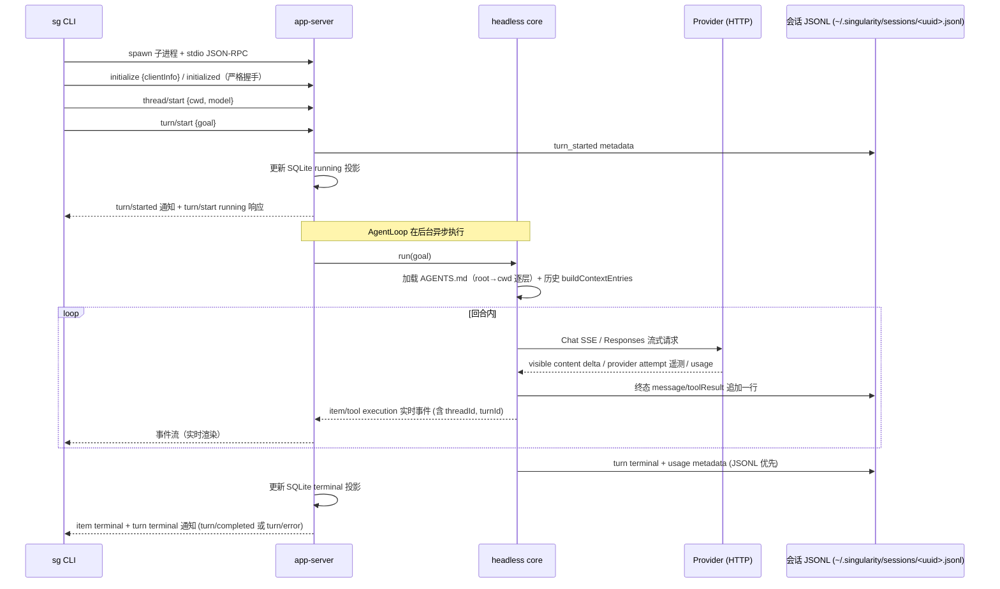
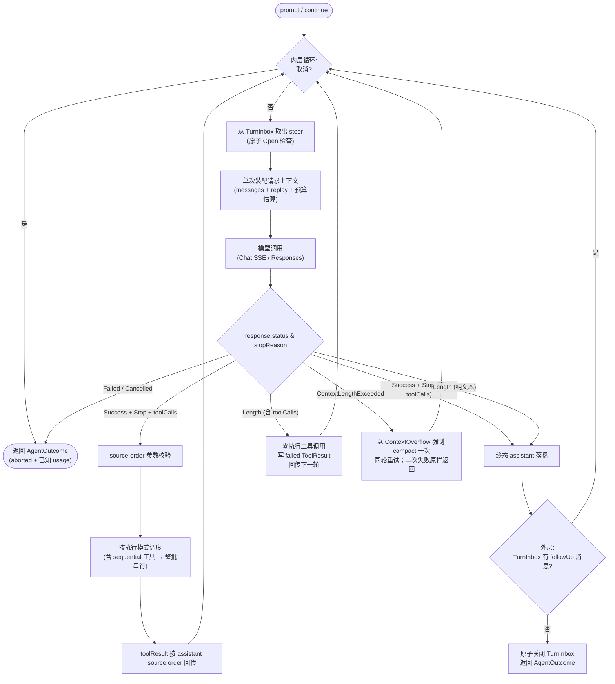
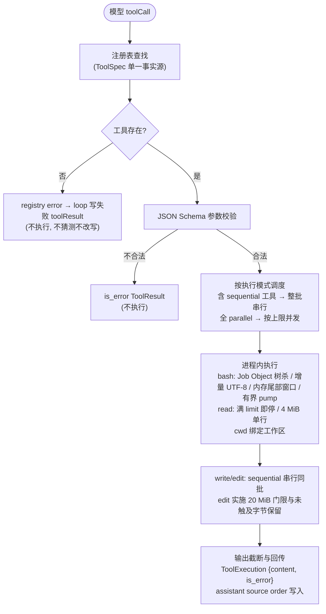
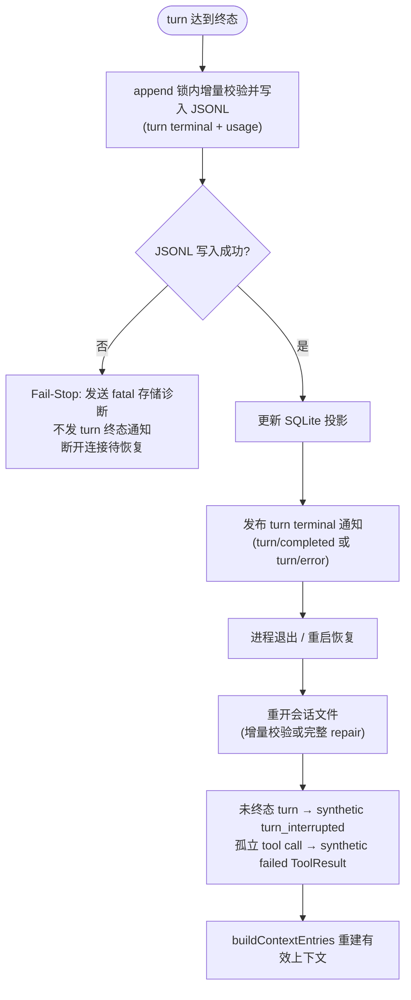
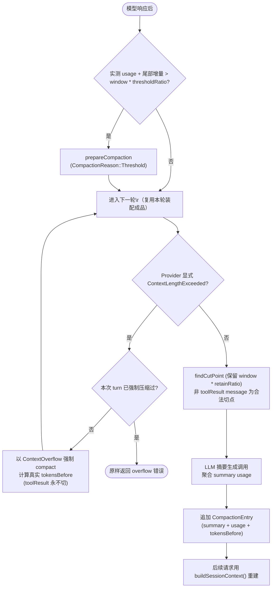
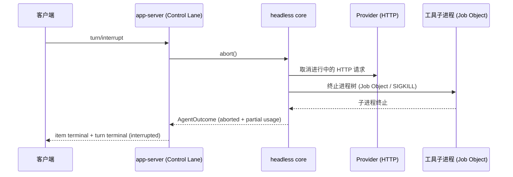

# Singularity 架构说明文档

> **本文档描述 Singularity 当前有效架构事实**，以当前源码与协议为权威依据。
>
> **维护规则**：修改以下任一事实时同步更新本文：进程边界、协议 transport/命令/事件、会话格式、Compaction、工具面与工具语义、Provider/模型能力声明、配置 schema、评估工具、发布二进制。

## 1. 总览与进程架构（图 a）

采用清晰的进程分层模式：单一 **headless core 库**（无进程/UI 假设）+ 瘦身 **app-server**（stdio JSON-RPC transport，单客户端连接可长驻，连接内支持多 session 并发 turn worker 与单 output writer）+ 全部客户端走同一协议。会话正文由 JSONL 持久化，SQLite 只保存轻量索引投影；运行时只保留当前连接所需的活动句柄和有界终态引用。关闭连接时广播执行停止，满队列输出会在停止信号下有界退出，所有 turn worker 在进程退出前由 transport 持有并 join。

- **headless core**：
  - `AgentLoop`（核心执行循环）：双层循环状态机，持有单一原子 `TurnInbox`、输入/终态事实聚合与诊断事件派发；
  - `session` 子系统：按职责划分为 `format`（严格 JSONL v1 格式与 schema 校验）、`file`（有界文件 I/O 与 JSONL 尾部解析）、`manager`（单写者生命周期与追加）、`context`（上下文条目与 LLM 投影）、`repair`（中断与孤立 tool call 修复）、`repository`（会话定位）；公开 API 由 `session/mod.rs` 保持稳定；
  - `Compaction`：上下文自动压缩引擎，以 `thresholdRatio` 与 `retainRatio` 控制切点；判定在每轮响应后基于 Provider 实测 usage（首轮/无 usage 时用装配成品估算兜底），聚合每次摘要調用的 Provider usage；
  - 工具系统：`ToolRegistry` 固定注册 `read`/`bash`/`edit`/`write` 四工具单一事实源，并声明各工具执行模式（read=parallel，bash/edit/write=sequential）；
  - 消息与事件流：`AgentEvents` 提供类型化、非裁决性的 Provider attempt 与诊断观察回调；
  - 资源加载：`AGENTS.md` root→cwd 逐层加载与角色适配；
  - `singularity_model`：按职责划分为 `types`（消息/工具/请求/响应/usage/reasoning）、`error`、`provider`（contract/runtime/telemetry）、`openai`（wire/chat/responses 适配）、`transport`（HTTP/retry/stream 解码）、`discovery` 以及整层原子选择的 `config`。
- **app-server**：
  - stdio JSON-RPC transport（16 MiB 帧上限、单一有界输出 writer、按序分发）；
  - 分离的执行管道：stdio frame reader 持续读取，普通状态请求由唯一 `AppServer` owner 串行处理，实时控制请求（`turn/interrupt`、`turn/steer`、`turn/followUp`）通过窄 control lane 即时派发到活动 turn 句柄；
  - `lifecycle`：`runner` 负责 turn worker 启动与事件桥接，`terminal` 负责 durable terminalization 与 fail-stop 终态收敛；
  - `state_paths`：SQLite 索引路径与 state 目录的解析、准备与安全校验（拒绝仓库内 home 与非安全路径）；
  - 命令/事件协议包含 thread/turn/item 生命周期、公开 history projection、settings、usage、`agent/diagnostic` 与 `provider/attempt` 遥测。
- **传输**：CLI 每次命令启动独立 **stdio app-server 子进程**；Desktop 可保持一个长驻 stdio 连接并在同一进程中执行多轮、并发运行不同 session 的 turn、切换设置、取消和重连。没有 TCP daemon、cursor/gap replay 或独立 Desktop UI。
- **客户端**：`sg` CLI（一次性 stdio 子进程客户端，支持信号拦截优雅中断与 JSON 事件类型化投影）；Desktop 接入复用同一协议、配置和会话。
- **共享事实**：`%USERPROFILE%\.singularity\config.json`（全局配置单一事实源）；`~/.singularity/auth.v1.json`（私有认证单文件，Unix 0600，Windows 继承目录 ACL）；会话 JSONL 为 `~/.singularity/sessions/<uuid>.jsonl`，SQLite 仅保存 `~/.singularity/index.sqlite3` 中的轻量索引。
- **依赖方向**：客户端只依赖协议层与 core；产品 crate 绝不依赖 evaluation。

（图 a：进程架构）

## 2. 主调用链（图 b）

`sg run <goal>` 完整链路：spawn 独立 app-server stdio 子进程 → 严格握手（initialize 仅 `clientInfo` 并拒绝未知字段 / initialized）→ `thread/start`（创建 `~/.singularity/sessions/<uuid>.jsonl` 并写入索引）→ `turn/start`（持久化 `turn_started` metadata 与 active 索引，立即返回 `Running` 状态响应）→ 后台 AgentLoop 运行 → core 逐层加载项目指令（root→cwd）与历史（buildContextEntries）→ provider 调用和工具事件（携带显式 `threadId` 与 `turnId`）实时流式回传客户端 → 终态消息、terminal metadata、usage 追加到 JSONL → SQLite 更新索引 → 发布 item/turn 终态通知（`turn/completed` 或 `turn/error`）。CLI 与客户端根据匹配的 `(threadId, turnId)` 等待终端通知以决定渲染与退出码。`sg continue` 和 Desktop 重连都通过索引定位并重开既有会话文件，继续操作追加新 turn。

（图 b：主调用链）

## 3. AgentLoop 循环（图 c）

双层循环状态机结构，内嵌单一原子 `TurnInbox`。内层每轮迭代：检查取消 → 从 `TurnInbox` 取出并清空 steer 消息注入上下文 → 单次装配本轮请求上下文（消息 + reasoning replay + 预算估算同一成品上完成）→ 模型调用（流式 assistant 消息）→ 根据 typed `stopReason`（`Stop` / `Length`）分支处理，并在响应后按实测 usage 判定压缩（见第 6 节）：
- 成功且含工具调用：按 source order 完成参数校验，按执行模式调度（批内含任一 sequential 工具则整批按模型原始顺序串行；全 parallel 则按 provider 并发上限分批并行），durable ToolResult 始终按 assistant source order 写入并回传；
- 成功无工具调用：持久化终态 assistant 消息；
- `stopReason=length` 截断：若为纯文本，持久化 partial text 与已知 usage 并形成正常终态；若截断响应包含 tool calls，**零执行任何工具调用**，为已解析调用写入模型可见的 synthetic failed ToolResult（`model output was truncated before the tool call completed`），交由下一模型轮次处理；
- 显式上下文溢出（`ContextLengthExceeded`）：以 `CompactionReason::ContextOverflow` 强制压缩一次并同轮重试；二次失败原样返回；
- 取消与错误：typed `ModelErrorKind::Cancelled` 规范化为携带已确认累计 usage 的 aborted 终态（标记 `usage_complete=false`）；其他错误保留真实 cause。

内层循环结束后进入外层：若 `TurnInbox` 仍有 follow-up 消息则继续内层，否则在同一临界区内原子关闭 inbox 并退出，返回携带累计 usage、`usage_complete` 和 typed terminal reason 的 `AgentOutcome`。

- **原子 TurnInbox**：统一维护 `Open`/`Closed` 状态与 steer/followUp 队列。关闭点前到达的输入必定被接受并执行；关闭点后到达的输入明确返回 rejected 错误，不存在“已接受但丢失”的中间竞态。
- **结构化诊断**：Compaction 非 Session 失败等非致命告警以 `AgentDiagnostic { severity, code, message }` 承载，经 `AgentEvent::Diagnostic` 投影为协议层 `agent/diagnostic` 事件；诊断投递为尽力而为，投递失败不改变轮次结果。不向 stderr 直接打印，不污染 Session JSONL。
- **事件出口与遥测**：AgentLoop 全部生命周期事件收敛为单一 `AgentEvent` 枚举，经唯一 `AgentEvents::on_event` 回调流式投递；除诊断外，事件投影失败立即中止本轮并丢弃当轮 provider 结果，错误经 `run` 返回。Provider attempt 开始与结束作为 `AgentEvent::ProviderAttempt` 投递，绑定真实 `model_turn_ordinal`，并在终态聚合 attempt/retry/latency summary，不产生持久化 transcript 垃圾。

（图 c：AgentLoop 循环）

## 4. 工具执行链（图 d）

模型 toolCall → 注册表查找（单一事实源 ToolSpec）→ source-order JSON Schema 参数校验 → 按执行模式调度：批内全部为 parallel 工具时按 provider 并发上限分批并发执行，批内含任一 sequential 工具（bash/edit/write）时整批按模型原始顺序串行 → 进程内工具继承宿主权限执行 → 工具自身完成输出截断/超时/进程树终止 → `ToolExecution {content, is_error}` 按 assistant source order 回传。**无 before/after hook**：校验失败返回 is_error 结果，注册层错误（如未知工具）由 loop 包装为失败的 toolResult，不终止整轮。

**工具面**：`ToolRegistry::new()` 只注册 `read`、`bash`、`edit`、`write` 4 个固定内建工具；无未注册工具，无动态工具开关、MCP 或扩展。工具 schema 见第 12.2 节。

**执行可靠性与资源边界**：

- **read**：收集满 `limit`（缺省 2000 行）即停止，不再扫描至 EOF 统计全文行数；保留单行 ≤ 4 MiB 与返回输出 ≤ 2000 行 / 50 KiB 限制；截断提示给出 `File continues; use offset=Z to continue.`；支持基于 1-indexed 行号的 `offset` 续读，不产生磁盘临时文件。
- **edit**：输入文件与 projected replacement 均实施 20 MiB 硬上限预检；无 `\r` 文件走零映射恒等快路径，含 `\r` 时仅对命中区做局部边界换算，不再构建全量映射表；仅在 normalized view 下查找唯一匹配并映射回原始 byte offsets，未修改的前缀与后缀字节 100% 原样保留；替换行尾风格优先沿用被替换区域、邻近上下文或文件多数派，平票回退 LF；patch 展示为仅围绕命中区的局部上下文 diff；保持直接 in-place 写入。
- **write**：直接 in-place 写入；声明为 sequential，含 write 的批按模型原始顺序串行。
- **bash**：
  - 缺省 `timeout_ms` 为 120000 ms，显式范围 `1..=600000` ms；
  - stdout 与 stderr 分别持有独立的增量 UTF-8 carry buffer，跨 chunk 保留未完成 code point，仅在各自真实 EOF 时替换最终残缺字节；
  - 输出仅保留内存尾部窗口：预览保留最后 2000 行 / 50 KiB，内部窗口上限为其两倍（100 KiB），超出窗口的更早输出即弃并在结果中标记截断；不写任何磁盘临时/spill 文件；
  - 输出读取线程有界停机：主子进程退出后最长 2s 排空宽限，超时（后台进程仍持管道写端）即截断并附信息标记 `[output truncated: a background process is still writing]`，线程必收敛；后台进程不受影响；
  - 进程树终止（D-004）：Windows 经 `JobObject` 封装模块以 `KILL_ON_JOB_CLOSE` 创建作业，子进程创建后立即绑定，其后代进程全部纳入作业范围；取消时整树 `TerminateJobObject`，句柄关闭兜底终止仍在运行的子孙进程；Unix 使用独立进程组发送 SIGKILL。
- **执行模式 contract**：每个 ToolSpec 声明 `supports_parallel`（read=true；bash/edit/write=false）。批内含任一 sequential 工具时整批按模型原始顺序串行执行；全部为 parallel 时按 provider 并发上限分批并发。默认契约 `max_parallel_tool_calls=1` 行为不变。

（图 d：工具执行链）

## 5. Session 持久化与恢复（图 e）

会话格式采用干净的 **version: 1** 格式：JSONL 严格线性序列，每个 entry 有 `id` 与 `timestamp`，条目的物理顺序即事实源顺序；不提供 branch/tree 语义，**不写 `parentId`**（旧格式文件作废硬切），重复 id、未知字段（含 `parentId`）与中间 header 一律严格拒绝。消息 role 仅包含 user / assistant / toolResult，另有 compaction 和不进入模型上下文的 metadata entry（`turn_started`、`turn_completed`、`turn_failed`、`turn_interrupted`、`thread_settings`、`usage`）。**会话 JSONL 是唯一持久事实源**。SQLite `session_index` 只保存 session_id/rollout_path/cwd/title/model/status/created_at/updated_at/token_usage 等轻量投影，不保存对话正文。

- **单写者追加**：一轮 turn 只打开一次 `SessionManager` 并独占贯穿全程（开始标记 → 对话 → 工具 → 压缩 → 终态 → 用量）；`activate_turn` 保证同一会话至多一个存活写者（D-005）。append 基于内存态直接校验（行长/文件字节/条目数）并落盘，不做跨写者增量尾部合并；会话重开与崩溃恢复仍走有界解析与 repair。
- **持久化发布次序与 Fail-Stop 合同**：终态发布顺序固定为 **durable JSONL metadata → SQLite 索引更新 → 公开终态通知**。当 turn terminal metadata 经有界重试后仍无法持久化时，**绝不发布任何虚假的 turn terminal event**；立即发出连接级致命存储诊断并终止 app-server 连接/进程，由重连后的 JSONL 恢复路径收敛状态。
- **崩溃恢复与 Orphan ToolResult**：重开文件时，未终态的 `turn_started` 追加 synthetic `turn_interrupted`；孤立的 assistant tool call 在文件尾部追加 synthetic failed ToolResult（`[previous execution outcome unknown; do not retry]`），绝不重新执行工具，保证 Provider 观察到的序列严格为 `assistant tool call → failed ToolResult → new user message`。

（图 e：Session 持久化与恢复）

## 6. Compaction（图 f）

上下文压缩算法与数据流设计：

- **触发与门限配置**：
  - `thresholdRatio`（默认 `0.90`）：当上下文估算达到 `contextWindow * thresholdRatio` 时触发压缩；
  - `retainRatio`（默认 `0.20`）：压缩后保留最近约 `contextWindow * retainRatio` 的上下文；
  - `summary.maxTokens`（默认 `8192`）：单次摘要请求的最大输出 token 上限；
  - 配置约束：必须满足 `0 < retainRatio < thresholdRatio < 1`，摘要上限必须为正且不超过模型输出能力，配置非法时 fail closed。
- **响应后判定**：压缩判定只发生在每轮模型响应之后——以 Provider 对上一请求的实测 usage 为基线，叠加响应后新增的尾部条目估算（从末尾反向累计至最近一条 assistant 消息）；首轮或 usage 缺失时以本轮装配成品的估算兜底。请求前不再做独立的全量重建判定；Provider 显式报 `ContextLengthExceeded` 时仍走强制恢复路径。
- **单次装配**：每个模型轮次的上下文（消息、reasoning replay 与预算估算）只装配一次，后续压缩判定与请求复用这一成品与装配时的条目界标。
- **显式 Reason 与真实 tokensBefore**：Compaction 执行时携带显式 `CompactionReason`（`Threshold` 或 `ContextOverflow`）；强制压缩（`ContextOverflow`）的持久化 `tokensBefore` 来自当前真实重建上下文估算，禁止写入控制哨兵值。
- **Usage 聚合**：每次用于生成摘要的 Provider 调用均计量并持久化其已知 usage；split-turn 产生的多次摘要调用全部计入 `CompactionEntry.usage` 并累加进当前 turn 总 usage。
- **切点与结构化摘要**：`findCutPoint` 从最新往回累积估计 token 直到满足 retention 预算，取其后最近合法切点（非 toolResult 的 message）；**toolResult 永不切**；有 previousSummary 时通过 UPDATE prompt 合并更新，文件操作记录跨多次压缩累积。
- **非致命告警**：后置自动 Compaction 的非 Session 失败（如 Provider 瞬时报错）通过 `AgentDiagnostic` 事件通知宿主并继续执行，不回滚已完成的对话轮次；Session 写入失败保持 fatal。

（图 f：Compaction 数据流）

## 7. 取消/中断传播（图 g）

`turn/interrupt` → app-server 实时 control lane → core `abort()` → 取消进行中的 Provider HTTP 请求 + 杀死工具子进程树 → 回合以 `interrupted` 终态收尾（已落盘条目保留，运行中未完成的工具只产生失败/未知说明，不补成功结果）。中断前工具已产生的 workspace 副作用不回滚。

（图 g：取消/中断传播）

## 8. Evaluation（外部黑盒评估）

评估系统是仓库外部的独立黑盒评估器，不作为产品内部子命令，也不包含在产品二进制发布中：

- **黑盒调用接口**：通过外部评估运行器黑盒调用 `sg run <goal> --model <model> --json`，严格禁止在评估器中依赖 Harness Rust 内部 crate。
- **任务集格式**：`task_id` + `workspace/`（测试项目）+ `instruction.md` + `checker.sh`。
- **流程与判定**：为每个评估 cell 准备干净 workspace 副本与独立 `SINGULARITY_HOME` → 子进程运行 `sg run --json` → 复制并脱敏 session rollout（剔除 private replay）→ 独立运行 `checker.sh` 判定（exit 0/1/2）→ 聚合指标生成 `results.json` 与 `cell.json`。turn 失败但 checker 通过时判 passed；checker 异常退出或超时判 failed；超时或崩溃杀死整棵进程树。

## 9. Provider 与模型

**静态能力声明与运行时元数据**：每个模型的能力（context window、max output、reasoning 档位、工具支持）按「用户配置顶层字段 > 内置模型表 > models.dev 目录元数据」三级解析，任一级命中即停，三级均未提供限额时配置捕获 fail closed（api_protocol 必须由用户显式声明）；目录元数据来自 models.dev api.json 的投影缓存 `~/.singularity/metadata-cache.json`（TTL 24h），捕获读路径只读该文件、缺失或过期时不填充且行为不变，仅在模型目录发现刷新成功后顺带重新拉取落盘，网络失败 fail-soft。模型发现作为运行时组件维护 `models-cache.json` + TTL 刷新的已发现模型目录（过期回落 Stale/Unavailable），发现负载中的坏条目按 fail-soft 跳过（响应级缺陷仍 fail closed）。context window 未声明时保留 `unknown` 元数据，执行时本地 compaction 预算以默认 128000 兜底。

- **Provider 协议适配**：
  - OpenAI Responses 协议：官方 OpenAI reasoning 模型通过 Responses wire 发送；
  - OpenAI Chat Completions 协议：支持规范化 SSE 流式传输，仅将按序 visible `content` delta 发送给 Agent，Provider 内部聚合 reasoning、tool-call fragments、usage 与 finish reason，产生与非流式完全一致的 `ModelTurnResponse`；任何 visible delta 发出后禁止自动重试该请求；
  - 支持保留的 vendor-specific Chat thinking wire 格式；
  - 工具选择仅保留 `Auto` 模式。
- **Typed Stop Reason 与截断处理**：
  - 模型响应规范化为 `stopReason`（`Stop`、`Length`）；`content_filter` 映射为 typed error；
  - 移除 `response_output_tokens_exceed_provider_limit` 响应有效性拦截门禁，Provider usage 纯粹作为 accounting 事实记录；请求侧 `max_tokens` / `max_output_tokens` 仍然严格受控。
- **重试策略与全抖动（Full Jitter）**：
  - 传输层单次 complete 最多 6 次 attempt（首次 + 最多 5 次重试），只重试网络/body 读取错误与 HTTP 408/429/5xx；
  - 优先遵守 `Retry-After`（ms/秒/IMF-fixdate）；缺失时采用 Full Jitter：从 `[0, min(60s, 500ms * 2^(retry_count-1))]` 均匀独立采样；等待过程可感知取消。
- **配置整层选择与 Fail Closed**：
  - 配置层实施原子、整层选择：任一 Provider 进程环境变量存在即选择完整 process layer，绝不与 user config 跨层逐字段合并；缺少必填项时直接 fail closed。
- **失败诊断**：失败投影稳定 typed 分类 + 脱敏真实错误文本，敏感信息降级为 `Internal error`，不暴露 API key 或原始凭据。

## 10. 配置与项目指令

**配置单一事实源**：`%USERPROFILE%\.singularity\config.json`（全局）+ 进程环境层（`SINGULARITY_MODELS_CONFIG` 等）；providers / models / 默认设置全部在此，CLI 与桌面端读同一文件。进程启动时捕获一次配置快照。私有认证文件为单一 `~/.singularity/auth.v1.json`，导入流程为写临时文件后同卷原子改名；Unix 上设为 0600，Windows 上继承目录 ACL。config 与 models 的模型条目不接受 `capabilities` 块，出现即按未知字段拒绝；能力以顶层字段为唯一权威。会话目录 `~/.singularity/sessions/`、索引 `~/.singularity/index.sqlite3` 与备份目录 `~/.singularity/backups/` 同理（Unix 0700/0600，Windows 继承目录 ACL）。

**资源加载**：`AGENTS.md` 逐层加载（root→cwd），无 trust 门控。按 root→cwd 顺序逐层收集项目指令文件 `AGENTS.md`，合并后经 developer→system→user role adaptation seam 注入，不修改 user goal；单文件 ≤ 32 KiB、合并总计 ≤ 64 KiB 预算，超预算按预算截断纳入前缀并向模型追加截断尾注，同时向客户端发 `agent/diagnostic`（warning, `project_instructions_truncated`）；真 I/O 错误仍使 turn/start 失败。无 override 或 sha2 额外结构。

## 11. 客户端与协议

**客户端**：`sg` CLI 是 app-server 协议客户端，每次命令 spawn 独立 stdio 子进程；Desktop 可保持同一连接长驻。CLI 命令：`sg run <goal>`（发起新回合）、`sg continue <session-id>`（重开既有会话继续）、`sg threads`（全部会话 + cwd）、`sg session read|delete`、`sg config`（doctor / models / import-env）。

**JSON-RPC 传输合同**（stdio JSON-Lines framing）：

- 每行一个完整 JSON 值；JSONL 只负责 framing，不改变 JSON-RPC 2.0 语义；单帧上限 16 MiB。
- 所有 envelope 带 `jsonrpc: "2.0"`，由互斥的 request / notification / success / error 表示；request id 只接受字符串或可精确表示的 JSON 整数；error envelope 不允许省略 `id`。
- **静默拒绝无 ID 请求**：Request-only method 作为无 id notification 到达时，**不产生任何副作用，且不发送任何 wire response**；Notification-only method 携带 id 时返回 typed error。
- **严格 Initialize**：`InitializeParams` 仅包含 `clientInfo`，使用 `deny_unknown_fields` 严格拒绝任何未知字段或旧版 capabilities，不增加协议版本协商。
- **双管道调度**：stdio reader 将消息分类为 ordinary request 与 realtime turn control。普通状态请求排入单 owner 队列按序处理；`turn/interrupt`、`turn/steer`、`turn/followUp` 通过共享活动 turn 句柄即时处理，不被耗时的普通请求阻塞。所有响应与事件统一通过单一有界 output writer 发送。
- **turn lane 就绪点**：`ready_for_turn` 在 initialize 请求处理完成（回执已写出）后置位，置位动作发生在 ordinary 处理任务内部、响应写出之后（同一任务内的先后序构成 happens-before）；客户端收到 initialize 回执即可立即发送 `turn/start` 进入流式 turn lane。`initialized` 通知继续把守 ordinary 门禁：initialize 与 initialized 均未完成前，落入普通管线的请求返回 not_initialized。
- **注册前置发布**：`turn/start` 仅在打开会话、构建 Provider/Agent、注册 steer/followUp 收件箱全部成功后，才落盘 `turn_started` 并发布 `turn/started` 与 running 响应；收到 `turn/started` 后立即 steer/followUp 必成功。准备阶段失败则 turn/start 直接回错误响应，不产生任何 turn 痕迹。
- **session/read 分页**：历史读取以 turn 为单位组织返回（`turns[]` + `totalTurns`），参数为 `cursor`/`limit`（1..=200）/`sortDirection`（asc|desc）/`detail`（summary|full）/`kinds`；不透明游标 `nextCursor`/`backwardsCursor` 支持双向翻页，无效或越界游标按 invalid params 拒绝；kinds 过滤先于分页（被过滤轮不占页配额），`turn` kind 命中轮次本身；页内轮次恒按会话顺序排列，首个 turn 标记前落盘的前导条目归入无身份前导组（turnId/status 为 null）。
- **终态与回执形态**：协议 `Turn` 只携带单一 `status`；`turn/interrupt` 回执直接给出目标终态 `interrupted`；`turn/steer`/`turn/followUp` 响应为 `TurnInjectionResult{turn}`；item 引用以 camelCase `itemId` 暴露；`tool/execution/end` 仅在 result 内保留一处 `isError`。
- **CLI 信号处理与优雅退出**：第一次收到 Ctrl+C 信号时，CLI 发送 `turn/interrupt` 请求，停止接收新输入，继续读取并排空 terminal events，等待 app-server 子进程有界退出并返回常规 interrupted 退出码；第二次 Ctrl+C 强制退出。
- **CLI Session Reference**：`sg run --session-reference <id>` 将历史会话投影为 untrusted reference 文本；每个生成段落（header、summary、transcript、role line、current-request heading）各占一行，未信任内容中的换行折叠为字面量 `⏎`，统一受控于 16 KiB 与 4096-token 硬上限。

**命令与事件集**：
- 命令：`initialize`、`initialized`、`agent/capability`、`thread/start`、`thread/list`、`thread/resume`、`thread/settings`、`session/read`、`session/delete`、`turn/start`、`turn/steer`、`turn/followUp`、`turn/interrupt`、`server/shutdown`；
- 生命周期与执行事件：`thread/started`、`turn/started`、`item/started`、`item/agentMessage/delta`、`item/completed`、`item/failed`、`turn/completed`、`turn/error`、`tool/execution/start`、`tool/execution/update`、`tool/execution/end`；
- 遥测与诊断事件：`agent/diagnostic`（结构化非致命告警）、`provider/attempt`（类型化 attempt 进度）、`provider/attempt/summary`（终态聚合）。

## 12. 技术细节速查

### 12.1 脱敏与工具输出合同

- 工具执行结果是 `ToolExecution {content: String, is_error: bool}`，追加为会话 `toolResult` message 后按原样进入 LLM 上下文（role `tool` + tool_call_id），并在公开 history 中投影为带 `isError` 的 `tool_result` item；没有把流式 delta 永久化为独立事件。
- bash 对流式输出做控制字符过滤（保留 `\t`/`\n`/`\r`），预览保留最后 2000 行 / 50 KiB；完整输出仅保留内存尾部窗口（100 KiB 上限，超出即弃并标记截断），不写磁盘临时文件。read 收集满 `limit`（缺省 2000 行）即停、不扫描至 EOF，单行 ≤ 4 MiB，输出 ≤ 2000 行 / 50 KiB，超限提示 `File continues; use offset=Z to continue.`，不写临时文件。edit 实施 20 MiB 输入与输出上限，无 `\r` 时零映射恒等、含 `\r` 时仅对命中区局部换算并产出局部上下文 diff，未触及字节 100% 保持原样。
- 工具结果文本不包含 provider 原始响应；raw tool arguments 仅存在于 assistant 的 `tool_call` 内容块及工具生命周期事件中。密钥边界由 provider 错误脱敏承担。

### 12.2 工具 schema

| 工具 | schema | 语义要点 |
| --- | --- | --- |
| read | `{path, offset?, limit?}` | 文本文件有界读取；单行 ≤ 4 MiB，输出 ≤ 2000 行 / 50 KiB；收集满 limit（缺省 2000 行）即停，超限提示 `File continues; use offset=Z to continue.`，不写临时文件；offset 1-indexed，limit 上限 2000 |
| bash | `{command, timeout_ms?}` | 缺省 `timeout_ms` 120000；显式 integer `1..=600000`；预览保留最后 2000 行 / 50 KiB，完整输出仅保留内存尾部窗口（100 KiB，超出标记截断）；输出 pump 有界（主进程退出后 2s 排空宽限，后台进程持管道时标示截断）；Windows Job Object（KILL_ON_JOB_CLOSE + 子进程创建后立即绑定）/ Unix 进程组终止整树 |
| edit | `{path, oldString, newString}` | 单次精确文本替换（唯一匹配，否则 is_error）；20 MiB 大小上限；无 `\r` 零映射恒等、含 `\r` 仅命中区局部换算；未触及字节原样保留；保持行尾风格；返回局部 diff / firstChangedLine；in-place 写入 |
| write | `{path, content}` | 写文件（新建或覆盖）；in-place 写入；sequential 工具，所在批按模型原始顺序串行 |

### 12.3 会话落盘细节

- 流式期间的消息 delta 不落盘；终态 user/assistant/toolResult/compaction 消息各追加一行，turn lifecycle/settings/usage 作为 metadata 追加到同一 JSONL。
- turn 启动时当前 user 消息立即写盘（先于第一次模型请求），进程崩溃后重开会话可看到该 user 消息。
- `turn_started` 在 SQLite active 投影和 `turn/started` 通知之前写盘；terminal metadata 与 usage 在 SQLite 终态投影和终态通知之前写盘。assistant tool-call 消息与其 toolResult 配对写盘；崩溃造成孤立 tool call 时，可写恢复路径先补 synthetic failed ToolResult（unknown / do not retry），不重写原条目、不重新执行工具。metadata 永远不进入模型 context。

### 12.4 错误码与错误合同

- JSON-RPC 标准错误码（`-32700` / `-32600` / `-32601` / `-32602` / `-32603`）与“不回显原始输入”合同见第 11 节。
- 项目级错误码由 core 定义（`ErrorCode`），具体清单以协议层当前类型和错误映射为准。

### 12.5 维护规则与验证

- 本文与真实架构同步维护（见头部维护规则）。
- 验证按变更风险选择：纯文档、决策记录或提示词修改检查最终内容、链接并运行 `git diff --check`；代码、协议、持久化、并发、安全或 Provider 变更再按影响范围运行定向测试、构建检查和必要的真实链路验证；完整 workspace 检查或 Evaluation 不是默认门禁。
- 影响 AgentLoop / provider / 工具 / 会话 / compaction 时，通过 `sg → app-server → core` 产品链核对链路。

## 13. 当前维护边界

- 本文只描述当前有效的进程边界、协议、会话格式、AgentLoop、Compaction、工具语义、Provider 能力声明、配置和评估入口。
- 已移除机制、迁移过程、阶段状态和历史提交由 Git 保存，不在架构事实源中维护。
- 修改上述任一事实时，必须同步更新对应章节并运行受影响的静态、定向和真实链路验证。
