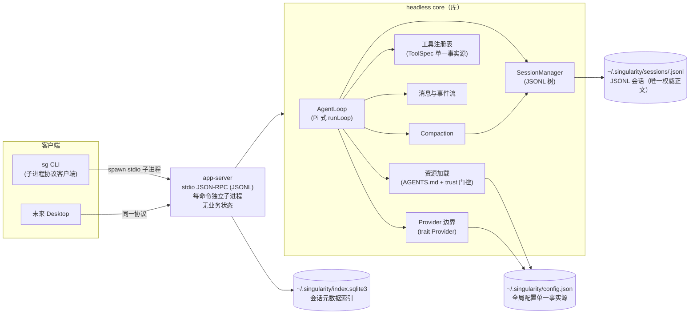
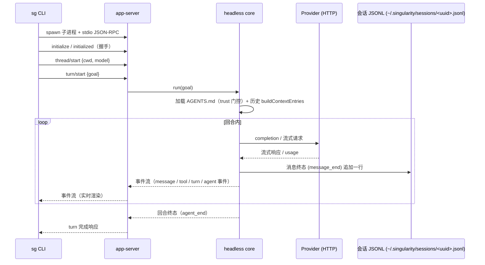
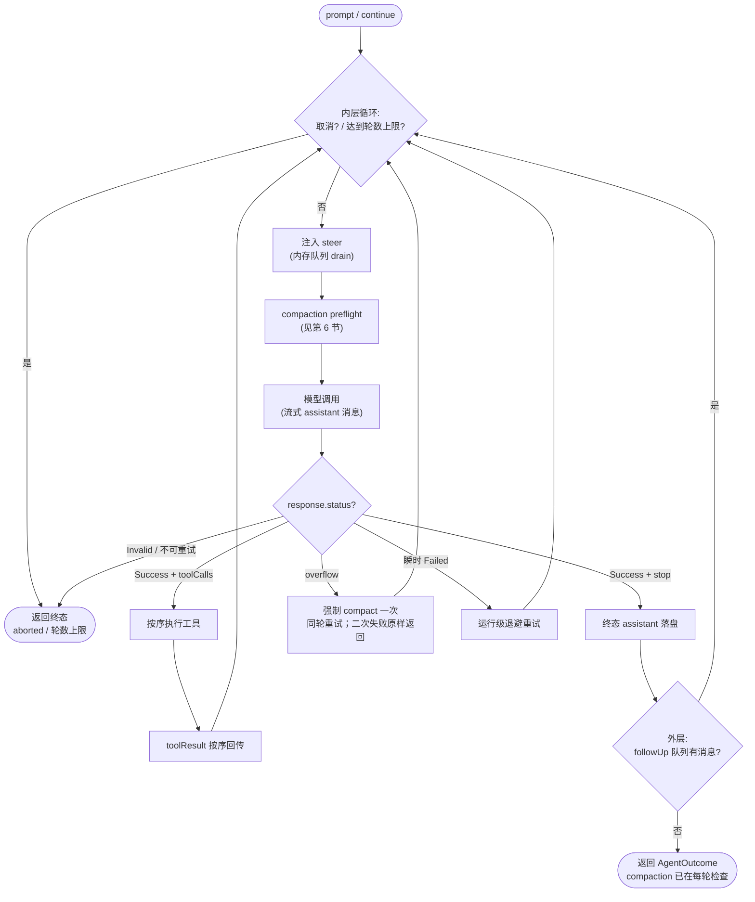
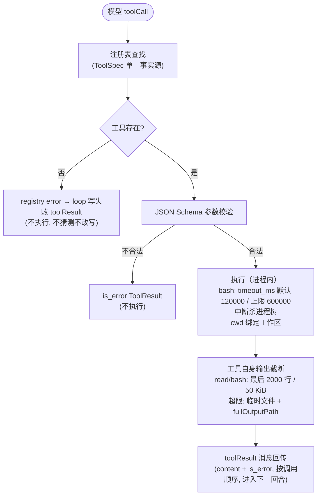
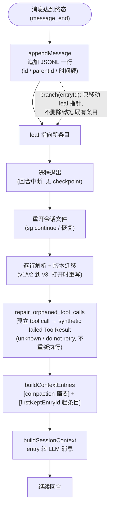
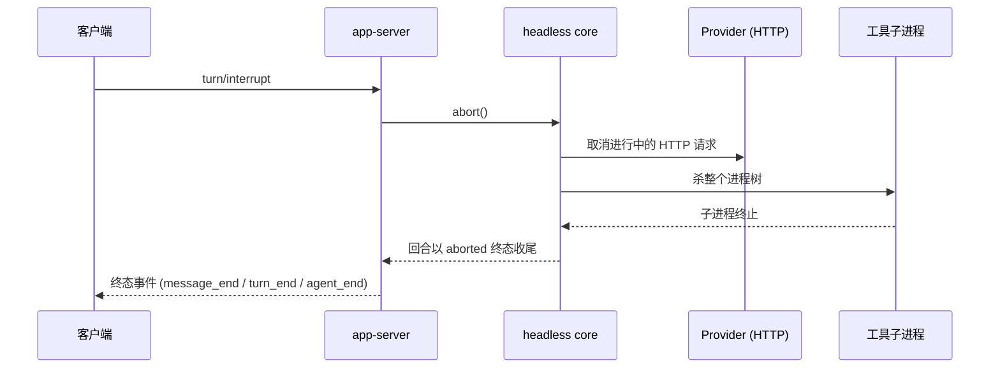

# Singularity 架构（当前实现）

> **本文档描述当前有效架构**，与 `origin/main` 源码一致；技术细节对照 Pi v0.84.1 一手源码核查记录（`outputs/arch-review/01`、`02`）与当前源码。已移除机制的细节不展开，见附录 A；历史实现由 Git 保存。
>
> **维护规则**：修改以下任一事实时同步更新本文：进程边界、协议 transport/命令/事件、会话格式、Compaction、工具面与工具语义、Provider/模型能力声明、trust 决策、配置 schema、评估工具、发布二进制。

## 1. 总览与进程架构（图 a）

采用 Codex 进程模式：单一 **headless core 库**（无进程/UI 假设）+ 瘦身 **app-server**（stdio JSON-RPC transport，每命令独立子进程，连接内单 worker 顺序处理，无业务状态）+ 全部客户端走同一协议。业务状态（历史、输入组装、工具装配、trust 决策）全部下沉到 core。

- **headless core**：AgentLoop（Pi 式 runLoop）、SessionManager（JSONL 树）、Compaction、工具注册表（ToolSpec 单一事实源）、消息与事件流、资源加载（AGENTS.md + trust 门控）、Provider 边界（trait Provider）。
- **app-server**：JSON-RPC（JSONL framing）；命令/事件协议收敛为 Pi RPC 级命令集 + 事件流；无 7 态 Turn、无 trace 合同、无 cursor/gap/背压/全局排序、无 16-worker 池。
- **传输**：CLI 每次命令启动独立 **stdio app-server 子进程**（JSON-Lines），无 TCP daemon、无连接复用、无空闲自停；未来 Desktop 可嵌入 core 或经同一协议启动 stdio 子进程。
- **客户端**：`sg` CLI（一次性 stdio 子进程客户端）；未来 Desktop 同协议、同配置、同会话。
- **共享事实**：`%USERPROFILE%\.singularity\config.json`（全局配置单一事实源）；`~/.singularity/auth.v1-*.json`（私有认证文件，owner-only ACL）；会话 JSONL 为 `~/.singularity/sessions/<uuid>.jsonl`，SQLite 仅保存 `~/.singularity/index.sqlite3` 中的轻量索引。
- **依赖方向**：客户端只依赖协议层与 core；产品 crate 不依赖 evaluation。

（图 a：进程架构）

## 2. 主调用链（图 b）

`sg run <goal>` 完整链路：spawn 独立 app-server stdio 子进程 → LSP 式握手（initialize/initialized）→ `thread/start`（创建 `~/.singularity/sessions/<uuid>.jsonl` 并写入索引）→ `turn/start`（goal 交给 core）→ core 加载项目指令（trust 门控）与历史（buildContextEntries）→ AgentLoop 运行 → provider 调用 → 事件实时回传客户端 → 消息终态追加到会话 JSONL → 索引更新状态与 usage。`sg continue` 通过索引定位并重开既有会话文件，走同一条链。

（图 b：主调用链）

## 3. AgentLoop 循环（图 c）

Pi 式双层循环（裁决 4/9）。内层每轮迭代：检查取消与轮数上限 → drain steer 队列注入 user 消息 → compaction preflight → 模型调用（流式 assistant 消息）→ 仅 `Success` 响应执行工具并把 toolResult 按序回传 → 进入下一轮；无 toolCall 的 `Success` 响应持久化终态 assistant 消息。内层退出后进入外层：drain followUp 队列，仍有消息则继续内层，否则返回聚合结果。

- **steer / followUp 是内存队列**（裁决 9）：纯内存投递，进程退出即丢；不持久化、无幂等键。steer 在工具执行完成后、下一次模型调用前注入；followUp 在 agent 即将停止时注入。
- **模型失败语义**：`Success` 才持久化 assistant 消息或执行工具；`Failed` 且为瞬时类错误做运行级重试（首次 + 最多 4 次，2s/4s/8s/16s 退避）；`Invalid` 直接失败。显式上下文溢出（`ContextLengthExceeded`）强制压缩一次后重试同一轮（见第 6 节），第二次失败按原错误返回。
- 停止条件：无工具调用的成功 assistant 响应；外部取消（aborted，不视为模型错误）；达到 `max_turns` 上限；模型错误或会话错误直接返回。

（图 c：AgentLoop 循环）

## 4. 工具执行链（图 d）

模型 toolCall → 注册表查找（单一事实源 ToolSpec）→ JSON Schema 参数校验 → 执行（进程内，继承进程权限，无 workspace containment）→ 工具自身完成输出截断/超时/进程树终止 → `ToolExecution {content, is_error}` 按调用顺序回传。**无 before/after hook**：校验失败返回 is_error 结果，注册层错误（如未知工具）由 loop 包装为失败的 toolResult，不终止整轮。

**工具面（裁决 3，对齐 Pi）**：`ToolRegistry::new()` 只注册 read/bash/edit/write；文档不再声明未注册的 grep/find/ls。工具 schema 见第 12.2 节。

**执行可靠性（裁决 5，对齐 Pi，实测调整）**：

- 超时：bash 缺少 `timeout_ms` 时使用 120000 ms；显式值必须是 integer 1..=600000，上限 600000 ms。
- 输出截断：保留最后 2000 行 / 50 KiB，超限写入临时文件并返回 fullOutputPath。
- 中断：abort 信号杀死整个进程树。
- 工作目录绑定会话/任务工作区。
- 不实现并发修改检测（Pi 没有；遇到真实覆盖冲突场景再按需加）。

（图 d：工具执行链）

## 5. Session 持久化与恢复（图 e）

会话格式语义对齐 Pi（裁决 10）：JSONL 树（v3），每个 entry 有 `id` 与 `parentId`（带时间戳），七类消息 role（user / assistant / toolResult / bashExecution / custom / branchSummary / compactionSummary），compaction entry，打开时 v1/v2→v3 迁移（迁移即重写文件）。存放于 `~/.singularity/sessions/<uuid>.jsonl`（header UUID 即 session id），迁移旧项目 `.singularity/agent-sessions/` 时先备份到 `~/.singularity/backups/` 并校验。**会话 JSONL 是唯一持久事实源**：无 checkpoint；进程退出即中断，重开会话即继续，可写重开时对崩溃遗留的孤立 tool call 补 synthetic failed ToolResult（不重新执行工具）。SQLite `session_index` 只保存 session_id/rollout_path/cwd/title/model/status/created_at/updated_at/token_usage，不保存对话正文。

- 落盘时机：turn 启动先把当前 user 消息追加 JSONL；随后只有终态 assistant/toolResult/compaction 消息追加 JSONL，流式 delta 不落盘。进程崩溃时已追加的 user/assistant tool-call 条目保留，不存在的回合不写入状态。
- 追加即推进 leaf；**分支只移动 leaf 指针**，不删除、不改写既有条目。
- 恢复：重开文件 → 逐行解析 + 版本迁移 → `repair_orphaned_tool_calls`（有 tool_call_id 但无后续 ToolResult 的 assistant 条目，追加 synthetic failed ToolResult：`[previous execution outcome unknown; do not retry]`；不重写/删除原条目、绝不重新执行工具）→ `buildContextEntries`（取路径中最近 compaction entry：`[compaction 摘要]` + `firstKeptEntryId` 起的原始条目；被总结的旧条目从 context 省略但保留在文件）→ `buildSessionContext` 转 LLM 消息。
- 事件条目不进 context（custom / label / model_change / thinking_level_change / session_info 只作树内记录）。
- `session_index.status` 只表示最近一次 turn 的展示状态（active/completed/failed/interrupted）；`sg continue`/resume 不改变它，继续成功与否由真实 JSONL 内容决定。

（图 e：Session 持久化与恢复）

## 6. Compaction（图 f）

对齐 Pi 算法（裁决 10 目标数据流），并叠加 Phase F 的 preflight 与显式 overflow 兜底：

- **触发**：每次模型请求前先做 preflight：估算 `系统/开发者指令 + 会话消息 + tool schema + max_output_tokens + 32 token 开销`，超过 context window 则先压缩并在压缩后仍超窗时 fail closed。每次成功的模型响应后，`maybe_compact` 用 `contextWindow − reserveTokens(16384)` 判定；contextTokens 取最近有效 assistant usage 的 totalTokens + 其后的消息估算，无可用 usage 时全量估算（字符 UTF-16 长度/4）。
- **显式溢出兜底**（裁决 8）：provider 以 `ContextLengthExceeded` 显式报溢出（流式错误或 Failed 响应）时，强制 compaction 一次（`keepRecentTokens=0` / `reserveTokens=0`，toolResult 仍不切）并重试同一轮；第二次溢出按原错误返回，不无限压缩。失败请求未持久化 assistant/error/length 消息，因此无需移除尾部消息。
- **切点**：`findCutPoint` 从最新往回累积估计 token 直到达到 keepRecentTokens(20000)，取其后最近合法切点；合法切点 = 非 toolResult 的 message（user / assistant / bashExecution / custom / branchSummary / compactionSummary），**toolResult 永不切**（必须跟随其 tool call）；split turn 时摘要范围回到该 turn 起点。
- **摘要**：结构化摘要 prompt（serializeConversation 序列化，tool result 截断 2000 字符）；摘要系统指令与普通请求共用 developer→system→user role adaptation seam；有 previousSummary 时用 UPDATE prompt 合并更新；文件操作（read/modified 列表）跨多次压缩累积；摘要调用是一次性 prompt，不写缓存，provider 传输层重试负责可重试网络错误。
- **落盘与重建**：追加 CompactionEntry（summary + firstKeptEntryId + tokensBefore + previousSummary + 文件操作 details）→ 每次请求通过 `buildSessionContext()` 重建消息，session 内存态不保留旧上下文 → **原始历史保留**（JSONL 与文件条目不变）。
- **降级**：post-response compaction 的摘要生成失败（provider/无效响应）记录后跳过，不丢弃已完成轮次；会话写入错误仍传播。
- **二次压缩**：从上一次 compaction 的 firstKeptEntryId 起，之前保留的消息再次进入总结范围；previousSummary 走 UPDATE 合并；最新 context 条目已是 compaction 时不重复压缩（两次压缩之间必须有新消息）。

（图 f：Compaction 数据流）

## 7. 取消/中断传播（图 g）

`turn/interrupt` → app-server → core `abort()` → 取消进行中的 provider HTTP 请求 + 杀死工具子进程树 → 回合以 aborted 终态收尾（已落盘条目保留，运行中未完成的工具不补成功结果）。中断前工具已产生的 workspace 副作用不回滚（照 Pi：取消不宣称回滚副作用）。

（图 g：取消/中断传播）

## 8. Evaluation（图 h）

轻量回归评估工具（裁决 2），独立于产品 crate（不进入产品协议与发布包）：

- **任务集**（通用格式）：task_id + `workspace/`（几百~1000 行项目，含测试）+ `instruction.md` + `checker.sh`。
- **执行规模**：3 题 × 2 模型 = 6 cell 全并行（用户裁决：一次 3 题防供应商并发限流；模型组：opencode-go/deepseek-v4-flash#max、longcat/LongCat-2.0#high；题集为高难度替换题：warehouse-audit / billing-calc / cache-ttl）。
- **流程**：准备干净 workspace 副本（含 checker.sh）→ 子进程跑 `sg run --json`（**真实产品链路，禁止 fake/mock**；每 cell 均为独立 stdio 子进程）→ 收集会话文件（rollout）→ 独立运行 checker.sh（exit 0 = 通过；**绝不采信 agent 自报**；300s 超时防挂死）→ 从 rollout + usage 聚合指标。
- **判分语义**：turn 失败但 checker 通过时判 passed（workspace 状态是客观证据）；checker 输出经读取线程边读边同步捕获（孙进程持管道不 EOF 也能拿到已读部分）。
- **指标**：通过/失败/部分得分；中断/崩溃/超时；总时长；token 总量；缓存命中率；成本估算；耗时拆解；工具调用数；工具失败数；重复动作。
- 每次 harness 改动后重跑，指标按模型分组对比。

（图 h：Evaluation 产品链）

## 9. Provider 与模型

**静态能力声明**（裁决 8）：删除 capability probe 体系；每个模型静态声明能力（context window、max output、reasoning 档位、工具支持），来源为内置模型表 + 用户 models/config 覆盖；不做网络探测或能力协商。context window 未声明时保留 `unknown` 元数据，执行时本地 compaction 预算以默认 128000 兜底。显式溢出重试兜底见第 6 节。

- **Provider 边界**：`trait Provider`；保留 OpenAI-compatible 双协议 adapter（Chat Completions / Responses），同一请求对象投影两条 wire 路径，共用请求校验、重试、响应归一化；`finish_reason=length`/`content_filter` 作为未完成响应 fail closed。
- **usage 记账**：每次调用回传 input/output/total、cached input、reasoning token 与 cost（含 cached_input_tokens/cost 字段），供评估指标与诊断使用。成本按 `(input − cached)×input价 + cached×cache价 + output×output价` 计（input 已含缓存命中，命中部分按 cache 价）。
- **重试（两层）**：传输层单次 complete 最多 6 次 attempt（首次 + 最多 5 次重试），只重试可重试的网络/timeout/body 读取错误与 HTTP 429/5xx；backoff 以 50 ms 为基数逐次翻倍，每次等待检查取消。**运行级**（agent 层）在传输层耗尽后对瞬时类错误（NetworkError/RateLimited/ProviderOverloaded + 瞬时文本信号）整轮至多 5 次尝试（首次 + 4 次重试，2s 指数退避 2/4/8/16s，可取消）；取消/挂起超时/认证/限额/校验/上下文溢出不重试。
- **思考档位**：每模型显式声明 reasoning 档位；Chat 与 Responses 分别按各自 wire 合同发送对应字段。
- **失败诊断**：失败投影稳定 typed 分类（阶段、transport 类别、HTTP status、校验码等）+ 脱敏后的真实错误文本（敏感内容降级为 `Internal error`，不包含 API key、endpoint 原始请求/响应）；错误保留真实因果差异，不靠字符串匹配驱动控制流。
- **配置校验**：配置值在本地信任边界完整校验，fail closed，不静默 trim/纠正；错误不携带原始值；API key 只通过配置引用的环境变量名解析，不进入会话/日志。

## 10. 配置与信任

**配置单一事实源**：`%USERPROFILE%\.singularity\config.json`（全局）+ 进程环境层（`SINGULARITY_MODELS_CONFIG` 等）；providers / models / 默认设置全部在此，CLI 与桌面端读同一文件。进程启动时捕获一次配置快照。私有认证文件 `~/.singularity/auth.v1-*.json` 以 owner-only ACL 校验。会话目录 `~/.singularity/sessions/`、索引 `~/.singularity/index.sqlite3` 与备份目录 `~/.singularity/backups/` 均 owner-only。

**trust 决策（裁决 7）**：对齐 Pi——陌生项目 ask / always / never；决策持久化到信任存储（CLI 显式覆盖 → 是否存在项目资源 → 信任存储 → 默认策略 → 交互选择）。**不信任的项目不加载项目指令、技能与扩展**。cap-std 路径硬化（nofollow capability 绑定）已删除。

**资源加载**：按 root→cwd 顺序逐层收集项目指令文件（每层优先 AGENTS.override.md，否则 AGENTS.md），合并后经 developer→system→user role adaptation seam 注入，不修改 user goal；单文件 ≤ 32 KiB、合并总计 ≤ 64 KiB；来源与 aggregate SHA-256 作为内部校验事实。

## 11. 客户端与协议

**客户端**：`sg` CLI 是 app-server 协议客户端，每次命令 spawn 独立 stdio 子进程。CLI 命令：`sg run <goal>`（发起新回合）、`sg continue <session-id>`（重开既有会话继续）、`sg threads`（全部会话 + cwd）、`sg session read|delete`、`sg config`（doctor / models / import-env）、`sg trust`、`sg eval`。`sg turn status/pause/resume/input` 与 `thread/read/fork/archive/delete` 已删除。未来 Desktop 嵌入 core 或走同一 stdio 协议。

**JSON-RPC 传输合同**（stdio JSON-Lines framing）：

- 每行一个完整 JSON 值；JSONL 只负责 framing，不改变 JSON-RPC 2.0 语义。
- 所有 envelope 带 `jsonrpc: "2.0"`，由互斥的 request / notification / success / error 表示；request id 只接受字符串或可精确表示的 JSON 整数，`null` 仅用于服务端无法关联合法请求时的 response/error id；error envelope 不允许省略 `id`；响应按解析后的合法 id 关联。
- 错误码：`-32700`（解析失败）、`-32600`（无效请求）、`-32601`（未知方法）、`-32602`（无效参数）、`-32603`（内部错误）；标准错误不回显原始输入或内部诊断，`data` 仅允许显式脱敏内容。
- batch 没有 stdio 消费者；transport 对 batch frame 直接返回 `-32600` 拒绝。
- 方法注册表（method 名、params/result schema）是命令合同的唯一事实源。

**命令/事件集（当前实现）**：initialize/initialized、server/capabilities、thread/start、thread/list、thread/resume、session/read、session/delete、turn/start、turn/steer、turn/followUp、turn/interrupt、agent/capability、project/trust、server/shutdown。turn/steer 与 turn/followUp 只作用于运行中的 turn，投递时无活动 turn 或 turn 已终态返回 not found。`session/read` 有界解析并默认返回摘要 + 最近 20 条路径条目，不返回全文；CLI 的 `查看会话 <id>`/`session:<id>` 只把该结果投影为 untrusted reference material（仅 user/assistant/toolResult 字符串文本，带来源 id、non-instructional 声明、16 KiB/4096 token 硬上限），当前请求用独立 `CURRENT REQUEST` 边界分隔。实际发出的事件为 thread/started、turn/started、item/started、item/agentMessage/delta、item/failed、turn/completed；`item/completed` 类型在协议中保留但当前 loop 不发（第一段 delta 只发 started）。**会话 JSONL 是唯一持久记录**。

**客户端失败语义**：CLI 用 typed params/result 与 JsonRpcId 关联请求，只把 matching response 之前的 notification 与 response 关联；EOF、子进程退出、超时、非法 envelope 与 JSON-RPC error 均为非零退出；客户端事件投影只含安全字段，不泄露 raw payload。

## 12. 保留的技术细节

### 12.1 脱敏与工具输出合同

- 工具执行结果是 `ToolExecution {content: String, is_error: bool}`，追加为会话 `toolResult` message 后按原样进入 LLM 上下文（role `tool` + tool_call_id）；没有结构化 `ToolResult`/`preview` 投影层。
- bash 对流式输出做控制字符过滤（保留 `\t`/`\n`/`\r`），并按 tail 规则截断（最后 2000 行 / 50 KiB）；read 单行 ≤ 4 MiB、单次扫描 ≤ 64 MiB 且同样按 tail 规则截断。超限内容写入工作区临时文件并通过 `fullOutputPath` 文本标记返回，不向模型发送原文件内容。
- 工具结果文本不包含 provider 原始响应；raw tool arguments 只存在于会话 assistant 条目的 `args` 字段，用于重建合法的 assistant tool_calls 续接，不进入错误正文。保护路径与密钥边界由 write/edit/read 的路径拒绝规则与 provider 错误脱敏承担，不做统一的全文本 secret 扫描。

### 12.2 工具 schema（对齐 Pi）

| 工具 | schema | 语义要点 |
| --- | --- | --- |
| read | `{path, offset?, limit?}` | 文本文件有界读取（非图片）；单行 ≤ 4 MiB，单次扫描 ≤ 64 MiB；输出 tail 截断 2000 行 / 50 KiB，超限写临时文件并返回 fullOutputPath；offset 1-indexed，limit 自动 clamp 到 2000 |
| bash | `{command, timeout_ms?}` | 缺省 `timeout_ms` 使用 120000；显式 schema 为 integer `1..=600000`，负数/浮点/字符串/null/溢出为 typed 参数错误；输出截断最后 2000 行/50 KiB，超限写临时文件并返回 fullOutputPath；含 exitCode；abort 杀进程树（Unix 独立进程组） |
| edit | `{path, oldString, newString}` | 单次精确文本替换（唯一匹配，否则 is_error）；保留行尾风格；结果含 diff / firstChangedLine |
| write | `{path, content}` | 写文件（新建或覆盖） |
| grep / find / ls | 不实现 | 当前 `ToolRegistry::new()` 只注册 read/bash/edit/write；可选只读工具面未注册 |

### 12.3 会话落盘细节

- 流式期间的消息 delta 不落盘；终态 user/assistant/toolResult/compaction 消息各追加一行。
- turn 启动时当前 user 消息立即写盘（先于第一次模型请求），进程崩溃后重开会话可看到该 user 消息。
- assistant tool-call 消息与其 toolResult 配对写盘；崩溃造成孤立 tool call 时，可写恢复路径先补 synthetic failed ToolResult（unknown / do not retry），不重写原条目、不重新执行工具。

### 12.4 错误码与错误合同

- JSON-RPC 标准错误码（`-32700` / `-32600` / `-32601` / `-32602` / `-32603`）与"不回显原始输入"合同见第 11 节。
- 项目级错误码由 core 定义（`ErrorCode`），具体清单随协议收敛（Phase 2/6）定稿。

### 12.5 维护规则与验证

- 本文与真实架构同步维护（见头部维护规则）。
- 收口验证命令：`cargo fmt --all -- --check`、`cargo check --workspace --all-targets --all-features --locked`、`cargo clippy --workspace --all-targets --all-features --locked --no-deps -- -D warnings`、`cargo test --workspace --all-targets --locked --no-fail-fast`、`git diff --check`。
- 影响 AgentLoop / provider / 工具 / 会话 / compaction 时，通过 `sg → app-server → core` 产品链跑一次真实 Provider 任务核对链路。
- 评估铁律（裁决 2）：harness 链路验证必须真实模型调用，禁止 fake/mock；mock 只允许于纯逻辑单元测试（解析、切点算法等与链路行为无关处）。

## 附录 A：已移除机制清单

以下机制已从目标架构移除（裁决详见 `outputs/arch-review/00-decision-baseline.md`；历史实现由 Git 保存）：

| 机制 | 裁决 | 去向 |
| --- | --- | --- |
| checkpoint 体系（TurnCheckpoint / ApprovalCheckpoint、resume epoch、tool_executions unknown 归约、v5–v8 codec） | 1 | 无 checkpoint；会话 JSONL 为唯一持久事实源 |
| SQLite 消息/历史存储（v13 schema 的 threads/turns/items 表、workspace execution guard） | 1/6 | 消息事实源改为 JSONL 会话；SQLite 收敛为 `session_index` 轻量索引（`crates/store`） |
| trace 体系（TraceEvent / typed span / TransportTraceSink、trace/list\|show\|tail\|metrics 方法） | 6 | 删除；会话文件即完整记录，事件流为实时输出 |
| 16-worker 请求池、控制/事件双队列、cursor/gap、输出全局排序 | 4 | 单 worker 顺序处理 |
| capability probe 体系（约 3236 行 negotiation + 持久化缓存） | 8 | 静态能力声明 |
| 旧 Evaluation（task_set v6 / result v9 / evidence v4、三维 gate、source-template cache、publication） | 2 | 轻量回归工具（第 8 节） |
| 旧工具面 read/list/grep/patch/command 及 patch 原子发布 / WorkspaceContentRevision | 3 | Pi 工具面 read/bash/edit/write（+可选只读集） |
| 项目指令 cap-std nofollow 硬化（capability 绑定、nlink / handle-relative 校验） | 7 | trust + 简单加载 |
| Turn 状态机（paused / suspended / blocked / turn status / pause / resume / input） | 1/4 | 删除；同一连接内保留 turn/steer、turn/followUp、turn/interrupt |
| turn_inputs / inputId 幂等键、steer/follow_up 持久化消费关系 | 9 | 内存队列，无幂等键（turn/steer、turn/followUp） |
| artifact 体系（artifact refs、artifact/fetch） | 6 | 删除 |
| OpenTelemetry exporter 边界（原 §12.1） | 6 | 无外部遥测；不引入 exporter |
| config.toml 迁移（原定把 config.json 环境层迁入共享 config.toml） | 遗留事项 3（已裁决取消） | **不迁移**：`config.json` 为当前配置格式（Pi 用 JSON），环境层（`SINGULARITY_MODELS_CONFIG` 等）保留 |
| 死表面（evaluator_only 字段、ItemKind::Plan、turn_diff_updated、CLI 死订阅、docs/audits 空目录） | Phase 1 | 由 Phase 1 剥离 |

## 附录 B：重构阶段状态表

| Phase | 内容 | 状态 |
| --- | --- | --- |
| 1 | 剥离死表面（evaluator_only、ItemKind::Plan、turn_diff_updated、CLI 死订阅、docs/audits 空目录） | **完成**（提交 `8c44439b`） |
| 2 | 新建 JSONL SessionManager + Pi 式 Agent 循环 + Compaction + 事件流（新模块，与旧机制并存不切换） | **完成**（提交 `5213e604` / `602303d` / `d2e79e0` / `da6c689`：message/session/compaction/tools/loop + 真实模型端到端） |
| 4 | 删除 Store / Checkpoint 体系，切换会话事实源；删除 trace 存储与指标体系 | **完成**：W4-1 store 收敛（`1af9213a`，删 checkpoint_recovery/trace_artifact 全链与 trace 表，恢复语义保持 Paused/Suspended 可恢复）；W4-2 真实链路验收（sg run 完整任务 + 会话文件校验） |
| 5 | Provider 简化：删 capability probe 全链，静态声明 + 用户覆盖；保留双协议 adapter / 重试 / usage 记账 | **完成**：删 capability.rs 全链（probe/negotiation/缓存/fingerprint），agent loop 改调静态 `protocol_contract()`，config.json 接受旧 `capabilities` 声明块并入静态契约（顶层字段优先），supports_system/developer 默认统一 true/true；内置模型表为遗留项 |
| 6 | 客户端收敛：app-server 瘦身为单 worker stdio transport、业务状态下沉 core、CLI 改协议客户端、配置改共享全局配置 | **完成**：单 worker 顺序传输（`da329bf8`，删 16-worker 池/双队列/全局排序/gap/容量错误/CancellationMonitor，interrupt 进程内直连）、CLI 去掉订阅与 cursor 校验（`353d7ba4`）、turn/input 改内存投递（裁决 9 落地）；真实链路验收含运行中 interrupt（interrupted/cancelled）；业务状态下沉 core、事件命名 Pi 式收敛、**config.toml 不迁移（裁决，Pi 用 JSON）** |
| 7 | 清理与文档：删除旧迁移、重写本文档、项目指令 trust 化（删 cap-std） | **完成**：删 v1–v12 旧迁移（`b1a273ed`）、sg eval 评估工具 + 5 题任务集（`8c5de156`，10 cell 并行真实链路 + checker.sh 判分 + 12 项指标聚合，含真实 usage 数据源）、pycache 清理（`16c2e9ca`）；完成验证见 `outputs/exec/status.md` |
| 后续演进（重构后） | 架构收敛：删除 TCP daemon（每命令独立 stdio 子进程）；JSONL 唯一权威 + SQLite 轻量索引；会话迁移到 `~/.singularity/sessions/`；协议/CLI 收缩 | **本计划实施中**（见 `plan/architecture-harness-remediation-1.md`） |
